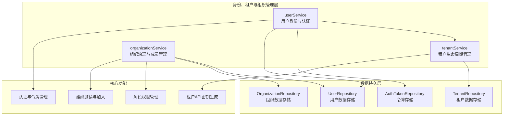
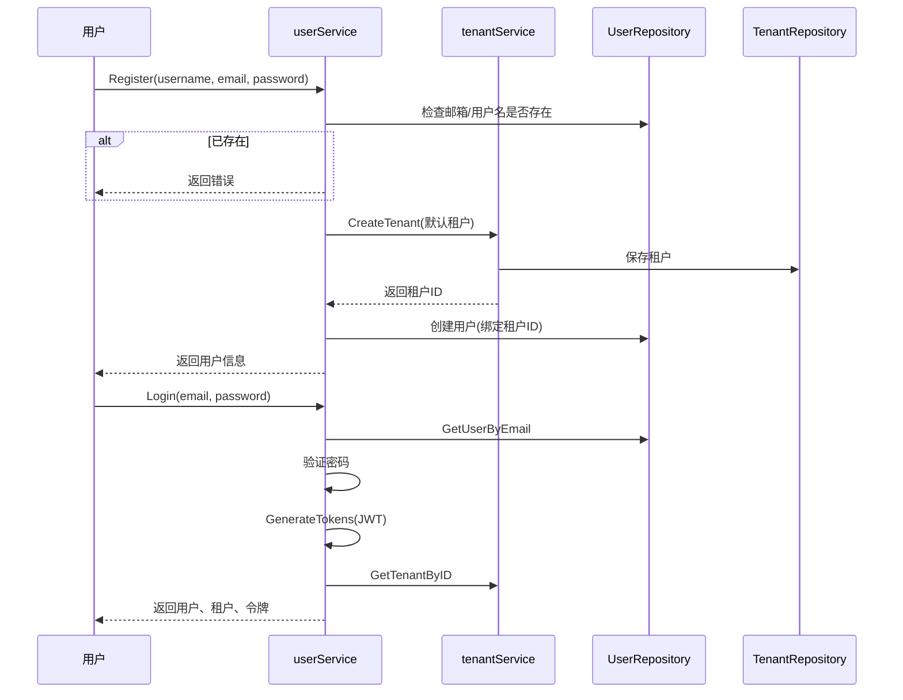
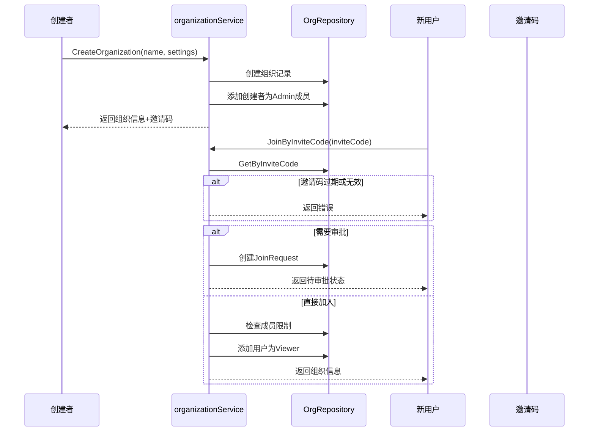

# 身份、租户与组织管理模块

## 概述

想象一下一个现代办公大楼：每个人都有自己的工位（租户），可以自由布置和工作；同时，人们可以组成团队（组织）共享会议室和资源；每个人都有一张门禁卡（身份），可以进出自己的工位和被授权的团队区域。`identity_tenant_and_organization_management` 模块就是这个系统的核心——它管理用户身份、租户隔离和组织协作，为整个平台提供安全、灵活的权限边界。

这个模块解决了多用户 SaaS 平台的核心问题：如何在同一套系统中为不同用户和团队提供隔离的工作空间，同时支持资源共享和协作。它不仅仅是用户管理，更是整个平台的权限和隔离基础。

## 架构概览

### 核心组件说明

1. **userService**：用户身份管理的核心，负责用户注册、登录、密码管理和JWT令牌生成与验证。它是整个认证系统的入口点。

2. **tenantService**：租户生命周期管理，每个租户代表一个独立的工作空间。它还负责生成和验证租户API密钥，这些密钥是外部系统访问租户资源的凭证。

3. **organizationService**：组织治理层，负责创建组织、管理成员、处理加入请求和角色权限。它是用户之间协作的桥梁。

## 设计决策与权衡

### 1. 用户与租户的1:1绑定策略

**决策**：每个新用户注册时自动创建一个默认租户，用户与该租户建立强绑定关系。

**原因**：
- 简化了新用户的上手流程——注册后立即拥有一个独立的工作空间
- 确保每个用户至少有一个可操作的租户，避免"无家可归"的情况
- 为后续组织协作提供了基础：用户可以保留自己的私有租户，同时加入其他组织

**权衡**：
- 增加了系统初始创建的资源开销（每个用户一个租户）
- 但避免了复杂的租户选择和切换逻辑，提升了用户体验

### 2. JWT令牌与数据库双重验证

**决策**：JWT令牌不仅包含用户信息，还会在数据库中存储，并在验证时检查撤销状态。

**原因**：
- JWT的无状态特性提供了良好的性能和可扩展性
- 但纯JWT无法实现即时撤销（如用户主动登出或安全事件）
- 通过数据库存储令牌状态，既保留了JWT的优点，又获得了撤销能力

**权衡**：
- 每次验证都需要查询数据库，增加了一定的开销
- 但这是安全性与性能之间的合理平衡，特别是对于需要严格访问控制的系统

### 3. 租户API密钥的AES-GCM加密设计

**决策**：租户API密钥采用AES-GCM加密，将租户ID加密后编码为base64，格式为`sk-{encrypted}`。

**原因**：
- API密钥本身包含租户ID信息，无需额外查询即可识别调用者
- AES-GCM提供了加密和完整性验证，防止密钥被篡改
- 格式统一（`sk-`前缀）便于识别和处理

**权衡**：
- 密钥生成和解析相对复杂
- 但提供了更好的安全性和自描述性

### 4. 组织角色的分层设计

**决策**：组织角色采用分层设计（Owner → Admin → Viewer），权限具有传递性。

**原因**：
- 简化了权限管理：高级角色自动拥有低级角色的所有权限
- 清晰的责任边界：Owner拥有组织的完全控制权，Admin管理日常运营，Viewer只读访问
- 便于未来扩展：可以在现有层级之间插入新角色

**权衡**：
- 灵活性相对受限（无法定义完全自定义的权限组合）
- 但对于大多数协作场景已经足够，且大大降低了理解和使用成本

## 数据流程

### 用户注册与登录流程

### 组织创建与成员加入流程

## 核心子模块

### 1. 用户身份账户管理

负责用户身份的全生命周期管理，包括注册、登录、密码重置和令牌管理。这个模块是整个系统的安全基石。

**关键特性**：
- JWT令牌的生成与验证（24小时访问令牌，7天刷新令牌）
- bcrypt密码哈希存储
- 令牌撤销机制
- 用户信息的CRUD操作

更多详情请参考：[用户身份账户管理](application_services_and_orchestration-agent_identity_tenant_and_configuration_services-identity_tenant_and_organization_management-user_identity_account_management.md)

### 2. 租户生命周期与列表管理

管理租户的创建、更新、删除和查询，以及租户API密钥的生成与验证。每个租户代表一个独立的工作空间和资源隔离边界。

**关键特性**：
- 租户CRUD操作
- API密钥的AES-GCM加密生成
- 租户列表查询与搜索
- 租户状态管理

更多详情请参考：[租户生命周期与列表管理](application_services_and_orchestration-agent_identity_tenant_and_configuration_services-identity_tenant_and_organization_management-tenant_lifecycle_and_listing_management.md)

### 3. 组织治理与成员管理

处理组织的创建、成员管理、角色分配和加入请求审批。这是实现团队协作和资源共享的核心模块。

**关键特性**：
- 组织CRUD操作
- 邀请码生成与验证
- 成员角色管理（Owner/Admin/Viewer）
- 加入请求审批流程
- 可搜索组织发现

更多详情请参考：[组织治理与成员管理](application_services_and_orchestration-agent_identity_tenant_and_configuration_services-identity_tenant_and_organization_management-organization_governance_and_membership_management.md)

## 跨模块依赖

### 依赖的模块

1. **identity_tenant_and_organization_repositories**：提供数据持久化能力，包括用户、租户和组织的存储。
   - [用户身份与认证仓库](data_access_repositories-identity_tenant_and_organization_repositories-user_identity_and_auth_repositories.md)
   - [租户管理仓库](data_access_repositories-identity_tenant_and_organization_repositories-tenant_management_repository.md)
   - [组织成员与治理仓库](data_access_repositories-identity_tenant_and_organization_repositories-organization_membership_sharing_and_access_control_repositories-organization_membership_and_governance_repository.md)

2. **core_domain_types_and_interfaces**：定义核心领域模型和接口契约，确保各层之间的类型安全。
   - [身份、租户、组织与配置契约](core_domain_types_and_interfaces-identity_tenant_organization_and_configuration_contracts.md)

### 被依赖的模块

1. **resource_sharing_and_access_services**：依赖本模块提供的用户、租户和组织信息来管理资源共享权限。
   - [知识库共享访问服务](application_services_and_orchestration-agent_identity_tenant_and_configuration_services-resource_sharing_and_access_services-knowledge_base_sharing_access_service.md)
   - [代理共享访问服务](application_services_and_orchestration-agent_identity_tenant_and_configuration_services-resource_sharing_and_access_services-agent_sharing_access_service.md)

2. **http_handlers_and_routing**：依赖本模块提供认证和用户信息，处理HTTP请求。
   - [认证初始化与系统操作处理器](http_handlers_and_routing-auth_initialization_and_system_operations_handlers.md)
   - [代理、租户、组织与模型管理处理器](http_handlers_and_routing-agent_tenant_organization_and_model_management_handlers.md)

## 新贡献者指南

### 常见陷阱与注意事项

1. **JWT_SECRET的重要性**
   - 生产环境必须设置`JWT_SECRET`环境变量，否则系统会生成随机密钥，导致重启后所有令牌失效
   - 密钥长度至少32字节，建议使用安全的随机生成器

2. **TENANT_AES_KEY的配置**
   - 租户API密钥加密依赖`TENANT_AES_KEY`环境变量
   - 该密钥一旦设置不应更改，否则所有现有API密钥将无法解析
   - 建议使用16、24或32字节的密钥（对应AES-128、AES-192或AES-256）

3. **用户-租户绑定的不可变性**
   - 用户创建时绑定的默认租户ID目前是不可更改的
   - 设计新功能时不要假设用户可以切换主租户

4. **组织所有者的特殊保护**
   - 组织所有者不能被移除，也不能更改其角色
   - 删除组织只能由所有者执行

5. **邀请码的一次性使用**
   - 虽然邀请码可以多次使用，但每次生成新邀请码会使旧邀请码失效
   - 需要长期有效的邀请码应设置有效期为0（永不过期）

### 扩展点

1. **自定义认证方式**
   - `userService`可以通过实现新的令牌生成方法来支持OAuth、SAML等认证方式
   - 现有的JWT实现可以作为参考

2. **租户配置扩展**
   - `tenantService`中的租户模型可以轻松扩展以支持更多配置项
   - 目前的`RetrieverEngines`字段就是一个很好的例子

3. **组织角色自定义**
   - 虽然目前使用固定的角色层级，但可以通过扩展`OrgMemberRole`类型来支持自定义角色
   - 需要相应修改权限检查逻辑

### 测试建议

1. **边界情况测试**
   - 测试令牌过期和撤销的各种场景
   - 测试组织成员限制的边界情况
   - 测试邀请码过期和重新生成的行为

2. **并发测试**
   - 测试同时提交多个加入请求的情况
   - 测试并发使用邀请码的场景

3. **安全测试**
   - 验证密码哈希的强度
   - 测试API密钥的篡改检测
   - 验证权限检查的完整性
