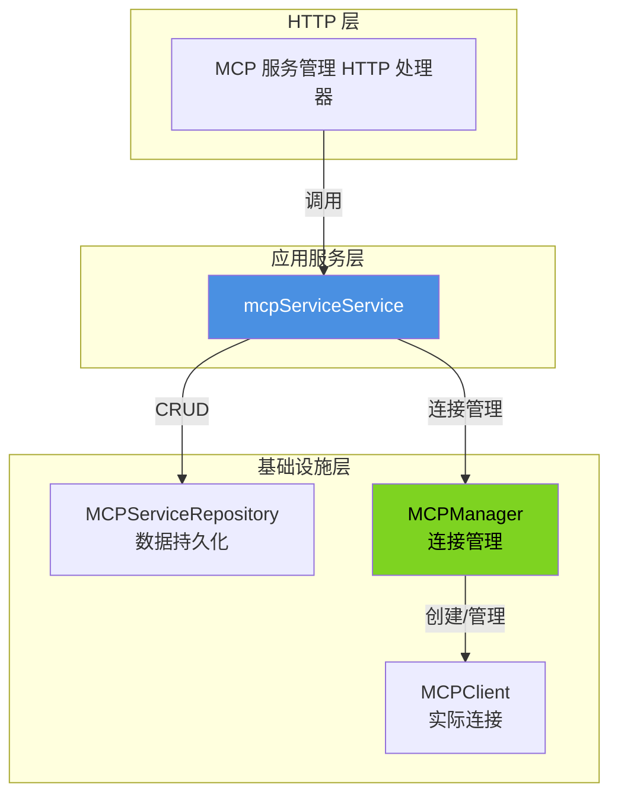

# MCP 服务配置管理模块技术深度解析

## 1. 什么是 MCP 服务配置管理模块？

**MCP (Model Context Protocol) 服务配置管理模块** 是系统中负责管理外部 MCP 服务生命周期的核心组件。在现代 AI 应用架构中，MCP 允许 AI 代理通过标准化协议与外部服务交互，获取工具能力和资源访问权限。

**为什么需要这个模块？** 想象一下，您的 AI 代理需要与多个外部服务交互——每个服务都有不同的连接方式、认证配置和启用状态。如果没有统一的管理机制，您会面临：
- 配置分散且难以维护
- 连接状态不可控
- 安全风险难以管理
- 服务变更时缺乏一致性保证

这个模块就像一个**智能插座面板**：它统一管理所有外部 MCP 服务的"接入点"，负责它们的注册、配置、连接状态监控，以及安全地启用/禁用它们。

## 2. 核心架构与数据流向

让我们先看一下这个模块的架构和主要组件交互：



### 数据流向说明

1. **配置创建流程**：
   - HTTP 请求 → `CreateMCPService` → 安全校验 → 设置默认配置 → 持久化到仓库
   
2. **配置更新流程**：
   - HTTP 请求 → `UpdateMCPService` → 读取现有配置 → 智能合并 → 检测变更 → 关闭旧连接（如需要）→ 更新仓库
   
3. **服务测试流程**：
   - `TestMCPService` → 读取配置 → 创建临时客户端 → 连接测试 → 初始化 → 获取工具/资源列表 → 返回结果

4. **工具/资源获取流程**：
   - `GetMCPServiceTools`/`GetMCPServiceResources` → 读取配置 → 获取或创建客户端 → 调用 MCP 协议 → 返回结果

## 3. 核心组件深度解析

### 3.1 mcpServiceService 结构体

这是模块的核心 orchestrator，负责协调所有 MCP 服务相关的业务逻辑。

```go
type mcpServiceService struct {
    mcpServiceRepo interfaces.MCPServiceRepository
    mcpManager     *mcp.MCPManager
}
```

**设计意图**：
- 遵循单一职责原则：只关注 MCP 服务的业务逻辑编排
- 依赖注入模式：通过构造函数注入仓库和管理器，便于测试和解耦
- 门面模式：封装了底层数据访问和连接管理的复杂性，提供简洁的接口

### 3.2 CreateMCPService - 创建服务

```go
func (s *mcpServiceService) CreateMCPService(ctx context.Context, service *types.MCPService) error
```

**功能**：创建一个新的 MCP 服务配置

**内部机制**：
1. **安全检查**：首先拒绝 Stdio 传输类型，这是一个明确的安全决策
2. **默认配置**：如果未提供高级配置，自动设置默认值
3. **时间戳管理**：设置创建和更新时间
4. **持久化**：通过仓库保存配置

**设计亮点**：
- **安全优先**：主动禁用潜在危险的 Stdio 传输，防止任意命令执行
- **合理默认**：通过 `types.GetDefaultAdvancedConfig()` 确保配置完整性

### 3.3 UpdateMCPService - 更新服务（最复杂的方法）

```go
func (s *mcpServiceService) UpdateMCPService(ctx context.Context, service *types.MCPService) error
```

**功能**：更新现有 MCP 服务配置，支持部分更新和完整更新

**内部机制**：
1. **存在性验证**：先检查服务是否存在
2. **传输类型校验**：再次确保不使用禁用的传输类型
3. **智能合并**：
   - 如果 `service.Name` 为空，视为仅更新启用状态的部分更新
   - 否则视为完整更新，更新所有提供的字段
4. **变更检测**：检查关键配置（URL、传输类型、认证配置等）是否变更
5. **连接管理**：
   - 如果服务被禁用，关闭连接
   - 如果关键配置变更，关闭连接（强制重新连接）
   - 如果服务刚启用，关闭可能存在的旧连接确保干净状态

**设计亮点**：
- **部分更新模式**：通过检查 `service.Name` 是否为空来区分部分更新和完整更新，这种设计简洁但有效
- **连接生命周期管理**：智能判断何时需要关闭连接，确保配置变更能及时生效
- **状态追踪**：保存旧的启用状态，以便检测启用/禁用转换

### 3.4 TestMCPService - 测试服务

```go
func (s *mcpServiceService) TestMCPService(
    ctx context.Context,
    tenantID uint64,
    id string,
) (*types.MCPTestResult, error)
```

**功能**：测试 MCP 服务连接并获取可用工具和资源

**内部机制**：
1. 从仓库获取服务配置
2. 创建临时客户端（不通过 MCPManager，避免影响现有连接）
3. 设置 30 秒超时的上下文
4. 执行连接 → 初始化 → 列出工具 → 列出资源的完整流程
5. 返回包含成功状态、消息、工具和资源的测试结果

**设计亮点**：
- **隔离测试**：使用临时客户端，不影响可能正在使用的现有连接
- **优雅降级**：如果列出工具或资源失败，不会导致整个测试失败，而是记录警告并返回空列表
- **超时保护**：30 秒超时防止测试挂起

### 3.5 GetMCPServiceTools / GetMCPServiceResources

这两个方法结构相似，负责从 MCP 服务获取工具或资源列表。

**内部机制**：
1. 从仓库获取服务配置
2. 通过 `mcpManager.GetOrCreateClient` 获取或创建客户端
3. 调用相应的 MCP 协议方法
4. 返回结果

**设计亮点**：
- **连接复用**：通过 MCPManager 管理客户端生命周期，避免频繁创建/销毁连接
- **延迟连接**：`GetOrCreateClient` 暗示了连接可能是懒加载的

## 4. 依赖关系分析

### 4.1 输入依赖（模块调用的组件）

| 依赖 | 类型 | 用途 |
|------|------|------|
| `interfaces.MCPServiceRepository` | 仓库接口 | 数据持久化抽象，负责 CRUD 操作 |
| `*mcp.MCPManager` | 连接管理器 | 管理 MCP 客户端连接生命周期 |
| `mcp.NewMCPClient` | 客户端工厂 | 创建临时测试客户端 |
| `types.MCPService` | 领域模型 | MCP 服务配置数据结构 |
| `types.MCPTestResult` | 领域模型 | 测试结果数据结构 |

### 4.2 输出依赖（调用本模块的组件）

- **HTTP 处理器层**：`mcp_service_management_handlers`（位于 `http_handlers_and_routing` 模块）

### 4.3 数据契约

本模块依赖以下关键数据契约：
- `types.MCPService`：必须包含 `TransportType`、`Enabled`、`URL`、`AuthConfig` 等字段
- `types.MCPTool` / `types.MCPResource`：表示 MCP 服务提供的工具和资源
- 仓库接口 `interfaces.MCPServiceRepository`：定义了数据访问的标准方法

## 5. 设计决策与权衡

### 5.1 安全决策：禁用 Stdio 传输

**决策**：明确拒绝 `types.MCPTransportStdio` 传输类型

**原因**：
- Stdio 传输通常涉及执行本地命令，存在严重的安全风险
- 在多租户环境中，这种风险被放大
- 提供了更安全的替代方案（SSE 和 HTTP Streamable）

**权衡**：
- ✅ 优点：显著提高安全性
- ❌ 缺点：限制了某些可能的合法使用场景
- 🔄 替代方案：如果未来需要支持，可以考虑添加严格的沙箱和权限控制

### 5.2 部分更新模式：基于 Name 字段的判断

**决策**：通过检查 `service.Name` 是否为空来区分部分更新和完整更新

**原因**：
- 简洁的 API 设计，避免引入额外的标志参数
- 利用了字段语义：Name 是服务的必填字段，不太可能为空

**权衡**：
- ✅ 优点：API 简洁，实现直观
- ❌ 缺点：
  - 语义耦合：将字段存在性与更新模式绑定
  - 限制：无法在不修改 Name 的情况下进行其他字段的部分更新
- 🔄 替代方案：使用专用的更新选项结构体或指针字段来明确区分

### 5.3 连接管理：主动关闭而非自动重连

**决策**：在配置变更或禁用时主动关闭连接，而不是尝试自动重连

**原因**：
- 明确的生命周期控制
- 避免在配置错误时无限重试
- 将连接建立的时机交给实际使用时（懒加载）

**权衡**：
- ✅ 优点：
  - 资源使用更高效
  - 错误处理更明确
  - 避免潜在的重试风暴
- ❌ 缺点：
  - 首次使用时可能有连接延迟
  - 需要上层处理连接失败的情况

### 5.4 测试隔离：使用临时客户端

**决策**：测试时创建独立的临时客户端，而不是复用现有连接

**原因**：
- 测试结果不受现有连接状态影响
- 避免测试过程中断正常使用的连接
- 确保测试的是当前配置，而不是缓存的连接

**权衡**：
- ✅ 优点：测试结果准确，不影响生产连接
- ❌ 缺点：
  - 可能创建额外的连接到 MCP 服务
  - 测试稍微慢一些（需要建立新连接）

## 6. 使用指南与最佳实践

### 6.1 基本使用流程

1. **创建 MCP 服务**：
   ```go
   service := &types.MCPService{
       TenantID:      tenantID,
       Name:          "My MCP Service",
       TransportType: types.MCPTransportSSE,
       URL:           &url,
       Enabled:       true,
   }
   err := mcpServiceService.CreateMCPService(ctx, service)
   ```

2. **测试连接**：
   ```go
   result, err := mcpServiceService.TestMCPService(ctx, tenantID, serviceID)
   if result.Success {
       fmt.Printf("Available tools: %d\n", len(result.Tools))
   }
   ```

3. **获取工具列表**：
   ```go
   tools, err := mcpServiceService.GetMCPServiceTools(ctx, tenantID, serviceID)
   ```

### 6.2 部分更新的正确姿势

要仅更新服务的启用状态，只需提供 ID、租户 ID 和 Enabled 字段，保持 Name 为空：
```go
service := &types.MCPService{
    ID:       serviceID,
    TenantID: tenantID,
    Enabled:  false, // 仅禁用服务
    // Name 保持为空，表示这是部分更新
}
err := mcpServiceService.UpdateMCPService(ctx, service)
```

### 6.3 配置变更后的连接管理

模块会自动处理连接生命周期，但要注意：
- 配置变更后，现有连接会被关闭
- 新连接会在下次使用时自动建立
- 这意味着配置变更不会立即生效，直到下次访问该服务

## 7. 边缘情况与注意事项

### 7.1 部分更新的局限性

当前实现中，除了启用状态外，无法进行其他字段的部分更新。例如，您不能仅更新 URL 而不提供 Name。

**解决方法**：进行完整更新，先读取现有服务，修改需要更改的字段，然后保存回去。

### 7.2 配置变更与连接状态的不同步

配置已更新但连接仍使用旧配置的情况理论上不会发生，因为模块会在检测到关键配置变更时关闭连接。但是，如果 MCP 服务端在连接期间更改了工具或资源，这些变更不会自动反映出来。

**解决方法**：需要时调用测试接口或禁用后重新启用服务。

### 7.3 测试超时

TestMCPService 有硬编码的 30 秒超时。对于网络较慢或 MCP 服务响应慢的情况，这可能导致测试失败。

**注意**：30 秒是一个合理的默认值，但在特定环境中可能需要调整。

### 7.4 ListMCPServices 中的敏感数据处理

ListMCPServices 会调用 `MaskSensitiveData()` 来屏蔽敏感信息。确保 `types.MCPService.MaskSensitiveData()` 正确实现，否则敏感信息可能泄露。

### 7.5 并发更新问题

当前实现没有乐观锁机制，并发更新可能导致最后写入获胜。

**解决方法**：如果需要更强的并发控制，可以考虑在仓库层实现乐观锁。

## 8. 相关模块参考

- [MCP 服务管理 HTTP 处理器](http_handlers_and_routing-agent_tenant_organization_and_model_management_handlers-mcp_service_management_handlers.md)
- [MCP 连接管理](platform_infrastructure_and_runtime-mcp_connectivity_and_protocol_models.md)
- [MCP 领域模型](core_domain_types_and_interfaces-mcp_web_search_and_eventing_contracts.md)
- [MCP 外部服务仓库](data_access_repositories-agent_configuration_and_external_service_repositories-mcp_external_service_repository.md)
