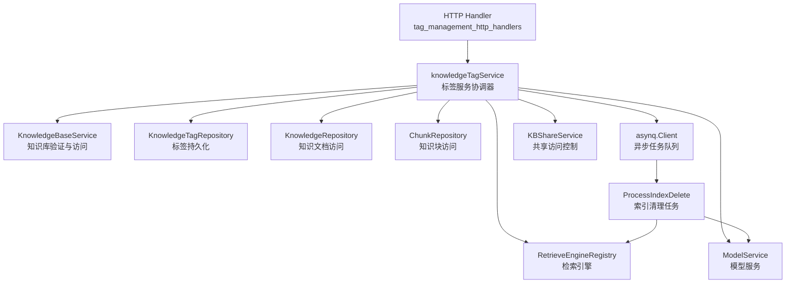

# knowledge_tag_configuration_services 模块技术深度解析

## 1. 模块概述

### 1.1 问题空间

在知识管理系统中，标签（Tag）是组织和检索知识内容的核心机制。然而，简单的标签存储方案会面临以下挑战：

- **访问控制复杂性**：标签属于知识库，需要同时处理租户自有访问和组织共享访问两种场景
- **统计数据效率**：标签需要实时显示关联的知识文档和知识块数量，N+1查询问题会严重影响性能
- **删除操作的连锁反应**：删除标签时需要处理关联内容的清理、向量索引的同步更新，以及不同类型知识库（文档型/FAQ型）的差异化处理
- **异步任务编排**：大规模内容删除和索引清理需要异步执行，避免阻塞用户操作

`knowledgeTagService`的设计正是为了解决这些问题，提供一个安全、高效、一致的标签管理服务层。

### 1.2 核心价值

这个模块是知识管理系统中的**标签 orchestrator**——它不仅仅是CRUD操作的封装，更是标签生命周期、访问控制、统计聚合和异步清理的协调中心。

---

## 2. 架构与数据流

### 2.1 核心架构图



### 2.2 角色与职责

| 组件 | 角色 | 关键职责 |
|------|------|----------|
| `knowledgeTagService` | 编排器 | 协调所有标签相关操作，处理权限、统计、删除连锁反应 |
| `KnowledgeTagRepository` | 数据访问 | 标签的CRUD和批量统计查询 |
| `KBShareService` | 权限守卫 | 验证组织共享的知识库访问权限 |
| `asynq.Client` | 异步调度 | 提交索引删除和知识删除任务 |
| `RetrieveEngineRegistry` | 索引操作 | 向量索引的批量删除 |

### 2.3 关键数据流

#### 2.3.1 标签列表查询流程

```
ListTags()
  ↓
验证知识库存在 + 访问权限检查
  ↓
Repository.ListByKB() → 获取标签列表
  ↓
Repository.BatchCountReferences() → 批量获取所有标签的引用统计（2次SQL而非2*N次）
  ↓
组装 KnowledgeTagWithStats → 返回分页结果
```

**设计亮点**：使用`BatchCountReferences`一次性获取所有标签的知识计数和块计数，避免了N+1查询问题，这是列表操作性能的关键优化。

#### 2.3.2 强制删除标签流程

```
DeleteTag(force=true)
  ↓
获取标签和知识库信息
  ↓
检查标签引用计数
  ↓
根据知识库类型分支：
  ├─ 文档型 → enqueueKnowledgeDeleteTask() → 异步删除知识文档
  └─ FAQ型 → deleteChunksAndEnqueueIndexDelete() → 删除块 + 异步索引清理
  ↓
如果没有excludeIDs → Repository.Delete() → 删除标签本身
```

**设计亮点**：
- 区分知识库类型处理删除逻辑
- 向量索引清理异步执行，不阻塞用户
- `excludeIDs`机制支持部分内容保留

---

## 3. 核心组件深度解析

### 3.1 knowledgeTagService 结构体

这是模块的核心编排器，采用依赖注入模式，所有依赖都通过构造函数传入，便于测试和替换。

```go
type knowledgeTagService struct {
    kbService      interfaces.KnowledgeBaseService  // 知识库服务
    repo           interfaces.KnowledgeTagRepository // 标签仓库
    knowledgeRepo  interfaces.KnowledgeRepository    // 知识仓库
    chunkRepo      interfaces.ChunkRepository        // 知识块仓库
    retrieveEngine interfaces.RetrieveEngineRegistry // 检索引擎
    modelService   interfaces.ModelService           // 模型服务
    task           *asynq.Client                     // 异步任务
    kbShareService interfaces.KBShareService         // 共享服务
}
```

**设计意图**：
- 依赖接口而非具体实现，遵循依赖倒置原则
- 所有外部交互都通过清晰的接口契约进行
- 便于单元测试时mock各个依赖组件

### 3.2 ListTags - 带统计的标签列表

这是最常用的查询接口，其性能优化是设计重点。

```go
func (s *knowledgeTagService) ListTags(
    ctx context.Context,
    kbID string,
    page *types.Pagination,
    keyword string,
) (*types.PageResult, error)
```

**核心逻辑**：
1. **访问权限双重检查**：
   - 首先检查是否是租户自有知识库
   - 如果不是，则通过`kbShareService`检查是否有组织共享的查看权限
   
2. **批量统计优化**：
   - 先获取标签列表
   - 收集所有标签ID，调用`BatchCountReferences`一次性获取所有统计数据
   - 这个设计将查询次数从O(2N+1)降到O(3)

3. **effectiveTenantID 模式**：
   - 使用知识库所属的租户ID进行数据访问，而非当前用户的租户ID
   - 这确保了共享知识库场景下的数据访问正确性

### 3.3 DeleteTag - 复杂的删除编排

这是模块中最复杂的方法，体现了服务层的编排价值。

```go
func (s *knowledgeTagService) DeleteTag(
    ctx context.Context,
    id string,
    force bool,
    contentOnly bool,
    excludeIDs []string,
) error
```

**参数设计意图**：
- `force`：是否强制删除有内容的标签
- `contentOnly`：仅删除内容，保留标签本身（用于清空标签）
- `excludeIDs`：排除某些ID不删除（精细控制）

**关键设计决策**：

1. **异步任务分离**：
   - 向量索引删除通过`enqueueIndexDeleteTask`异步执行
   - 文档型知识库的知识删除通过`enqueueKnowledgeDeleteTask`异步执行
   - 这样设计避免了长时间阻塞用户请求

2. **知识库类型差异化处理**：
   - **文档型知识库**：删除知识文档（会级联删除块）
   - **FAQ型知识库**：直接删除知识块
   - 这种区分反映了两种知识库的内容模型差异

3. **索引清理的批处理**：
   - 在`ProcessIndexDelete`中，使用100个一批的方式删除向量索引
   - 避免单次请求过大导致向量数据库过载

### 3.4 CreateTag - 特殊标签处理

```go
func (s *knowledgeTagService) CreateTag(
    ctx context.Context,
    kbID string,
    name string,
    color string,
    sortOrder int,
) (*types.KnowledgeTag, error)
```

**特殊逻辑**：
- "未分类"（`types.UntaggedTagName`）标签强制设置`sortOrder = -1`
- 确保它始终显示在标签列表的最前面
- 这是产品体验的细节在代码中的体现

### 3.5 FindOrCreateTagByName - 幂等创建模式

```go
func (s *knowledgeTagService) FindOrCreateTagByName(
    ctx context.Context,
    kbID string,
    name string,
) (*types.KnowledgeTag, error)
```

**设计意图**：
- 支持在导入或批量操作中安全地创建标签
- 先查询，不存在则创建，避免重复
- 这种模式在数据导入场景中非常常见

---

## 4. 依赖分析

### 4.1 输入依赖（被此模块调用）

| 依赖接口 | 用途 | 调用位置 |
|---------|------|---------|
| `KnowledgeBaseService` | 验证知识库存在、获取知识库信息 | ListTags, CreateTag, DeleteTag, FindOrCreateTagByName |
| `KnowledgeTagRepository` | 标签的持久化操作 | 所有方法 |
| `KnowledgeRepository` | 获取知识文档ID列表 | DeleteTag |
| `ChunkRepository` | 删除知识块 | DeleteTag |
| `RetrieveEngineRegistry` | 创建检索引擎、删除向量索引 | enqueueIndexDeleteTask, ProcessIndexDelete |
| `ModelService` | 获取嵌入模型维度 | ProcessIndexDelete |
| `asynq.Client` | 提交异步任务 | DeleteTag, enqueueIndexDeleteTask |
| `KBShareService` | 验证共享访问权限 | ListTags |

### 4.2 输出依赖（调用此模块）

此模块被`tag_management_http_handlers`调用，作为HTTP层的服务支撑。

### 4.3 数据契约

**关键数据结构**：
- `types.KnowledgeTag`：标签基本信息
- `types.KnowledgeTagWithStats`：带统计的标签信息
- `types.IndexDeletePayload`：索引删除任务payload
- `types.KnowledgeListDeletePayload`：知识列表删除任务payload

---

## 5. 设计决策与权衡

### 5.1 批量统计 vs 单次查询

**决策**：使用`BatchCountReferences`一次性获取所有标签的统计数据

**权衡**：
- ✅ **优点**：查询次数从O(2N+1)降到O(3)，性能提升显著
- ⚠️ **缺点**：实现稍复杂，需要Repository层支持批量查询
- **适用场景**：标签列表通常不会特别长（几十到几百个），批量查询收益明显

### 5.2 异步索引清理 vs 同步删除

**决策**：向量索引的删除通过异步任务执行

**权衡**：
- ✅ **优点**：用户请求快速返回，不阻塞；可以重试和批处理
- ⚠️ **缺点**：存在短暂的一致性窗口（索引可能滞后于元数据）；需要额外的任务队列基础设施
- **合理性**：向量索引删除是重量级操作，且用户通常不会立即感知到索引的存在，异步是合理选择

### 5.3 effectiveTenantID 模式

**决策**：使用知识库所属租户ID而非当前用户租户ID进行数据访问

**权衡**：
- ✅ **优点**：支持跨租户的知识库共享场景
- ⚠️ **缺点**：需要仔细区分"数据所属租户"和"操作执行者租户"，容易出错
- **必要性**：这是组织共享功能的基础，没有它就无法实现跨租户的知识库共享

### 5.4 contentOnly + excludeIDs 组合

**决策**：提供精细的删除控制参数

**权衡**：
- ✅ **优点**：灵活性极高，可以满足各种复杂的删除场景
- ⚠️ **缺点**：API复杂度增加，测试矩阵变大
- **合理性**：标签管理是高频操作，用户确实需要这些精细控制（比如"清空标签但保留标签本身"）

---

## 6. 使用指南与最佳实践

### 6.1 基本用法示例

```go
// 列出标签
tags, err := tagService.ListTags(ctx, kbID, &types.Pagination{Page: 1, PageSize: 20}, "")

// 创建标签
tag, err := tagService.CreateTag(ctx, kbID, "重要", "#FF0000", 1)

// 强制删除标签（同时删除关联内容）
err := tagService.DeleteTag(ctx, tagID, true, false, nil)

// 仅清空标签内容，保留标签
err := tagService.DeleteTag(ctx, tagID, false, true, nil)
```

### 6.2 扩展点

1. **自定义统计字段**：修改`BatchCountReferences`返回的结构，可以添加更多统计维度
2. **标签合并功能**：可以基于现有方法实现标签合并（将一个标签的内容迁移到另一个标签）
3. **标签批量操作**：可以扩展支持批量创建/更新/删除标签

### 6.3 注意事项

1. **访问权限**：始终确保在调用前验证用户对知识库的访问权限
2. **异步任务监控**：需要监控asynq队列的任务执行情况，索引删除失败会导致垃圾数据
3. **事务边界**：删除操作没有使用跨服务的分布式事务，存在部分成功的可能性
4. **"未分类"标签**：这个标签有特殊的排序逻辑，不要尝试修改它的sortOrder

---

## 7. 边缘情况与陷阱

### 7.1 共享知识库的租户上下文

**陷阱**：使用当前用户的租户ID查询标签，会导致找不到共享知识库的标签

**正确做法**：始终使用知识库的`TenantID`作为`effectiveTenantID`进行数据访问

### 7.2 force=false 但有引用计数

**陷阱**：忘记检查引用计数直接删除，会导致数据库外键约束错误

**正确做法**：代码中已经有检查，但调用者需要处理返回的错误提示

### 7.3 excludeIDs 非空时不删除标签

**行为**：如果`excludeIDs`有值，即使`force=true`也不会删除标签本身

**原因**：因为还有内容关联在标签上，删除标签会导致这些内容的标签引用失效

### 7.4 异步任务失败的处理

**风险**：索引删除任务失败会导致向量数据库中存在孤儿索引

**缓解**：
- 任务配置了重试（index delete最多重试10次）
- 需要监控任务失败情况
- 可以考虑实现定期的垃圾清理任务

---

## 8. 相关模块参考

- [标签HTTP处理器](http_handlers_and_routing-knowledge_faq_and_tag_content_handlers-tag_management_http_handlers.md)
- [知识库服务](application_services_and_orchestration-knowledge_ingestion_extraction_and_graph_services-knowledge_base_lifecycle_management.md)
- [共享访问服务](application_services_and_orchestration-agent_identity_tenant_and_configuration_services-resource_sharing_and_access_services-knowledge_base_sharing_access_service.md)
- [检索引擎](application_services_and_orchestration-retrieval_and_web_search_services-retriever_engine_composition_and_registry.md)

---

## 总结

`knowledge_tag_configuration_services`模块是一个典型的**服务层编排器**示例。它不只是简单的CRUD封装，而是：

1. **访问控制的守护者**：处理租户自有和组织共享两种场景
2. **性能优化者**：通过批量查询解决N+1问题
3. **异步编排者**：将重量级操作放到后台执行
4. **复杂逻辑协调者**：处理不同知识库类型、不同删除模式的差异化逻辑

这个模块的设计很好地平衡了灵活性、性能和一致性，是理解服务层设计模式的很好案例。
