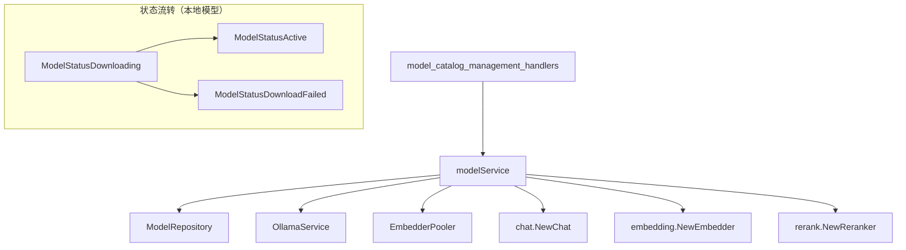

# model_catalog_configuration_services 模块深度解析

## 1. 问题空间与模块定位

### 为什么需要这个模块？

在构建 AI 驱动的知识库和对话系统时，我们面临一个核心挑战：**如何统一管理不同来源、不同类型的 AI 模型，同时处理它们在部署方式、生命周期和可用性上的差异**。

想象一下这个场景：你的系统需要同时支持：
- 远程托管的模型（如 OpenAI GPT-4、阿里云通义千问）
- 本地部署的模型（如通过 Ollama 运行的 Llama 2）
- 不同类型的模型（聊天、嵌入、重排序）
- 跨租户共享知识库时的向量兼容性问题

一个简单的数据库 CRUD 包装器无法解决这些问题。你需要一个服务层来：
1. 处理本地模型的异步下载和状态管理
2. 确保模型在使用前处于可用状态
3. 根据模型配置动态实例化对应的客户端
4. 维护内置模型的不可变性
5. 支持跨租户的模型访问

这就是 `model_catalog_configuration_services` 模块存在的原因——它不是一个简单的存储网关，而是一个**模型生命周期编排器**。

### 模块的核心职责

从架构角度看，这个模块位于应用服务层，扮演着三个关键角色：
- **模型目录管理器**：负责模型的 CRUD 操作和状态追踪
- **模型实例工厂**：根据存储的配置动态创建可使用的模型客户端
- **本地模型编排器**：处理 Ollama 模型的异步下载和状态转换

---

## 2. 核心抽象与心智模型

### 关键抽象概念

在理解这个模块时，你需要在脑海中建立以下几个核心抽象：

1. **`types.Model`**：模型的"元数据契约"，包含模型的来源、类型、状态和配置参数
2. **`interfaces.ModelRepository`**：数据持久化的抽象接口，服务层不直接依赖具体数据库实现
3. **状态机**：本地模型从 `Downloading` → `Active`/`DownloadFailed` 的状态流转
4. **模型工厂方法族**：`GetChatModel`、`GetEmbeddingModel`、`GetRerankModel`，它们将元数据转换为可执行的模型实例

### 类比理解

可以把这个模块想象成一个**AI 模型的应用商店管理器**：

- **模型目录** = 应用商店的商品列表
- **远程模型** = 云服务应用，立即可用
- **本地模型** = 需要下载安装的桌面应用
- **`CreateModel`** = 安装应用（云端立即完成，本地需要下载）
- **`GetXxxModel`** = 启动应用，确保它能正常运行
- **内置模型** = 系统预装应用，用户无法卸载或修改

---

## 3. 架构与数据流向

### 模块架构图



### 核心数据流向

让我们通过两个关键操作来追踪数据流向：

#### 操作 1：创建本地模型（CreateModel）

```
HTTP 请求 → CreateModel(ctx, model)
    ↓
1. 检查 model.Source → 判定为本地模型
    ↓
2. 设置 model.Status = Downloading
    ↓
3. repo.Create(ctx, model) → 持久化到数据库
    ↓
4. 启动 goroutine 异步处理：
   ├─ ollamaService.PullModel() → 下载模型
   ├─ 成功: model.Status = Active
   ├─ 失败: model.Status = DownloadFailed
   └─ repo.Update(ctx, model) → 更新状态
    ↓
返回（无需等待下载完成）
```

#### 操作 2：获取嵌入模型（GetEmbeddingModel）

```
调用 GetEmbeddingModel(ctx, modelId)
    ↓
1. GetModelByID(ctx, modelId)
   ├─ 从 context 提取 tenantID
   ├─ repo.GetByID(ctx, tenantID, modelId)
   └─ 验证 model.Status == Active
    ↓
2. embedding.NewEmbedder(embedding.Config{...}, pooler, ollamaService)
   └─ 使用 model.Parameters 构建配置
    ↓
返回 Embedder 接口实例
```

---

## 4. 核心组件深度解析

### modelService 结构体

```go
type modelService struct {
    repo          interfaces.ModelRepository
    ollamaService *ollama.OllamaService
    pooler        embedding.EmbedderPooler
}
```

这个结构体是整个模块的核心，它的设计体现了**依赖倒置原则**：
- 不依赖具体的数据库实现，而是依赖 `ModelRepository` 接口
- 通过构造函数注入依赖，便于测试和替换

#### 设计意图
这种设计使得服务层与持久化层解耦，你可以轻松地为 `ModelRepository` 编写内存实现来进行单元测试，而不需要真实的数据库。

---

### CreateModel 方法

这是模块中最复杂的方法，因为它需要处理两种完全不同的模型部署模式。

#### 关键设计点：

**1. 远程模型 vs 本地模型的分支处理**
```go
if model.Source == types.ModelSourceRemote {
    // 远程模型：立即激活
    model.Status = types.ModelStatusActive
    // ...
} else {
    // 本地模型：设置为下载中，启动异步下载
    model.Status = types.ModelStatusDownloading
    // ... 启动 goroutine
}
```

**设计意图**：远程模型（如 OpenAI）的可用性不依赖于我们的系统，所以可以立即标记为活跃。而本地模型需要先下载到本地，这是一个耗时操作，必须异步处理。

**2. 异步下载的上下文处理**
```go
newCtx := logger.CloneContext(ctx)
go func() {
    // 使用 newCtx 而不是原始 ctx
}()
```

**设计意图**：原始 `ctx` 可能会在 HTTP 请求结束时被取消，我们克隆一个新的上下文来确保后台下载不会因为请求结束而中断。

**3. 状态更新的最终一致性**
下载完成后，goroutine 会更新模型状态并调用 `repo.Update`。这里没有使用事务或分布式锁，而是依赖于**最终一致性**。

**设计权衡**：这种方式简单高效，但存在一个小的时间窗口，数据库状态与实际 Ollama 状态可能不一致。考虑到模型下载不频繁且可以容忍短暂的不一致，这是一个合理的权衡。

---

### GetModelByID 方法

这个方法不仅仅是简单的查询，它还包含了**状态验证逻辑**：

```go
if model.Status == types.ModelStatusActive {
    return model, nil
}
if model.Status == types.ModelStatusDownloading {
    return nil, errors.New("model is currently downloading")
}
// ... 其他状态检查
```

**设计意图**：在服务层就过滤掉不可用的模型，确保上层业务逻辑拿到的都是可用的模型。这是一种**防御性编程**的实践。

**值得注意的细节**：`GetChatModel` 方法并没有使用 `GetModelByID`，而是直接调用 `repo.GetByID`，跳过了状态检查。这种不一致性值得进一步探究（见"陷阱与注意事项"部分）。

---

### GetEmbeddingModelForTenant 方法

这是一个非常有意思的方法，它解决了**跨租户知识库共享**中的向量兼容性问题：

```go
func (s *modelService) GetEmbeddingModelForTenant(ctx context.Context, modelId string, tenantID uint64) (embedding.Embedder, error) {
    // 直接使用传入的 tenantID 而不是从 context 中提取
    model, err := s.repo.GetByID(ctx, tenantID, modelId)
    // ...
}
```

**设计背景**：当租户 A 共享一个知识库给租户 B 时，租户 B 在检索这个知识库时必须使用租户 A 的嵌入模型，否则向量空间不匹配，检索结果会完全错误。

**设计意图**：这个方法打破了常规的"从 context 提取租户 ID"的模式，显式地允许跨租户访问模型，同时仍然保持安全性（因为调用者需要知道目标租户 ID 和模型 ID）。

---

### UpdateModel 和 DeleteModel 方法

这两个方法都包含了对内置模型的保护逻辑：

```go
if existingModel != nil && existingModel.IsBuiltin {
    return errors.New("builtin models cannot be updated")
}
```

**设计意图**：内置模型是系统预配置的，用户不应该能够修改或删除它们，否则可能导致系统功能不稳定。这是一种**契约式编程**的实践，在服务层强制执行业务规则。

---

## 5. 依赖关系分析

### 依赖的模块

让我们看看这个模块依赖了什么：

1. **`interfaces.ModelRepository`**（来自 core_domain_types_and_interfaces）
   - 用途：数据持久化抽象
   - 契约：需要实现 Create、GetByID、List、Update、Delete 方法
   - 耦合度：松耦合，依赖接口而非实现

2. **`ollama.OllamaService`**（来自 model_providers_and_ai_backends）
   - 用途：管理本地 Ollama 模型的拉取和运行
   - 契约：提供 PullModel 方法
   - 耦合度：紧耦合，直接依赖具体类型

3. **`embedding.EmbedderPooler`** 和 **`embedding.NewEmbedder`**（来自 model_providers_and_ai_backends）
   - 用途：创建和管理嵌入模型实例
   - 耦合度：紧耦合，直接调用工厂函数

4. **`chat.NewChat`** 和 **`rerank.NewReranker`**（来自相应的模型提供者模块）
   - 用途：创建聊天和重排序模型实例
   - 耦合度：紧耦合

### 被依赖的模块

根据模块树，这个模块被以下模块依赖：
- **`model_catalog_management_handlers`**（来自 http_handlers_and_routing）：处理 HTTP 请求
- 可能还有其他服务模块（如检索服务、对话服务）需要获取模型实例

### 数据契约

模块之间的关键数据契约：
- **`types.Model`**：模型元数据结构
- **`embedding.Embedder`**、**`chat.Chat`**、**`rerank.Reranker`**：模型实例接口
- **上下文契约**：`ctx` 必须包含 `types.TenantIDContextKey`

---

## 6. 设计决策与权衡

让我们深入分析代码中的关键设计决策：

### 决策 1：本地模型的异步下载 vs 同步等待

**选择**：异步下载，立即返回
**替代方案**：同步等待下载完成后返回

**权衡分析**：
| 维度 | 异步方案 | 同步方案 |
|------|---------|---------|
| 用户体验 | 👍 无需等待，即时反馈 | 👎 可能超时，体验差 |
| 实现复杂度 | 👎 需要状态管理和 goroutine | 👍 简单直接 |
| 资源占用 | 👎 需要管理后台 goroutine | 👍 资源可控 |
| 错误处理 | 👎 需要异步状态通知 | 👍 直接返回错误 |

**为什么选择异步**：模型下载可能需要几分钟，HTTP 请求无法等待这么久。异步是唯一可行的方案。

---

### 决策 2：服务层包含状态验证逻辑

**选择**：在 `GetModelByID` 中验证模型状态
**替代方案**：让调用者自己验证状态

**权衡分析**：
- **优势**：
  - ✅ 确保模型可用性的逻辑集中在一处
  - ✅ 调用者代码更简洁
  - ✅ 防止误用
- **劣势**：
  - ❌ `GetChatModel` 跳过了这个验证，造成不一致
  - ❌ 降低了灵活性（如果调用者确实需要获取非活跃模型）

**设计意图**：这体现了**封装复杂性**的设计思想——服务层承担了验证责任，使上层逻辑更简单。但 `GetChatModel` 的不一致是一个值得注意的设计异味。

---

### 决策 3：直接依赖模型工厂函数 vs 通过接口抽象

**选择**：直接调用 `embedding.NewEmbedder`、`chat.NewChat` 等
**替代方案**：定义工厂接口，通过依赖注入提供

**权衡分析**：
- **当前方案**：
  - ✅ 简单直接，不需要额外的接口
  - ❌ 紧耦合，难以测试（需要真实的模型提供者）
  - ❌ 难以扩展新的模型类型

**为什么这样选择**：这可能是一个**基于实用主义的妥协**。在没有明确的扩展需求时，过度设计抽象接口反而会增加复杂性。但如果未来需要支持更多模型类型或更灵活的实例化策略，可能需要重新考虑。

---

### 决策 4：内置模型的保护在服务层实现 vs 在数据库层实现

**选择**：在服务层检查 `IsBuiltin` 标志
**替代方案**：在数据库层通过权限或触发器保护

**权衡分析**：
- **服务层保护**：
  - ✅ 业务逻辑集中在应用层，符合领域驱动设计
  - ✅ 可以提供清晰的错误信息
  - ❌ 如果有其他服务绕过这个服务直接操作数据库，保护失效

**设计意图**：这是一个**分层架构**的典型实践——业务规则属于应用服务层，而不是数据层。只要所有修改操作都通过这个服务，保护就是有效的。

---

## 7. 使用指南与最佳实践

### 常见使用模式

#### 1. 创建一个远程模型

```go
model := &types.Model{
    Name:   "gpt-4",
    Type:   types.ModelTypeChat,
    Source: types.ModelSourceRemote,
    Parameters: &types.ModelParameters{
        BaseURL: "https://api.openai.com/v1",
        APIKey:  "sk-xxx",
        Provider: "openai",
    },
}
err := modelService.CreateModel(ctx, model)
// 模型会立即处于 Active 状态
```

#### 2. 创建一个本地 Ollama 模型

```go
model := &types.Model{
    Name:   "llama2",
    Type:   types.ModelTypeChat,
    Source: types.ModelSourceLocal,
    // 本地模型通常不需要 APIKey 和 BaseURL
}
err := modelService.CreateModel(ctx, model)
// 模型会先处于 Downloading 状态，后台下载完成后变为 Active
```

#### 3. 获取并使用嵌入模型

```go
embedder, err := modelService.GetEmbeddingModel(ctx, modelID)
if err != nil {
    // 处理错误（模型不存在、未激活等）
}
embeddings, err := embedder.Embed(ctx, []string{"hello world"})
```

#### 4. 跨租户获取嵌入模型（用于共享知识库）

```go
// tenantID 是知识库所属的原始租户 ID
embedder, err := modelService.GetEmbeddingModelForTenant(ctx, modelID, tenantID)
```

---

## 8. 陷阱与注意事项

### 1. GetChatModel 跳过状态验证

**问题**：`GetChatModel` 直接调用 `repo.GetByID`，而不是使用 `GetModelByID`，这意味着它可以返回非活跃状态的模型。

**潜在风险**：如果使用一个正在下载或下载失败的聊天模型，可能会导致运行时错误。

**建议**：如果你正在修改这部分代码，考虑统一所有模型获取方法的状态检查逻辑，或者明确记录为什么 `GetChatModel` 需要跳过检查。

---

### 2. 上下文必须包含 TenantID

**隐式契约**：几乎所有方法都假设 `ctx` 包含 `types.TenantIDContextKey`，并直接进行类型断言。

**风险**：如果调用者忘记设置这个值，会导致 panic。

**防御性建议**：在类型断言前增加检查。

---

### 3. 本地模型下载的错误处理

**问题**：当本地模型下载失败时，状态会被设置为 `DownloadFailed`，但系统不会自动重试。

**操作建议**：实现一个定期检查失败模型并重试的后台任务，或者提供一个手动触发重试的 API。

---

### 4. 没有默认模型选择逻辑

**注意**：代码末尾的注释明确说明了这一点，默认模型选择逻辑已被移除。

**含义**：调用者必须明确指定要使用的模型 ID，服务层不再维护"默认聊天模型"、"默认嵌入模型"的概念。

---

### 5. 模型更新时的并发安全性

**问题**：当后台下载 goroutine 更新模型状态时，如果用户同时调用 `UpdateModel`，可能会发生竞态条件。

**当前状态**：代码没有使用任何锁机制来防止这种情况。

---

## 9. 总结

`model_catalog_configuration_services` 模块是一个精心设计的**模型生命周期编排器**，它解决了统一管理不同来源、不同类型 AI 模型的复杂问题。

关键要点回顾：
1. **双重模式处理**：远程模型立即可用，本地模型异步下载
2. **状态驱动设计**：模型状态机确保只有活跃模型可以被使用
3. **工厂模式**：将模型元数据转换为可执行的模型实例
4. **跨租户支持**：`GetEmbeddingModelForTenant` 解决了共享知识库的向量兼容性问题
5. **内置模型保护**：在服务层强制执行业务规则

这个模块的设计体现了**实用主义**和**关注点分离**的原则，虽然有一些小的不一致性和潜在的改进空间，但整体上是一个健壮、可维护的解决方案。

当你需要扩展或修改这个模块时，请记住：它不仅仅是一个 CRUD 包装器，更是一个**模型生命周期的编排者**。
