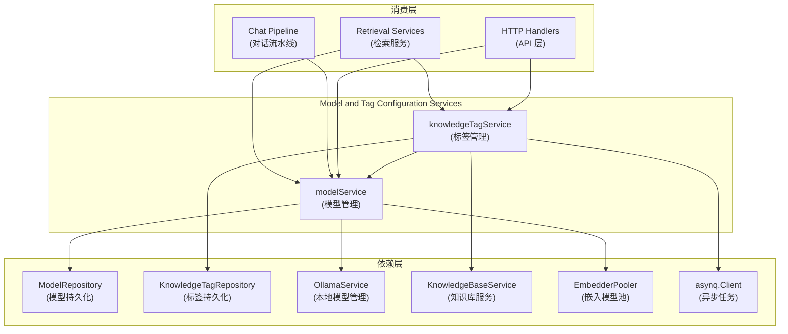

# Model and Tag Configuration Services 模块深度解析

## 概览

Model and Tag Configuration Services 模块是系统中负责管理 AI 模型生命周期和知识库标签配置的核心服务层。它像一个"资源管理中枢"，一方面负责模型的注册、初始化和生命周期管理（从远程 API 到本地 Ollama 模型），另一方面提供灵活的知识标签系统，让用户能够组织和管理知识库内容。

### 为什么这个模块存在？

想象一下，如果你需要构建一个支持多种 AI 模型（OpenAI、Azure、Ollama 等）的系统，同时还要让用户能够用标签灵活组织知识库内容，你会面临两个关键挑战：

1. **模型管理复杂性**：不同模型来源有不同的接入方式——远程模型需要 API 密钥配置，本地模型需要下载和管理生命周期。而且，你需要在运行时动态初始化这些模型实例，而不是硬编码在系统中。

2. **标签系统的一致性**：标签看似简单，但需要考虑权限控制、使用统计、级联删除、跨租户共享等复杂场景。如果直接在数据库层处理这些逻辑，会导致业务逻辑分散和重复。

这个模块的存在就是为了封装这些复杂性，提供一套统一、安全、易用的接口来管理模型和标签资源。

## 架构概览



### 架构说明

这个模块采用**服务层模式**，将业务逻辑与数据访问分离。两个核心服务各自负责一个明确的领域：

1. **modelService**：模型资源管理器
   - 负责模型的 CRUD 操作
   - 处理本地模型的异步下载
   - 动态初始化不同类型的模型实例（聊天、嵌入、重排序）
   - 支持跨租户模型访问（用于知识库共享场景）

2. **knowledgeTagService**：标签组织管理器
   - 提供标签的生命周期管理
   - 处理复杂的级联删除逻辑（包括异步索引清理）
   - 集成权限检查确保数据安全
   - 提供使用统计信息

数据流向通常是：API 层 → 服务层 → 仓库层 → 数据库，而服务层在这里扮演了业务逻辑编排者的角色。

## 核心设计决策

### 1. 模型状态机设计

**选择**：为模型定义了完整的状态机（Downloading → Active / DownloadFailed）

**为什么这样设计**：
- 本地模型（如 Ollama）可能需要数分钟甚至更长时间下载，不能阻塞请求
- 用户需要知道模型当前的可用状态
- 失败场景需要有明确的处理和反馈机制

**替代方案**：
- ❌ 同步下载：会导致请求超时，用户体验差
- ❌ 无状态管理：用户不知道模型何时可用，失败时无法调试

### 2. 标签删除的多模式支持

**选择**：DeleteTag 支持三种模式（普通删除、force 强制删除、contentOnly 仅删内容）

**为什么这样设计**：
- 不同场景需要不同的删除策略：
  - 普通删除：防止误删有内容的标签
  - force 删除：清理整个标签及其内容
  - contentOnly：清空标签内容但保留标签定义（常用于重置）
- 文档型和 FAQ 型知识库的删除逻辑不同，需要差异化处理

**替代方案**：
- ❌ 单一删除方法：会导致接口不够灵活，调用方需要处理太多分支逻辑
- ❌ 多个独立方法：会增加 API 复杂度，容易造成使用混淆

### 3. 异步任务处理删除操作

**选择**：使用 asynq 异步处理索引删除和文档删除任务

**为什么这样设计**：
- 向量索引删除可能涉及多个后端（Elasticsearch、Milvus 等），耗时较长
- 批量删除大量文档时，同步处理会导致请求超时
- 失败重试机制可以通过任务队列天然支持

**替代方案**：
- ❌ 同步删除：用户体验差，系统脆弱
- ❌ Goroutine 直接处理：缺乏重试、持久化和监控机制

### 4. 跨租户模型访问支持

**选择**：专门提供 GetEmbeddingModelForTenant 方法支持跨租户模型访问

**为什么这样设计**：
- 知识库共享场景中，必须使用源租户的嵌入模型才能保证向量兼容性
- 向量维度和编码方式是模型特定的，切换模型会导致已有的向量无法使用
- 需要严格的权限控制确保跨租户访问的安全性

**替代方案**：
- ❌ 要求共享时重新向量化：成本高、耗时长
- ❌ 复制模型配置：会导致配置同步问题

## 关键组件详解

### modelService：模型资源管家

modelService 就像是一个"模型图书馆管理员"，它不仅管理着模型的目录信息，还知道如何在需要时把模型"取出来"使用。

**核心职责**：
1. **模型生命周期管理**：从创建到删除的完整流程
2. **状态追踪**：本地模型下载进度和失败处理
3. **实例工厂**：根据配置动态初始化不同类型的模型

**关键方法解析**：

- **CreateModel**：智能处理远程和本地模型的差异
  - 远程模型：立即可用，状态设为 Active
  - 本地模型：异步下载，先设为 Downloading 状态
  - 这种设计让调用方无需关心模型来源的差异

- **GetEmbeddingModel / GetChatModel / GetRerankModel**：工厂方法模式
  - 封装了模型初始化的复杂性
  - 调用方只需提供模型 ID，就能获得可用的模型实例
  - 这种设计使得切换模型提供商变得透明

- **GetEmbeddingModelForTenant**：跨租户访问的特殊处理
  - 绕过了常规的租户上下文检查
  - 专门为知识库共享场景设计
  - 体现了服务层对特定业务场景的适配

### knowledgeTagService：知识组织专家

knowledgeTagService 像是一个"图书馆分类员"，它不仅管理标签本身，还要处理标签与内容之间的复杂关系。

**核心职责**：
1. **标签 CRUD**：基本的标签管理功能
2. **权限守卫**：确保用户只能操作有权限的标签
3. **级联操作**：处理标签删除时的内容清理
4. **统计聚合**：提供标签使用情况数据

**关键方法解析**：

- **ListTags**：批量查询优化
  - 使用 BatchCountReferences 一次性获取所有标签的使用统计
  - 避免了 N+1 查询问题
  - 性能优化：从 2N+1 次查询降到 3 次查询

- **DeleteTag**：复杂的多场景处理
  - 支持三种删除模式，适应不同业务需求
  - 区分文档型和 FAQ 型知识库的删除逻辑
  - 异步处理索引清理，避免阻塞
  - 这种设计展现了服务层如何封装复杂性

- **ProcessIndexDelete**：异步任务处理器
  - 批量处理索引删除，避免对后端造成压力
  - 包含重试机制，确保最终一致性
  - 体现了系统对可靠性的重视

## 数据流动路径

### 模型创建流程（本地 Ollama 模型）

```
HTTP 请求 → CreateModel
              ↓
         状态设为 Downloading
              ↓
         保存到仓库
              ↓
         启动 Goroutine 异步下载
              ↓
         返回成功（模型 ID）
         
[后台]
    PullModel → 更新状态为 Active 或 DownloadFailed
              ↓
         保存到仓库
```

**关键点**：调用方不会被阻塞，后续可以通过 GetModelByID 轮询状态。

### 标签删除流程（force=true）

```
HTTP 请求 → DeleteTag(force=true)
              ↓
         权限检查
              ↓
         获取知识库信息
              ↓
    ┌──── 文档型知识库？─────┐
    ↓                        ↓
  是                        否
    ↓                        ↓
enqueueKnowledgeDelete  deleteChunksAndEnqueueIndexDelete
    ↓                        ↓
[后台处理]              [后台处理]
    ↓                        ↓
删除文档和向量索引       删除向量索引
```

**关键点**：耗时的操作都被移到后台，API 响应快速返回。

## 依赖关系分析

### 入站依赖（谁使用这个模块）

1. **HTTP Handlers**：[agent_tenant_organization_and_model_management_handlers](../http_handlers_and_routing-agent_tenant_organization_and_model_management_handlers.md)
   - 提供 REST API 接口
   - 进行请求验证和响应包装

2. **Chat Pipeline**：[chat_pipeline_plugins_and_flow](../application_services_and_orchestration-chat_pipeline_plugins_and_flow.md)
   - 使用 modelService 获取聊天模型
   - 生成 AI 回复

3. **Retrieval Services**：[retrieval_and_web_search_services](../application_services_and_orchestration-retrieval_and_web_search_services.md)
   - 使用 modelService 获取嵌入和重排序模型
   - 使用 knowledgeTagService 进行内容过滤

### 出站依赖（这个模块使用谁）

1. **Repository 层**：[model_catalog_repository](../data_access_repositories-model_catalog_repository.md)、[tagging_and_reference_count_repositories](../data_access_repositories-tagging_and_reference_count_repositories.md)
   - 数据持久化
   - 不包含业务逻辑

2. **OllamaService**：来自 model_providers_and_ai_backends
   - 本地模型管理
   - 模型下载和运行时

3. **KnowledgeBaseService**：[knowledge_base_lifecycle_management](../application_services_and_orchestration-knowledge_ingestion_extraction_and_graph_services.md)
   - 知识库信息获取
   - 权限验证

4. **asynq.Client**：异步任务队列
   - 后台任务处理
   - 重试机制

## 新贡献者指南

### 常见陷阱与注意事项

1. **租户上下文的重要性**
   - ❌ 错误：直接使用 ctx 中的租户 ID 访问其他租户的资源
   - ✅ 正确：使用 GetEmbeddingModelForTenant 这样专门的跨租户方法
   - 提示：大多数操作都隐含租户隔离，跨租户操作需要特殊处理

2. **模型状态检查**
   - ❌ 错误：假设所有模型都是 Active 状态
   - ✅ 正确：使用 GetModelByID 会自动检查状态，或手动验证状态
   - 提示：GetChatModel 绕过了状态检查，因为聊天模型可能有特殊的就绪状态

3. **异步任务的最终一致性**
   - ❌ 错误：删除标签后立即查询期望内容已消失
   - ✅ 正确：理解异步操作需要时间，设计时考虑最终一致性
   - 提示：可以通过任务队列状态或轮询来确认操作完成

4. **内置模型的保护**
   - ❌ 错误：尝试修改或删除内置模型
   - ✅ 正确：检查 IsBuiltin 标志，尊重系统保护的模型
   - 提示：内置模型是系统预配置的，用户自定义模型应单独创建

5. **标签名称的唯一性**
   - ❌ 错误：假设标签名称在全局唯一
   - ✅ 正确：理解标签名称在知识库范围内唯一
   - 提示：不同知识库可以有相同名称的标签

### 扩展点

1. **添加新的模型类型**
   - 在 modelService 中添加类似 GetXxxModel 的方法
   - 遵循相同的模式：获取模型配置 → 初始化实例 → 返回接口

2. **自定义标签删除逻辑**
   - DeleteTag 已经有很好的扩展性，通过参数控制行为
   - 新的删除模式可以考虑添加新的参数或重载方法

3. **模型状态通知**
   - 可以在模型状态变更时添加事件发布
   - 便于前端实时更新模型状态

## 总结

Model and Tag Configuration Services 模块展示了如何通过服务层设计来封装复杂性：

- **关注点分离**：业务逻辑在服务层，数据访问在仓库层
- **异步思维**：耗时操作后台化，保证用户体验
- **多场景支持**：通过参数和模式匹配，灵活应对不同业务需求
- **权限优先**：在每个操作中嵌入安全检查，防止越权访问

这个模块的设计哲学可以概括为：**把复杂性留给自己，把简单性留给使用者**。作为系统的核心基础设施服务，它为上层应用提供了坚实而灵活的支撑。

## 子模块文档

- [Model Catalog Configuration Services](application_services_and_orchestration-agent_identity_tenant_and_configuration_services-model_and_tag_configuration_services-model_catalog_configuration_services.md) - 详细的模型配置和管理服务解析
- [Knowledge Tag Configuration Services](application_services_and_orchestration-agent_identity_tenant_and_configuration_services-model_and_tag_configuration_services-knowledge_tag_configuration_services.md) - 深入了解知识标签系统的设计与实现
