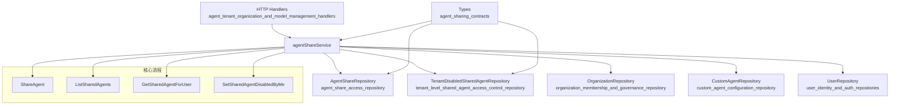

# Agent Sharing Access Service 深度解析

## 1. 问题空间与解决方案

### 1.1 问题定义
在多租户、多组织的协作环境中，智能体（Agent）的跨组织共享面临着一系列复杂的挑战：

- **权限控制难题**：如何确保只有授权用户能够共享和访问智能体？
- **租户隔离边界**：如何在支持跨租户共享的同时，维护租户间的安全隔离？
- **配置一致性**：如何保证被共享的智能体是完整配置的，避免使用者遇到运行时错误？
- **访问策略冲突**：当用户通过多个组织获得同一智能体的访问权限时，如何确定最终生效的权限？
- **用户体验权衡**：如何在保证安全的前提下，让用户能够方便地启用/禁用特定共享智能体？

### 1.2 设计洞察
该模块的核心设计洞察是将**智能体共享**抽象为一种**受控的资源桥接**，而非简单的资源复制。它通过三层防护机制确保安全共享：
1. **前置验证层**：验证智能体完整性、用户权限和组织成员身份
2. **策略执行层**：强制执行只读共享策略，确保权限不会过度授权
3. **访问控制层**：在访问时实时计算有效权限，支持用户级别的启用/禁用

## 2. 架构与核心概念

### 2.1 系统架构图



### 2.2 核心心智模型
可以将 `agentShareService` 想象成一个**智能体共享的海关检查系统**：

1. **出口检查（ShareAgent）**：智能体所有者提出共享申请时，系统检查智能体是否"合格出口"（完整配置）、申请人是否有"出口权"（组织编辑/管理员）。
2. **护照签发（AgentShare 记录）**：审核通过后，系统签发一张"共享护照"，记录共享关系和权限。
3. **入境检查（ListSharedAgents/GetSharedAgentForUser）**：当用户访问共享智能体时，系统检查用户的"入境资格"（组织成员身份），计算"有效签证"（有效权限）。
4. **黑名单管理（SetSharedAgentDisabledByMe）**：用户可以将特定共享智能体加入"个人黑名单"，暂时拒绝其"入境"。

这种模型既保证了共享的灵活性，又维护了系统的安全性和租户隔离。

## 3. 核心组件深度解析

### 3.1 agentShareService 结构体
`agentShareService` 是该模块的核心协调者，它通过依赖注入的方式组合了五个关键仓库：

```go
type agentShareService struct {
    shareRepo    interfaces.AgentShareRepository    // 共享关系存储
    disabledRepo interfaces.TenantDisabledSharedAgentRepository // 禁用状态存储
    orgRepo      interfaces.OrganizationRepository  // 组织管理
    agentRepo    interfaces.CustomAgentRepository   // 智能体管理
    userRepo     interfaces.UserRepository          // 用户管理
}
```

**设计意图**：
- 采用**依赖注入**模式，使服务易于测试和扩展
- 通过**组合而非继承**的方式，将不同关注点的职责分离到各个仓库
- 仓库接口（`interfaces.*`）定义了清晰的契约，降低了与具体实现的耦合

### 3.2 ShareAgent - 智能体共享流程
这是模块中最复杂的方法之一，它包含了多层验证和策略执行：

#### 工作流程：
1. **智能体验证**：检查智能体是否存在，是否属于当前租户
2. **配置完整性检查**：确保智能体配置了必需的模型
   - 必须有聊天模型（`ModelID != ""`）
   - 如果使用知识库，必须有重排序模型（`RerankModelID != ""`）
3. **组织和成员验证**：验证组织存在，且用户是组织成员
4. **角色权限检查**：只有编辑者和管理员可以共享智能体
5. **权限降级策略**：强制将权限设置为只读（`OrgRoleViewer`）
6. **共享关系管理**：创建新共享或更新已存在的共享

**关键设计决策**：
- **配置检查的必要性**：这是一个**左移错误处理**的例子——在共享时就发现配置问题，而不是等到用户尝试使用时才报错，大大提升了用户体验。
- **只读权限强制执行**：注释明确说明"智能体共享仅支持只读，不支持可编辑"，这是一个**安全性优先**的设计决策，避免了权限过度扩散的风险。
- **幂等性设计**：如果共享已存在，方法会更新现有共享而不是报错，这使得 API 更加健壮，客户端可以安全地重试。

### 3.3 ListSharedAgents - 共享智能体列表与权限聚合
该方法展示了如何处理**多源权限聚合**的复杂场景：

#### 工作流程：
1. 获取用户所有的共享记录
2. 过滤掉用户自己租户的智能体
3. 对每个共享，计算有效权限：
   - 如果用户在组织中的角色权限低于共享权限，以用户角色为准
4. 去重逻辑：
   - 同一智能体通过多个组织共享时，保留最高权限的那个
   - 使用 `agentID + sourceTenantID` 作为唯一键
5. 填充元数据：组织名称、共享者用户名等
6. 应用禁用状态：检查并设置用户是否禁用了该智能体

**设计亮点**：
- **有效权限计算**：`effectivePermission` 的计算逻辑体现了**最小权限原则**——用户获得的权限是共享权限和其在组织中角色的交集。
- **智能去重策略**：通过 map 去重并保留最高权限，既避免了重复显示，又确保用户获得最优体验。
- **优雅降级**：当禁用列表查询失败时，方法会返回不带禁用状态的列表，而非完全失败，这是一种**韧性设计**。

### 3.4 GetSharedAgentForUser - 访问控制检查
这是实际控制智能体访问的关键方法：

#### 工作流程：
1. 查找用户对该智能体的共享记录
2. 验证共享记录存在且有效
3. 从源租户获取完整的智能体配置

**设计意图**：
- **一次共享查找 + 一次智能体查找**：这种设计平衡了性能和一致性，确保用户获得的是最新的智能体配置。
- **源租户解析**：智能体的源租户从共享记录中解析，而不是从当前上下文推断，这避免了混淆，支持跨租户的正确访问。

### 3.5 SetSharedAgentDisabledByMe - 用户级别的访问控制
这个看似简单的方法体现了**用户体验与安全的平衡**：

```go
func (s *agentShareService) SetSharedAgentDisabledByMe(ctx context.Context, tenantID uint64, agentID string, sourceTenantID uint64, disabled bool) error {
    if disabled {
        return s.disabledRepo.Add(ctx, tenantID, agentID, sourceTenantID)
    }
    return s.disabledRepo.Remove(ctx, tenantID, agentID, sourceTenantID)
}
```

**设计洞察**：
- **三元组唯一标识**：使用 `(tenantID, agentID, sourceTenantID)` 作为唯一标识，确保正确区分来自不同源租户的同名智能体。
- **租户级别的禁用**：禁用状态是按租户存储的，这意味着用户在不同租户中可以有不同的禁用设置。

## 4. 数据流转与依赖关系

### 4.1 核心数据流转

#### 共享创建流程
```
ShareAgent请求 
    ↓
[验证智能体存在 & 所有权] → agentRepo.GetAgentByID
    ↓
[验证配置完整性] → 检查 ModelID 和 RerankModelID
    ↓
[验证组织存在] → orgRepo.GetByID
    ↓
[验证用户成员身份 & 角色] → orgRepo.GetMember
    ↓
[创建/更新共享记录] → shareRepo.Create/Update
    ↓
返回 AgentShare
```

#### 共享智能体列表查询流程
```
ListSharedAgents请求
    ↓
[获取用户所有共享] → shareRepo.ListSharedAgentsForUser
    ↓
[过滤 & 权限计算]
    ├─ 过滤自己租户的智能体
    ├─ 验证组织成员身份 → orgRepo.GetMember
    └─ 计算有效权限
    ↓
[去重 & 聚合] → 保留最高权限
    ↓
[填充元数据]
    ├─ 组织名称
    └─ 共享者用户名 → userRepo.GetUserByID
    ↓
[应用禁用状态] → disabledRepo.ListByTenantID
    ↓
返回 SharedAgentInfo 列表
```

### 4.2 依赖关系分析

**上游依赖**：
- **HTTP 处理器层**：`organization_shared_agent_access_handlers` 调用服务层方法，处理 HTTP 请求和响应。
- **类型定义**：`agent_sharing_contracts` 定义了核心数据结构（`AgentShare`、`SharedAgentInfo` 等）。

**下游依赖**：
- **AgentShareRepository**：负责共享关系的持久化和查询。
- **TenantDisabledSharedAgentRepository**：管理租户级别的共享智能体禁用状态。
- **OrganizationRepository**：提供组织和成员信息。
- **CustomAgentRepository**：提供智能体配置信息。
- **UserRepository**：提供用户信息。

**关键契约**：
- 所有仓库都通过接口（`interfaces.*`）依赖，而非具体实现，这使得模块易于测试和扩展。
- 错误处理契约：服务定义了自己的错误类型（如 `ErrAgentShareNotFound`），并将仓库错误转换为这些类型，提供统一的错误语义。

## 5. 设计决策与权衡

### 5.1 只读共享策略
**决策**：智能体共享只支持只读权限，不支持可编辑权限。
**理由**：
- **安全性**：避免了跨租户的修改权限可能带来的安全风险。
- **简化模型**：只读共享大大简化了权限管理和冲突解决的复杂性。
- **使用场景**：在大多数协作场景中，只读访问已经足够满足需求。
**权衡**：
- 限制了某些高级协作场景的可能性，但这种限制是有意为之的，以换取系统的安全性和简单性。

### 5.2 配置完整性前置检查
**决策**：在共享时检查智能体配置的完整性，而不是在使用时。
**理由**：
- **用户体验**：提前发现问题，让智能体所有者能够及时修复，而不是让最终使用者遇到错误。
- **质量保证**：确保只有高质量的智能体才能被共享，提升整个共享生态的质量。
**权衡**：
- 增加了共享时的复杂度，但这种一次性成本远小于每次使用时检查的成本。

### 5.3 有效权限的实时计算
**决策**：每次查询列表时都重新计算有效权限，而不是持久化。
**理由**：
- **一致性**：确保权限变化（如用户角色变更、共享权限变更）能够立即生效。
- **简化存储**：避免了维护冗余权限数据的复杂性。
**权衡**：
- 每次查询都需要多次仓库调用，可能对性能有一定影响。但在实际场景中，这种影响通常是可接受的，特别是考虑到权限查询的频率远低于智能体使用的频率。

### 5.4 用户级别的禁用功能
**决策**：允许用户在自己的租户中禁用特定的共享智能体。
**理由**：
- **用户体验**：给用户提供了控制权，可以过滤掉不感兴趣的共享智能体。
- **非侵入性**：禁用状态是用户级别的，不影响其他用户对同一智能体的访问。
**权衡**：
- 增加了系统的复杂度，但这种复杂度是值得的，因为它大大提升了用户体验。

## 6. 使用指南与示例

### 6.1 共享智能体
```go
// 创建共享服务
shareService := NewAgentShareService(shareRepo, disabledRepo, orgRepo, agentRepo, userRepo)

// 共享智能体
share, err := shareService.ShareAgent(
    ctx,
    "agent-123",     // 智能体 ID
    "org-456",       // 组织 ID
    "user-789",      // 用户 ID
    1001,            // 租户 ID
    types.OrgRoleEditor, // 期望权限（会被强制降级为 Viewer）
)

if err != nil {
    // 处理错误
    switch err {
    case ErrAgentNotFoundForShare:
        // 智能体不存在
    case ErrNotAgentOwner:
        // 不是智能体所有者
    case ErrAgentNotConfigured:
        // 智能体配置不完整
    // ... 其他错误处理
    }
}
```

### 6.2 列出用户可访问的共享智能体
```go
agents, err := shareService.ListSharedAgents(ctx, "user-789", 1002)
if err != nil {
    // 处理错误
}

for _, agent := range agents {
    fmt.Printf("智能体: %s, 来自组织: %s, 权限: %s\n",
        agent.Agent.Name,
        agent.OrgName,
        agent.Permission,
    )
    if agent.DisabledByMe {
        fmt.Println("  (已禁用)")
    }
}
```

### 6.3 禁用/启用共享智能体
```go
// 禁用智能体
err := shareService.SetSharedAgentDisabledByMe(
    ctx,
    1002,            // 当前租户 ID
    "agent-123",     // 智能体 ID
    1001,            // 源租户 ID
    true,            // 是否禁用
)

// 启用智能体
err = shareService.SetSharedAgentDisabledByMe(
    ctx,
    1002,
    "agent-123",
    1001,
    false,
)
```

## 7. 边缘情况与注意事项

### 7.1 多组织权限聚合
**场景**：用户通过多个组织获得同一智能体的访问权限，且权限级别不同。
**处理**：系统会自动选择最高权限的那个共享记录作为有效权限。
**注意**：权限级别是通过 `HasPermission` 方法定义的，目前是 `Admin > Editor > Viewer`。

### 7.2 用户角色变更
**场景**：用户在组织中的角色发生变化（如从 Viewer 提升为 Editor）。
**处理**：由于有效权限是实时计算的，变更会在用户下次查询共享智能体列表时立即生效。
**注意**：即使共享记录中的权限是 Viewer，如果用户角色是 Editor，有效权限也会是 Editor。

### 7.3 智能体配置变更
**场景**：智能体被共享后，其配置发生了变更（如添加了知识库但未配置重排序模型）。
**处理**：系统不会在配置变更后自动撤销共享，但用户使用时可能会遇到错误。
**注意**：这是一个潜在的边缘情况，当前设计没有处理这种"事后配置退化"的场景。

### 7.4 跨租户 ID 冲突
**场景**：两个不同租户的智能体碰巧有相同的 ID。
**处理**：系统使用 `agentID + sourceTenantID` 作为唯一标识，正确区分不同源的智能体。
**注意**：在处理禁用状态时，也使用了相同的三元组标识，确保不会错误地禁用来自其他租户的同名智能体。

### 7.5 仓库调用失败的优雅降级
**场景**：在 `ListSharedAgents` 中，查询禁用列表失败。
**处理**：系统会记录错误，但仍然返回不带禁用状态的列表，而不是完全失败。
**注意**：这种韧性设计确保了即使部分功能失败，核心功能仍然可用。

## 8. 总结

`agent_sharing_access_service` 模块是一个精心设计的组件，它在多租户环境中安全、灵活地实现了智能体的跨组织共享。它的核心价值在于：

1. **三层防护机制**：前置验证、策略执行、访问控制，确保安全共享。
2. **用户体验优先**：配置前置检查、用户级禁用、实时权限计算，提升用户体验。
3. **灵活与安全的平衡**：只读共享、权限降级、最小权限原则，在灵活性和安全性之间找到了良好的平衡点。

该模块的设计展示了如何在复杂的企业环境中，通过清晰的抽象、良好的错误处理、以及对用户体验的关注，构建一个既安全又易用的资源共享系统。
