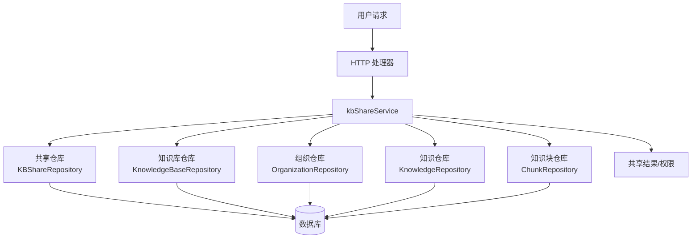

# 知识库共享访问服务 (knowledge_base_sharing_access_service) 技术深度解析

## 1. 什么问题需要解决？

在多租户、多组织的协作场景中，企业通常面临一个核心挑战：**如何安全、灵活地跨组织边界共享知识库资源，同时保持清晰的权限控制和资源所有权**。

### 问题空间分析

传统的资源共享模型往往面临以下困境：
1. **简单复制导致数据冗余**：将知识库复制到目标组织会造成数据不一致，更新需要同步到多个副本
2. **直接访问导致权限失控**：开放直接访问会绕过组织边界的安全控制
3. **权限模型过于简单**：无法同时满足"谁能共享"、"共享给谁"、"共享什么权限"这三个维度的复杂需求
4. **缺乏治理机制**：目标组织无法对共享进来的资源进行管理（例如当共享者离开组织后）

### 设计洞察

`kbShareService` 的核心设计思想是：**将共享关系建模为独立的 "共享契约" 实体**，通过这个契约来解耦资源所有者和资源消费者，同时在契约中嵌入完整的权限计算逻辑。

可以将其想象为现实世界中的"图书馆借阅系统"：
- 资源所有者（图书馆）拥有书籍
- 共享契约（借阅证）定义了谁能借、能借多久、有什么权限
- 有效的权限是"借阅证权限"和"用户在图书馆中的身份"的交集

## 2. 核心架构与数据流

### 架构图



### 核心组件角色

| 组件 | 职责 |
|------|------|
| `kbShareService` | 核心编排器，协调所有共享操作，实现权限计算逻辑 |
| `KBShareRepository` | 持久化共享契约，处理共享记录的 CRUD |
| `OrganizationRepository` | 提供组织和成员信息，验证用户的组织角色 |
| `KnowledgeBaseRepository` | 验证知识库存在性和所有权 |
| `KnowledgeRepository` / `ChunkRepository` | 补充知识库的统计信息（文档数/块数） |

### 关键数据流：共享知识库

当用户调用 `ShareKnowledgeBase` 时，数据流向如下：

1. **所有权验证阶段**：
   - 通过 `kbRepo` 获取知识库，验证其存在性
   - 检查知识库的 `TenantID` 与当前用户租户一致（确保是所有者）

2. **组织权限验证阶段**：
   - 通过 `orgRepo` 验证目标组织存在
   - 检查用户是否是该组织成员，且角色至少是 `Editor`（Viewer 不能共享）

3. **契约创建阶段**：
   - 构建 `KnowledgeBaseShare` 实体，包含共享双方、权限、时间戳
   - 尝试创建：如果已存在则更新权限（幂等设计）

4. **结果返回**：返回完整的共享契约对象

## 3. 核心组件深度解析

### kbShareService 结构体

这是整个模块的核心编排器，采用依赖注入设计，完全依赖接口而非具体实现。

```go
type kbShareService struct {
    shareRepo interfaces.KBShareRepository
    orgRepo   interfaces.OrganizationRepository
    kbRepo    interfaces.KnowledgeBaseRepository
    kgRepo    interfaces.KnowledgeRepository
    chunkRepo interfaces.ChunkRepository
}
```

**设计意图**：
- 通过构造函数 `NewKBShareService` 注入所有依赖，便于单元测试
- 每个依赖都有明确的单一职责，符合开闭原则
- 服务本身不包含任何持久化逻辑，只负责业务流程编排

### 共享操作：ShareKnowledgeBase

这是模块的核心入口点，实现了完整的共享创建流程。

**关键设计决策**：
1. **幂等性处理**：如果共享已存在，不会报错而是更新权限
2. **双重所有权验证**：既验证知识库属于当前租户，又验证用户在目标组织有足够角色
3. **权限预验证**：在创建前就检查 `permission.IsValid()`，避免无效状态进入系统

**错误处理策略**：
- 将仓库层的错误（如 `repository.ErrKBShareAlreadyExists`）转换为服务层的语义错误
- 保持错误链的完整性，通过 `errors.Is()` 进行类型断言

### 权限计算逻辑：有效权限的交集模型

模块中最精妙的设计是**有效权限的计算**，体现在 `ListSharedKnowledgeBases`、`CheckUserKBPermission` 等方法中：

```go
// 有效权限是共享权限和用户组织角色的交集
effectivePermission := share.Permission
if !member.Role.HasPermission(share.Permission) {
    effectivePermission = member.Role
}
```

**为什么采用交集模型？**
- **安全性**：防止用户通过加入低权限组织获得高权限访问
- **灵活性**：资源所有者可以设置最大权限，组织可以根据用户角色进一步限制
- **符合直觉**：想象成"你有一张贵宾卡（共享权限），但这家店今天只有部分区域开放（组织角色）"

### 去重与权限提升：ListSharedKnowledgeBases

当一个知识库通过多个组织共享给同一用户时，需要：
1. **去重**：只显示一次知识库
2. **权限提升**：保留最高的有效权限

**实现方式**：使用 `map[string]*types.SharedKnowledgeBaseInfo` 按知识库 ID 去重，比较权限时保留较高的那个。

**权限层次**：`Admin(3) > Editor(2) > Viewer(1)`，通过 `HasPermission()` 方法比较。

### 治理机制：组织管理员的介入权

在 `UpdateSharePermission` 和 `RemoveShare` 中，有一个关键设计：

```go
// 共享者可以更新；组织管理员也可以更新（例如当共享者离开时）
if share.SharedByUserID != userID {
    member, err := s.orgRepo.GetMember(ctx, share.OrganizationID, userID)
    if err != nil || member.Role != types.OrgRoleAdmin {
        return ErrSharePermissionDenied
    }
}
```

**为什么允许组织管理员介入？**
- **解决"孤儿共享"问题**：当共享者离开组织后，资源不会变成无法管理
- **内容治理**：组织需要对进入自己边界的内容有最终控制权
- **责任分离**：资源所有者负责"共享什么"，组织管理员负责"在我的组织内如何管理"

## 4. 依赖关系分析

### 流入依赖（谁调用这个服务）

从模块树可以看出，这个服务位于 `application_services_and_orchestration` 层，主要被：
- HTTP 处理器层（`http_handlers_and_routing`）调用
- 可能被其他应用服务编排使用

### 流出依赖（这个服务调用谁）

| 依赖接口 | 用途 | 耦合度 |
|---------|------|--------|
| `KBShareRepository` | 共享契约持久化 | 高（核心依赖） |
| `OrganizationRepository` | 组织和成员验证 | 高（权限计算必需） |
| `KnowledgeBaseRepository` | 知识库所有权验证 | 高（共享前提） |
| `KnowledgeRepository` | 文档计数统计 | 低（仅增强信息） |
| `ChunkRepository` | 知识块计数统计 | 低（仅增强信息） |

**依赖设计的优点**：
- 所有依赖都是接口，便于替换和测试
- 统计信息的获取是可选的（失败只记录警告），不影响核心流程
- 没有直接依赖数据库，保持了服务层的纯粹性

### 数据契约

服务的输入输出主要基于以下类型（虽然代码中未完全展示，但可推断）：
- `types.KnowledgeBaseShare`：共享契约实体
- `types.OrgMemberRole`：角色枚举（Admin/Editor/Viewer）
- `types.SharedKnowledgeBaseInfo`：给前端的共享知识库信息

## 5. 设计决策与权衡

### 决策 1：共享关系作为独立实体，而非知识库属性

**选择**：创建独立的 `KnowledgeBaseShare` 表/实体，而不是在知识库上添加 `SharedToOrgs` 字段

**原因**：
- 一个知识库可以共享给多个组织，关系是多对多的
- 每个共享关系有自己的元数据（权限、共享者、时间戳）
- 需要独立查询"某组织收到的所有共享"，而不总是从知识库出发

**权衡**：
- ✅ 灵活：支持复杂的共享场景
- ✅ 可扩展：可以轻松添加共享过期时间、共享范围等属性
- ❌ 查询复杂：获取知识库的共享需要 JOIN 或额外查询

### 决策 2：权限计算采用"交集模型"而非"并集模型"

**选择**：有效权限 = min(共享权限, 用户组织角色)

**替代方案**：有效权限 = max(共享权限, 用户组织角色)

**原因**：
- **安全性优先**：防止权限提升攻击
- **符合最小权限原则**：用户应该只获得完成工作所需的最小权限
- **责任清晰**：资源所有者和组织都有控制权

**权衡**：
- ✅ 安全：无法通过组织角色提升权限
- ❌ 有时会让用户困惑："为什么我在组织是 Admin，但只有 Viewer 权限？"

### 决策 3：组织管理员可以修改/删除任何共享

**选择**：赋予目标组织管理员完全的共享治理权

**替代方案**：只有共享者可以管理

**原因**：
- 解决"孤儿资源"问题
- 组织需要对自己边界内的内容负责
- 企业场景中，IT 部门通常需要这种治理能力

**权衡**：
- ✅ 健壮：不会因为人员变动导致资源无法管理
- ❌ 信任假设：需要信任组织管理员不会滥用此权限
- ❌ 复杂度增加：需要双重权限检查

### 决策 4：列表时实时计算权限，而非预计算缓存

**选择**：每次调用 `ListSharedKnowledgeBases` 时实时计算有效权限

**替代方案**：预计算并缓存用户对每个知识库的权限

**原因**：
- 组织角色可能随时变化，缓存会失效
- 共享关系变化需要同步更新缓存
- 实时计算虽然稍慢，但保证了数据一致性

**权衡**：
- ✅ 一致：永远看到最新的权限状态
- ❌ 性能：每次列表需要多次仓库调用
- ❌ 可扩展性：当用户属于很多组织时，可能变慢

## 6. 使用指南与常见模式

### 创建共享

```go
// 共享知识库给组织，赋予 Editor 权限
share, err := kbShareService.ShareKnowledgeBase(
    ctx,
    kbID,           // 知识库 ID
    orgID,          // 目标组织 ID
    userID,         // 执行者 ID
    tenantID,       // 执行者租户 ID
    types.OrgRoleEditor,  // 共享权限
)
```

**前提条件**：
- 调用者必须是知识库的所有者（同一租户）
- 调用者必须是目标组织的成员，且角色至少是 Editor
- 目标组织必须存在

### 检查权限

```go
// 检查用户是否有至少 Editor 权限
hasPermission, err := kbShareService.HasKBPermission(
    ctx,
    kbID,
    userID,
    types.OrgRoleEditor,
)

// 或者获取详细的权限级别
permission, isShared, err := kbShareService.CheckUserKBPermission(
    ctx,
    kbID,
    userID,
)
```

### 列出用户可访问的共享知识库

```go
// 获取用户通过组织获得的所有共享知识库（已去重，保留最高权限）
sharedKBs, err := kbShareService.ListSharedKnowledgeBases(
    ctx,
    userID,
    currentTenantID,  // 过滤掉用户自己租户的知识库
)
```

## 7. 边缘情况与陷阱

### 边缘情况 1：知识库共享给多个用户所在的组织

**现象**：用户通过组织 A 获得 Viewer 权限，通过组织 B 获得 Editor 权限
**结果**：用户最终获得 Editor 权限（取最高）
**注意**：这是设计如此，但有时会让管理员困惑

### 边缘情况 2：共享者离开组织

**现象**：创建共享的用户不再属于目标组织
**结果**：组织管理员仍然可以管理这个共享（设计的治理机制）
**建议**：在 UI 中显示"共享者已离开"的提示

### 边缘情况 3：知识库被删除

**现象**：知识库被删除，但共享记录仍然存在
**当前处理**：代码中有 `if share.KnowledgeBase == nil { continue }` 的检查
**建议**：考虑在删除知识库时级联删除共享记录，或者定期清理

### 陷阱 1：忘记检查有效权限

**错误做法**：直接使用 `share.Permission`，而不计算与用户组织角色的交集
**后果**：用户可能获得超出其组织角色的权限
**正确做法**：始终使用代码中的交集计算逻辑

### 陷阱 2：假设用户只属于一个组织

**错误做法**：找到第一个共享就返回
**后果**：用户可能无法看到更高权限的共享
**正确做法**：收集所有共享，去重并保留最高权限

## 8. 扩展与演进方向

### 可能的扩展点

1. **共享过期时间**：在 `KnowledgeBaseShare` 中添加 `ExpiresAt` 字段
2. **共享范围限制**：限制只能共享知识库的部分内容
3. **共享审计日志**：记录所有共享操作的变更历史
4. **共享请求工作流**：需要目标组织审批的共享流程
5. **批量共享操作**：一次共享多个知识库给多个组织

### 性能优化考虑

如果用户组织数量和共享数量变得很大，可以考虑：
- 预计算并缓存用户权限（带失效机制）
- 使用数据库视图简化列表查询
- 批量获取组织成员信息，减少 N+1 查询

## 9. 参考链接

- [组织共享访问仓库](data_access_repositories-identity_tenant_and_organization_repositories-organization_membership_sharing_and_access_control_repositories-shared_resource_access_repositories-knowledge_base_share_access_repository.md)
- [Agent 共享访问服务](application_services_and_orchestration-agent_identity_tenant_and_configuration_services-resource_sharing_and_access_services-agent_sharing_access_service.md)
- [组织治理与成员管理](application_services_and_orchestration-agent_identity_tenant_and_configuration_services-identity_tenant_and_organization_management-organization_governance_and_membership_management.md)
