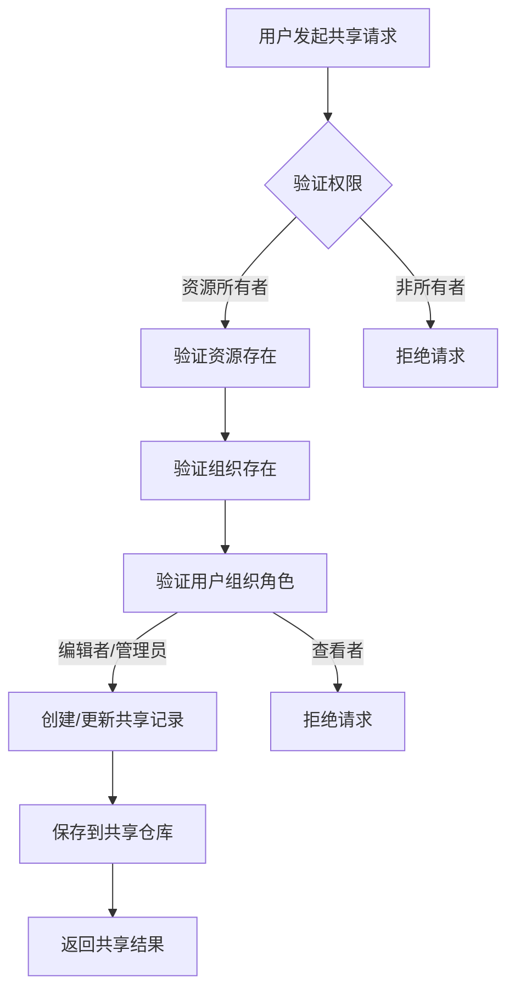
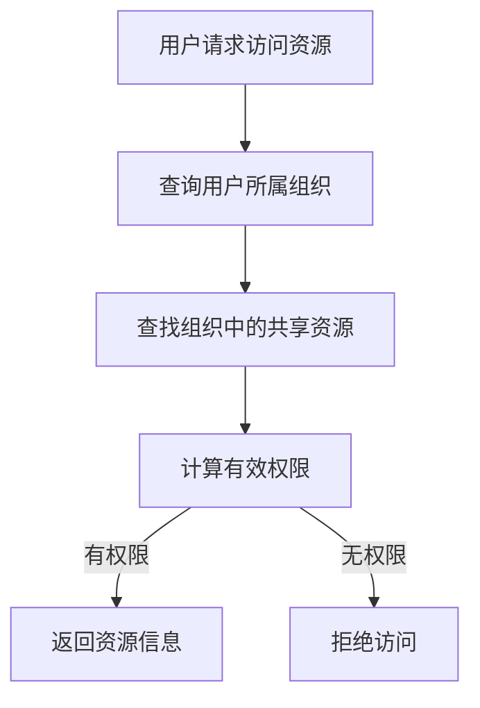

# 资源共享与访问服务 (resource_sharing_and_access_services)

## 模块概述

想象一下，您在一个大型企业中工作，拥有多个团队和部门。每个团队都开发了自己的智能体和知识库，但它们之间无法共享资源。这个模块就是为了解决这个问题而设计的——它就像企业内部的"资源共享中心"，允许不同团队安全地共享智能体和知识库，同时保持严格的访问控制。

这个模块解决了跨租户资源共享的核心问题：
- 如何让一个租户的智能体安全地被另一个租户使用？
- 如何控制共享资源的访问权限？
- 如何在共享的同时保护数据安全和隐私？

## 核心组件

该模块包含两个主要的服务组件：

1. **agentShareService** - 负责智能体的共享管理
2. **kbShareService** - 负责知识库的共享管理

这两个服务遵循相似的设计模式，但针对各自的资源类型进行了专门优化。

## 架构设计

### 核心设计理念

这个模块采用了**基于组织的共享模型**，而不是直接的用户间共享。这种设计有几个关键优势：

1. **集中管理**：组织管理员可以统一管理共享资源
2. **权限继承**：用户通过组织成员身份自动获得共享资源的访问权限
3. **可审计性**：所有共享操作都与组织关联，便于追踪

### 数据流向

以下是资源共享的典型数据流：



当其他用户访问共享资源时：



### 关键设计决策

#### 1. 组织作为共享中介

**设计选择**：资源只能共享给组织，而不能直接共享给个人用户。

**原因分析**：
- 简化权限管理：用户通过组织成员身份自动获得权限
- 提高可维护性：组织管理员可以统一管理所有共享资源
- 符合企业协作模式：资源通常是在团队/部门间共享，而非个人

#### 2. 双重权限验证

**设计选择**：有效权限是"共享权限"和"用户组织角色"的交集（取较低值）。

**原因分析**：
- 防止权限提升：即使资源共享者授予了高权限，用户也不能超过自己在组织中的角色
- 灵活性与安全性平衡：资源所有者可以控制共享范围，组织管理员可以控制成员权限

**示例**：
- 共享权限：编辑者
- 用户组织角色：查看者
- 有效权限：查看者

#### 3. 智能体共享仅支持只读

**设计选择**：智能体共享强制使用只读权限，即使请求更高权限也会被降级。

**代码位置**：`agentShareService.ShareAgent` 方法中
```go
// 智能体共享仅支持只读，不支持可编辑
permission = types.OrgRoleViewer
```

**原因分析**：
- 安全性考虑：防止其他组织修改智能体配置
- 简化模型：智能体的配置修改应该由所有者控制
- 未来扩展：如果需要可编辑共享，可以在后续版本中添加

#### 4. 共享资源的去重与权限合并

**设计选择**：当同一资源通过多个组织共享给同一用户时，保留最高权限的那个。

**实现方式**：使用 map 按资源 ID 去重，比较权限级别后保留最高权限。

**原因分析**：
- 用户体验：用户看到的是资源列表，而不是共享记录列表
- 权限最大化：确保用户获得最宽松的有效权限

## 子模块详解

### 智能体共享访问服务 (agent_sharing_access_service)

这个子模块专门处理智能体的共享逻辑，实现了安全、灵活的智能体跨组织共享机制。

**详细文档：[智能体共享访问服务](application_services_and_orchestration-agent_identity_tenant_and_configuration_services-resource_sharing_and_access_services-agent_sharing_access_service.md)

**核心功能**：
- 共享智能体到组织
- 移除智能体共享
- 列出智能体的所有共享
- 列出组织中的共享智能体
- 列出用户可访问的共享智能体
- 禁用/启用共享智能体（租户级别）

**关键特性**：
- 共享前验证智能体配置完整性（必须配置聊天模型，使用知识库时必须配置重排序模型）
- 支持租户级别禁用特定共享智能体
- 智能体共享强制只读权限

**设计亮点**：
- 采用三层防护机制确保安全共享
- 前置验证层、策略执行层、访问控制层
- 将智能体共享抽象为"智能体共享的海关检查系统"

### 知识库共享访问服务 (knowledge_base_sharing_access_service)

这个子模块专门处理知识库的共享逻辑，实现了安全、灵活的知识库跨组织共享机制。

**详细文档**：[知识库共享访问服务](application_services_and_orchestration-agent_identity_tenant_and_configuration_services-resource_sharing_and_access_services-knowledge_base_sharing_access_service.md)

**核心功能**：
- 共享知识库到组织
- 更新共享权限
- 移除知识库共享
- 列出知识库的所有共享
- 列出组织中的共享知识库
- 列出用户可访问的共享知识库
- 检查用户对知识库的权限

**关键特性**：
- 支持多种权限级别（查看者、编辑者、管理员）
- 共享者和组织管理员都可以管理共享
- 自动计算知识库中的知识/文档数量
- 支持权限检查和验证

**设计亮点**：
- 将共享关系建模为独立的"共享契约"实体
- 采用"图书馆借阅系统"的类比模型
- 有效权限计算采用"交集模型"，确保安全性
- 组织管理员拥有共享治理权

## 依赖关系

这个模块依赖于以下核心组件：

1. **共享仓库** (`AgentShareRepository`, `KBShareRepository`) - 持久化共享记录
2. **组织仓库** (`OrganizationRepository`) - 验证组织存在和用户角色
3. **资源仓库** (`CustomAgentRepository`, `KnowledgeBaseRepository`) - 验证资源存在和所有权
4. **禁用仓库** (`TenantDisabledSharedAgentRepository`) - 管理租户级别的禁用状态
5. **用户仓库** (`UserRepository`) - 获取用户信息
6. **知识/块仓库** (`KnowledgeRepository`, `ChunkRepository`) - 计算知识库内容数量

## 注意事项与最佳实践

### 常见陷阱

1. **权限验证顺序**：
   - 始终先验证资源所有权，再验证组织角色
   - 不要假设用户在组织中的角色，总是从仓库查询

2. **共享记录更新**：
   - 当共享已存在时，更新权限而不是创建新记录
   - 始终更新 `UpdatedAt` 时间戳

3. **性能考虑**：
   - 列出共享资源时，可能需要多次查询仓库，考虑使用批量查询
   - 计算知识库内容数量可能很耗时，考虑缓存

### 扩展点

1. **添加新的资源类型**：
   - 遵循现有的服务模式
   - 实现相应的仓库接口
   - 考虑权限模型是否需要调整

2. **支持更细粒度的权限**：
   - 当前使用组织角色作为权限基础
   - 可以扩展为自定义权限级别
   - 注意保持向后兼容性

3. **添加共享审计日志**：
   - 记录所有共享操作
   - 包括谁、何时、做了什么操作
   - 便于问题追踪和安全审计

## 总结

`resource_sharing_and_access_services` 模块是系统中实现跨租户资源共享的核心组件。它通过组织作为共享中介，实现了安全、灵活的资源共享机制。该模块的设计注重安全性、可维护性和用户体验，通过双重权限验证、智能去重等机制，确保了资源共享的安全性和便利性。

对于新加入团队的开发者来说，理解这个模块的关键是把握"组织作为共享中介"和"双重权限验证"这两个核心设计理念，以及智能体和知识库共享的异同点。
