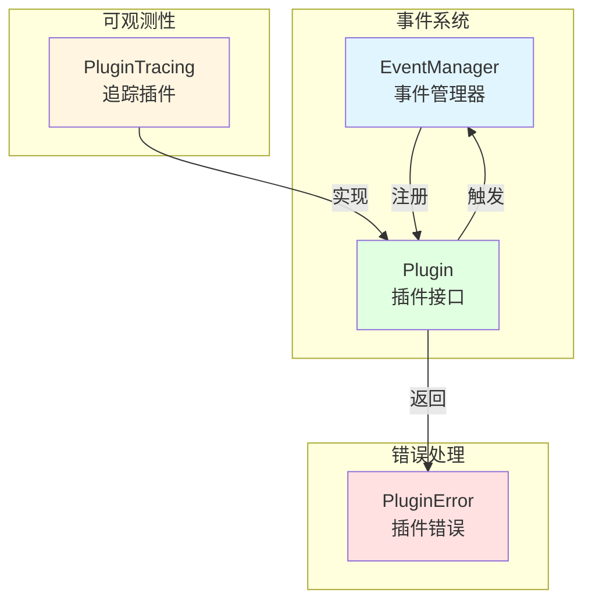

# Pipeline Core and Instrumentation

## 概述

想象一下，你正在构建一个复杂的聊天机器人系统，它需要处理查询理解、知识检索、结果排序、响应生成等多个步骤。每个步骤都可能有多个实现方式，而且你需要能够灵活地组合这些步骤，同时还要能够观察整个流程的执行情况。这就是 `pipeline_core_and_instrumentation` 模块要解决的问题。

这个模块提供了一个基于事件驱动的插件架构，允许你将聊天处理流程分解为多个独立的、可插拔的组件。每个组件只关注自己的职责，通过事件系统进行通信，从而实现了高度的解耦和灵活性。同时，模块还内置了强大的可观测性支持，可以追踪整个处理流程的关键指标和状态。

## 核心架构



### 核心组件说明

1. **Plugin 接口**：定义了插件的基本契约。每个插件需要声明它关心的事件类型，并在事件发生时执行相应的逻辑。插件可以决定是否继续执行后续的插件链。

2. **EventManager**：事件管理器，负责插件的注册和事件的触发。它维护了事件类型到插件列表的映射，并在事件触发时按顺序调用相关插件。

3. **PluginTracing**：一个内置的追踪插件，用于记录聊天处理流程中的关键信息，如查询内容、搜索结果、模型调用等。

4. **PluginError**：定义了插件执行过程中可能出现的错误类型，提供了统一的错误处理机制。

## 设计思想

### 1. 事件驱动架构

该模块采用了事件驱动的设计模式。这意味着整个聊天处理流程不是通过硬编码的函数调用来组织的，而是通过触发和响应事件来实现的。

**为什么选择这种方式？**
- **解耦**：插件之间不需要直接依赖，只需要关注自己关心的事件。
- **灵活性**：可以轻松地添加、移除或替换插件，而不需要修改核心流程。
- **可扩展性**：新的功能可以通过添加新的插件来实现，而不需要修改现有代码。

### 2. 中间件模式

插件的设计借鉴了中间件模式。每个插件在处理事件时，可以选择在调用下一个插件之前或之后执行自己的逻辑，甚至可以决定中断整个插件链的执行。

**这种设计的优势：**
- **责任链**：可以将复杂的处理逻辑分解为多个独立的步骤。
- **横切关注点**：可以方便地实现日志、追踪、错误处理等横切关注点。
- **控制流**：每个插件都有机会控制处理流程的走向。

### 3. 内置可观测性

模块将可观测性作为一等公民，通过 `PluginTracing` 内置了对关键操作的追踪支持。这使得我们可以在生产环境中轻松地监控和调试聊天处理流程。

## 数据流程

让我们通过一个典型的聊天查询处理流程来看看数据是如何在这个模块中流动的：

1. **查询重写**：触发 `REWRITE_QUERY` 事件，相关插件对用户查询进行优化和扩展。
2. **知识检索**：触发 `CHUNK_SEARCH` 或 `CHUNK_SEARCH_PARALLEL` 事件，执行向量搜索或混合搜索。
3. **结果重排**：触发 `CHUNK_RERANK` 事件，对搜索结果进行重排序。
4. **结果合并**：触发 `CHUNK_MERGE` 事件，合并多个检索源的结果。
5. **Top-K 过滤**：触发 `FILTER_TOP_K` 事件，选择最相关的 K 个结果。
6. **消息组装**：触发 `INTO_CHAT_MESSAGE` 事件，将检索结果组装成聊天消息。
7. **模型调用**：触发 `CHAT_COMPLETION` 或 `CHAT_COMPLETION_STREAM` 事件，调用 LLM 生成响应。

在整个流程中，`PluginTracing` 会记录每个步骤的关键信息，包括输入参数、输出结果、执行时间等。

## 核心组件详解

### Plugin 接口

```go
type Plugin interface {
    OnEvent(
        ctx context.Context,
        eventType types.EventType,
        chatManage *types.ChatManage,
        next func() *PluginError,
    ) *PluginError
    ActivationEvents() []types.EventType
}
```

`Plugin` 是整个模块的核心接口。每个插件需要实现两个方法：
- `ActivationEvents()`：返回该插件关心的事件类型列表。
- `OnEvent()`：处理事件的核心逻辑，接收上下文、事件类型、聊天管理对象和下一个插件的回调函数。

### EventManager

`EventManager` 负责管理插件的注册和事件的触发。它的核心方法包括：
- `Register()`：注册一个插件。
- `Trigger()`：触发一个事件，调用所有相关插件。

`EventManager` 使用了一种巧妙的方式来构建插件链：它从最后一个插件开始，向前构建一个嵌套的函数调用链。这样，当事件触发时，插件会按照注册的顺序依次执行。

### PluginTracing

`PluginTracing` 是一个内置的追踪插件，它实现了 `Plugin` 接口，并关注以下事件：
- `CHUNK_SEARCH`：知识块搜索
- `CHUNK_RERANK`：结果重排
- `CHUNK_MERGE`：结果合并
- `INTO_CHAT_MESSAGE`：消息组装
- `CHAT_COMPLETION`：聊天完成（非流式）
- `CHAT_COMPLETION_STREAM`：聊天完成（流式）
- `FILTER_TOP_K`：Top-K 过滤
- `REWRITE_QUERY`：查询重写
- `CHUNK_SEARCH_PARALLEL`：并行搜索

对于每个事件，`PluginTracing` 会记录关键的输入参数和输出结果，并将这些信息附加到 OpenTelemetry 的 span 中。

### PluginError

`PluginError` 提供了统一的错误处理机制。它包含以下字段：
- `Err`：原始错误
- `Description`：人类可读的错误描述
- `ErrorType`：错误类型标识符

模块还预定义了一些常见的错误类型，如 `ErrSearchNothing`、`ErrSearch`、`ErrRerank` 等。

## 使用指南

### 创建一个插件

要创建一个新的插件，你需要实现 `Plugin` 接口：

```go
type MyPlugin struct{}

func (p *MyPlugin) ActivationEvents() []types.EventType {
    return []types.EventType{types.CHUNK_SEARCH}
}

func (p *MyPlugin) OnEvent(
    ctx context.Context,
    eventType types.EventType,
    chatManage *types.ChatManage,
    next func() *PluginError,
) *PluginError {
    // 在调用下一个插件之前执行的逻辑
    fmt.Println("Before search")
    
    // 调用下一个插件
    err := next()
    
    // 在调用下一个插件之后执行的逻辑
    fmt.Println("After search")
    
    return err
}
```

### 注册插件

要使用你的插件，你需要将它注册到 `EventManager` 中：

```go
eventManager := NewEventManager()
myPlugin := &MyPlugin{}
eventManager.Register(myPlugin)
```

### 触发事件

要触发一个事件，你可以使用 `EventManager.Trigger()` 方法：

```go
err := eventManager.Trigger(ctx, types.CHUNK_SEARCH, chatManage)
```

## 设计权衡

### 1. 灵活性 vs 性能

**选择**：优先考虑灵活性。

**原因**：聊天处理流程可能需要频繁地调整和优化，因此灵活性是至关重要的。虽然事件驱动的架构会带来一些性能开销，但通过合理的插件设计和缓存机制，这些开销通常是可以接受的。

### 2. 同步 vs 异步

**选择**：同步执行。

**原因**：插件链的执行顺序通常很重要，而且许多操作（如搜索、模型调用）本身就是 I/O 密集型的，同步执行可以简化编程模型。如果需要异步处理，可以在插件内部实现。

### 3. 全局状态 vs 局部状态

**选择**：通过 `ChatManage` 传递状态。

**原因**：将所有相关状态集中在 `ChatManage` 对象中，可以简化插件之间的通信，同时避免了全局状态带来的问题。

## 注意事项

1. **插件顺序**：插件的注册顺序很重要，因为它们会按照注册的顺序依次执行。
2. **错误处理**：插件可以通过返回错误来中断整个插件链的执行，因此需要谨慎处理错误。
3. **状态管理**：`ChatManage` 对象在整个插件链中是共享的，插件可以修改它的状态，但需要注意并发安全。
4. **性能考虑**：虽然插件架构提供了很大的灵活性，但过度使用插件可能会导致性能下降，因此需要在灵活性和性能之间取得平衡。

## 子模块

该模块包含以下子模块：
- [pipeline_contracts_and_event_orchestration](application_services_and_orchestration-chat_pipeline_plugins_and_flow-pipeline_core_and_instrumentation-pipeline_contracts_and_event_orchestration.md)：定义了事件和契约
- [pipeline_tracing_instrumentation](application_services_and_orchestration-chat_pipeline_plugins_and_flow-pipeline_core_and_instrumentation-pipeline_tracing_instrumentation.md)：提供了追踪和可观测性支持
- [pipeline_test_doubles_and_validation_helpers](application_services_and_orchestration-chat_pipeline_plugins_and_flow-pipeline_core_and_instrumentation-pipeline_test_doubles_and_validation_helpers.md)：提供了测试支持和验证工具
