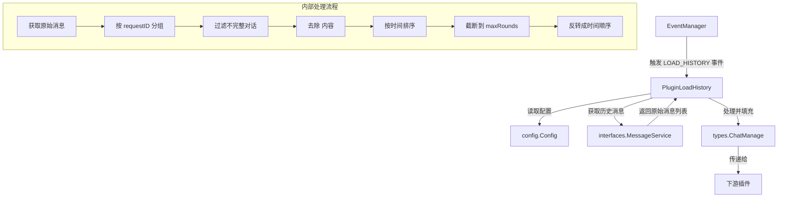

# history_context_loading 模块技术深度解析

## 1. 问题背景与模块存在的意义

在多轮对话系统中，理解用户当前问题往往需要依赖之前的对话历史。但直接将所有历史消息传递给下游处理会面临几个关键挑战：

**问题空间：**
1. **上下文窗口限制**：现代 LLM 都有上下文长度限制，无法无限制地包含所有历史对话
2. **信息冗余与干扰**：历史对话中可能包含内部思考过程、临时信息等对当前查询无用的内容
3. **对话完整性问题**：历史消息可能存在不完整的交互对（只有用户问题没有系统回答，或反之）
4. **时序一致性**：需要确保历史对话以正确的时间顺序呈现

**为什么朴素解决方案不够好：**
- 简单地取最近 N 条消息会破坏对话的完整性（可能截断一个交互对）
- 不过滤内容会将内部思考过程（如 <think> 标签内容）暴露给下游，影响模型理解
- 不做时序处理会导致对话顺序混乱，影响上下文连贯性

**设计洞察：**
本模块的核心设计思想是将历史消息**重构为完整的交互对**，通过过滤、排序、截断等操作，提供一个高质量、结构化的对话上下文，既保证了信息的完整性，又控制了上下文长度。

## 2. 心智模型与核心抽象

### 2.1 心智模型

想象这个模块是一个**对话历史剪辑师**：
- 它从原始素材库（历史消息存储）中获取原始素材
- 将素材按照场景（requestID）分组，确保每个场景都是一个完整的交互
- 剪掉那些不完整的场景（只有问题没有回答，或反之）
- 去除掉拍摄过程中的导演备注和内部思考（<think> 标签内容）
- 按照时间顺序排列场景，保留最近的 N 个场景
- 最终呈现给观众（下游处理）一个连贯、精简、高质量的对话历史

### 2.2 核心抽象

- **`PluginLoadHistory`**：历史加载插件，作为整个处理流程的编排者
- **`types.History`**：结构化的对话历史对，包含用户查询、系统回答、知识引用等
- **`types.ChatManage`**：整个对话处理的上下文容器，承载历史信息在各插件间传递

## 3. 架构与数据流程

### 3.1 架构图



### 3.2 数据流程详解

**关键操作路径：**

1. **事件触发**：`EventManager` 触发 `LOAD_HISTORY` 事件，调用 `PluginLoadHistory.OnEvent()`
2. **配置确定**：从系统配置或请求参数中确定 `maxRounds`（最大对话轮数）
3. **消息获取**：调用 `messageService.GetRecentMessagesBySession()` 获取历史消息
   - 注意这里获取了 `maxRounds*2+10` 条消息，这是为了应对可能的不完整对话对
4. **分组处理**：将消息按 `requestID` 分组，构建 `types.History` 对象
   - 用户消息填充到 `Query` 字段
   - 系统消息填充到 `Answer` 字段，同时去除 `<think>` 标签内容
5. **完整性过滤**：只保留同时有 `Query` 和 `Answer` 的完整对话对
6. **时序处理**：
   - 按创建时间倒序排序（最新的在前）
   - 截断到 `maxRounds` 条
   - 反转成正序（最旧的在前，最新的在后）
7. **上下文传递**：将处理后的历史列表设置到 `chatManage.History`
8. **继续流程**：调用 `next()` 传递给下一个插件

## 4. 核心组件深度解析

### 4.1 PluginLoadHistory 结构体

```go
type PluginLoadHistory struct {
    messageService interfaces.MessageService // 消息服务，用于获取历史消息
    config         *config.Config            // 系统配置
}
```

**设计意图：**
- 单一职责原则：只负责历史对话的加载和预处理
- 依赖注入：通过构造函数注入依赖，便于测试和替换
- 配置驱动：行为由配置控制，而非硬编码

### 4.2 NewPluginLoadHistory 工厂函数

```go
func NewPluginLoadHistory(eventManager *EventManager,
    messageService interfaces.MessageService,
    config *config.Config,
) *PluginLoadHistory
```

**参数说明：**
- `eventManager`：事件管理器，用于注册插件
- `messageService`：消息服务接口，提供历史消息检索能力
- `config`：系统配置，包含对话历史相关配置

**设计亮点：**
- 自动注册：在创建实例的同时自动向事件管理器注册，符合开闭原则
- 接口依赖：依赖抽象接口而非具体实现，提高了模块的可测试性和可替换性

### 4.3 ActivationEvents 方法

```go
func (p *PluginLoadHistory) ActivationEvents() []types.EventType
```

**返回值：** 只包含 `types.LOAD_HISTORY` 的事件类型列表

**设计意图：**
- 明确声明插件关心的事件类型
- 事件管理器根据此声明决定何时触发该插件
- 遵循插件系统的约定，实现了关注点分离

### 4.4 OnEvent 方法 - 核心处理逻辑

这是模块的核心方法，让我们深入分析其内部工作原理：

#### 阶段 1：配置准备
```go
maxRounds := p.config.Conversation.MaxRounds
if chatManage.MaxRounds > 0 {
    maxRounds = chatManage.MaxRounds
}
```

**设计意图：**
- 配置优先级：请求级配置优先于系统级配置，提供了灵活性
- 默认值机制：系统配置提供了合理的默认值，避免配置缺失导致的问题

#### 阶段 2：历史消息获取
```go
history, err := p.messageService.GetRecentMessagesBySession(ctx, chatManage.SessionID, maxRounds*2+10)
```

**关键设计决策：**
- **为什么获取 `maxRounds*2+10` 条消息？**
  - 每个完整的对话对包含 2 条消息（用户+系统）
  - `+10` 是为了应对可能存在的不完整对话对，确保过滤后仍有足够的完整对话
  - 这是典型的**过度获取后过滤**策略，在数据量可控的情况下，简化了处理逻辑

#### 阶段 3：消息分组与构建
```go
historyMap := make(map[string]*types.History)
for _, message := range history {
    h, ok := historyMap[message.RequestID]
    if !ok {
        h = &types.History{}
    }
    if message.Role == "user" {
        h.Query = message.Content
        h.CreateAt = message.CreatedAt
    } else {
        h.Answer = regThink.ReplaceAllString(message.Content, "")
        h.KnowledgeReferences = message.KnowledgeReferences
    }
    historyMap[message.RequestID] = h
}
```

**核心机制：**
- **RequestID 分组**：利用 `RequestID` 将相关的用户消息和系统消息关联在一起
- **角色区分处理**：根据消息角色分别填充到不同字段
- **内容净化**：使用正则表达式去除 `<think>` 标签内容，避免内部思考过程干扰下游处理

**正则表达式解析：**
```go
var regThink = regexp.MustCompile(`(?s)<think>.*?</think>`)
```
- `(?s)`：单行模式，让 `.` 匹配包括换行符在内的所有字符
- `<think>.*?</think>`：非贪婪匹配，从 `<think>` 开始到最近的 `</think>` 结束

#### 阶段 4：完整性过滤
```go
historyList := make([]*types.History, 0)
for _, h := range historyMap {
    if h.Answer != "" && h.Query != "" {
        historyList = append(historyList, h)
    }
}
```

**设计意图：**
- 只保留完整的对话对，确保历史对话的连贯性
- 避免不完整的对话对干扰下游的理解和处理

#### 阶段 5：时序处理
```go
// 按时间倒序排序
sort.Slice(historyList, func(i, j int) bool {
    return historyList[i].CreateAt.After(historyList[j].CreateAt)
})

// 截断到 maxRounds
if len(historyList) > maxRounds {
    historyList = historyList[:maxRounds]
}

// 反转成正序
slices.Reverse(historyList)
```

**为什么这样处理？**
1. **先倒序排序**：确保最新的对话在前面
2. **截断**：只保留最新的 `maxRounds` 条对话
3. **再反转成正序**：让对话按时间顺序排列，符合人类阅读习惯

这种处理方式既保证了获取的是最新的对话，又保证了呈现顺序的正确性。

## 5. 依赖关系分析

### 5.1 依赖的模块

| 依赖 | 用途 | 耦合度 |
|------|------|--------|
| `interfaces.MessageService` | 获取历史消息 | 中等（依赖接口，可替换） |
| `config.Config` | 获取系统配置 | 低（只读访问） |
| `types.EventType` | 事件类型定义 | 低（枚举使用） |
| `types.ChatManage` | 对话上下文 | 高（核心数据结构） |
| `types.History` | 历史消息结构 | 高（核心数据结构） |

### 5.2 被依赖的情况

本模块作为一个插件，被以下组件调用：
- `EventManager`：在 `LOAD_HISTORY` 事件触发时调用
- 下游插件：通过 `chatManage.History` 获取处理后的历史对话

### 5.3 数据契约

**输入契约：**
- `chatManage.SessionID`：必须提供有效的会话 ID
- `chatManage.MaxRounds`：可选，覆盖系统配置的最大轮数

**输出契约：**
- `chatManage.History`：处理后的历史对话列表，按时间正序排列
- 每个 `History` 对象包含：
  - `Query`：用户查询（非空）
  - `Answer`：系统回答（非空，已去除 `<think>` 内容）
  - `CreateAt`：对话创建时间
  - `KnowledgeReferences`：知识引用（如果有）

## 6. 设计决策与权衡

### 6.1 关键设计决策

#### 决策 1：RequestID 分组策略
**选择：** 使用 `RequestID` 将用户消息和系统消息关联
**替代方案：** 
- 按消息顺序配对（第一条用户消息配第一条系统消息）
- 使用时间窗口分组

**为什么选择这个方案：**
- 更准确：`RequestID` 是精确的关联标识，避免了时序错乱导致的配对错误
- 更健壮：能处理并发场景下的消息交错问题
- 更简单：不需要复杂的配对逻辑

**权衡：**
- 依赖上游系统正确设置 `RequestID`
- 如果 `RequestID` 丢失或错误，会导致对话配对失败

#### 决策 2：过度获取策略
**选择：** 获取 `maxRounds*2+10` 条消息，然后过滤
**替代方案：**
- 精确获取 `maxRounds*2` 条消息
- 分批获取直到有足够的完整对话对

**为什么选择这个方案：**
- 简单高效：一次获取，避免多次往返
- 鲁棒性强：留有足够的缓冲来应对不完整对话对
- 性能可接受：对话历史数据量通常不大，过度获取的开销可控

**权衡：**
- 可能获取一些最终不会使用的消息
- 在极端情况下（所有消息都是不完整的），仍可能没有足够的完整对话对

#### 决策 3：内容净化策略
**选择：** 使用正则表达式去除 `<think>` 标签内容
**替代方案：**
- 要求上游系统不发送 `<think>` 内容
- 在消息服务层面过滤
- 使用更复杂的解析器

**为什么选择这个方案：**
- 自主性强：不依赖上游系统的行为
- 实现简单：正则表达式足够处理这种结构化的标签
- 灵活性高：可以轻松调整要过滤的内容

**权衡：**
- 正则表达式处理大文本时可能有性能问题
- 如果标签格式变化，需要修改正则表达式
- 可能误删合法内容（虽然概率很低）

#### 决策 4：三次排序策略
**选择：** 倒序排序 → 截断 → 反转正序
**替代方案：**
- 正序排序 → 取最后 N 条
- 使用优先队列只保留最新的 N 条

**为什么选择这个方案：**
- 直观易懂：代码意图清晰
- 易于调试：可以在每个阶段检查中间结果
- 性能可接受：对话历史数量不大，排序开销可以忽略

**权衡：**
- 理论上有不必要的排序操作
- 对于非常大的历史列表，效率略低

### 6.2 架构模式

本模块采用了以下设计模式：

1. **插件模式**：通过 `ActivationEvents` 和 `OnEvent` 方法实现插件化设计
2. **管道与过滤器模式**：作为整个聊天处理管道中的一个过滤器
3. **策略模式**：通过配置和请求参数动态调整行为

## 7. 使用指南与最佳实践

### 7.1 配置说明

**系统配置：**
```go
config.Conversation.MaxRounds // 默认最大对话轮数
```

**请求级配置：**
```go
chatManage.MaxRounds // 覆盖系统配置的最大轮数
```

### 7.2 常见使用模式

**模式 1：使用默认配置**
```go
// 系统已在初始化时注册了 PluginLoadHistory
// 只需触发 LOAD_HISTORY 事件即可
eventManager.Trigger(ctx, types.LOAD_HISTORY, chatManage)
```

**模式 2：自定义最大轮数**
```go
chatManage.MaxRounds = 5 // 只保留最近 5 轮对话
eventManager.Trigger(ctx, types.LOAD_HISTORY, chatManage)
```

### 7.3 扩展点

虽然本模块设计相对简单，但仍有一些潜在的扩展点：

1. **自定义过滤规则**：可以在完整性过滤阶段添加自定义规则
2. **内容摘要**：对于过长的历史消息，可以添加摘要逻辑
3. **重要性排序**：不仅按时间排序，还可以考虑对话的重要性
4. **多语言支持**：根据语言特性调整处理逻辑

## 8. 边缘情况与注意事项

### 8.1 边缘情况

**1. 没有历史消息**
- 行为：`chatManage.History` 为空切片
- 影响：下游处理需要处理空历史的情况

**2. 历史消息全是不完整对话**
- 行为：过滤后 `chatManage.History` 为空
- 注意：即使获取了很多消息，也可能没有可用的完整对话

**3. 历史消息中没有 `<think>` 标签**
- 行为：正则表达式不匹配任何内容，原样保留
- 设计：这是预期行为，模块对没有 `<think>` 标签的消息是兼容的

**4. `RequestID` 重复或混乱**
- 行为：可能导致对话配对错误
- 注意：这是上游系统的问题，但本模块会受到影响

**5. 时间戳错误或乱序**
- 行为：排序结果可能不正确
- 影响：历史对话的顺序可能不是预期的

### 8.2 注意事项与陷阱

**陷阱 1：过度依赖 `maxRounds*2+10`**
- 问题：认为获取了这么多消息就一定有足够的完整对话
- 现实：在极端情况下，仍可能没有足够的完整对话
- 建议：下游处理需要检查 `chatManage.History` 的实际长度

**陷阱 2：`<think>` 标签格式变化**
- 问题：如果标签变成 `<thinking>` 或其他格式，正则表达式不会匹配
- 建议：如果格式可能变化，考虑使用更灵活的匹配方式

**陷阱 3：修改历史消息**
- 问题：下游插件可能会修改 `chatManage.History` 中的内容，影响后续处理
- 建议：如果需要修改，创建副本而不是直接修改

**陷阱 4：性能问题**
- 问题：当历史消息非常多时，正则表达式和排序可能会有性能问题
- 建议：设置合理的 `maxRounds`，限制处理的消息数量

### 8.3 调试技巧

**1. 查看日志**
模块会记录以下关键日志：
- `input`：输入参数（session_id, max_rounds）
- `fetched`：获取到的消息数量
- `output`：最终处理结果

**2. 检查中间结果**
可以在以下关键点添加调试代码：
- 获取原始消息后
- 分组构建后
- 完整性过滤后
- 排序截断后

## 9. 总结

`history_context_loading` 模块是一个看似简单但设计精巧的组件，它解决了多轮对话系统中历史上下文加载的核心问题。通过将原始消息重构为完整的交互对，去除不必要的内容，控制上下文长度，确保时序正确，为下游处理提供了高质量的对话历史。

模块的设计体现了以下优秀实践：
- 单一职责：只做一件事，做好一件事
- 配置驱动：行为由配置控制，灵活可调整
- 容错设计：考虑了各种边缘情况
- 性能平衡：在简单性和效率之间取得了良好平衡

对于新加入团队的开发者来说，理解这个模块的关键是：
1. 理解为什么要这样处理历史消息（问题空间）
2. 理解数据是如何流动和转换的（处理流程）
3. 注意那些看似简单的决策背后的权衡（设计意图）

希望这份文档能帮助你快速理解并有效地使用这个模块！
