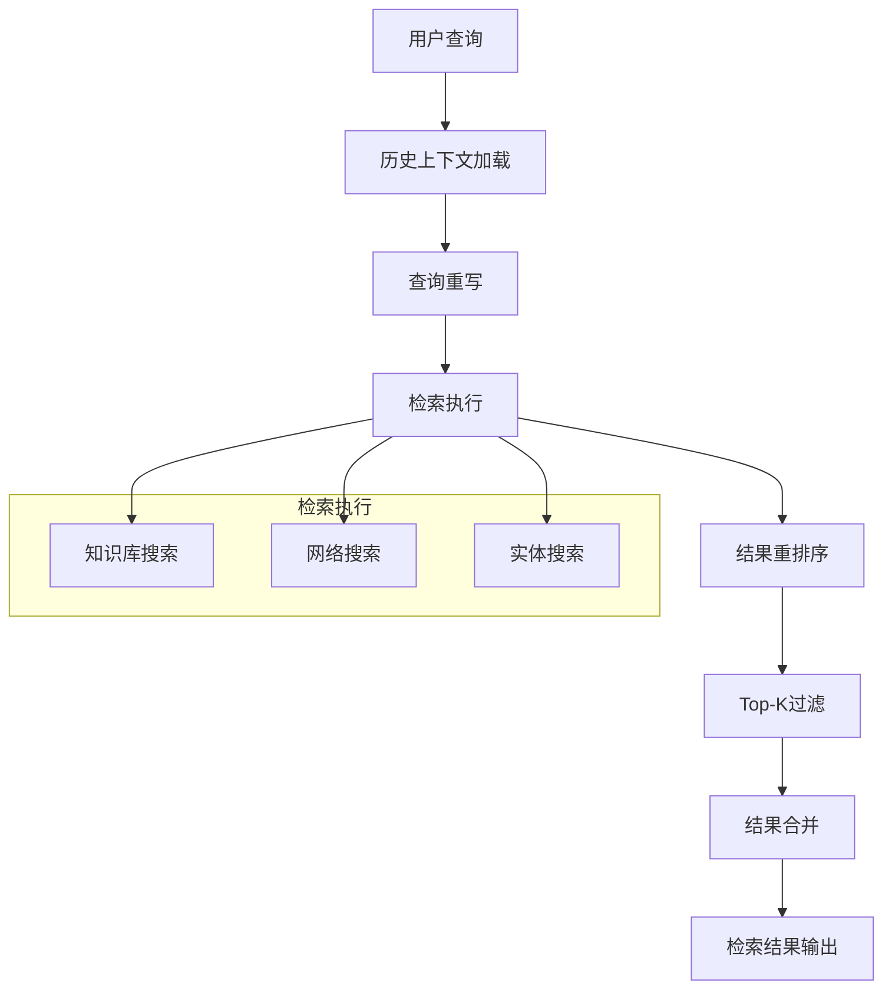

# 查询理解与检索流程模块

## 1. 模块概述

### 1.1 什么是查询理解与检索流程？

想象一下，当你向一个知识助手提问时，它需要像一个专业的研究助理一样工作：首先回忆之前的对话，理解你的问题，然后在知识库中搜索相关信息，筛选出最有用的内容，最后整理成连贯的回答。`query_understanding_and_retrieval_flow`模块就是这个研究助理的"大脑"——它负责协调从查询理解到检索结果获取的整个流程。

这个模块是聊天管道中的核心环节，它将用户的原始查询转化为高质量的检索结果，为后续的回答生成提供坚实的基础。

### 1.2 为什么需要这个模块？

在没有这个模块之前，检索系统可能会面临以下问题：
- **上下文丢失**：无法理解多轮对话中的指代关系（如"它"、"这个"）
- **检索质量低**：直接使用原始查询可能无法捕获用户的真实意图
- **结果冗余**：返回大量相似或重复的内容
- **缺乏关联**：无法利用知识图谱中的实体关系

这个模块通过一系列精心设计的插件，系统性地解决了这些问题，提供了一个可扩展、可配置的检索流程框架。

## 2. 架构设计

### 2.1 整体架构



### 2.2 核心设计理念

这个模块采用了**插件化事件驱动架构**，每个功能都是一个独立的插件，通过事件管理器进行协调。这种设计有几个关键优势：

1. **可组合性**：可以根据需要灵活组合不同的插件
2. **可测试性**：每个插件可以独立测试
3. **可扩展性**：添加新功能只需创建新插件
4. **容错性**：单个插件失败不会影响整个流程

### 2.3 数据流转

整个流程的数据流转如下：

1. **输入**：原始用户查询、会话ID、配置参数
2. **历史加载**：从消息服务获取对话历史，构建上下文
3. **查询重写**：使用LLM将原始查询重写为更精确的检索查询
4. **检索执行**：
   - 并行执行知识库搜索、网络搜索和实体搜索
   - 合并多源检索结果
5. **结果优化**：
   - 重排序：使用重排序模型评估结果相关性
   - 过滤：保留Top-K个最相关结果
   - 合并：合并相邻/重叠的文本块，扩展上下文
6. **输出**：优化后的检索结果集合

## 3. 核心组件详解

### 3.1 历史上下文加载插件 (PluginLoadHistory)

**职责**：加载对话历史，为后续处理提供上下文。

**设计意图**：
- 不进行查询重写，仅加载历史记录
- 为需要历史上下文但不需要重写的场景提供轻量级选择

**关键处理**：
- 获取最近的消息记录（获取比需要更多的消息以应对不完整的对话对）
- 按RequestID分组，构建完整的问答对
- 过滤掉不完整的对话（只有问题或只有回答）
- 移除思考过程（`<think>`标签内容）
- 按时间排序并限制轮数

**使用场景**：当只需要历史上下文而不需要查询重写时使用，例如简单的问答场景。

### 3.2 查询重写插件 (PluginRewrite)

**职责**：使用历史对话上下文和LLM优化用户的原始查询。

**设计意图**：
- 解决多轮对话中的指代消解问题
- 补充缺失的上下文信息
- 将自然语言查询转化为更适合检索的形式

**关键处理**：
- 格式化对话历史供提示词模板使用
- 使用可配置的提示词模板
- 调用LLM生成重写后的查询
- 支持自定义系统提示词和用户提示词

**设计权衡**：
- ✅ 使用LLM重写可以显著提高检索质量
- ⚠️ 增加了延迟（需要额外的LLM调用）
- ⚠️ 增加了成本

### 3.3 检索执行插件族

#### 3.3.1 单查询检索插件 (PluginSearch)

**职责**：执行知识库搜索和网络搜索。

**核心特性**：
- **并行搜索**：同时执行知识库搜索和网络搜索
- **直接加载**：对于特定的知识文件，尝试直接加载所有内容块（避免检索遗漏）
- **查询扩展**：当召回率低时，使用本地技术生成查询变体（不依赖LLM）
- **去重**：基于ID、父块ID和内容签名去除重复结果
- **历史补充**：从对话历史中添加相关的知识引用

**查询扩展技术**：
- 移除停用词，创建纯关键词变体
- 提取引用短语或关键片段
- 按常见分隔符分割并使用最长片段
- 移除疑问词

**设计权衡**：
- ✅ 并行搜索提高了效率
- ✅ 查询扩展在不增加LLM调用的情况下提高了召回率
- ⚠️ 直接加载可能会引入过多不相关内容（但有大小限制）

#### 3.3.2 并行检索插件 (PluginSearchParallel)

**职责**：并行执行文本块搜索和实体搜索。

**设计意图**：
- 结合向量/关键词检索和知识图谱检索的优势
- 通过并行执行减少整体延迟

**关键处理**：
- 使用独立的ChatManage副本避免并发写入冲突
- 合并两个搜索的结果
- 只有当两个搜索都失败且没有结果时才返回错误

**设计权衡**：
- ✅ 利用了知识图谱的结构化信息
- ✅ 并行执行减少了延迟
- ⚠️ 增加了系统复杂度

#### 3.3.3 实体搜索插件 (PluginSearchEntity)

**职责**：在知识图谱中搜索相关实体和关系。

**设计意图**：
- 利用知识图谱中的结构化信息
- 发现文本检索可能遗漏的关联内容

**关键处理**：
- 并行搜索多个知识库和单个文件
- 从图节点中提取相关的文本块ID
- 过滤掉已经在搜索结果中的块
- 获取新块的详细信息并添加到结果中

### 3.4 结果优化插件族

#### 3.4.1 重排序插件 (PluginRerank)

**职责**：使用重排序模型评估和重新排序检索结果。

**核心功能**：
- **复合评分**：结合模型评分、基础评分和来源权重
- **位置优先**：对文档开头的内容给予小幅加分
- **FAQ优先**：对FAQ类型的内容提供可配置的分数提升
- **阈值降级**：如果初始阈值没有结果，自动降低阈值重试
- **MMR（最大边际相关性）**：在相关性和多样性之间取得平衡

**复合评分公式**：
$$
\text{composite} = (0.6 \times \text{modelScore} + 0.3 \times \text{baseScore} + 0.1 \times \text{sourceWeight}) \times \text{positionPrior}
$$

**MMR算法**：
$$
\text{MMR} = \lambda \times \text{relevance} - (1-\lambda) \times \text{redundancy}
$$

**设计权衡**：
- ✅ 显著提高了结果的相关性
- ✅ MMR平衡了相关性和多样性
- ⚠️ 增加了额外的模型调用成本和延迟

#### 3.4.2 Top-K过滤插件 (PluginFilterTopK)

**职责**：保留最相关的K个结果。

**设计意图**：
- 限制传递给后续阶段的结果数量
- 避免给LLM上下文窗口带来过大压力

**关键处理**：
- 按优先级过滤：MergeResult > RerankResult > SearchResult

#### 3.4.3 结果合并插件 (PluginMerge)

**职责**：合并相邻/重叠的文本块，扩展短上下文。

**核心功能**：
- **块合并**：合并同一知识来源中相邻或重叠的文本块
- **ImageInfo合并**：合并相关块的图片信息
- **FAQ答案填充**：为FAQ类型的块填充格式化的问答内容
- **短上下文扩展**：对于过短的文本块，自动获取前后相邻块进行扩展

**上下文扩展策略**：
- 最小长度：350字符
- 最大长度：850字符
- 优先向前扩展，然后向后扩展
- 处理重叠内容

**设计权衡**：
- ✅ 提供了更完整的上下文
- ✅ 减少了结果的碎片化
- ⚠️ 可能会引入一些不相关的周边内容

## 4. 关键设计决策

### 4.1 插件化架构 vs 单体流程

**选择**：插件化事件驱动架构

**原因**：
- 需要灵活组合不同的处理步骤
- 不同的场景可能需要不同的流程
- 便于独立测试和优化各个组件

**权衡**：
- ✅ 灵活性高，可组合性强
- ✅ 易于扩展和维护
- ⚠️ 增加了一定的架构复杂度
- ⚠️ 插件之间的数据传递需要明确的契约

### 4.2 查询扩展：本地实现 vs LLM生成

**选择**：本地实现（不依赖LLM）

**原因**：
- 降低成本和延迟
- 提高可靠性（不依赖LLM的可用性）
- 对于简单的关键词扩展，本地方法已经足够有效

**权衡**：
- ✅ 成本低，速度快
- ✅ 可靠性高
- ⚠️ 可能不如LLM生成的变体质量高
- ⚠️ 只能处理简单的语言模式

### 4.3 结果多样性：MMR vs 简单聚类

**选择**：MMR（最大边际相关性）

**原因**：
- MMR在相关性和多样性之间提供了平滑的权衡
- 实现相对简单，计算效率高
- 有明确的参数（λ）可以调节平衡

**权衡**：
- ✅ 平衡了相关性和多样性
- ✅ 计算效率高
- ⚠️ 不如复杂的聚类方法精确
- ⚠️ 需要手动调节λ参数

### 4.4 直接加载：全部加载 vs 仅检索

**选择**：对于特定知识文件尝试直接加载所有内容块

**原因**：
- 检索可能会遗漏一些相关内容
- 对于小文件，直接加载的成本可接受
- 可以确保不会因为检索阈值问题遗漏重要信息

**权衡**：
- ✅ 确保了高召回率
- ✅ 实现简单
- ⚠️ 可能会引入不相关内容
- ⚠️ 有大小限制（最多50个块）

## 5. 使用指南

### 5.1 配置参数

关键配置参数：
- `MaxRounds`：最大对话历史轮数
- `EmbeddingTopK`：向量检索返回的结果数
- `RerankTopK`：重排序后保留的结果数
- `VectorThreshold`：向量相似度阈值
- `KeywordThreshold`：关键词匹配阈值
- `RerankThreshold`：重排序相关性阈值
- `EnableRewrite`：是否启用查询重写
- `EnableQueryExpansion`：是否启用查询扩展
- `FAQPriorityEnabled`：是否启用FAQ优先
- `FAQScoreBoost`：FAQ分数提升因子

### 5.2 常见使用场景

#### 场景1：简单问答（不需要历史）
```
PluginSearch → PluginRerank → PluginFilterTopK → PluginMerge
```

#### 场景2：多轮对话
```
PluginLoadHistory → PluginRewrite → PluginSearchParallel → 
PluginRerank → PluginFilterTopK → PluginMerge
```

#### 场景3：高精度检索
```
PluginLoadHistory → PluginRewrite → PluginSearch → 
PluginRerank → PluginFilterTopK → PluginMerge
```

## 6. 扩展点与自定义

### 6.1 添加新插件

1. 创建实现`Plugin`接口的结构体
2. 在`ActivationEvents()`中返回感兴趣的事件类型
3. 在`OnEvent()`中实现插件逻辑
4. 使用`eventManager.Register()`注册插件

### 6.2 自定义评分逻辑

可以通过以下方式自定义评分逻辑：
- 修改`compositeScore()`函数中的权重
- 添加新的评分因子
- 自定义MMR的λ参数

### 6.3 自定义查询扩展

可以通过修改`expandQueries()`函数添加新的查询扩展技术。

## 7. 注意事项与常见陷阱

### 7.1 注意事项

1. **并发安全**：`PluginSearchParallel`中使用了独立的ChatManage副本，避免并发写入冲突
2. **阈值设置**：阈值设置过高会导致召回率低，过低会导致 precision 低
3. **上下文窗口**：注意最终结果的总长度，不要超过LLM的上下文窗口限制
4. **错误处理**：单个插件失败不应影响整个流程，除非所有路径都失败

### 7.2 常见陷阱

1. **过度依赖重排序**：重排序模型不是万能的，基础检索质量仍然很重要
2. **忽略去重**：多个检索源可能返回重复结果，必须进行去重
3. **上下文扩展过度**：扩展过多的上下文可能会引入噪音，反而影响质量
4. **配置参数不匹配**：不同阶段的参数（如TopK）需要协调设置

## 8. 子模块

- [历史上下文加载](application_services_and_orchestration-chat_pipeline_plugins_and_flow-query_understanding_and_retrieval_flow-history_context_loading.md)
- [查询重写与实体准备](application_services_and_orchestration-chat_pipeline_plugins_and_flow-query_understanding_and_retrieval_flow-query_rewriting_and_entity_preparation.md)
- [检索执行](application_services_and_orchestration-chat_pipeline_plugins_and_flow-query_understanding_and_retrieval_flow-retrieval_execution.md)
- [检索结果优化与合并](application_services_and_orchestration-chat_pipeline_plugins_and_flow-query_understanding_and_retrieval_flow-retrieval_result_refinement_and_merge.md)

## 9. 与其他模块的关系

- **上游**：[聊天管道核心与监控](application_services_and_orchestration-chat_pipeline_plugins_and_flow-pipeline_core_and_instrumentation.md)
- **下游**：[响应组装与生成](application_services_and_orchestration-chat_pipeline_plugins_and_flow-response_assembly_and_generation.md)
- **依赖**：
  - [知识库服务](application_services_and_orchestration-knowledge_ingestion_extraction_and_graph_services.md)
  - [消息服务](application_services_and_orchestration-conversation_context_and_memory_services.md)
  - [模型服务](model_providers_and_ai_backends.md)
  - [网络搜索服务](application_services_and_orchestration-retrieval_and_web_search_services.md)
