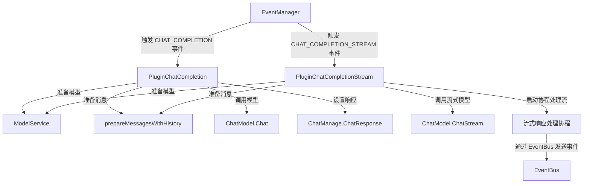

# LLM 响应生成模块

## 1. 为什么这个模块存在

在构建智能对话系统时，生成最终的 LLM 响应是整个流程的关键环节。这个模块解决了以下核心问题：

**问题场景**：当用户发起一个对话请求，经过查询理解、检索增强、上下文构建等一系列处理后，我们需要：
- 调用适当的 LLM 模型生成响应
- 支持流式和非流式两种交互模式
- 确保响应能够正确传递给前端
- 处理模型调用过程中的各种异常情况

**为什么需要专门的模块**：
- LLM 模型调用是整个聊天管道中最昂贵的操作（时间和成本）
- 流式和非流式响应需要完全不同的处理逻辑
- 需要与事件系统紧密集成以支持实时交互
- 模型调用失败会直接影响用户体验，需要健壮的错误处理

## 2. 核心抽象与心智模型

这个模块的设计基于**插件化事件驱动架构**，可以用以下类比来理解：

> 想象一个剧院的演出流程：
> - `EventManager` 是剧院经理，负责协调各个环节
> - `PluginChatCompletion` 和 `PluginChatCompletionStream` 是两种不同的表演团队
> - 非流式团队（`PluginChatCompletion`）准备完整的剧本后一次性呈现
> - 流式团队（`PluginChatCompletionStream`）则是即兴表演，边创作边呈现
> - `EventBus` 是剧院的音响系统，将表演实时传递给观众

### 核心组件

- **PluginChatCompletion**：处理非流式 LLM 响应生成
- **PluginChatCompletionStream**：处理流式 LLM 响应生成

## 3. 架构与数据流

### 非流式响应流程

1. **事件触发**：`EventManager` 触发 `CHAT_COMPLETION` 事件
2. **模型准备**：通过 `ModelService` 获取合适的聊天模型
3. **消息构建**：使用 `prepareMessagesWithHistory` 准备包含对话历史的消息
4. **模型调用**：调用 `ChatModel.Chat` 生成完整响应
5. **响应设置**：将生成的响应设置到 `ChatManage.ChatResponse`
6. **继续流程**：调用 `next()` 继续管道中的下一个插件

### 流式响应流程

1. **事件触发**：`EventManager` 触发 `CHAT_COMPLETION_STREAM` 事件
2. **模型准备**：通过 `ModelService` 获取合适的聊天模型
3. **消息构建**：使用 `prepareMessagesWithHistory` 准备包含对话历史的消息
4. **EventBus 检查**：确保 `ChatManage.EventBus` 可用
5. **流式模型调用**：调用 `ChatModel.ChatStream` 获取响应通道
6. **协程启动**：启动独立协程处理流式响应
7. **事件发送**：通过 `EventBus` 实时发送响应片段
8. **继续流程**：立即调用 `next()` 继续管道，不等待流式响应完成

## 4. 关键设计决策

### 4.1 插件化架构

**决策**：将响应生成实现为可注册到 `EventManager` 的插件

**原因**：
- 遵循整个聊天管道的插件化设计理念
- 允许灵活地添加/替换响应生成策略
- 便于测试和独立开发

**权衡**：
- ✅ 优点：灵活性高，易于扩展
- ❌ 缺点：增加了间接层，调试可能更复杂

### 4.2 流式与非流式分离

**决策**：为流式和非流式响应创建独立的插件

**原因**：
- 两种模式的处理逻辑差异巨大
- 非流式是同步的，流式需要异步处理
- 分离可以避免代码复杂度过高

**权衡**：
- ✅ 优点：职责清晰，代码更易维护
- ❌ 缺点：存在一定的代码重复（如模型准备逻辑）

### 4.3 流式响应的协程处理

**决策**：在 `PluginChatCompletionStream` 中启动独立协程处理流式响应

**原因**：
- 确保管道可以立即继续，不阻塞后续处理
- 允许流式响应在后台持续发送
- 符合 Go 语言的并发编程模式

**权衡**：
- ✅ 优点：响应迅速，用户体验好
- ❌ 缺点：增加了并发复杂度，需要注意资源管理

### 4.4 思考内容的特殊处理

**决策**：在流式模式下，将思考内容用 `<think>` 标签包裹并嵌入到答案流中

**原因**：
- 确保前端可以一致地处理流式和历史加载的思考内容
- 简化前端逻辑，只需一种处理方式
- 保持非 agent 模式的显示一致性

**权衡**：
- ✅ 优点：前端处理简单，用户体验一致
- ❌ 缺点：在响应生成层引入了前端展示相关的逻辑

## 5. 子模块说明

### 5.1 非流式响应生成

负责处理一次性完整响应的生成，适用于对响应时间要求不高的场景。

详细内容请参考：[非流式响应生成](application_services_and_orchestration-chat_pipeline_plugins_and_flow-response_assembly_and_generation-llm_response_generation-llm_non_streaming_response_generation.md)

### 5.2 流式响应生成

负责处理实时流式响应的生成，适用于需要快速反馈的交互场景。

详细内容请参考：[流式响应生成](application_services_and_orchestration-chat_pipeline_plugins_and_flow-response_assembly_and_generation-llm_response_generation-llm_streaming_response_generation.md)

## 6. 与其他模块的关系

### 依赖模块

- **[Chat Pipeline Core](application_services_and_orchestration-chat_pipeline_plugins_and_flow-pipeline_core_and_instrumentation.md)**：提供事件管理和插件基础设施
- **[Model Service](model_providers_and_ai_backends.md)**：提供 LLM 模型的访问接口
- **[Event System](platform_infrastructure_and_runtime-event_bus_and_agent_runtime_event_contracts.md)**：用于流式响应的事件传递

### 被依赖模块

- **[Chat Pipeline Orchestration](application_services_and_orchestration-chat_pipeline_plugins_and_flow.md)**：在聊天管道中调用此模块生成最终响应

## 7. 注意事项与常见陷阱

### 7.1 流式响应的 EventBus 依赖

**陷阱**：流式响应模式下，必须确保 `ChatManage.EventBus` 已正确初始化，否则会导致错误。

**解决方案**：在使用流式响应前，始终检查 EventBus 是否可用，并在缺失时提供清晰的错误信息。

### 7.2 思考内容的标签处理

**陷阱**：思考内容的 `<think>` 标签处理逻辑较为复杂，容易出现标签未正确闭合的情况。

**解决方案**：仔细测试各种边界情况，确保思考内容无论在何种情况下都能正确地被标签包裹。

### 7.3 流式响应的错误处理

**陷阱**：流式响应中的错误是通过事件系统传递的，而不是直接返回，容易被忽略。

**解决方案**：确保前端正确监听和处理错误事件，同时在后端记录详细的错误日志。

### 7.4 资源管理

**陷阱**：流式响应启动的协程可能在某些情况下无法正确清理，导致资源泄漏。

**解决方案**：确保响应通道能够正确关闭，考虑使用 context 来管理协程的生命周期。

## 8. 扩展点

### 8.1 自定义响应生成策略

可以通过创建新的插件类实现不同的响应生成策略，只需：
1. 实现插件接口
2. 注册到 EventManager
3. 处理相应的事件类型

### 8.2 响应后处理

可以在 `next()` 调用前后添加自定义逻辑，对生成的响应进行后处理。

### 8.3 自定义事件发送

在流式模式下，可以扩展事件发送逻辑，添加更多自定义事件类型。
