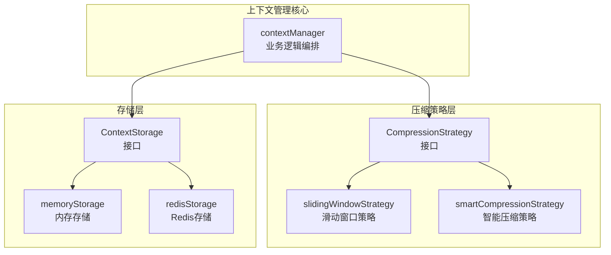

# LLM 上下文管理与存储模块

## 概述

当你与 LLM 进行多轮对话时，一个核心挑战出现了：模型的上下文窗口是有限的，但对话历史可能无限增长。`llm_context_management_and_storage` 模块就是为了解决这个问题而设计的——它像一个聪明的"对话记忆管家"，负责管理、压缩和持久化对话上下文，确保在不超出 LLM 上下文限制的前提下，尽可能保留重要的对话信息。

想象一下，你正在与一个 AI 助手进行一个小时的技术讨论，涉及多个主题和复杂的决策。如果没有这个模块，要么对话会因为超出上下文长度而中断，要么重要的早期信息会被简单丢弃。这个模块通过智能压缩策略和可插拔的存储后端，让对话能够流畅地继续下去。

## 架构概览

这个架构体现了清晰的关注点分离：

1. **contextManager** 作为核心编排者，不关心具体的存储实现或压缩算法，只负责协调两者来管理对话上下文。
2. **CompressionStrategy** 接口定义了压缩算法的契约，允许在不同策略之间切换而不影响核心逻辑。
3. **ContextStorage** 接口抽象了存储细节，使得内存和 Redis 存储可以无缝替换。

## 核心设计思想

### 1. 策略模式：可插拔的压缩算法

模块采用策略模式来处理上下文压缩，这意味着你可以根据场景选择不同的压缩策略：

- **slidingWindowStrategy**：简单高效，保留系统提示和最近 N 条消息，适用于对性能要求高的场景。
- **smartCompressionStrategy**：使用 LLM 本身来总结旧对话，保留更多语义信息，但会增加延迟和成本。

这种设计让模块既可以在资源受限的环境中运行，也可以在需要高质量上下文的场景中发挥作用。

### 2. 接口隔离：存储与逻辑分离

ContextStorage 接口将存储实现与业务逻辑完全解耦，这带来了几个关键好处：

- **可测试性**：可以轻松使用内存存储进行单元测试，而不需要启动 Redis 服务。
- **部署灵活性**：单实例部署可以用内存存储，分布式部署则切换到 Redis。
- **扩展性**：未来可以轻松添加新的存储后端（如数据库、文件等）。

### 3. 防御性设计：数据复制与安全操作

在 memoryStorage 实现中，你会注意到每次保存和加载都会创建消息的深拷贝。这不是多余的——这是为了防止外部代码意外修改内部状态，避免难以调试的并发问题。同样，redisStorage 在处理 JSON 序列化失败时也有适当的错误处理。

## 关键工作流

### 添加消息的完整流程

当一条新消息被添加到会话时，数据流向如下：

1. **contextManager.AddMessage** 接收新消息
2. 从配置的 **ContextStorage** 加载现有上下文
3. 将新消息追加到上下文
4. 使用 **CompressionStrategy** 估算当前 token 数
5. 如果超出限制，应用压缩策略
6. 将更新后的上下文保存回存储

这个流程确保了每次添加消息后，上下文始终保持在 token 限制之内。

### 压缩决策逻辑

压缩不是每次都触发的——只有当 token 估算超过 `maxTokens` 时才会发生：

- 对于滑动窗口策略，直接截断旧消息
- 对于智能压缩策略，会先检查旧消息数量是否超过 `summarizeThreshold`，只有达到阈值才会调用 LLM 进行总结
- 如果 LLM 总结失败，会优雅回退到保留所有消息

这种渐进式压缩策略平衡了性能和信息保留。

## 设计权衡分析

### 1. Token 估算的精度 vs 性能

当前的 token 估算采用了简单的 "4 字符 ≈ 1 token" 规则。这是一个有意的权衡：

- **选择简单估算**：快速、无依赖、适用于大多数场景
- **代价**：对于某些语言（如中文）或特殊格式（如代码），估算可能不够准确
- **为什么这样做**：精确的 token 计数通常需要调用 LLM 提供商的 API 或使用特定的分词库，这会增加延迟和依赖复杂性

### 2. 智能压缩的成本 vs 质量

smartCompressionStrategy 是一个强大但昂贵的选择：

- **优点**：通过 LLM 总结可以保留更多语义信息，对话连贯性更好
- **缺点**：每次压缩都需要额外的 LLM 调用，增加了延迟和成本
- **缓解措施**：设置了 `summarizeThreshold`，只有旧消息足够多时才会触发总结；同时有失败回退机制

### 3. 内存存储的简单性 vs 持久性

memoryStorage 是默认选项，但它有明显的局限性：

- **优点**：零依赖、超快、易于测试
- **缺点**：服务重启后数据丢失，无法在多实例间共享
- **适用场景**：开发环境、单实例部署、短期会话
- **Redis 替代**：提供了持久性和分布式共享，但增加了基础设施依赖

## 使用指南与注意事项

### 配置建议

1. **maxTokens 设置**：应该比 LLM 的实际上下文窗口小 10-20%，为新的响应留出空间。
2. **压缩策略选择**：
   - 性能优先：使用 slidingWindowStrategy，recentMessageCount 设置为 10-20
   - 质量优先：使用 smartCompressionStrategy，recentMessageCount 设置为 5-10，summarizeThreshold 设置为 10-15
3. **Redis 配置**：生产环境建议 TTL 设置为 24-72 小时，平衡存储成本和用户体验。

### 常见陷阱

1. **忘记设置系统提示**：系统提示通常应该在对话开始时设置，并且始终保存在上下文的最前面。
2. **过度依赖智能压缩**：在高并发场景下，智能压缩可能会造成 LLM API 限流，建议设置合理的阈值或使用滑动窗口策略。
3. **忽略存储错误**：虽然模块会返回错误，但上层应用应该有适当的降级策略，比如在存储失败时继续使用内存中的上下文。

### 扩展点

模块设计了几个清晰的扩展点：

1. **新的压缩策略**：实现 CompressionStrategy 接口即可添加新策略，比如基于重要性评分的压缩。
2. **新的存储后端**：实现 ContextStorage 接口即可支持数据库、文件等其他存储方式。
3. **更精确的 token 估算**：可以覆盖 EstimateTokens 方法，使用特定的分词库来获得更准确的计数。

## 与其他模块的关系

- **[会话对话生命周期服务](application_services_and_orchestration-conversation_context_and_memory_services-session_conversation_lifecycle_service.md)**：使用本模块来管理会话上下文
- **[消息历史服务](application_services_and_orchestration-conversation_context_and_memory_services-message_history_service.md)**：互补模块，负责长期历史存储，而本模块专注于当前对话上下文
- **[聊天流水线插件与流](application_services_and_orchestration-chat_pipeline_plugins_and_flow.md)**：使用本模块提供的上下文来构建 LLM 请求

## 子模块

- [上下文压缩策略](application_services_and_orchestration-conversation_context_and_memory_services-llm_context_management_and_storage-context_compression_strategies.md)
- [上下文管理器编排](application_services_and_orchestration-conversation_context_and_memory_services-llm_context_management_and_storage-context_manager_orchestration.md)
- [上下文存储契约与实现](application_services_and_orchestration-conversation_context_and_memory_services-llm_context_management_and_storage-context_storage_contracts_and_implementations.md)
