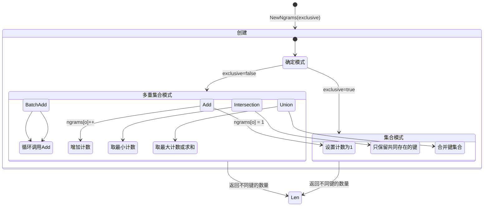
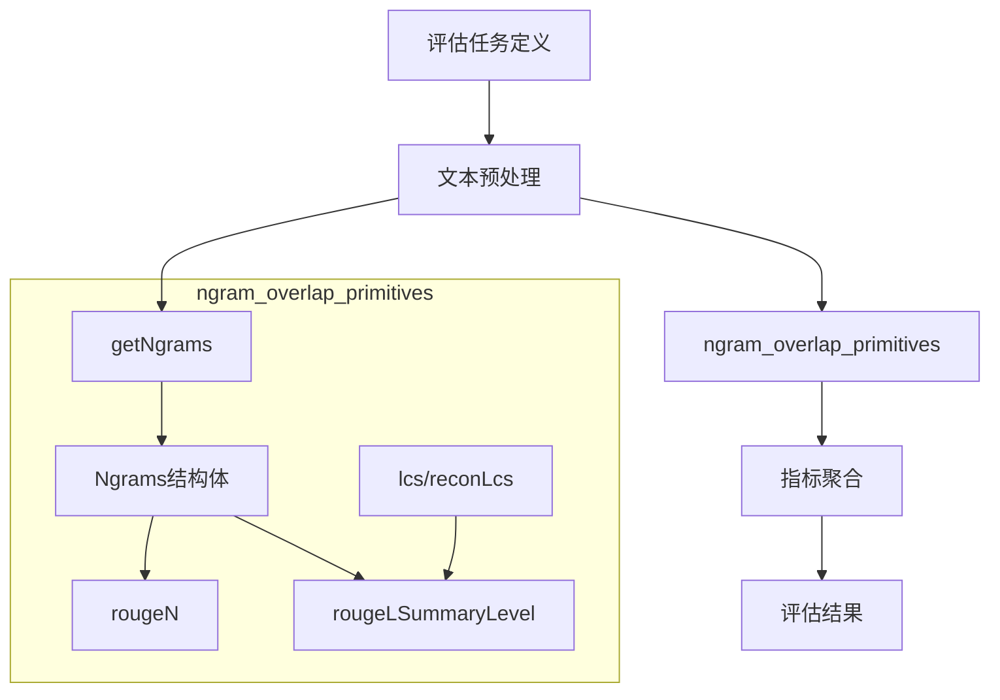
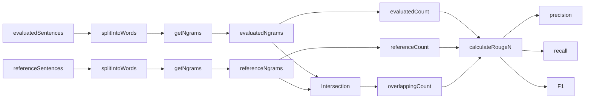
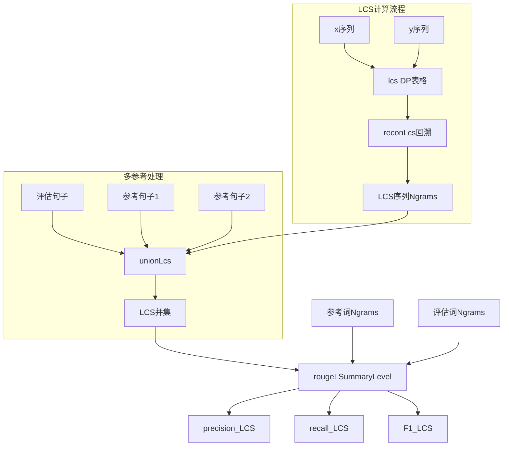

# ngram_overlap_primitives 模块技术深度分析

## 1. 问题定位与模块价值

### 为什么需要这个模块？

在自然语言处理（NLP）的评估场景中，我们需要量化衡量生成文本与参考文本之间的相似度。无论是机器翻译、文本摘要还是问答系统，都需要一种客观的方法来评估输出质量。

想象一下：你有一个生成的摘要和一个人工编写的参考摘要。如何用数字表达它们有多相似？简单的字符串匹配不够灵活，因为相同的意思可以用不同的词序表达。这就是 n-gram 重叠度量的用武之地——它通过比较文本中连续词序列（n-gram）的重叠程度，提供了一种既精确又鲁棒的相似度计算方法。

### 设计洞察

这个模块的核心洞察是：**文本相似度可以通过共享的局部序列模式来衡量**。n-gram（连续 n 个词的序列）捕获了文本的局部结构，而最长公共子序列（LCS）则捕捉了更灵活的顺序相似性。通过组合这些概念，我们可以构建出像 ROUGE 这样被广泛接受的文本质量评估指标。

## 2. 核心抽象与心智模型

### Ngrams 结构体：有状态的序列集合

`Ngrams` 是这个模块的核心抽象，它不仅仅是一个简单的计数器——它是一个**带有集合语义的词序列容器**。



可以把 `Ngrams` 想象成一个**文本指纹采集器**：
- 当 `exclusive=true` 时，它像一个集合——只记录某个 n-gram 是否出现过
- 当 `exclusive=false` 时，它像一个多重集合——记录每个 n-gram 出现的次数

这种设计让同一个抽象可以支持不同的评估策略：集合模式适合"是否包含"的判断，多重集合模式适合"包含多少"的量化。

```go
type Ngrams struct {
    ngrams    map[string]int  // 内部存储：n-gram 字符串到计数的映射
    exclusive bool            // 控制集合/多重集合行为的开关
}
```

### 关键操作的语义

- **Add/BatchAdd**：向指纹采集器中添加序列
- **Intersection**：找出两个文本共享的序列模式
- **Union**：合并多个文本的序列模式
- **Len**：统计不同序列模式的数量（集合模式）或总出现次数（多重集合模式）

## 3. 数据流程与架构角色

### 在评估管道中的位置

这个模块位于评估服务的底层，作为 ROUGE 等文本重叠指标的计算原语。



### 关键流程解析

#### 3.1 ROUGE-N 计算流程

以 `rougeN` 函数为例，我们来追踪数据如何流动：



1. **输入准备**：接收评估句子和参考句子（都是 `[]string` 类型）
2. **词级 n-gram 提取**：`getWordNgrams` 首先调用 `splitIntoWords` 将句子拆分为单词，然后 `getNgrams` 滑动窗口提取 n-gram
3. **集合操作**：计算评估 n-gram 集合和参考 n-gram 集合的交集
4. **指标计算**：根据原始计数或计算精度/召回率/F1 值

#### 3.2 ROUGE-L 计算流程



ROUGE-L 使用最长公共子序列，流程更复杂一些：

1. **LCS 表格构建**：`lcs` 函数构建动态规划表格
2. **LCS 重构**：`reconLcs` 从表格回溯重建实际的公共子序列
3. **多参考处理**：`unionLcs` 处理多个参考句子，计算并集 LCS
4. **最终指标**：`rougeLSummaryLevel` 汇总计算召回率、精度和 F1

## 4. 设计决策与权衡

### 4.1 exclusive 标志的设计

**决策**：在 `Ngrams` 结构体中使用 `exclusive` 布尔值来控制集合/多重集合行为

**权衡分析**：
- ✅ **优点**：同一套 API 支持两种使用模式，代码复用性高
- ⚠️ **缺点**：行为由运行时标志控制，增加了状态复杂性，调用者需要清楚自己想要什么模式

**替代方案考虑**：
- 方案 A：创建两个不同的类型 `NgramSet` 和 `NgramMultiset`
  - 优点：类型安全，行为明确
  - 缺点：代码重复，需要维护两套几乎相同的实现
- 方案 B：使用策略模式注入计数行为
  - 优点：更灵活，可扩展
  - 缺点：过度设计，对于这个简单场景来说太重

**为什么当前选择是合理的**：对于评估指标这种性能敏感且行为相对固定的场景，当前设计在简单性和灵活性之间取得了很好的平衡。

### 4.2 字符串作为 n-gram 的键

**决策**：使用 `strings.Join(text[i:i+n], " ")` 将 n-gram 转换为字符串作为 map 的键

**权衡分析**：
- ✅ **优点**：简单直接，利用 Go 原生的 map 键比较
- ⚠️ **缺点**：字符串连接有开销，对于大文本可能产生大量临时字符串

**为什么这样设计**：在评估场景中，文本通常不会极端巨大，这种实现的简单性超过了性能考虑。如果需要优化，可以考虑使用更高效的哈希方案，但当前实现对于大多数用例已经足够。

### 4.3 递归实现 LCS 重构

**决策**：`reconLcs` 使用递归函数从 DP 表格重构 LCS

**权衡分析**：
- ✅ **优点**：代码清晰，与算法的数学描述直接对应
- ⚠️ **缺点**：对于极长的序列，可能遇到栈溢出问题（尽管 Go 的栈会动态增长）

**实际考虑**：在文本评估场景中，句子长度通常有限，递归深度不会成为问题。这种实现的可读性优势是值得的。

## 5. 组件深度解析

### 5.1 Ngrams 结构体

**目的**：提供一个统一的抽象来表示和操作 n-gram 集合/多重集合

**内部机制**：
- 使用 `map[string]int` 存储 n-gram 及其计数
- `exclusive` 标志控制 `Add` 操作的行为：设置为 1 或递增计数

**关键方法**：

```go
func (n *Ngrams) Add(o string) {
    if n.exclusive {
        n.ngrams[o] = 1  // 集合行为：只记录存在
    } else {
        n.ngrams[o]++     // 多重集合行为：记录次数
    }
}
```

**设计意图**：这个方法体现了策略模式的简化版——行为由内部状态而非外部策略对象决定。

### 5.2 getNgrams 函数

**目的**：从词序列中提取 n-gram

**参数**：
- `n int`：n-gram 的大小（1=unigram，2=bigram，等）
- `text []string`：输入的词序列
- `exclusive bool`：控制生成的 Ngrams 是集合还是多重集合

**实现细节**：
```go
func getNgrams(n int, text []string, exclusive bool) *Ngrams {
    ngramSet := NewNgrams(exclusive)
    for i := 0; i <= len(text)-n; i++ {
        ngramSet.Add(strings.Join(text[i:i+n], " "))
    }
    return ngramSet
}
```

**滑动窗口机制**：循环从 0 到 `len(text)-n`，每次取 `text[i:i+n]` 作为当前窗口，这是提取连续序列的标准模式。

### 5.3 lcs 和 reconLcs 函数

**目的**：计算两个序列的最长公共子序列（LCS）

**算法解析**：
- `lcs` 构建动态规划表格，时间复杂度 O(n×m)，空间复杂度 O(n×m)
- `reconLcs` 从表格右下角回溯，递归重建 LCS

**为什么需要两个函数**：
- `lcs` 只计算长度，不保留实际序列
- `reconLcs` 需要表格来重构序列，这种分离让我们可以在只需要长度时节省内存

### 5.4 rougeN 和 calculateRougeN 函数

**责任分离**：
- `rougeN` 负责协调：提取 n-gram、计算交集、决定返回原始计数还是计算指标
- `calculateRougeN` 纯粹的数学计算：从计数到精度、召回率、F1 的转换

**设计亮点**：F1 计算中的 `1e-8` 小常数
```go
results["f"] = 2.0 * ((results["p"] * results["r"]) / (results["p"] + results["r"] + 1e-8))
```
这是防止除以零的标准技巧，比显式检查更简洁且性能更好。

### 5.5 rougeLSummaryLevel 函数

**多参考处理**：这个函数处理多个参考句子的情况，通过计算所有参考的 LCS 并集来评估生成文本。

**流程**：
1. 收集所有参考词和评估词
2. 对每个参考句子，计算与评估句子的 LCS 并集
3. 汇总并计算最终指标

## 6. 依赖关系与契约

### 6.1 内部依赖

这个模块内部调用了一些未在代码中完全展示的函数：

- `splitIntoWords(sentences []string) []string`：将句子拆分为单词
  - **契约假设**：输入是句子列表，输出是平坦的单词列表
  - **潜在耦合点**：分词策略会直接影响 n-gram 的提取结果

### 6.2 被依赖关系

根据模块树，这个模块被以下模块使用：

- [bleu_precision_based_overlap_metric](application_services_and_orchestration-evaluation_dataset_and_metric_services-generation_text_overlap_metrics-bleu_precision_based_overlap_metric.md)
- [rouge_recall_oriented_overlap_metric](application_services_and_orchestration-evaluation_dataset_and_metric_services-generation_text_overlap_metrics-rouge_recall_oriented_overlap_metric.md)

这些高级指标模块依赖 `ngram_overlap_primitives` 提供的底层计算原语。

## 7. 使用示例与模式

### 7.1 基本使用：计算 n-gram 重叠

```go
// 创建两个文本
evaluated := []string{"the quick brown fox jumps over the lazy dog"}
reference := []string{"the quick brown cat jumps over the lazy dog"}

// 提取 bigram (2-gram)
evaluatedNgrams := getWordNgrams(2, evaluated, false)
referenceNgrams := getWordNgrams(2, reference, false)

// 计算交集
overlap := evaluatedNgrams.Intersection(referenceNgrams)
fmt.Printf("重叠的 bigram 数量: %d\n", overlap.Len())
```

### 7.2 使用 ROUGE-N 评估

```go
// 计算 ROUGE-2
results := rougeN(evaluated, reference, 2, false, false)
fmt.Printf("ROUGE-2 精度: %.2f\n", results["p"])
fmt.Printf("ROUGE-2 召回率: %.2f\n", results["r"])
fmt.Printf("ROUGE-2 F1: %.2f\n", results["f"])
```

### 7.3 使用 ROUGE-L 评估

```go
// 计算 ROUGE-L
results := rougeLSummaryLevel(evaluated, reference, false, false)
fmt.Printf("ROUGE-L 精度: %.2f\n", results["p"])
fmt.Printf("ROUGE-L 召回率: %.2f\n", results["r"])
fmt.Printf("ROUGE-L F1: %.2f\n", results["f"])
```

## 8. 边缘情况与陷阱

### 8.1 空输入处理

模块对空输入有合理的处理：
- 当 `evaluatedCount == 0` 时，精度设为 0
- 当 `referenceCount == 0` 时，召回率设为 0
- F1 计算中有 `1e-8` 防止除以零

**注意**：如果参考和评估都是空的，会得到精度=0、召回率=0、F1=0，这在数学上合理但语义上可能需要特殊处理。

### 8.2 exclusive 标志的混淆

**陷阱**：调用者可能不清楚何时该用 `exclusive=true` 或 `false`

**指导原则**：
- 如果你关心的是"是否出现"（如 ROUGE 的某些变体），用 `exclusive=true`
- 如果你关心的是"出现多少次"（如 BLEU），用 `exclusive=false`

### 8.3 分词策略的影响

**隐藏依赖**：`splitIntoWords` 的实现对结果有重大影响

**潜在问题**：
- 不同的分词方式（如是否保留标点、大小写处理）会产生不同的 n-gram
- 如果评估和参考使用了不同的分词策略，结果会失真

**建议**：确保评估和参考文本使用完全相同的分词流水线。

### 8.4 LCS 的内存消耗

**注意**：`lcs` 函数创建的表格大小为 O(n×m)，对于非常长的文本可能消耗大量内存

**缓解**：如果需要处理超长文本，可以考虑使用只保留两行的优化版 LCS 算法（尽管这会让重构 LCS 变得更复杂）。

## 9. 扩展与修改指南

### 9.1 添加新的 n-gram 操作

如果需要添加新的集合操作（如差集），可以遵循现有方法的模式：

```go
func (n *Ngrams) Difference(o *Ngrams) *Ngrams {
    difference := NewNgrams(n.exclusive)
    for k, v := range n.ngrams {
        if _, ok := o.ngrams[k]; !ok {
            if n.exclusive {
                difference.ngrams[k] = 1
            } else {
                difference.ngrams[k] = v
            }
        }
    }
    return difference
}
```

### 9.2 性能优化方向

如果性能成为瓶颈，可以考虑：

1. **避免字符串连接**：使用结构体或哈希值作为 map 键，代替 `strings.Join`
2. **流式处理**：对于超大文本，实现不一次性加载所有文本的流式 n-gram 提取
3. **并行计算**：对于多参考场景，可以并行计算每个参考的 LCS

### 9.3 测试建议

测试这个模块时，应该覆盖：

- 基本功能：简单的 n-gram 提取和重叠计算
- 边界情况：空输入、单字输入、n 大于文本长度
- 多语言：考虑非空格分隔的语言（尽管当前实现可能不支持）
- 性能基准：确保优化不会破坏行为

## 10. 总结

`ngram_overlap_primitives` 模块是文本评估指标的基础构建块。它通过 `Ngrams` 抽象统一了集合和多重集合的操作，为 ROUGE 等指标提供了高效且灵活的计算原语。

设计上的关键决策——使用 `exclusive` 标志控制行为、字符串作为键、递归 LCS 重构——都是在简单性、可读性和性能之间的精心平衡。理解这些权衡，以及模块的数据流和依赖关系，是有效使用和扩展这个模块的关键。

对于新贡献者，最重要的是记住：这个模块虽然看起来简单，但它是评估系统的基础，微小的改变可能会对整个评估结果产生深远影响。
