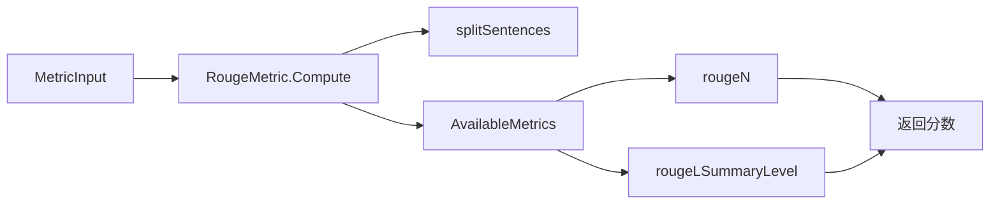

# Rouge 召回导向重叠度量模块技术深度解析

## 1. 问题空间与模块定位

在评估文本生成质量时，我们需要一种客观、可量化的方法来比较生成文本与参考文本之间的相似性。这正是 `rouge_recall_oriented_overlap_metric` 模块所要解决的核心问题。

### 为什么需要这个模块？
- **文本生成评估的标准化**: 在智能问答系统、摘要生成等场景中，我们需要一种统一的方式来衡量模型输出的质量
- **自动化评估**: 人工评估成本高、效率低，且存在主观性，ROUGE 提供了一种自动化的客观评估方法
- **召回优先**: 与 BLEU 等精度优先的指标不同，ROUGE 专注于召回率，更适合评估摘要等需要覆盖关键信息的场景

### 模块在系统中的角色
本模块是评估服务层的核心组件之一，属于 `evaluation_dataset_and_metric_services` 下的 `generation_text_overlap_metrics` 子模块。它与 BLEU 等其他文本重叠度量指标一起，为评估系统提供了完整的文本生成质量评估能力。

## 2. 核心抽象与设计思想

### 核心抽象
模块的核心是 `RougeMetric` 结构体，它封装了 ROUGE 度量的三个关键配置：
- **exclusive**: 排他匹配模式，控制 n-gram 的匹配策略
- **metric**: ROUGE 度量类型，如 "rouge-1"、"rouge-2"、"rouge-l"
- **stats**: 返回的统计指标，如 "f" (F1)、"p" (精确率)、"r" (召回率)

### 设计理念
1. **策略模式**: 通过 `AvailableMetrics` 映射表将不同的 ROUGE 变体实现为独立的计算函数，实现了算法与使用的解耦
2. **工厂模式**: 通过 `NewRougeMetric` 工厂函数统一创建实例，封装了配置参数的验证和初始化逻辑
3. **接口统一**: 所有 ROUGE 变体都遵循相同的函数签名，确保了使用上的一致性

## 3. 数据流程与关键操作

### 端到端数据流程
1. **输入接收**: 从 `types.MetricInput` 获取生成文本和参考文本
2. **文本预处理**: 使用 `splitSentences` 将文本分割为句子序列
3. **度量计算**: 根据配置的 metric 类型选择对应的计算函数
4. **结果聚合**: 累加指定的统计指标并返回平均值

### 关键组件交互


### 核心计算流程
1. **文本分割**: 将输入文本分割成句子序列，这是 ROUGE 计算的基础预处理步骤
2. **度量选择**: 从 `AvailableMetrics` 中查找与配置 metric 对应的计算函数
3. **分数计算**: 调用选中的计算函数，传入假设文本、参考文本和排他模式
4. **统计提取**: 从计算结果中提取指定的统计指标（精确率、召回率或 F1 值）
5. **结果归一化**: 计算平均分数并返回

## 4. 设计决策与权衡

### 设计决策 1: 使用函数映射表而非继承
**选择**: 通过 `AvailableMetrics` 映射表将不同的 ROUGE 变体实现为独立函数
**原因**: 
- 更符合 Go 语言的函数式编程风格
- 避免了复杂的继承层次结构
- 便于添加新的 ROUGE 变体，只需在映射表中添加新条目

**权衡**: 
- 优点：灵活性高，易于扩展
- 缺点：函数签名必须严格一致，减少了定制化的空间

### 设计决策 2: 配置与计算分离
**选择**: 将配置参数存储在 `RougeMetric` 结构体中，计算逻辑独立在函数中
**原因**:
- 允许创建多个预配置的度量实例
- 配置参数在创建时确定，计算时无需重复传递
- 便于在不同场景下复用相同的配置

**权衡**:
- 优点：提高了代码的复用性和可维护性
- 缺点：每次计算都需要访问结构体字段，可能有微小的性能开销

### 设计决策 3: 支持多种统计指标
**选择**: 允许通过 `stats` 参数选择返回精确率、召回率或 F1 值
**原因**:
- 不同的评估场景可能关注不同的指标
- 提供了更大的灵活性，满足多样化的评估需求

**权衡**:
- 优点：适用性广，可满足多种评估需求
- 缺点：增加了使用复杂度，用户需要了解不同统计指标的含义

## 5. 实现细节与关键组件

### RougeMetric 结构体
```go
type RougeMetric struct {
    exclusive bool   // 是否使用排他匹配模式
    metric    string // ROUGE 度量类型
    stats     string // 要返回的统计指标
}
```
- **exclusive**: 控制 n-gram 的匹配策略，排他模式下每个 n-gram 只能匹配一次
- **metric**: 定义使用的 ROUGE 变体，如 "rouge-1"（一元语法）、"rouge-l"（最长公共子序列）
- **stats**: 指定返回的统计类型，"f" 为 F1 值，"p" 为精确率，"r" 为召回率

### AvailableMetrics 映射表
这个映射表是模块的核心，它将 ROUGE 变体名称映射到对应的计算函数：
- **rouge-1 到 rouge-5**: 基于 n-gram 的 ROUGE 变体，分别使用 1 到 5 个连续词作为匹配单元
- **rouge-l**: 基于最长公共子序列的 ROUGE 变体，更关注句子级别的结构相似性

### Compute 方法
这是模块的主要入口点，它：
1. 从 `MetricInput` 中提取生成文本和参考文本
2. 将文本分割成句子序列
3. 调用相应的 ROUGE 计算函数
4. 累加指定的统计指标并返回平均值

## 6. 使用示例与最佳实践

### 基本使用
```go
// 创建一个 Rouge-1 度量实例，计算 F1 值，使用非排他模式
rougeMetric := NewRougeMetric(false, "rouge-1", "f")

// 准备输入
input := &types.MetricInput{
    GeneratedTexts: "这是生成的文本",
    GeneratedGT:    "这是参考文本",
}

// 计算分数
score := rougeMetric.Compute(input)
```

### 常见配置
- **摘要评估**: 推荐使用 "rouge-l"，它更关注句子结构和内容覆盖
- **关键词匹配**: 推荐使用 "rouge-1" 或 "rouge-2"，它们更关注词级别的匹配
- **严格评估**: 使用排他模式 (exclusive=true)，避免重复匹配相同的 n-gram

## 7. 边缘情况与注意事项

### 边缘情况处理
1. **空文本输入**: 模块会返回 0 分，避免除以零错误
2. **不支持的 metric 类型**: 会导致运行时 panic，使用前应验证 metric 类型是否在 `AvailableMetrics` 中
3. **不支持的 stats 类型**: 同样会导致运行时 panic，应确保 stats 参数为 "f"、"p" 或 "r"

### 使用注意事项
1. **文本预处理**: 模块内部会进行句子分割，但不会进行其他预处理（如小写化、标点符号处理），使用前应根据需要进行预处理
2. **语言依赖性**: ROUGE 最初是为英语设计的，对于其他语言可能需要调整分词策略
3. **评估局限性**: ROUGE 主要衡量词汇重叠，无法评估语义理解、逻辑连贯性等方面的质量

## 8. 依赖关系与模块交互

### 依赖的模块
- **types 模块**: 提供 `MetricInput` 结构体定义
- **ngram_overlap_primitives 模块**: 包含底层的 n-gram 计算和最长公共子序列算法（虽然在当前代码中未直接显示，但从架构关系可以推断）

### 被依赖的模块
- **metric_hooking_and_metric_set_contracts 模块**: 可能使用本模块作为评估指标集的一部分
- **evaluation_orchestration_and_state 模块**: 可能在评估流程中调用本模块

## 9. 总结

`rouge_recall_oriented_overlap_metric` 模块提供了一个灵活、可扩展的 ROUGE 度量实现，它通过策略模式和工厂模式的结合，实现了配置与计算的分离，支持多种 ROUGE 变体和统计指标。作为评估服务层的核心组件，它为文本生成质量的自动化评估提供了重要支持。

模块的设计体现了 Go 语言的简洁和实用主义，通过函数映射表而非继承来实现多态，通过结构体来封装配置，通过工厂函数来创建实例。这些设计决策使得模块既易于使用，又具有良好的可扩展性。
