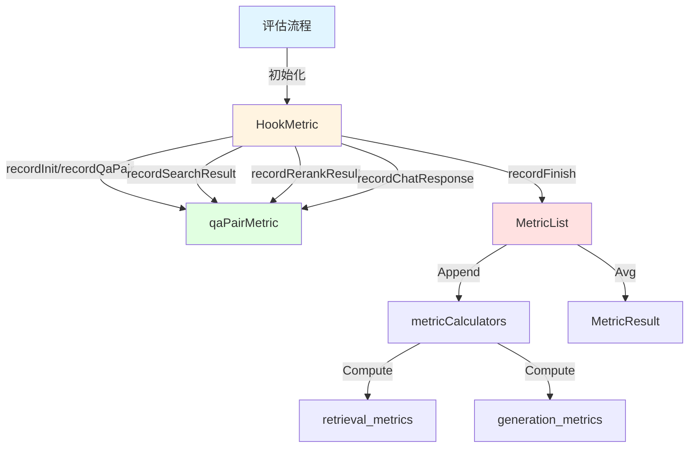

# 指标钩子与指标集合契约 (metric_hooking_and_metric_set_contracts)

## 概述

这个模块解决了一个关键问题：如何在评估过程中**统一、安全、可扩展地收集和计算检索和生成质量指标**。在典型的评估系统中，你可能需要针对多个问答对运行检索和生成流程，然后在结束时汇总所有指标结果——但如果你不小心，会陷入重复代码、线程安全问题，以及指标计算与业务逻辑耦合的陷阱。

这个模块的核心思想是：把指标收集想象成"钩子"——在评估流程的各个关键节点挂上钩子，让模块自动记录数据，最后一键生成平均指标。它不仅统一了指标计算的契约，还处理了并发安全问题，并且通过元数据驱动的方式让指标配置变得灵活可扩展。

## 核心架构



### 核心组件角色

- **HookMetric**：指标收集的总指挥。它像一个评估管道的"观察站"，在流程的每个节点捕获数据，同时保证线程安全。
- **qaPairMetric**：单个问答对的数据容器。它保存一个问答对从检索到生成的完整上下文。
- **MetricList**：指标结果的管理者。它计算并存储每个问答对的指标，最后计算平均值。
- **metricCalculators**：这是模块的"配置大脑"——一个元数据驱动的注册表，定义了要计算哪些指标，以及如何把计算结果映射到最终的输出结构。

## 数据流程深度解析

整个模块的工作流程可以分为三个阶段：**收集期**、**计算期**、**汇总期**。

### 1. 收集期：挂载钩子捕获数据

当评估流程开始时，调用者首先创建 `HookMetric` 实例，为每个问答对分配一个索引。评估过程中，在关键节点调用对应的 `record*` 方法：

- `recordInit`：初始化一个新的问答对指标记录
- `recordQaPair`：记录 Ground Truth 数据（问题、标准答案、相关文档ID）
- `recordSearchResult`：记录初始检索结果
- `recordRerankResult`：记录重排序后的结果（这是用于检索指标计算的最终结果）
- `recordChatResponse`：记录生成的回答内容

这里有一个重要的设计细节：**数据捕获和计算是分离的**。在这个阶段，`HookMetric` 只是忠实地记录所有原始数据，不进行任何计算，这样做的好处是：
1. 指标计算不会阻塞评估流程
2. 可以灵活决定何时触发计算
3. 更容易调试（你可以检查原始数据）

### 2. 计算期：指标计算与存储

当调用 `recordFinish` 时，模块进入计算期。这里发生了几个关键操作：

1. **数据准备**：从重排序结果中提取文档 ID 列表，从聊天响应中获取生成文本，组装成 `MetricInput`。
2. **多指标计算**：遍历 `metricCalculators` 列表，对每个指标调用 `Compute` 方法。
3. **结果映射**：通过预定义的字段访问函数，把计算结果"写入"到 `MetricResult` 的对应字段。
4. **线程安全存储**：使用互斥锁保护 `MetricList` 的追加操作。

这个阶段的设计亮点是 `metricCalculators` 这个匿名结构体数组。它本质上是一个**声明式配置**，把"计算什么指标"和"结果放在哪里"这两个问题的答案编码在同一个地方。当你需要添加新指标时，只需要在这个列表中添加一行配置，而不需要修改 `Append` 或 `Avg` 方法的逻辑——这就是**开放封闭原则**的一个优雅实现。

### 3. 汇总期：平均值计算

最后，调用 `MetricResult` 获取所有问答对的平均指标。`Avg` 方法同样利用 `metricCalculators` 配置，对每个指标字段独立计算平均值。这里的关键是，它不需要知道 `MetricResult` 的具体结构——所有操作都通过配置中的字段访问器完成，这保持了代码的灵活性。

## 核心组件详解

### HookMetric

**作用**：线程安全的指标收集协调器

**设计意图**：
这个结构体是模块的对外门面。它的存在是为了让调用者不需要了解指标计算的细节，只需要在流程的各个节点"报告"发生了什么。同时，它封装了并发控制，确保即使多个 goroutine 同时记录指标也不会出问题。

**关键机制**：
- 使用 `sync.RWMutex` 而不是 `sync.Mutex`：这是一个细心的优化。指标收集（写操作）需要互斥，但读取结果（读操作）可以并发，所以读写锁能提供更好的并发性能。
- 预分配容量的切片：`NewHookMetric` 接受一个 capacity 参数，这减少了切片扩容的开销。

### qaPairMetric

**作用**：单个问答对的上下文容器

**设计意图**：
这是一个典型的数据持有对象（DTO），但它的存在不是为了移动数据，而是为了**保持数据的一致性**。在评估过程中，检索结果、重排序结果、生成响应可能来自不同的步骤甚至不同的组件，把它们绑定在一个结构体里，可以确保我们是对同一组数据计算指标。

**值得注意的细节**：
它是一个私有结构体（小写开头）——这意味着模块外部无法直接操作它，只能通过 `HookMetric` 的方法来间接修改。这是一种封装，防止调用者在记录过程中意外修改数据。

### MetricList

**作用**：指标结果的计算与聚合引擎

**设计意图**：
这个结构体把"如何计算一系列指标"和"如何聚合指标结果"这两个职责封装在一起。它不关心指标的含义，只关心"对每个输入计算所有配置的指标，然后把它们平均"。

**设计亮点**：
- `metricCalculators` 是一个包级别的变量，而不是 `MetricList` 的字段。这是一个**依赖注入的简化版本**——指标配置在模块加载时确定，所有 `MetricList` 实例共享同一套配置。在评估场景下，这通常是合理的（你不会希望同时运行两个不同的指标配置），但如果未来需要更灵活的配置，可以轻松改成通过构造函数注入。

## 设计决策与权衡

### 1. 声明式指标配置 vs 硬编码指标计算

**选择**：使用 `metricCalculators` 数组作为声明式配置

**原因**：
- 可扩展性：添加新指标只需要修改一个地方
- 避免重复：`Append` 和 `Avg` 都使用同一套配置，保持一致性
- 关注点分离：指标定义与计算逻辑解耦

**权衡**：
- 稍微增加了理解成本：新手需要理解字段访问函数的工作原理
- 失去了一些编译时安全性：字段映射错误在运行时才会发现

### 2. 读写锁 vs 普通互斥锁

**选择**：`sync.RWMutex`

**原因**：
- 常见模式是：多次并发收集指标，最后读取一次结果
- 读操作（获取平均指标）可以并发进行，不会阻塞彼此
- 写操作使用 `Lock()`，确保数据一致性

**权衡**：
- 读写锁本身比普通互斥锁有轻微的开销
- 如果读写比例接近 1:1，可能不会有性能收益（但在评估场景下这不太可能）

### 3. 预先分配切片容量 vs 动态扩容

**选择**：`NewHookMetric(capacity int)` 要求调用者提供容量

**原因**：
- 评估场景通常知道要处理多少个问答对
- 避免切片多次扩容带来的内存拷贝
- 明确的契约：调用者知道需要提前知道数量

**权衡**：
- 如果实际数量超过容量，仍然会扩容
- 给调用者增加了一点负担（需要先获取数量）

## 依赖关系分析

### 此模块依赖什么

- **types 包**：定义了 `MetricInput`、`MetricResult`、`QAPair` 等核心数据结构
- **types/interfaces**：定义了 `Metrics` 接口，这是所有指标计算器必须实现的契约
- **metric 包**：提供具体的指标实现（PrecisionMetric、RecallMetric、BLEUMetric 等）
- **logger**：用于日志记录

### 什么依赖此模块

根据模块树，这个模块位于 `evaluation_dataset_and_metric_services` 下，推测：
- 评估编排服务（evaluation_orchestration_and_state）会使用它来收集评估指标
- 评估端点处理器（evaluation_endpoint_handler）可能会通过它来返回最终指标结果

### 数据契约

这个模块与外界交互的核心契约是：

1. **输入契约**：`QAPair`（包含标准答案和相关文档）、`SearchResult`（检索结果）、`ChatResponse`（生成内容）
2. **输出契约**：`MetricResult`（包含所有检索和生成指标）
3. **扩展契约**：`Metrics` 接口（任何实现了 `Compute` 方法的类型都可以作为指标计算器）

## 用法与示例

### 基本用法

```go
// 1. 创建指标收集器，假设我们有 100 个问答对
hook := NewHookMetric(100)

// 2. 处理每个问答对
for i, qaPair := range qaPairs {
    // 初始化
    hook.recordInit(i)
    hook.recordQaPair(i, qaPair)
    
    // 执行检索...
    searchResult := doSearch(qaPair.Question)
    hook.recordSearchResult(i, searchResult)
    
    // 执行重排序...
    rerankResult := doRerank(searchResult)
    hook.recordRerankResult(i, rerankResult)
    
    // 执行生成...
    chatResponse := generateAnswer(qaPair.Question, rerankResult)
    hook.recordChatResponse(i, chatResponse)
    
    // 完成并计算这个问答对的指标
    hook.recordFinish(i)
}

// 3. 获取平均指标结果
result := hook.MetricResult()
fmt.Printf("MAP: %.2f, BLEU-4: %.2f\n", result.RetrievalMetrics.MAP, result.GenerationMetrics.BLEU4)
```

### 扩展新指标

假设你想添加一个新的生成指标 `METEOR`，你只需要：

1. 实现 `Metrics` 接口：
```go
type METEORMetric struct { /* ... */ }
func (m *METEORMetric) Compute(input *types.MetricInput) float64 { /* ... */ }
```

2. 在 `metricCalculators` 中添加一行配置：
```go
{metric.NewMETEORMetric(), func(r *types.MetricResult) *float64 {
    return &r.GenerationMetrics.METEOR
}},
```

## 注意事项与常见陷阱

### 1. 索引越界风险

`HookMetric` 的所有 `record*` 方法都接受一个 `index` 参数，但它**不会验证索引是否在有效范围内**。如果你创建时指定的 capacity 小于实际处理的问答对数量，或者索引计算错误，会导致 panic。

**建议**：在调用任何 `record*` 方法前确保索引正确，或者在调用者那边添加范围检查。

### 2. 必须按顺序调用方法

虽然模块没有强制要求，但调用者应该遵循这个顺序：
```
recordInit → recordQaPair → [recordSearchResult] → recordRerankResult → recordChatResponse → recordFinish
```

特别是 `recordFinish` 依赖于前面的数据，如果缺少关键数据（比如 `qaPair` 或 `rerankResult`），会导致空指针引用或错误的指标计算。

### 3. 检索指标来自 Rerank 结果，不是 Search 结果

这是一个容易混淆的点：模块使用 `recordRerankResult` 的结果来计算检索指标，而忽略 `recordSearchResult` 的数据。这是合理的，因为重排序通常代表最终展示给用户或用于生成的结果。

**建议**：如果你没有重排序步骤，仍然应该调用 `recordRerankResult` 并传入初始检索结果。

### 4. 线程安全仅限于 HookMetric 的方法

虽然 `HookMetric` 使用了锁来保护指标收集，但调用者仍然需要注意：不要在多个 goroutine 中同时为同一个 `index` 调用 `record*` 方法。锁保护的是 `MetricList` 的追加操作，而不是单个 `qaPairMetric` 的写入。

### 5. 性能考虑：指标计算是同步的

当调用 `recordFinish` 时，指标计算是在当前 goroutine 中同步执行的。如果你有大量的问答对或者计算密集的指标（比如某些复杂的生成指标），这可能会成为瓶颈。

**优化方向**：如果未来需要，可以考虑把指标计算放到后台 goroutine 池异步执行，但这会增加复杂性。

## 总结

这个模块的优雅之处在于它的**简洁性和可扩展性的平衡**。它没有使用复杂的框架或设计模式，只是通过几个结构体和一个声明式配置，就解决了指标收集、计算和聚合的问题，同时还处理了线程安全。

核心设计理念可以概括为：
1. **分离关注点**：数据收集 vs 指标计算
2. **声明式配置**：用数据驱动的方式定义指标
3. **封装复杂性**：对外提供简单的钩子接口，内部处理所有细节

对于需要评估检索和生成质量的系统来说，这个模块是一个可靠的基础组件。
