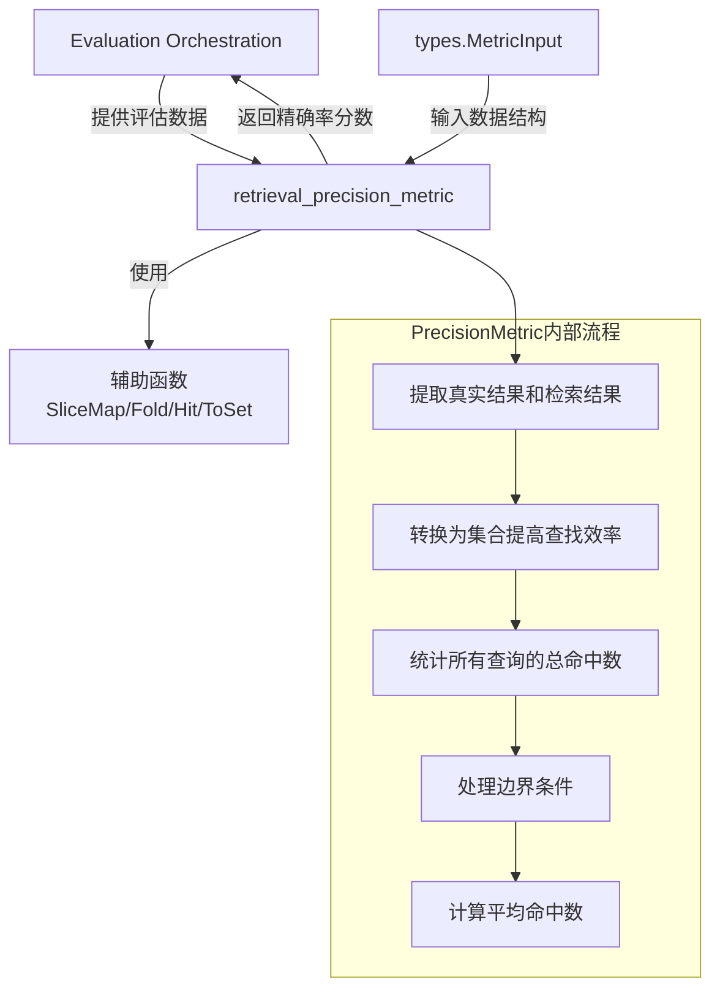

# retrieval_precision_metric 模块技术深度解析

## 1. 问题空间与模块定位

在信息检索系统的评估中，精确率（Precision）是一个核心指标，用于衡量检索结果的质量。想象一下，你在搜索引擎中查询"如何制作蛋糕"，搜索引擎返回了10个结果，其中只有3个真正与蛋糕制作相关——这时候精确率就是30%。

`retrieval_precision_metric` 模块的核心任务就是计算这种精确率，但它不是简单地处理单个查询，而是设计用于**批量评估**多个查询的检索质量。这是评估信息检索系统性能的关键组件，特别是在知识检索、问答系统等场景中。

值得特别注意的是，这个模块实现的精确率定义与传统定义略有不同——它计算的是**每个查询的命中数量的平均值**，而非传统的"命中数/检索结果数"的平均值。这种设计更关注"平均每个查询能找到多少相关结果"，而非"检索结果中有多少是相关的"。

## 2. 架构与数据流

让我们通过一个简洁的架构图来理解这个模块的角色和数据流：



## 3. 核心组件：PrecisionMetric

### 3.1 设计意图

`PrecisionMetric` 是一个简洁而专注的结构体，它的设计体现了单一职责原则——只做一件事，并且把它做好。这个组件不维护任何内部状态，完全依赖输入数据进行计算，这使得它具有高度的可测试性和可复用性。

它的无状态设计也使得它天然适合并发环境——多个 goroutine 可以安全地同时使用同一个 `PrecisionMetric` 实例。

### 3.2 核心方法：Compute

`Compute` 方法是这个模块的核心，让我们深入分析其工作原理：

```go
func (r *PrecisionMetric) Compute(metricInput *types.MetricInput) float64
```

**参数与返回值：**
- 输入：`*types.MetricInput`，包含检索的真实结果（ground truth）和预测结果
- 输出：`float64`，精确率分数，表示平均每个查询的命中数量

**内部工作流程：**
1. **数据提取**：从输入中获取真实结果集 `gts` 和预测结果集 `ids`
2. **高效查找准备**：将真实结果转换为集合（set）结构，这是一个关键的性能优化
3. **命中统计**：遍历所有查询，统计预测结果在真实结果中的命中次数
4. **边界处理**：处理没有真实结果的特殊情况，避免除零错误
5. **精确率计算**：总命中次数除以查询总数，得到最终的精确率分数

## 4. 性能优化与设计权衡

### 4.1 集合转换的性能考量

代码中有这样一行：
```go
gtSets := SliceMap(gts, ToSet)
```

这里将每个查询的真实结果列表转换为集合（map[int]struct{}），这是一个经典的时间换空间的优化：
- **为什么这样做？** 集合的查找时间复杂度是 O(1)，而列表是 O(n)
- **权衡分析**：牺牲了一些内存来存储集合结构，但对于大规模检索评估来说，这种性能提升是值得的
- **适用场景**：当真实结果集较大时，这种优化效果尤为明显
- **实现细节**：使用 `map[int]struct{}` 而非 `map[int]bool`，因为空结构体不占用任何内存空间

### 4.2 函数式编程风格的应用

代码中使用了 `SliceMap` 和 `Fold` 这类函数式编程风格的辅助函数：
- **设计意图**：使代码更简洁、更具可读性，强调"做什么"而非"怎么做"
- **权衡**：对于不熟悉函数式编程的开发者来说，可能需要一点学习成本
- **扩展性**：这种风格使得将来修改计算逻辑变得更加容易，比如只需替换传入 `Fold` 的函数

这种设计也展示了 Go 语言虽然不是纯函数式语言，但完全可以采用函数式的思想来编写清晰、优雅的代码。

## 5. 边缘情况与注意事项

### 5.1 空真实结果处理

代码中有一个重要的边界条件处理：
```go
if len(gts) == 0 {
    return 0.0
}
```

**设计意图**：
1. 防止除零错误
2. 在没有真实结果的情况下返回合理的默认值
3. 确保了方法的健壮性，即使输入数据不完整也能正常工作

### 5.2 精确率的特殊定义

正如前面提到的，这个模块计算的精确率与传统定义有所不同：
- **传统精确率**：每个查询的命中数/检索结果数，然后取平均
- **本模块精确率**：所有查询的总命中数/查询数（即平均每个查询的命中数）

**设计意图分析**：
- 这种设计更关注"召回"方面的表现——系统平均能找到多少相关结果
- 它不惩罚返回大量结果的系统，只关注找到了多少相关的
- 适用于那些更关心"有没有找到足够多相关结果"而非"结果有多精准"的场景

**使用注意**：
在使用这个指标时，确保你理解它的定义，并且它符合你的评估需求。如果需要传统定义的精确率，可能需要使用其他模块或修改这个实现。

### 5.3 输入数据的隐式契约

代码中没有明确检查 `metricInput.RetrievalGT` 和 `metricInput.RetrievalIDs` 的长度是否一致，但隐含假设它们是对应的：
- 第 i 个真实结果对应第 i 个检索结果
- 如果长度不一致，可能会导致意外的行为

这是一个潜在的改进点——可以添加显式的检查和错误处理。

## 6. 使用示例

虽然我们没有看到完整的 `types.MetricInput` 定义，但根据代码可以推断出基本使用方式：

```go
// 假设 MetricInput 结构类似于：
// type MetricInput struct {
//     RetrievalGT  [][]int  // 每个查询的真实相关文档ID
//     RetrievalIDs [][]int  // 每个查询的检索结果文档ID
// }

// 创建评估数据
input := &types.MetricInput{
    RetrievalGT: [][]int{
        {1, 2, 3},  // 查询1的真实相关文档
        {4, 5},     // 查询2的真实相关文档
    },
    RetrievalIDs: [][]int{
        {1, 6, 2},  // 查询1的检索结果
        {4, 7, 8},  // 查询2的检索结果
    },
}

// 计算精确率
precisionMetric := NewPrecisionMetric()
score := precisionMetric.Compute(input)
// 在这个例子中：
// 查询1命中2个文档（1和2）
// 查询2命中1个文档（4）
// 总命中数 = 3
// 查询数 = 2
// 最终分数 = 3 / 2 = 1.5
// 这表示平均每个查询能找到1.5个相关结果
```

## 7. 模块依赖与集成

### 7.1 内部依赖

这个模块相对独立，但它依赖于一些未在代码中显示的组件：
- `types.MetricInput`：定义了输入数据结构，这是与评估系统其他部分的契约
- 辅助函数（`SliceMap`, `Fold`, `Hit`, `ToSet`）：提供通用的数据处理功能

### 7.2 在系统中的位置

根据模块树结构，这个模块位于：
```
application_services_and_orchestration
  └── evaluation_dataset_and_metric_services
      └── retrieval_quality_metrics
          ├── ranking_quality_position_sensitive_metrics
          ├── retrieval_precision_metric (当前模块)
          └── retrieval_recall_metric
```

它与 [retrieval_recall_metric](application_services_and_orchestration-evaluation_dataset_and_metric_services-retrieval_quality_metrics-retrieval_recall_metric.md) 以及位置敏感的排序指标一起，构成了检索质量评估的完整工具集。

## 8. 扩展性与未来改进

虽然当前实现简洁高效，但有一些可能的改进方向：

1. **支持不同的精确率变体**：
   - 添加对 P@k（前k个结果的精确率）的支持
   - 实现传统定义的精确率计算

2. **更丰富的输入处理**：
   - 添加对 `RetrievalGT` 和 `RetrievalIDs` 长度不一致的显式检查
   - 支持加权查询，为不同重要性的查询赋予不同权重

3. **更详细的输出**：
   - 除了整体分数，还可以返回每个查询的精确率
   - 添加更丰富的统计信息，如标准差、中位数等

4. **接口抽象**：
   - 定义一个通用的 `Metric` 接口，使不同指标可以互换使用

但当前的设计保持了简单性，这是一个明智的选择——你可以随时添加功能，但很难在不破坏现有代码的情况下移除功能。当前的实现遵循了"最小可用产品"的原则，解决了核心问题，同时为未来的扩展留下了空间。
