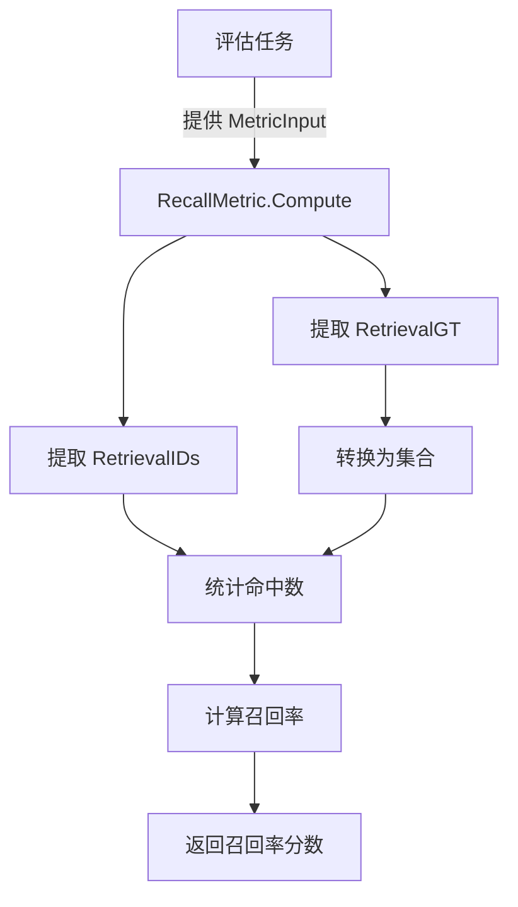

# 检索召回率指标模块（retrieval_recall_metric）技术深度解析

## 1. 模块概览

`retrieval_recall_metric` 模块是评价检索系统质量的核心组件之一，专注于计算**召回率**（Recall）这一关键指标。在信息检索场景中，召回率衡量的是："系统能够成功找到多少比例的相关文档？"

### 解决的问题

想象一个知识检索系统，当用户输入查询时，系统需要从海量文档库中找出所有相关的内容。如果系统只返回了部分相关文档，遗漏了很多重要信息，那么这个系统的召回率就很低。`RecallMetric` 组件的作用就是定量评估这个"覆盖率"指标，帮助我们客观评价检索系统的性能。

### 为什么简单计数不够？

直观上，你可能认为简单统计"找到的相关文档数/总相关文档数"就足够了。但实际情况要复杂一些：
1. **多个查询的聚合**：我们通常需要在多个查询上评估系统性能
2. **批量处理效率**：当处理大量查询和文档时，性能优化变得重要
3. **边界情况处理**：例如没有相关文档的情况

## 2. 核心组件解析

### RecallMetric 结构体

```go
type RecallMetric struct{}
```

`RecallMetric` 是一个极简的结构体设计，没有任何状态字段。这种设计反映了一个重要的架构决策：指标计算器是无状态的纯函数组件。

**设计意图**：
- 无状态设计使组件可安全并发使用
- 无需初始化，创建成本几乎为零
- 易于测试，因为没有内部状态需要重置

### Compute 方法

```go
func (r *RecallMetric) Compute(metricInput *types.MetricInput) float64 {
    gts := metricInput.RetrievalGT  // 真实相关文档
    ids := metricInput.RetrievalIDs  // 系统检索到的文档
    
    gtSets := SliceMap(gts, ToSet)  // 转换为集合以便高效查找
    ahit := Fold(gtSets, 0, func(a int, b map[int]struct{}) int { 
        return a + Hit(ids, b) 
    })  // 统计命中数
    
    if len(gtSets) == 0 {
        return 0.0
    }
    
    return float64(ahit) / float64(len(gtSets))  // 计算召回率
}
```

**关键步骤解析**：

1. **输入数据获取**：从 `MetricInput` 中提取两个核心数据
   - `RetrievalGT`：Ground Truth，每个查询的真实相关文档ID列表
   - `RetrievalIDs`：系统实际检索返回的文档ID列表

2. **集合转换**：`SliceMap(gts, ToSet)` 将每个查询的相关文档列表转换为集合（map实现），这是为了 O(1) 时间复杂度的成员检查

3. **命中计数**：使用函数式编程风格的 `Fold` 操作统计所有查询的命中总数
   - `Hit(ids, b)` 计算一个查询的命中数：在检索结果中出现的相关文档数
   - `Fold` 将所有查询的命中数累加

4. **边界处理**：处理没有真实相关文档的情况，避免除以零

5. **计算召回率**：召回率 = 命中总数 / 真实相关文档总数

## 3. 函数式编程模式的应用

这个模块的一个显著特点是使用了函数式编程风格的辅助函数，这些函数都定义在 [common.go](internal/application/service/metric/common.go) 中：

### ToSet - 列表转集合

```go
func ToSet[T comparable](li []T) map[T]struct{}
```

将切片转换为集合，这是信息检索指标计算中的常用优化。使用空结构体 `struct{}` 作为值，不占用额外内存。

### SliceMap - 映射变换

```go
func SliceMap[T any, Y any](li []T, fn func(T) Y) []Y
```

对切片中的每个元素应用变换函数，生成新的切片。这是函数式编程中的经典 `map` 操作。

### Hit - 计算命中数

```go
func Hit[T comparable](li []T, set map[T]struct{}) int
```

统计切片中在集合里出现的元素数量，即"命中数"。

### Fold - 折叠累加

```go
func Fold[T any, Y any](slice []T, initial Y, f func(Y, T) Y) Y
```

经典的 `fold`（或称 `reduce`）操作，从初始值开始，逐步将切片元素累积到结果中。

## 4. 数据流程与架构角色

### 数据流程图



### 架构位置

`RecallMetric` 位于评估服务层，属于 **retrieval_quality_metrics** 子模块，与其他检索质量指标（如 [PrecisionMetric](application_services_and_orchestration-evaluation_dataset_and_metric_services-retrieval_quality_metrics-retrieval_precision_metric.md)、[MAP](application_services_and_orchestration-evaluation_dataset_and_metric_services-retrieval_quality_metrics-ranking_quality_position_sensitive_metrics-mean_average_precision_metric.md)、[MRR](application_services_and_orchestration-evaluation_dataset_and_metric_services-retrieval_quality_metrics-ranking_quality_position_sensitive_metrics-mean_reciprocal_rank_metric.md) 等）一起工作。

## 5. 设计决策与权衡

### 决策1：无状态设计

**选择**：`RecallMetric` 结构体没有任何字段，所有状态都在调用时通过参数传入

**理由**：
- **线程安全**：多个 goroutine 可以同时使用同一个实例
- **简单性**：不需要考虑初始化、状态重置等问题
- **可测试性**：测试时不需要准备复杂的 fixture

**权衡**：
- 如果将来需要缓存某些计算结果，这种设计会限制优化空间
- 但对于指标计算这种"输入-输出"明确的场景，无状态是更好的选择

### 决策2：函数式编程风格

**选择**：使用 `SliceMap`、`Fold` 等函数式组合子

**理由**：
- **可读性**：声明式的代码更接近数学定义，意图更清晰
- **可复用性**：这些辅助函数被多个指标计算器共享（见 [PrecisionMetric](application_services_and_orchestration-evaluation_dataset_and_metric_services-retrieval_quality_metrics-retrieval_precision_metric.md)）
- **无副作用**：每个函数都是纯函数，易于推理

**权衡**：
- 对于不熟悉函数式编程的开发者，可能需要一点学习曲线
- 相比直接的循环，可能有极其微小的性能开销（但在 Go 中可以忽略不计）

### 决策3：集合优化

**选择**：将相关文档转换为 `map[T]struct{}` 集合

**理由**：
- **性能**：成员检查从 O(n) 降为 O(1)
- **内存效率**：使用空结构体作为值，不占用额外空间

**权衡**：
- 对于非常小的数据集，创建 map 的开销可能超过收益
- 但在评估场景中，通常数据量足够大，这种优化是值得的

## 6. 与 PrecisionMetric 的对比

有趣的是，[PrecisionMetric](application_services_and_orchestration-evaluation_dataset_and_metric_services-retrieval_quality_metrics-retrieval_precision_metric.md) 的代码与 `RecallMetric` 几乎完全相同，只有一处关键区别：

**PrecisionMetric**:
```go
return float64(ahit) / float64(len(gts))  // 除以查询数
```

**RecallMetric**:
```go
return float64(ahit) / float64(len(gtSets))  // 除以真实相关文档总数
```

这体现了两个指标的核心差异：
- **精确率（Precision）**：检索结果中有多少是相关的（关注质量）
- **召回率（Recall）**：所有相关文档中有多少被检索到了（关注覆盖）

## 7. 边缘情况与注意事项

### 边缘情况处理

1. **没有真实相关文档**：当 `len(gtSets) == 0` 时，直接返回 0.0
   - 避免了除以零错误
   - 语义上：没有相关文档可找，召回率自然为0

2. **没有检索结果**：当 `ids` 为空时，`Hit` 会返回 0，最终召回率为 0
   - 这是正确的行为：没有找到任何文档，自然没有召回

3. **完全命中**：当所有相关文档都被找到时，召回率为 1.0

### 隐含契约

使用 `RecallMetric` 时需要注意以下隐含约定：

1. **文档 ID 的可比性**：`MetricInput.RetrievalGT` 和 `MetricInput.RetrievalIDs` 中的文档 ID 必须是可比较的类型（满足 `comparable` 约束）

2. **ID 的一致性**：真实相关文档和检索结果必须使用相同的 ID 体系

3. **数据结构**：`RetrievalGT` 是一个二维结构：`[][]int`，外层是查询，内层是该查询的相关文档

## 8. 使用示例

假设我们有一个简单的检索系统评估场景：

```go
// 准备评估数据
metricInput := &types.MetricInput{
    RetrievalGT: [][]int{
        {1, 3, 5},  // 查询1的真实相关文档
        {2, 4},     // 查询2的真实相关文档
    },
    RetrievalIDs: []int{1, 2, 3, 6, 7},  // 系统检索结果
}

// 计算召回率
recallMetric := NewRecallMetric()
recall := recallMetric.Compute(metricInput)
// 计算过程：
// - 命中数：查询1找到1和3 (2个) + 查询2找到2 (1个) = 3个
// - 真实相关文档总数：3 + 2 = 5个
// - 召回率：3/5 = 0.6
```

## 9. 扩展点与未来方向

虽然当前实现已经很好地满足了基本需求，但有几个可能的扩展方向：

1. **加权召回率**：给不同的相关文档不同的权重
2. **多级召回率**：计算不同检索深度下的召回率（如 Recall@5, Recall@10）
3. **增量计算**：支持流式输入，逐步更新召回率

由于当前的无状态设计，这些扩展都可以通过创建新的指标计算器来实现，而无需修改现有代码。

## 总结

`retrieval_recall_metric` 模块是一个设计精良的组件，它：

1. **解决了明确的问题**：定量评估检索系统的覆盖能力
2. **使用了合适的抽象**：函数式组合子使代码清晰可复用
3. **做出了合理的权衡**：无状态设计换取简洁性和并发安全
4. **处理了边界情况**：优雅地处理极端输入

对于新加入团队的开发者，理解这个模块的关键是：
- 把握召回率的数学定义
- 理解函数式编程风格的应用
- 注意与精确率指标的细微但关键的区别
