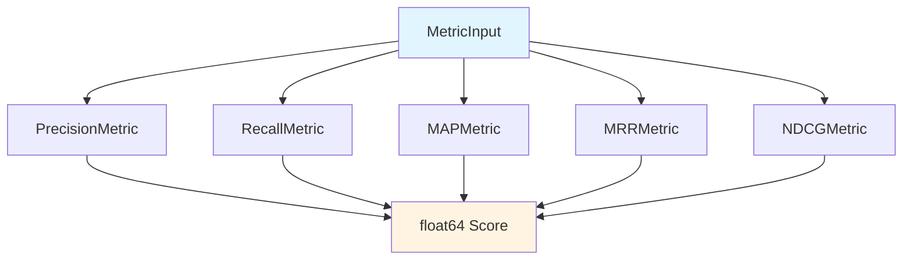

# 检索质量指标 (retrieval_quality_metrics) 模块

## 概述

当您构建一个知识检索系统时，您如何知道它是否"好"？想象一下：您有一个搜索系统，它返回 10 个结果，但用户想要的那个文档在第 8 个位置——这时候您需要一个系统来量化这种"不够好"的程度。`retrieval_quality_metrics` 模块就是这个系统的核心：它提供了一套标准化的数学指标，用于客观评估检索系统的质量。

这个模块不是一个简单的分数计算器——它是一套完整的检索质量评估工具包，包含五个业界标准的指标：
- **Precision**（精确率）：返回结果中有多少是相关的
- **Recall**（召回率）：所有相关文档中有多少被找到了
- **MAP**（Mean Average Precision）：衡量排序质量的综合指标
- **MRR**（Mean Reciprocal Rank）：第一个相关结果出现位置的倒数
- **NDCG**（Normalized Discounted Cumulative Gain）：考虑位置权重的标准化增益指标

## 架构概览

这个模块的设计极其简洁但功能强大。所有指标都遵循相同的契约模式：
1. 接收一个统一的 `MetricInput` 结构
2. 执行各自的计算逻辑
3. 返回一个 `float64` 类型的分数

这种设计使得指标可以轻松组合、替换和扩展，同时保持接口的一致性。

## 核心设计决策

### 1. 统一接口设计
**决策**：所有指标都实现相同的 `Compute(*types.MetricInput) float64` 方法签名

**为什么这样设计**：
- 符合"策略模式"（Strategy Pattern），使得指标可以在运行时动态切换
- 简化了上层调用代码，不需要为不同指标写不同的调用逻辑
- 便于添加新指标，只需实现相同接口即可

**权衡**：
- 优点：灵活性高、代码复用性好、测试容易
- 缺点：所有指标必须使用相同的输入结构，对于需要额外配置的指标（如 NDCG 的 k 值）需要通过构造函数传递

### 2. 集合优化的查找策略
**决策**：将 ground truth 转换为 map 集合进行 O(1) 复杂度的查找

**为什么这样设计**：
- 在评估大规模检索结果时，频繁的线性查找会成为性能瓶颈
- 使用 map 集合可以将相关性检查从 O(n) 降低到 O(1)
- 这是空间换时间的经典优化

**权衡**：
- 优点：计算效率大幅提升，特别是在结果集较大时
- 缺点：需要额外的内存来存储集合结构

### 3. 边界情况的优雅处理
**决策**：所有指标都显式处理空 ground truth 的情况，返回 0 而不是 panic

**为什么这样设计**：
- 防止在实际使用中因数据问题导致整个评估流程崩溃
- 遵循"防御性编程"原则
- 0 分是一个合理的默认值，表示"没有可评估的内容"

## 子模块说明

### 位置敏感的排序质量指标 (ranking_quality_position_sensitive_metrics)
这一子模块包含三个对结果顺序敏感的高级指标，专门用于评估排序质量而非仅仅相关性：

- [Mean Average Precision (MAP)](application_services_and_orchestration-evaluation_dataset_and_metric_services-retrieval_quality_metrics-ranking_quality_position_sensitive_metrics-mean_average_precision_metric.md)：综合衡量排序质量的黄金标准
- [Mean Reciprocal Rank (MRR)](application_services_and_orchestration-evaluation_dataset_and_metric_services-retrieval_quality_metrics-ranking_quality_position_sensitive_metrics-mean_reciprocal_rank_metric.md)：关注第一个相关结果的位置
- [Normalized Discounted Cumulative Gain (NDCG)](application_services_and_orchestration-evaluation_dataset_and_metric_services-retrieval_quality_metrics-ranking_quality_position_sensitive_metrics-normalized_discounted_cumulative_gain_metric.md)：考虑位置权重的标准化增益指标

### 精确率指标 (retrieval_precision_metric)
[PrecisionMetric](application_services_and_orchestration-evaluation_dataset_and_metric_services-retrieval_quality_metrics-retrieval_precision_metric.md) 计算返回结果中的相关文档比例，回答"返回的结果中有多少是用户想要的"这一问题。

### 召回率指标 (retrieval_recall_metric)
[RecallMetric](application_services_and_orchestration-evaluation_dataset_and_metric_services-retrieval_quality_metrics-retrieval_recall_metric.md) 计算所有相关文档中被找到的比例，回答"用户想要的文档中有多少被找到了"这一问题。

## 数据流程分析

### 输入数据契约
所有指标都使用相同的 `MetricInput` 结构，包含两个关键字段：
- `RetrievalGT`：二维数组，每个子数组代表一个查询的相关文档 ID 集合
- `RetrievalIDs`：一维数组，代表检索系统返回的文档 ID 排序结果

### 典型计算流程
以 `MAPMetric` 为例，完整的数据处理流程如下：

1. **数据预处理**：将 ground truth 转换为 map 集合
2. **命中标记**：遍历检索结果，标记哪些文档是相关的
3. **精度计算**：在每个相关文档位置计算精度值
4. **平均化**：将精度值平均得到 Average Precision
5. **最终均值**：对所有查询的 AP 取均值得到 MAP

## 与其他模块的依赖关系

### 上游依赖
- `core_domain_types_and_interfaces`：提供 `MetricInput` 类型定义
- `evaluation_dataset_and_metric_services`：包含指标契约和集成逻辑

### 下游使用
- `evaluation_orchestration_and_state`：使用这些指标进行完整的评估流程编排

## 新贡献者注意事项

### 1. 文档 ID 的一致性
所有指标都假设文档 ID 是 `int` 类型，并且 ground truth 和检索结果使用相同的 ID 空间。如果您的系统使用字符串 ID，需要先进行转换。

### 2. NDCG 的 k 值配置
`NDCGMetric` 是唯一一个需要在构造时配置参数的指标（`k` 值，表示只考虑前 k 个结果）。使用时请确保通过 `NewNDCGMetric(k)` 正确初始化。

### 3. Precision 和 Recall 的多查询处理
仔细查看代码会发现，`PrecisionMetric` 和 `RecallMetric` 对多查询的处理方式与其他指标略有不同。它们会累计所有查询的命中数，然后进行平均化。

### 4. 扩展新指标
如果要添加新指标，只需：
1. 创建新的结构体
2. 实现 `Compute(*types.MetricInput) float64` 方法
3. 提供相应的构造函数

不需要修改任何现有代码，这体现了"开闭原则"（Open/Closed Principle）的良好实践。
