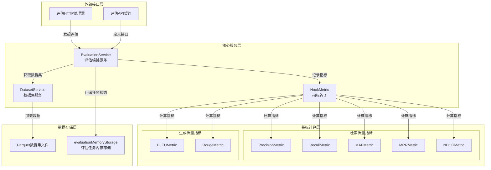

# 评估数据集与指标服务模块

## 概述

这个模块是系统的**评估实验室**，它解决了一个核心问题：如何客观、可重复地衡量知识检索系统和生成式AI模型的质量？想象一下，你需要比较不同的嵌入模型、重排策略或LLM配置，但只靠人工判断既主观又低效。这个模块提供了一套完整的基础设施，让你可以像在实验室里做实验一样，运行标准化的评估任务，计算多种质量指标，并得到可比较的结果。

从本质上讲，这个模块扮演了三个角色：
1. **数据集管理员**：加载和管理问答对数据集
2. **评估 orchestrator**：协调知识库创建、问答执行和指标计算
3. **质量裁判**：实现多种检索和生成质量指标

## 架构概览

这个架构的核心是**流水线式的评估流程**：
1. **数据准备**：`DatasetService` 从 Parquet 文件加载问答对数据集
2. **任务编排**：`EvaluationService` 创建临时知识库、执行问答管道
3. **指标收集**：`HookMetric` 在每个问答对处理后记录中间结果
4. **质量计算**：多种指标计算器从收集的数据中计算质量分数

## 核心设计决策

### 1. 基于内存的任务状态管理

**设计选择**：使用 `evaluationMemoryStorage` 在内存中存储评估任务状态，而非持久化到数据库。

**权衡分析**：
- ✅ **优点**：评估任务通常是临时的，内存存储提供极低的延迟和简单的实现
- ❌ **缺点**：服务重启会丢失所有进行中的评估任务
- **为什么这样选择**：评估任务本质上是"运行一次"的批处理作业，结果可以在完成后导出，不需要长期保存。这是一个典型的"简单优先"设计。

### 2. 并行化的问答对处理

**设计选择**：使用 `errgroup.Group` 并行处理多个问答对，工作线程数限制为 `runtime.GOMAXPROCS(0)-1`。

**权衡分析**：
- ✅ **优点**：充分利用多核CPU，大幅缩短评估时间
- ❌ **缺点**：增加了并发复杂性，需要仔细管理共享状态
- **为什么这样选择**：评估是计算密集型任务，且各问答对之间完全独立，是并行化的理想场景。保留一个核心给系统其他任务使用，避免CPU耗尽。

### 3. 临时知识库的创建与清理

**设计选择**：每次评估都创建新的临时知识库，评估完成后自动清理。

**权衡分析**：
- ✅ **优点**：确保评估的隔离性和可重复性，不会污染生产数据
- ❌ **缺点**：增加了评估的开销，尤其是对于大型数据集
- **为什么这样选择**：评估的科学性要求严格隔离，一次性使用的知识库是最可靠的方式。这是"正确性优先于性能"的设计。

### 4. 指标钩子模式

**设计选择**：使用 `HookMetric` 作为指标收集的中央协调者，而非直接在评估流程中计算指标。

**权衡分析**：
- ✅ **优点**：将指标收集与评估流程解耦，易于添加新指标
- ❌ **缺点**：增加了一层抽象，需要更多内存来存储中间结果
- **为什么这样选择**：指标会不断演进和扩展，解耦设计让系统可以灵活地适应新的评估需求。

## 子模块概览

### 数据集建模与服务
负责数据集的加载、解析和访问。它理解Parquet格式的数据集文件，并将其转换为内存中的问答对结构。

[查看详情](application_services_and_orchestration-evaluation_dataset_and_metric_services-dataset_modeling_and_service.md)

### 评估编排与状态
负责协调整个评估流程，从任务创建到执行再到结果收集。它是模块的"大脑"，管理着评估任务的生命周期。

[查看详情](application_services_and_orchestration-evaluation_dataset_and_metric_services-evaluation_orchestration_and_state.md)

### 检索质量指标
实现了多种用于衡量检索系统质量的指标，包括Precision、Recall、MAP、MRR和NDCG。这些指标从不同角度评估检索结果的相关性和排序质量。

[查看详情](application_services_and_orchestration-evaluation_dataset_and_metric_services-retrieval_quality_metrics.md)

### 生成文本重叠指标
实现了BLEU和ROUGE指标，用于衡量生成文本与参考文本之间的重叠程度。这些指标常用于机器翻译和文本摘要任务的评估。

[查看详情](application_services_and_orchestration-evaluation_dataset_and_metric_services-generation_text_overlap_metrics.md)

### 指标挂钩与指标集契约
定义了指标收集的钩子机制和指标集的契约。它将各种指标计算器组合在一起，提供统一的指标计算接口。

[查看详情](application_services_and_orchestration-evaluation_dataset_and_metric_services-metric_hooking_and_metric_set_contracts.md)

## 跨模块依赖

这个模块在系统中处于**消费端**的位置，它依赖多个核心服务来完成工作：

1. **知识库服务** ([knowledge_base_lifecycle_management](application_services_and_orchestration-knowledge_ingestion_extraction_and_graph_services-knowledge_base_lifecycle_management.md))：用于创建和删除临时知识库
2. **知识服务** ([knowledge_ingestion_orchestration](application_services_and_orchestration-knowledge_ingestion_extraction_and_graph_services-knowledge_ingestion_orchestration.md))：用于从段落创建知识
3. **会话服务** ([session_conversation_lifecycle_service](application_services_and_orchestration-conversation_context_and_memory_services-session_conversation_lifecycle_service.md))：用于执行知识问答
4. **模型服务** ([model_catalog_configuration_services](application_services_and_orchestration-agent_identity_tenant_and_configuration_services-model_and_tag_configuration_services.md))：用于获取默认模型配置

同时，它被 **HTTP处理器层** ([evaluation_endpoint_handler](http_handlers_and_routing-evaluation_and_web_search_handlers.md)) 调用，提供评估功能的API入口。

## 关键数据流程

让我们追踪一个完整的评估任务的数据流动：

1. **任务初始化**：用户调用 `EvaluationService.Evaluation()`，提供数据集ID、知识库ID、聊天模型ID和重排模型ID
2. **资源准备**：
   - 如果没有提供知识库ID，创建一个新的临时知识库
   - 从模型服务获取默认模型配置
   - 生成唯一的任务ID并注册到内存存储
3. **后台执行**：启动goroutine执行实际评估
   - `EvalDataset()` 从 `DatasetService` 获取数据集
   - 从数据集中提取所有段落，创建知识
   - 使用 `errgroup` 并行处理每个问答对：
     - 为每个问答对创建独立的 `ChatManage` 配置
     - 调用 `sessionService.KnowledgeQAByEvent()` 执行问答
     - 使用 `HookMetric` 记录搜索结果、重排结果和聊天响应
4. **指标计算**：`HookMetric` 在每个问答对完成后计算指标，并在所有问答对完成后聚合结果
5. **资源清理**：删除临时知识和知识库
6. **结果返回**：用户可以通过 `EvaluationResult()` 查询任务状态和最终指标

## 新贡献者指南

### 注意事项

1. **数据集路径**：默认数据集路径硬编码为 `./dataset/samples`，确保这个目录存在或修改 `DefaultDataset()` 函数
2. **Parquet格式**：数据集必须以特定的Parquet文件结构存在（queries.parquet, corpus.parquet, answers.parquet, qrels.parquet, qas.parquet）
3. **并发安全**：`HookMetric` 使用了读写锁，但在自定义指标时仍需注意并发访问问题
4. **错误处理**：评估任务在后台goroutine中运行，错误会被记录到任务状态而非直接返回给调用者
5. **租户隔离**：评估任务与租户ID绑定，查询结果时会验证租户ID匹配

### 扩展点

1. **添加新指标**：在 `metricCalculators` 切片中添加新的指标计算器和对应的字段访问器
2. **自定义数据集加载**：实现 `interfaces.DatasetService` 接口以支持不同的数据源
3. **指标权重配置**：修改 `metricCalculators` 中的指标初始化参数（如BLEU的权重、NDCG的k值）
4. **持久化评估任务**：替换 `evaluationMemoryStorage` 为数据库实现以支持任务持久化

### 常见陷阱

1. **忘记清理资源**：确保在评估完成后总是清理临时知识库和知识，否则会造成数据堆积
2. **忽略并发限制**：修改工作线程数时要小心，过多的并发可能导致资源耗尽
3. **指标解释错误**：不同的指标有不同的含义和适用场景，不要盲目比较不同指标的值
4. **数据集兼容性**：确保你的数据集与 `QAPair` 结构兼容，特别是PID和AID的映射关系
