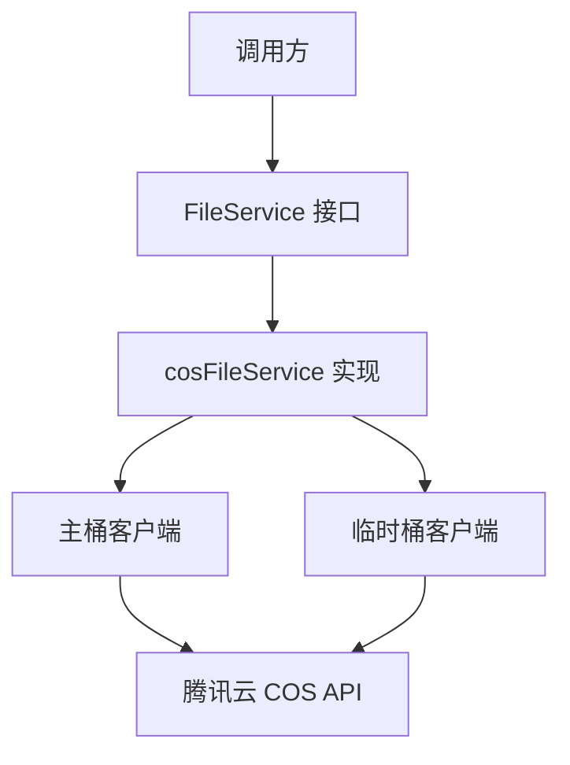

# COS 对象存储提供商服务技术深度剖析

## 1. 问题与解决方案

**核心问题**：在多租户系统中，需要一个统一的文件存储服务接口，能够同时支持持久化文件存储和临时文件管理，并且需要能够与腾讯云对象存储（COS）进行无缝集成。

**为什么需要这个模块**：
- 系统需要处理多种类型的文件：知识库文档、临时导出文件等
- 不同文件有不同的生命周期要求：持久存储 vs 自动过期
- 需要提供统一的接口，屏蔽底层存储实现细节
- 多租户场景下需要确保文件隔离和路径管理

**设计洞察**：
该模块采用了双桶策略——主桶用于持久存储，临时桶（可选配置）用于存放需要自动过期的临时文件。通过统一的接口，既简化了调用方的使用，又实现了灵活的文件生命周期管理。

## 2. 架构与数据流程

### 架构设计



### 组件说明

**核心组件**：
- `cosFileService`：实现 FileService 接口的主结构，维护主桶和可选的临时桶客户端
- `NewCosFileService`：基础工厂方法，仅创建主桶客户端
- `NewCosFileServiceWithTempBucket`：增强工厂方法，支持同时配置主桶和临时桶

### 数据流程

#### 2.1 持久化文件存储流程
1. 调用 `SaveFile` 或 `SaveBytes(temp=false)`
2. 根据配置的路径前缀、租户ID和知识ID构建对象存储路径
3. 生成唯一文件名（UUID + 原始扩展名）
4. 通过主桶客户端上传到腾讯云 COS
5. 返回完整的文件访问 URL

#### 2.2 临时文件存储流程
1. 调用 `SaveBytes(temp=true)` 且已配置临时桶
2. 在临时桶中构建路径：`exports/{tenantID}/{uuid}.{ext}`
3. 通过临时桶客户端上传到腾讯云 COS
4. 返回临时桶中的文件访问 URL

#### 2.3 文件获取与签名 URL 流程
1. 根据文件 URL 前缀判断文件所属的桶（主桶或临时桶）
2. 从对应桶中获取文件内容或生成预签名 URL
3. 预签名 URL 默认有效期为 24 小时

## 3. 核心组件深度解析

### 3.1 cosFileService 结构

```go
type cosFileService struct {
    client        *cos.Client
    bucketURL     string
    cosPathPrefix string
    tempClient    *cos.Client
    tempBucketURL string
}
```

**设计意图**：
- `client`/`bucketURL`：主存储桶，用于存放需要持久保存的文件
- `tempClient`/`tempBucketURL`：临时存储桶（可选），用于存放自动过期的文件
- `cosPathPrefix`：主桶路径前缀，用于在同一桶中隔离不同应用或环境的数据

**关键设计决策**：
临时桶设计是一个亮点——它将文件生命周期管理的责任下放到存储层，通过 COS 的生命周期规则实现自动清理，而无需在应用层维护清理任务。

### 3.2 SaveFile 方法

```go
func (s *cosFileService) SaveFile(ctx context.Context,
    file *multipart.FileHeader, tenantID uint64, knowledgeID string,
) (string, error)
```

**功能**：保存上传的文件到主存储桶

**路径组织策略**：`{cosPathPrefix}/{tenantID}/{knowledgeID}/{uuid}.{ext}`

**设计理由**：
- 按租户ID隔离：确保多租户数据隔离
- 按知识ID组织：便于批量管理和清理某个知识库的所有文件
- UUID 文件名：避免文件名冲突，同时保留原始扩展名以维持文件类型识别

### 3.3 SaveBytes 方法

```go
func (s *cosFileService) SaveBytes(ctx context.Context, 
    data []byte, tenantID uint64, fileName string, temp bool) (string, error)
```

**功能**：保存字节数据到 COS，支持选择存储位置

**双桶路由逻辑**：
- `temp=true` 且 `tempClient != nil` → 临时桶
- 其他情况 → 主桶

**临时桶路径**：`exports/{tenantID}/{uuid}.{ext}`
**主桶路径**：`{cosPathPrefix}/{tenantID}/exports/{uuid}.{ext}`

**设计考虑**：
临时桶路径不使用 `cosPathPrefix`，暗示临时桶通常是专用于临时文件的独立桶，不需要额外的前缀隔离。

### 3.4 GetFileURL 方法

```go
func (s *cosFileService) GetFileURL(ctx context.Context, filePath string) (string, error)
```

**功能**：生成预签名下载 URL，有效期 24 小时

**智能桶识别**：通过检查 `filePath` 的前缀来判断文件所在的桶，从而选择正确的客户端生成签名 URL。

**设计亮点**：这种设计使得调用方无需关心文件具体在哪个桶中，只需持有返回的文件 URL，即可统一处理。

## 4. 依赖关系分析

### 4.1 核心依赖

**外部依赖**：
- `github.com/tencentyun/cos-go-sdk-v5`：腾讯云 COS SDK，提供底层存储能力
- `github.com/google/uuid`：生成唯一文件名

**内部依赖**：
- `interfaces.FileService`：定义文件服务的通用接口，使存储实现可替换

### 4.2 与其他模块的关系

**调用关系**：
- 被知识库管理服务调用，用于存储文档和相关文件
- 被导出服务调用，用于临时存放导出结果
- 被文件访问 API 调用，用于获取文件内容和生成下载链接

**数据契约**：
- 输入：`multipart.FileHeader` 或 `[]byte`
- 输出：完整的 COS 文件 URL（作为后续操作的标识）
- 预签名 URL：用于临时授权访问，避免暴露永久访问凭证

## 5. 设计决策与权衡

### 5.1 双桶策略 vs 单桶生命周期规则

**选择**：双桶策略（主桶 + 可选临时桶）

**理由**：
- 灵活性：可以选择是否使用临时桶，适配不同部署环境
- 权限隔离：临时文件和持久文件可以有不同的访问权限策略
- 性能隔离：临时文件的访问模式可能与持久文件不同，分开存储避免相互影响

**权衡**：
- 增加了配置复杂度
- 需要维护两套客户端和连接
- 临时桶不可用时，会降级到主桶存储

### 5.2 URL 作为文件标识 vs 内部存储路径

**选择**：返回完整 URL 作为文件标识

**理由**：
- 调用方可以直接使用 URL 进行访问（虽然实际访问通常仍通过预签名 URL）
- 便于追踪和日志记录
- 简化了后续操作，无需额外转换

**权衡**：
- 如果桶域名变更，所有存储的 URL 都会失效
- URL 较长，存储时占用更多空间
- 暴露了底层存储的实现细节

### 5.3 路径组织策略

**选择**：按 `{prefix}/{tenant}/{knowledge}/{file}` 组织

**理由**：
- 租户级隔离是多租户系统的基本要求
- 按知识库组织便于批量操作（如删除整个知识库时清理所有相关文件）
- 分层结构使得权限管理和生命周期规则配置更精细

**权衡**：
- 路径较长
- 如果知识ID变更，无法简单地重命名路径（需要移动文件）

## 6. 使用与最佳实践

### 6.1 初始化

**基础使用（仅主桶）**：
```go
fileService, err := file.NewCosFileService(
    "my-bucket",
    "ap-guangzhou",
    "secret-id",
    "secret-key",
    "my-app-files",
)
```

**增强使用（主桶 + 临时桶）**：
```go
fileService, err := file.NewCosFileServiceWithTempBucket(
    "my-bucket",
    "ap-guangzhou",
    "secret-id",
    "secret-key",
    "my-app-files",
    "my-temp-bucket",
    "ap-guangzhou",
)
```

### 6.2 文件操作

**保存上传的文件**：
```go
fileURL, err := fileService.SaveFile(ctx, fileHeader, tenantID, knowledgeID)
```

**保存字节数据作为持久文件**：
```go
fileURL, err := fileService.SaveBytes(ctx, data, tenantID, "report.pdf", false)
```

**保存字节数据作为临时文件**：
```go
fileURL, err := fileService.SaveBytes(ctx, data, tenantID, "export.csv", true)
```

**获取文件内容**：
```go
reader, err := fileService.GetFile(ctx, fileURL)
```

**生成预签名下载链接**：
```go
downloadURL, err := fileService.GetFileURL(ctx, fileURL)
```

**删除文件**：
```go
err := fileService.DeleteFile(ctx, fileURL)
```

## 7. 注意事项与常见陷阱

### 7.1 临时桶配置

**重要**：临时桶需要在 COS 控制台配置生命周期规则，才能实现自动过期功能。代码本身只负责写入，不负责清理。

**建议配置**：
- 创建专门的临时桶
- 配置生命周期规则，例如 7 天后自动删除
- 使用独立的权限策略，限制临时桶的访问范围

### 7.2 URL 前缀匹配

**潜在问题**：`GetFile`、`DeleteFile` 和 `GetFileURL` 方法通过 URL 前缀来判断文件所在的桶。如果主桶和临时桶的 URL 有包含关系，可能会导致错误的判断。

**示例**：
- 主桶：`https://main-bucket.cos.ap-guangzhou.tencentcos.cn/`
- 临时桶：`https://main-bucket-temp.cos.ap-guangzhou.tencentcos.cn/`

这种情况下不会有问题，但如果临时桶 URL 是 `https://main-bucket.temp.cos.ap-guangzhou.tencentcos.cn/`，那么前缀匹配时可能会误判。

### 7.3 错误处理

**重要**：所有方法都返回 `error`，调用方必须妥善处理。特别是网络错误、权限错误等，需要考虑重试逻辑和降级策略。

**常见错误**：
- 认证失败：检查 SecretID 和 SecretKey 是否正确
- 权限不足：确保账号有 COS 的读写权限
- 桶不存在：确认桶名称和区域配置正确
- 网络问题：考虑实现重试机制

### 7.4 上下文传递

**注意**：所有方法都接受 `context.Context` 参数，用于控制超时和取消。调用方应该传入适当的上下文，避免长时间阻塞。

### 7.5 文件名处理

**当前实现**：只保留原始文件的扩展名，文件名部分替换为 UUID。这样可以避免文件名冲突，但会丢失原始文件名信息。

**如果需要保留原始文件名**：可以考虑在路径中加入原始文件名的编码版本，或者在元数据中存储原始文件名。

## 8. 参考资料

- 腾讯云 COS SDK 文档：https://github.com/tencentyun/cos-go-sdk-v5
- FileService 接口定义：查看 [core_domain_types_and_interfaces](core_domain_types_and_interfaces.md)
- 其他存储提供商实现：
  - [minio_object_storage_provider_service](application_services_and_orchestration-file_storage_provider_services-cloud_object_storage_provider_services-minio_object_storage_provider_service.md)
  - [tos_object_storage_provider_service](application_services_and_orchestration-file_storage_provider_services-cloud_object_storage_provider_services-tos_object_storage_provider_service.md)
