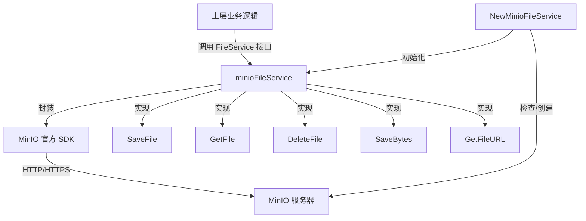

# MinIO 对象存储服务技术深度解析

## 1. 模块概述

在现代知识管理系统中，文件存储是基础设施的核心组件。`minio_object_storage_provider_service` 模块的存在是为了解决一个关键问题：如何以统一、可插拔的方式，将 MinIO 这一开源对象存储系统集成到我们的平台中，同时保持与其他存储提供商（如 TOS、COS 等）的接口一致性。

想象一下这个场景：系统需要支持多种云存储方案，但上层业务逻辑不应该关心文件到底存放在哪里。这就需要一个适配器层，将不同存储提供商的 API 转换为统一的 `FileService` 接口。本模块正是这样一个适配器——它将 MinIO 的对象存储能力封装起来，为整个系统提供文件上传、下载、删除和临时 URL 生成等核心功能。

## 2. 核心抽象与架构

### 2.1 核心组件

```go
type minioFileService struct {
    client     *minio.Client
    bucketName string
}
```

这个简单的结构体是整个模块的核心，它持有两个关键依赖：
- **MinIO 客户端**：与 MinIO 服务器交互的底层连接
- **桶名称**：所有文件操作的目标存储桶

### 2.2 架构图



### 2.3 设计理念

这个模块采用了**适配器模式**（Adapter Pattern），将 MinIO 的特定 API 转换为系统通用的 `FileService` 接口。这样做的好处是：
- **解耦**：上层业务逻辑不依赖具体的存储实现
- **可替换**：可以轻松切换到其他存储提供商而无需修改上层代码
- **单一职责**：该模块只负责与 MinIO 交互，不包含业务逻辑

## 3. 核心功能详解

### 3.1 服务初始化：`NewMinioFileService`

这是模块的入口点，它不仅仅是创建一个结构体实例，还包含了重要的初始化逻辑：

1. **客户端创建**：使用提供的凭证和端点初始化 MinIO 客户端
2. **桶验证**：检查指定的存储桶是否存在
3. **桶创建**：如果桶不存在，则自动创建它

**设计亮点**：这种"确保资源存在"的模式在初始化时执行，避免了在每次操作时都进行检查，提高了运行时效率。但这也意味着如果桶在运行时被删除，后续操作会失败——这是一个需要注意的权衡。

### 3.2 文件保存：`SaveFile`

该方法处理 Multipart 表单文件的上传，其核心流程如下：

1. **路径生成**：使用 `tenantID/knowledgeID/uuid.ext` 的格式生成对象名称
2. **文件打开**：从 Multipart 头中打开文件流
3. **上传执行**：调用 MinIO SDK 的 `PutObject` 方法
4. **路径返回**：返回 `minio://bucketName/objectName` 格式的统一路径

**关键设计决策**：
- 使用 UUID 作为文件名避免了冲突，但也意味着原始文件名丢失（只保留扩展名）
- 路径中包含 tenantID 和 knowledgeID，这为后续的权限控制和资源组织提供了基础
- 返回的是统一格式的 URI，而不是 MinIO 特定的 URL，这保持了接口的通用性

### 3.3 文件获取：`GetFile`

该方法通过统一路径格式检索文件：

1. **路径解析**：从 `minio://bucketName/objectName` 中提取对象名称
2. **对象获取**：调用 MinIO SDK 的 `GetObject` 方法
3. **流返回**：直接返回 `io.ReadCloser`，允许调用者流式处理文件内容

**值得注意的实现细节**：
- 路径解析逻辑假设 bucketName 是当前服务实例的 bucketName，这意味着如果你有一个指向其他 bucket 的路径，这个方法会失败
- 没有对对象存在性进行额外检查，直接将 MinIO SDK 的错误透传

### 3.4 文件删除：`DeleteFile`

删除文件的实现相对直接，但有一个重要的细节：

```go
err := s.client.RemoveObject(ctx, s.bucketName, objectName, minio.RemoveObjectOptions{
    GovernanceBypass: true,
})
```

**设计决策**：设置 `GovernanceBypass: true` 意味着即使文件有治理模式的保留策略，也会被删除。这是一个偏向于操作便利性的选择，但在某些合规场景下可能需要重新考虑。

### 3.5 字节保存：`SaveBytes`

这个方法处理直接从字节数据创建文件的场景，主要用于导出功能：

1. **路径生成**：使用 `tenantID/exports/uuid.ext` 的格式
2. **内容上传**：将字节包装为 `io.Reader` 并上传
3. **Content-Type**：硬编码为 `text/csv; charset=utf-8`

**注意**：方法注释中明确说明 `temp` 参数被忽略——这是一个接口兼容性的设计，MinIO 实现不支持自动过期的临时文件。

### 3.6 临时 URL 生成：`GetFileURL`

该方法生成一个有时限的预签名 URL，允许在不暴露凭证的情况下访问文件：

1. **路径解析**：与 `GetFile` 相同的解析逻辑
2. **URL 生成**：使用 MinIO SDK 的 `PresignedGetObject` 方法
3. **有效期**：硬编码为 24 小时

**设计权衡**：24 小时的有效期是在便利性和安全性之间的平衡——足够长以完成大多数下载任务，但又不会让 URL 永久有效。

## 4. 依赖关系分析

### 4.1 依赖的模块

- **`core_domain_types_and_interfaces`**：依赖 `interfaces.FileService` 接口定义
- **MinIO 官方 SDK**：使用 `github.com/minio/minio-go/v7` 进行底层交互
- **UUID 生成库**：使用 `github.com/google/uuid` 生成唯一文件名

### 4.2 被依赖的模块

该模块被上层的文件存储编排模块调用，作为多种存储提供商实现之一。

### 4.3 数据契约

**输入契约**：
- `multipart.FileHeader`：用于文件上传
- `[]byte`：用于直接字节数据保存
- 统一格式的路径：`minio://bucketName/objectName`

**输出契约**：
- 统一格式的路径：`minio://bucketName/objectName`
- `io.ReadCloser`：用于文件读取
- 预签名 URL：用于临时访问

## 5. 设计决策与权衡

### 5.1 路径格式的选择

**决策**：使用 `minio://bucketName/objectName` 作为统一路径格式

**原因**：
- 自描述性：路径本身就说明了存储提供商和位置
- 一致性：与其他存储提供商（如 `tos://`、`cos://`）保持相同的模式
- 可解析性：简单的字符串操作即可提取所需信息

**权衡**：这种格式不是标准 URI，需要自定义解析逻辑，且与 MinIO 自身的 S3 兼容 API 格式不同。

### 5.2 初始化时创建桶

**决策**：在服务创建时检查并创建桶

**优点**：
- 一次检查，终身受益：避免了每次操作时的检查开销
- 自动配置：简化了部署流程，无需手动创建桶

**缺点**：
- 权限要求：服务启动时需要有创建桶的权限
- 错误提前：如果桶创建失败，整个服务无法启动，而不是在第一次使用时失败

### 5.3 忽略 temp 参数

**决策**：在 `SaveBytes` 方法中忽略 temp 参数

**原因**：
- 接口一致性：保持与 `FileService` 接口的兼容
- 实现简化：MinIO 的自动过期功能需要额外的配置和管理

**权衡**：这意味着调用者如果依赖临时文件的自动清理功能，会感到意外。需要在文档中明确说明这一限制。

### 5.4 硬编码的 Content-Type 和有效期

**决策**：在 `SaveBytes` 中硬编码 Content-Type，在 `GetFileURL` 中硬编码有效期

**优点**：
- 简单性：减少了参数数量，简化了接口
- 满足主要场景：当前主要用于 CSV 导出，24 小时有效期通常足够

**缺点**：
- 灵活性不足：如果需要保存其他类型的文件或使用不同的有效期，就需要修改代码
- 可配置性差：这些值不能通过配置调整

## 6. 使用指南与注意事项

### 6.1 基本使用

```go
// 创建服务实例
fileService, err := NewMinioFileService(
    "minio.example.com:9000",
    "accessKey",
    "secretKey",
    "my-bucket",
    true, // useSSL
)
if err != nil {
    // 处理错误
}

// 保存文件
path, err := fileService.SaveFile(ctx, fileHeader, tenantID, knowledgeID)

// 获取文件
reader, err := fileService.GetFile(ctx, path)

// 生成临时 URL
url, err := fileService.GetFileURL(ctx, path)
```

### 6.2 配置选项

虽然当前实现中没有暴露配置选项，但以下参数是初始化时必需的：
- **endpoint**：MinIO 服务器地址，包含端口
- **accessKeyID**：访问密钥 ID
- **secretAccessKey**：秘密访问密钥
- **bucketName**：存储桶名称
- **useSSL**：是否使用 SSL 连接

### 6.3 常见陷阱与注意事项

1. **路径依赖**：`GetFile`、`DeleteFile` 和 `GetFileURL` 方法假设路径指向的是当前实例的 bucket。如果你有一个指向其他 bucket 的路径，这些方法会失败。

2. **临时文件不临时**：`SaveBytes` 方法的 `temp` 参数被忽略，文件不会自动过期。如果你需要临时文件，需要自己实现清理逻辑。

3. **Content-Type 限制**：`SaveBytes` 硬编码了 Content-Type 为 CSV。如果你需要保存其他类型的文件，这个方法不适用。

4. **错误处理**：所有方法都将底层 MinIO SDK 的错误透传，调用者需要准备处理 MinIO 特定的错误（如网络错误、权限错误等）。

5. **并发安全**：MinIO 客户端本身是并发安全的，所以 `minioFileService` 的实例可以在多个 goroutine 中安全使用。

6. **桶删除风险**：如果在服务运行时桶被删除，后续操作会失败。没有自动恢复机制。

## 7. 总结

`minio_object_storage_provider_service` 模块是一个清晰、聚焦的适配器实现，它将 MinIO 对象存储能力封装为系统通用的 `FileService` 接口。其设计简洁明了，优先考虑了接口一致性和易用性，在某些地方做了灵活性的妥协。

对于新加入团队的开发者来说，理解这个模块的关键在于认识到它在整个系统中的"适配器"角色——它不是业务逻辑的一部分，而是基础设施的一层，负责将特定的存储技术转换为系统通用的抽象。

当你需要修改或扩展这个模块时，请记住：保持接口的一致性是首要原则，任何改动都不应该破坏上层业务逻辑与存储实现之间的解耦。
