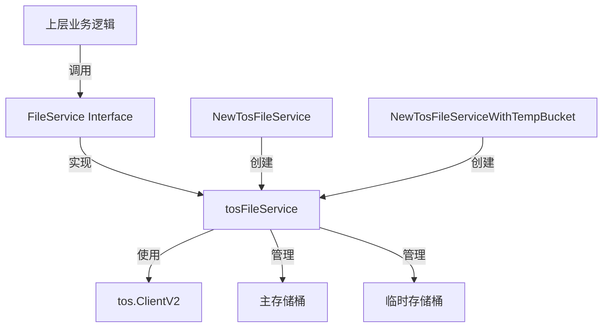

# tos_object_storage_provider_service 技术深度解析

## 1. 模块概述

`tos_object_storage_provider_service` 模块是一个专门为火山引擎对象存储服务（TOS）设计的文件存储适配器，它实现了通用的文件存储接口，为上层应用提供透明的文件存储能力。

### 问题背景

在构建企业级应用时，文件存储是一个基础需求。直接使用云服务商的SDK会导致代码与特定云服务强耦合，增加了切换云服务、本地开发和测试的难度。同时，文件存储操作需要处理诸如路径管理、权限控制、临时文件隔离等常见问题，这些逻辑如果散落在业务代码中会导致代码重复和维护困难。

### 设计洞察

该模块采用**适配器模式**，将火山引擎TOS的具体实现细节封装在通用的 `FileService` 接口之后。这种设计允许上层应用代码依赖抽象接口而非具体实现，同时通过构造函数注入配置的方式保持了灵活性。

## 2. 架构设计



### 核心组件角色

1. **tosFileService**: 核心实现类，封装了所有与TOS交互的逻辑
2. **tos.ClientV2**: 火山引擎TOS SDK提供的客户端，负责实际的API调用
3. **主存储桶**: 用于持久化存储文件的主要存储空间
4. **临时存储桶**: 可选的临时文件存储空间，用于存放短期有效的文件
5. **构造函数**: 负责初始化客户端、确保存储桶存在、配置路径前缀等

### 数据流向

以文件上传为例，数据流路径如下：
1. 上层应用调用 `SaveFile` 或 `SaveBytes` 方法
2. `tosFileService` 生成对象键（Object Key）
3. 通过 `tos.ClientV2` 调用TOS API上传文件
4. 返回标准化的 `tos://bucket/object` 格式路径

## 3. 核心组件深度解析

### tosFileService 结构体

```go
type tosFileService struct {
    client         *tos.ClientV2
    pathPrefix     string
    bucketName     string
    tempBucketName string
}
```

**设计意图**：
- `client`: 持有TOS客户端实例，避免重复初始化
- `pathPrefix`: 统一的路径前缀，用于在存储桶中划分命名空间，类似文件系统的根目录
- `bucketName`: 主存储桶名称
- `tempBucketName`: 可选的临时存储桶名称，提供临时文件隔离能力

**关键设计决策**：
- 所有字段都是私有的，通过构造函数初始化，保证了不可变性
- 不直接暴露TOS客户端，防止绕过封装直接操作

### NewTosFileService 构造函数

```go
func NewTosFileService(endpoint, region, accessKey, secretKey, bucketName, pathPrefix string) (interfaces.FileService, error)
```

**功能**：创建基础的TOS文件服务实例，只配置主存储桶。

**设计意图**：
- 提供简化的构造函数，满足大多数场景的需求
- 返回接口类型而非具体实现，符合"面向接口编程"的原则
- 参数设计反映了TOS客户端的核心配置需求

### NewTosFileServiceWithTempBucket 构造函数

```go
func NewTosFileServiceWithTempBucket(endpoint, region, accessKey, secretKey, bucketName, pathPrefix, tempBucketName, tempRegion string) (interfaces.FileService, error)
```

**功能**：创建支持临时存储桶的TOS文件服务实例。

**设计亮点**：
- 临时存储桶可以与主存储桶位于不同的区域（region），这是一个重要的灵活性设计
- 为临时存储桶创建独立的客户端实例，确保跨区域操作的正确性
- 临时存储桶是可选的，当 `tempBucketName` 为空时跳过相关初始化

**内部机制**：
当配置了临时存储桶时，函数会：
1. 创建一个使用临时区域的独立客户端
2. 确保临时存储桶存在
3. 将临时存储桶名称保存到服务实例中

### ensureTOSBucket 函数

```go
func ensureTOSBucket(client *tos.ClientV2, bucketName string) error
```

**功能**：确保指定的存储桶存在，不存在则创建。

**设计意图**：
- 实现"基础设施即代码"的理念，应用可以自动准备所需的存储资源
- 处理了并发创建的竞态条件（409 Conflict错误）
- 采用幂等设计，多次调用不会产生副作用

**错误处理策略**：
- 404错误：存储桶不存在，尝试创建
- 409错误：存储桶已被其他进程创建，视为成功
- 其他错误：直接返回，让上层处理

### joinTOSObjectKey 函数

```go
func joinTOSObjectKey(parts ...string) string
```

**功能**：安全地拼接对象键的各个部分。

**设计意图**：
- 规范化路径格式，去除多余的斜杠
- 过滤空字符串部分，避免生成无效的对象键
- 类似 `filepath.Join`，但专为对象存储设计

**实现细节**：
- 遍历所有部分，去除首尾斜杠
- 只保留非空部分
- 用单个斜杠连接所有有效部分

### parseTOSFilePath 函数

```go
func parseTOSFilePath(filePath string) (bucketName string, objectKey string, err error)
```

**功能**：解析 `tos://bucket/object` 格式的文件路径。

**设计意图**：
- 提供统一的路径解析逻辑，避免在各个方法中重复
- 验证路径格式，提前发现错误
- 将路径分解为存储桶名称和对象键两部分

**契约**：
- 输入路径必须以 `tos://` 开头
- 路径必须包含存储桶名称和对象键两部分
- 任何部分都不能为空

### SaveFile 方法

```go
func (s *tosFileService) SaveFile(ctx context.Context, file *multipart.FileHeader, tenantID uint64, knowledgeID string) (string, error)
```

**功能**：上传HTTP multipart文件到TOS。

**设计意图**：
- 针对Web应用场景，直接处理 `multipart.FileHeader`
- 使用租户ID和知识ID组织文件结构，实现多租户数据隔离
- 自动生成UUID文件名，避免文件名冲突

**路径结构**：
```
{pathPrefix}/{tenantID}/{knowledgeID}/{uuid}.{ext}
```

**内容类型处理**：
- 直接从HTTP头获取 `Content-Type` 并传递给TOS

### SaveBytes 方法

```go
func (s *tosFileService) SaveBytes(ctx context.Context, data []byte, tenantID uint64, fileName string, temp bool) (string, error)
```

**功能**：上传字节数组到TOS，支持临时文件模式。

**设计亮点**：
- 支持 `temp` 参数，可以选择将文件保存到临时存储桶
- 临时文件有独立的路径结构，不与持久化文件混合
- 固定设置内容类型为 `text/csv; charset=utf-8`，表明这是为导出场景设计的

**路径策略**：
- 持久化文件：`{pathPrefix}/{tenantID}/exports/{uuid}.{ext}`
- 临时文件：`exports/{tenantID}/{uuid}.{ext}`（在临时存储桶中）

### GetFile 方法

```go
func (s *tosFileService) GetFile(ctx context.Context, filePath string) (io.ReadCloser, error)
```

**功能**：从TOS获取文件内容。

**设计意图**：
- 返回 `io.ReadCloser` 接口，支持流式读取大文件
- 调用者负责关闭返回的读取器，避免资源泄漏
- 不限制文件大小，由底层TOS客户端处理

### DeleteFile 方法

```go
func (s *tosFileService) DeleteFile(ctx context.Context, filePath string) error
```

**功能**：从TOS删除文件。

**设计意图**：
- 接受 `tos://` 格式的路径，保持接口一致性
- 删除操作是幂等的，删除不存在的文件不会报错（取决于TOS SDK行为）

### GetFileURL 方法

```go
func (s *tosFileService) GetFileURL(ctx context.Context, filePath string) (string, error)
```

**功能**：生成文件的预签名URL。

**设计亮点**：
- 生成的URL有效期为24小时，平衡了便利性和安全性
- 使用GET方法，适合直接在浏览器中访问
- 不依赖特定的区域或存储桶配置，通过路径解析确定目标

## 4. 依赖分析

### 依赖的模块

1. **github.com/volcengine/ve-tos-golang-sdk/v2/tos**: 火山引擎TOS官方SDK，提供所有底层存储操作
2. **github.com/google/uuid**: 用于生成唯一文件名
3. **interfaces**: 定义了 `FileService` 接口，是本模块的契约

### 被依赖关系

本模块实现了 `interfaces.FileService` 接口，上层应用通过该接口使用文件存储能力，具体依赖关系需要参考接口定义模块的文档。

### 数据契约

- **输入路径**：必须是 `tos://bucket/object` 格式
- **输出路径**：返回 `tos://bucket/object` 格式的统一资源标识符
- **文件内容**：通过 `io.ReadCloser` 流式处理，不假设文件大小

## 5. 设计决策与权衡

### 设计模式选择

**适配器模式**：
- 选择理由：将外部系统（TOS）的接口转换为应用内部期望的接口
- 权衡：增加了一层抽象，但提高了系统的可替换性

**构造函数注入**：
- 选择理由：显式声明依赖，便于测试和配置
- 权衡：构造函数参数较多，但提高了代码的可维护性

### 架构权衡

**单客户端 vs 双客户端**：
- 决策：当配置临时存储桶且位于不同区域时，创建两个独立的客户端
- 理由：TOS客户端绑定到特定区域，跨区域操作需要独立客户端
- 权衡：增加了资源占用，但确保了跨区域操作的正确性

**自动创建存储桶**：
- 决策：在初始化时自动确保存储桶存在
- 理由：简化部署流程，减少手动配置步骤
- 权衡：需要存储桶创建权限，可能在权限严格的环境中失败

### 路径设计决策

**统一路径前缀**：
- 决策：所有文件都带有配置的路径前缀
- 理由：便于在共享存储桶中划分命名空间
- 权衡：增加了路径长度，但提高了组织性

**租户隔离**：
- 决策：在路径中包含租户ID
- 理由：实现多租户数据隔离，便于后续的数据管理
- 权衡：路径结构更复杂，但安全性和可管理性更高

### 临时文件策略

**独立存储桶**：
- 决策：临时文件可以存储在独立的存储桶中
- 理由：便于设置不同的生命周期策略，自动清理临时文件
- 权衡：增加了配置复杂度，但降低了存储成本

**不同路径结构**：
- 决策：临时文件使用不同的路径结构
- 理由：明确区分临时文件和持久化文件
- 权衡：需要维护两套路径逻辑，但提高了可理解性

## 6. 使用指南与示例

### 基本使用

```go
// 创建基础TOS文件服务
fileService, err := file.NewTosFileService(
    "https://tos-cn-beijing.volces.com",  // endpoint
    "cn-beijing",                           // region
    "your-access-key",                      // accessKey
    "your-secret-key",                      // secretKey
    "my-bucket",                            // bucketName
    "/app-files",                           // pathPrefix
)
if err != nil {
    // 处理错误
}

// 上传文件
filePath, err := fileService.SaveFile(ctx, fileHeader, tenantID, knowledgeID)

// 获取文件内容
reader, err := fileService.GetFile(ctx, filePath)
defer reader.Close()

// 生成预签名URL
url, err := fileService.GetFileURL(ctx, filePath)
```

### 高级配置（临时存储桶）

```go
// 创建支持临时存储桶的TOS文件服务
fileService, err := file.NewTosFileServiceWithTempBucket(
    "https://tos-cn-beijing.volces.com",  // endpoint
    "cn-beijing",                           // region
    "your-access-key",                      // accessKey
    "your-secret-key",                      // secretKey
    "my-bucket",                            // bucketName
    "/app-files",                           // pathPrefix
    "my-temp-bucket",                       // tempBucketName
    "cn-shanghai",                          // tempRegion（可以不同）
)

// 上传临时文件
tempFilePath, err := fileService.SaveBytes(ctx, data, tenantID, "export.csv", true)
```

## 7. 边缘情况与注意事项

### 路径格式严格性

- **问题**：所有文件操作都要求 `tos://bucket/object` 格式的路径
- **注意**：不能直接使用对象键作为路径，必须包含完整的协议和存储桶名称

### 资源泄漏风险

- **问题**：`GetFile` 返回的 `io.ReadCloser` 必须被关闭
- **建议**：始终使用 `defer reader.Close()` 模式

### 内容类型限制

- **问题**：`SaveBytes` 方法固定设置内容类型为 `text/csv; charset=utf-8`
- **注意**：如果用于上传非CSV文件，可能导致内容类型不正确

### 预签名URL有效期

- **问题**：`GetFileURL` 生成的URL有效期固定为24小时
- **注意**：如果需要不同的有效期，需要修改代码或自行实现

### 存储桶创建权限

- **问题**：初始化时会尝试创建存储桶，需要相应的权限
- **解决**：如果权限受限，可以预先创建好存储桶，代码会跳过创建步骤

### 临时存储桶区域配置

- **问题**：如果配置了临时存储桶但没有配置临时区域，会使用主区域
- **注意**：确保临时存储桶确实位于预期的区域

## 8. 总结

`tos_object_storage_provider_service` 模块是一个设计良好的文件存储适配器，它通过适配器模式将火山引擎TOS的具体实现封装在通用接口之后，提供了灵活、安全、易于使用的文件存储能力。

该模块的核心价值在于：
1. **解耦**：将应用代码与特定云存储服务解耦
2. **多租户支持**：通过路径设计天然支持多租户数据隔离
3. **临时文件管理**：提供独立的临时文件存储能力
4. **自动化**：自动处理存储桶创建、路径管理等常见任务

在使用时，需要注意路径格式、资源管理和权限配置等方面的问题，以确保系统的稳定性和安全性。
