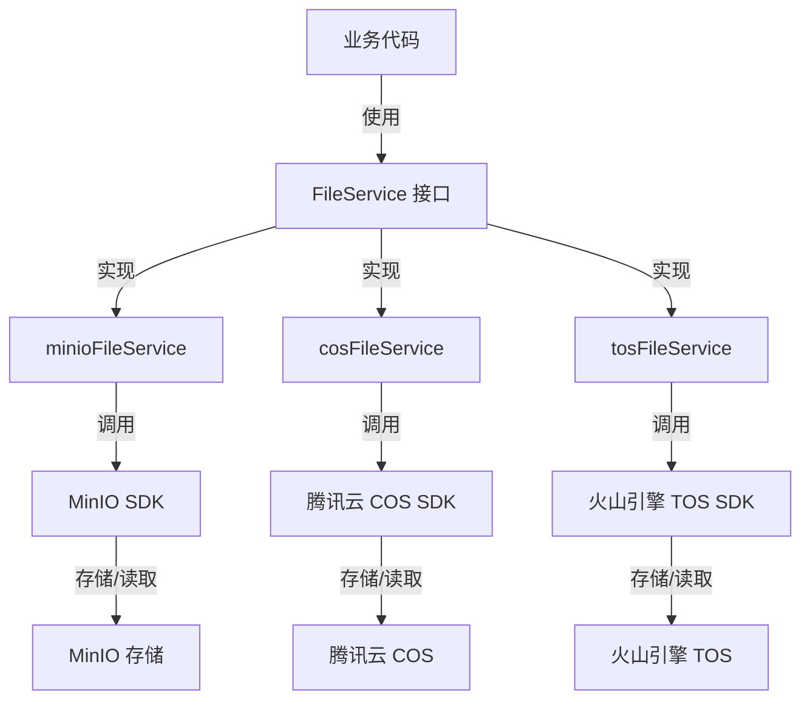

# 云对象存储提供商服务模块

## 概述

想象一下，您正在构建一个系统，需要将文件存储到不同的云服务商提供的对象存储服务中——比如腾讯云 COS、火山引擎 TOS，或者自建的 MinIO。每个服务都有自己的 API、SDK、路径格式和功能特性。如果直接在业务代码中调用这些服务的 SDK，您的代码会变得混乱且难以维护，更不用说切换存储提供商时的痛苦了。

`cloud_object_storage_provider_services` 模块正是为了解决这个问题而设计的。它提供了一个统一的抽象层，让您的业务代码可以以相同的方式与不同的云对象存储服务交互，而不必关心底层的实现细节。

## 架构概览

### Mermaid 架构图



### 架构分析

这个模块采用了**策略模式**和**抽象工厂模式**的组合。核心思想是：

1. **统一接口**：所有存储提供商都实现相同的 `FileService` 接口，定义了保存、获取、删除文件等基本操作。
2. **提供商特定实现**：每个云存储服务都有自己的实现类，负责处理该服务的特定细节。
3. **工厂创建**：通过工厂函数（如 `NewMinioFileService`、`NewCosFileService`）创建具体的服务实例。

### 核心组件

1. **minioFileService**：MinIO 对象存储服务的实现
2. **cosFileService**：腾讯云 COS 对象存储服务的实现
3. **tosFileService**：火山引擎 TOS 对象存储服务的实现

每个实现都封装了对应云存储服务商的 SDK 调用细节，并提供了统一的接口供上层应用使用。

## 设计决策

### 1. 统一接口设计

**决策**：所有存储提供商实现相同的 `FileService` 接口。

**原因**：
- 允许业务代码与具体存储实现解耦
- 便于在不同存储提供商之间切换
- 简化了测试，可以轻松使用 mock 实现

**权衡**：
- 必须为所有提供商提供相同的接口，可能无法充分利用某些提供商的独特功能
- 接口设计需要考虑所有提供商的共性，可能会变得有些抽象

### 2. 路径格式抽象

**决策**：每个实现使用自己的路径格式来标识文件。

**实现**：
- MinIO：`minio://bucketName/objectName`
- COS：完整的 URL 路径，如 `https://bucket.cos.region.tencentcos.cn/path/to/file`
- TOS：`tos://bucketName/objectKey`

**原因**：
- 每个提供商都有自己的路径习惯和约定
- 使用提供商原生的路径格式可以更好地与该提供商的生态系统集成
- 便于识别文件来自哪个存储提供商

**权衡**：
- 应用层需要处理不同格式的路径
- 路径解析逻辑需要在每个实现中单独处理

### 3. 临时文件支持

**决策**：部分实现支持临时文件存储（COS 和 TOS）。

**实现**：
- COS 和 TOS 支持可选的临时桶配置
- 临时文件会存储在临时桶中，通常配置了自动过期策略
- MinIO 实现忽略了 `temp` 参数

**原因**：
- 某些场景下（如导出文件），文件只需要短期存储
- 使用临时桶可以避免手动清理临时文件的负担
- 主桶和临时桶分离可以更好地管理存储成本

**权衡**：
- 增加了实现的复杂度
- 不是所有提供商都支持（如 MinIO）
- 需要额外的配置来设置临时桶

### 4. 桶的自动创建

**决策**：MinIO 和 TOS 实现会在初始化时检查并自动创建桶。

**实现**：
- 在工厂函数中检查桶是否存在
- 如果不存在，自动创建桶
- COS 实现没有这个功能

**原因**：
- 简化部署流程，减少手动配置步骤
- 确保应用可以在没有预先创建桶的情况下运行

**权衡**：
- 自动创建的桶可能没有最佳的安全配置
- 某些环境可能不允许应用程序创建桶
- 增加了初始化时间

## 数据流程

### 文件保存流程

1. 业务代码调用 `SaveFile` 方法，传入文件、租户 ID 和知识 ID
2. 实现生成唯一的对象名称，通常包含租户 ID、知识 ID 和 UUID
3. 打开文件并读取内容
4. 调用对应云存储 SDK 的上传方法
5. 返回文件的唯一路径标识

### 文件获取流程

1. 业务代码调用 `GetFile` 方法，传入文件路径
2. 实现解析文件路径，提取出对象标识
3. 调用对应云存储 SDK 的下载方法
4. 返回文件内容的读取流

### 文件删除流程

1. 业务代码调用 `DeleteFile` 方法，传入文件路径
2. 实现解析文件路径，提取出对象标识
3. 调用对应云存储 SDK 的删除方法
4. 返回操作结果

### 预签名 URL 生成流程

1. 业务代码调用 `GetFileURL` 方法，传入文件路径
2. 实现解析文件路径，确定文件所在的桶和对象标识
3. 调用对应云存储 SDK 的预签名 URL 生成方法
4. 返回有时效性的下载 URL（通常 24 小时有效）

## 子模块介绍

### MinIO 对象存储提供商服务

MinIO 是一个高性能的对象存储系统，兼容 Amazon S3 API。`minioFileService` 提供了与 MinIO 交互的功能。

**特点**：
- 支持桶的自动创建
- 使用 `minio://` 格式的路径
- 不支持临时文件功能

**使用场景**：
- 自建对象存储服务
- 开发和测试环境
- 需要完全控制存储基础设施的场景

[详细文档](application_services_and_orchestration-file_storage_provider_services-cloud_object_storage_provider_services-minio_object_storage_provider_service.md)

### 腾讯云 COS 对象存储提供商服务

腾讯云对象存储（Cloud Object Storage，COS）是腾讯云提供的一种存储海量文件的分布式存储服务。`cosFileService` 提供了与腾讯云 COS 交互的功能。

**特点**：
- 支持临时桶配置
- 使用完整的 URL 作为文件路径
- 可以区分主桶和临时桶的文件

**使用场景**：
- 生产环境部署在腾讯云
- 需要临时文件自动过期功能
- 与腾讯云其他服务集成

[详细文档](application_services_and_orchestration-file_storage_provider_services-cloud_object_storage_provider_services-cos_object_storage_provider_service.md)

### 火山引擎 TOS 对象存储提供商服务

火山引擎对象存储（Tinder Object Storage，TOS）是火山引擎提供的海量、安全、低成本、高可靠的云存储服务。`tosFileService` 提供了与火山引擎 TOS 交互的功能。

**特点**：
- 支持桶的自动创建
- 支持临时桶配置
- 使用 `tos://` 格式的路径
- 完善的路径解析和构建工具函数

**使用场景**：
- 生产环境部署在火山引擎
- 需要临时文件自动过期功能
- 与火山引擎其他服务集成

[详细文档](application_services_and_orchestration-file_storage_provider_services-cloud_object_storage_provider_services-tos_object_storage_provider_service.md)

## 与其他模块的关系

### 依赖关系

- **core_domain_types_and_interfaces**：依赖 `FileService` 接口定义
- **platform_infrastructure_and_runtime**：可能在配置和初始化时使用
- **http_handlers_and_routing**：HTTP 处理层可能会使用文件存储服务来处理上传的文件

### 被依赖关系

- **knowledge_ingestion_extraction_and_graph_services**：知识导入服务可能会使用文件存储来保存上传的文档
- **application_services_and_orchestration**：应用服务层可能会使用文件存储服务来处理各种文件操作
- **data_access_repositories**：某些数据访问层可能需要存储文件

## 使用指南

### 初始化服务

```go
// MinIO 服务初始化
fileService, err := file.NewMinioFileService(
    "localhost:9000",
    "accessKey",
    "secretKey",
    "my-bucket",
    false,
)

// COS 服务初始化（带临时桶）
fileService, err := file.NewCosFileServiceWithTempBucket(
    "my-bucket",
    "ap-guangzhou",
    "secretId",
    "secretKey",
    "prefix",
    "my-temp-bucket",
    "ap-guangzhou",
)

// TOS 服务初始化（带临时桶）
fileService, err := file.NewTosFileServiceWithTempBucket(
    "https://tos-cn-beijing.volces.com",
    "cn-beijing",
    "accessKey",
    "secretKey",
    "my-bucket",
    "prefix",
    "my-temp-bucket",
    "cn-beijing",
)
```

### 基本操作

```go
// 保存文件
filePath, err := fileService.SaveFile(ctx, fileHeader, tenantID, knowledgeID)

// 获取文件
reader, err := fileService.GetFile(ctx, filePath)

// 删除文件
err := fileService.DeleteFile(ctx, filePath)

// 保存字节数据（可能为临时文件）
filePath, err := fileService.SaveBytes(ctx, data, tenantID, fileName, isTemp)

// 获取预签名 URL
url, err := fileService.GetFileURL(ctx, filePath)
```

## 注意事项和陷阱

1. **路径格式差异**：不同提供商使用不同的路径格式，应用层需要注意不要混用不同提供商的路径。

2. **临时文件支持不统一**：MinIO 不支持临时文件功能，使用时需要注意 `temp` 参数可能被忽略。

3. **预签名 URL 有时效性**：生成的预签名 URL 通常只有 24 小时的有效期，不适合长期存储。

4. **错误处理**：每个实现都有自己的错误类型和格式，需要仔细处理。

5. **桶权限**：确保应用程序有足够的权限来访问和操作存储桶。

6. **区域配置**：COS 和 TOS 都需要正确配置区域，否则可能导致连接失败。

7. **路径前缀**：COS 和 TOS 支持路径前缀配置，可以用来组织文件，但需要注意前缀的格式。

## 总结

`cloud_object_storage_provider_services` 模块提供了一个统一的抽象层，让您的应用可以轻松地与不同的云对象存储服务交互。通过使用这个模块，您可以：

1. 简化代码，避免与具体存储提供商的 SDK 直接耦合
2. 灵活切换存储提供商，而无需修改业务代码
3. 利用各种云存储服务的特性，如临时文件、预签名 URL 等
4. 更好地组织和管理文件，通过租户 ID、知识 ID 等进行分类

虽然这个模块提供了很好的抽象，但在使用时仍需要注意不同提供商之间的差异，特别是路径格式和临时文件支持方面。希望这份文档能帮助您更好地理解和使用这个模块！
