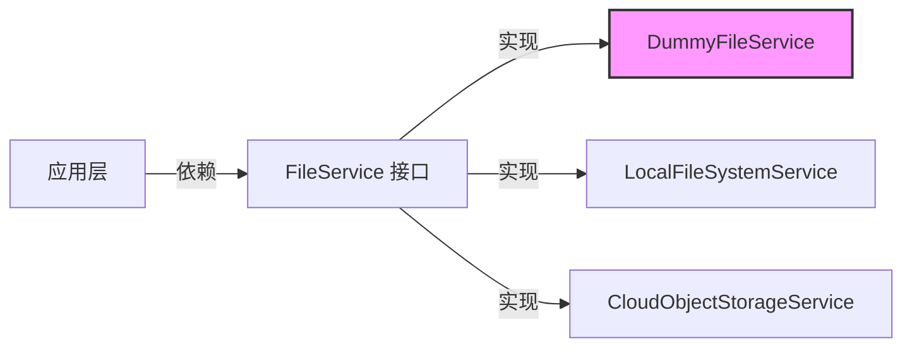

# dummy_file_provider_service 模块技术深度解析

## 1. 模块概述

在任何复杂的软件系统中，测试和开发环境的隔离都是一个关键挑战。`dummy_file_provider_service` 模块正是为了解决这个问题而存在的——它提供了一个无操作（no-op）的文件存储服务实现，专门用于测试场景或不需要实际文件存储的环境。

想象一下，您正在开发一个知识管理系统，需要频繁测试文件上传、检索和删除功能。每次测试都创建真实文件不仅会消耗磁盘空间，还会减慢测试速度并可能导致测试环境污染。`DummyFileService` 就像是一个"虚拟文件柜"，它接受您的文件存储请求，返回看起来真实的文件标识符，但实际上并不会在磁盘上写入任何数据。

## 2. 架构与设计意图

### 2.1 架构定位

`dummy_file_provider_service` 模块位于 `application_services_and_orchestration` 下的 `file_storage_provider_services` 子模块中，与其他文件存储实现（如 `cloud_object_storage_provider_services` 和 `local_filesystem_provider_service`）并列。这种架构设计遵循了**策略模式**（Strategy Pattern），允许系统在不同环境中灵活切换文件存储策略。



### 2.2 核心抽象

该模块的核心设计思想是**空对象模式**（Null Object Pattern）的一种变体。它提供了 `FileService` 接口的完整实现，但所有操作要么返回无意义的成功结果，要么明确表示不支持某些操作。这种设计使得调用方代码无需修改即可在不同环境中运行，同时避免了实际文件系统操作的开销。

## 3. 核心组件深度解析

### 3.1 DummyFileService 结构体

```go
type DummyFileService struct{}
```

这是一个极其简洁的结构体，没有任何字段。这种设计是有意为之的——它表明该服务不需要维护任何状态，完全是无状态的。这使得它在并发环境中非常安全，多个 goroutine 可以同时使用同一个实例而不会产生竞态条件。

### 3.2 NewDummyFileService 工厂函数

```go
func NewDummyFileService() interfaces.FileService {
    return &DummyFileService{}
}
```

这个工厂函数返回的是 `interfaces.FileService` 接口类型，而不是具体的 `*DummyFileService` 类型。这是一个重要的设计决策：它强制调用方依赖于抽象而非具体实现，符合依赖倒置原则（Dependency Inversion Principle）。这使得在不同环境中替换文件存储实现变得非常容易——只需更改工厂函数的调用位置即可。

### 3.3 SaveFile 方法

```go
func (s *DummyFileService) SaveFile(ctx context.Context,
    file *multipart.FileHeader, tenantID uint64, knowledgeID string,
) (string, error) {
    return uuid.New().String(), nil
}
```

这个方法是该模块最常用的方法之一。它接受完整的文件参数，但完全忽略了文件内容。相反，它生成并返回一个随机的 UUID 作为"文件路径"。这种设计有几个巧妙之处：

1. **接口兼容性**：它接受与真实实现相同的参数，确保调用方代码无需修改
2. **结果真实性**：返回的 UUID 看起来像是一个真实的文件标识符，使得下游代码可以正常处理
3. **无副作用**：不会在文件系统中创建任何实际文件，保持测试环境清洁

### 3.4 GetFile 方法

```go
func (s *DummyFileService) GetFile(ctx context.Context, filePath string) (io.ReadCloser, error) {
    return nil, errors.New("not implemented")
}
```

与 `SaveFile` 不同，`GetFile` 方法明确返回错误。这是一个合理的设计选择：既然没有实际存储文件，就无法检索它们。返回明确的错误而不是静默失败，可以帮助开发者快速定位问题，避免在测试中出现难以调试的行为。

### 3.5 DeleteFile 方法

```go
func (s *DummyFileService) DeleteFile(ctx context.Context, filePath string) error {
    return nil
}
```

这个方法是一个完全的无操作（no-op），它总是返回成功。这种设计反映了一个重要的测试哲学：删除操作通常应该被允许成功，即使没有实际文件可删除。这使得测试可以按照正常流程执行，而不会因为删除不存在的文件而失败。

### 3.6 SaveBytes 方法

```go
func (s *DummyFileService) SaveBytes(ctx context.Context, data []byte, tenantID uint64, fileName string, temp bool) (string, error) {
    return uuid.New().String(), nil
}
```

与 `SaveFile` 类似，这个方法也接受完整的参数但忽略实际数据，返回一个随机 UUID。它的存在确保了 `DummyFileService` 完全实现了 `FileService` 接口，即使某些调用方使用字节数组而不是 multipart 文件来保存内容。

### 3.7 GetFileURL 方法

```go
func (s *DummyFileService) GetFileURL(ctx context.Context, filePath string) (string, error) {
    return filePath, nil
}
```

这个方法简单地返回传入的文件路径作为 URL。这种设计使得调用方可以继续处理文件 URL，而不会因为缺少实际存储而中断流程。虽然返回的 URL 可能无法实际访问，但它允许测试流程继续执行到下一步。

## 4. 依赖关系分析

### 4.1 输入依赖

`DummyFileService` 的依赖非常精简：

- **`context.Context`**：标准的 Go 上下文，用于传递请求范围的值、取消信号和截止时间
- **`mime/multipart.FileHeader`**：表示上传文件的元数据
- **`github.com/google/uuid`**：用于生成唯一标识符
- **`github.com/Tencent/WeKnora/internal/types/interfaces`**：定义了 `FileService` 接口

这种极简的依赖设计是有意为之的，它确保了 `DummyFileService` 可以在几乎任何环境中使用，而不会引入复杂的依赖链。

### 4.2 被依赖关系

虽然我们没有直接的调用方代码，但基于模块结构可以推断，`DummyFileService` 主要被以下组件使用：

- **测试代码**：用于隔离文件存储操作的单元测试和集成测试
- **开发环境**：在开发初期，当实际文件存储尚未就绪时
- **演示环境**：用于展示系统功能而不需要实际存储文件的场景

## 5. 设计决策与权衡

### 5.1 无状态 vs 有状态

**决策**：选择完全无状态的设计

**原因**：
- 简化实现，不需要维护任何内部数据结构
- 确保线程安全，可以在并发环境中自由使用
- 符合测试替身（Test Double）的设计理念，测试替身应该尽可能简单

**权衡**：
- 失去了跟踪"存储"文件的能力（虽然在测试场景中这通常不是问题）
- 无法提供更复杂的模拟行为（如模拟存储配额限制）

### 5.2 部分操作成功 vs 全部失败

**决策**：让写入操作"成功"，读取操作失败

**原因**：
- 大多数测试流程更关注文件上传和处理流程，而不是下载
- 允许测试流程继续执行，而不会在早期就失败
- 明确的失败比静默成功更容易调试

**权衡**：
- 如果测试流程依赖于能够读取之前"存储"的文件，测试将会失败
- 可能会掩盖某些与文件检索相关的bug

### 5.3 返回随机 UUID vs 固定标识符

**决策**：返回随机 UUID

**原因**：
- 模拟真实文件存储系统的行为，真实系统通常会生成唯一标识符
- 避免了标识符冲突的可能性
- 使得每次测试运行都有不同的标识符，可以测试某些边缘情况

**权衡**：
- 使得依赖于特定文件路径的测试变得困难
- 无法轻松预测返回的标识符，这在某些测试场景中可能是个问题

## 6. 使用指南与最佳实践

### 6.1 何时使用 DummyFileService

- **单元测试**：当测试不依赖于实际文件内容时
- **集成测试**：当测试流程的重点不是文件存储本身时
- **开发环境**：在实际文件存储服务尚未就绪时
- **演示环境**：当您需要展示系统功能但不想处理实际文件时

### 6.2 配置示例

虽然 `DummyFileService` 本身不需要配置，但您通常会通过依赖注入框架或工厂模式来选择使用它。以下是一个常见的配置模式：

```go
// 根据环境变量选择文件服务实现
func NewFileService(env string) interfaces.FileService {
    switch env {
    case "production":
        return cloud_storage.NewCloudStorageService()
    case "development":
        return local_file.NewLocalFileService()
    default: // test, staging
        return dummy.NewDummyFileService()
    }
}
```

### 6.3 测试模式

当使用 `DummyFileService` 进行测试时，有几种常见的模式：

1. **忽略文件路径**：如果您的测试不依赖于特定的文件路径，可以直接使用返回的任何值
2. **使用接口模拟**：对于更复杂的场景，考虑使用接口模拟框架（如 gomock）来获得更多控制
3. **验证调用**：虽然 `DummyFileService` 本身不记录调用，但您可以包装它来添加调用跟踪功能

## 7. 边缘情况与注意事项

### 7.1 已知限制

1. **无法检索文件**：`GetFile` 方法总是返回错误，任何依赖于文件检索的测试都会失败
2. **不验证参数**：所有方法都完全忽略输入参数的有效性，即使传入 nil 或无效值也会返回成功
3. **没有容量限制**：不会模拟存储配额或文件大小限制，这可能导致某些边界条件测试无法进行

### 7.2 常见陷阱

1. **过度依赖**：不要在实际需要文件存储的场景中使用 `DummyFileService`
2. **测试隔离失效**：由于返回随机 UUID，某些期望特定文件路径的测试可能会出现非确定性结果
3. **错误掩盖**：由于大多数操作都返回成功，某些真正的错误可能会被掩盖

### 7.3 扩展建议

如果您发现 `DummyFileService` 的功能不足以满足您的测试需求，可以考虑以下扩展：

1. **添加内存存储**：在内存中维护一个简单的文件映射，允许保存和检索文件
2. **记录调用历史**：添加方法调用记录功能，便于在测试中验证交互
3. **模拟错误场景**：添加配置选项，允许模拟各种错误条件（如磁盘满、权限错误等）

## 8. 相关模块参考

- [local_filesystem_provider_service](application_services_and_orchestration-file_storage_provider_services-local_filesystem_provider_service.md)：本地文件系统实现
- [cloud_object_storage_provider_services](application_services_and_orchestration-file_storage_provider_services-cloud_object_storage_provider_services.md)：云存储实现
- [core_domain_types_and_interfaces](core_domain_types_and_interfaces.md)：定义 FileService 接口的模块
