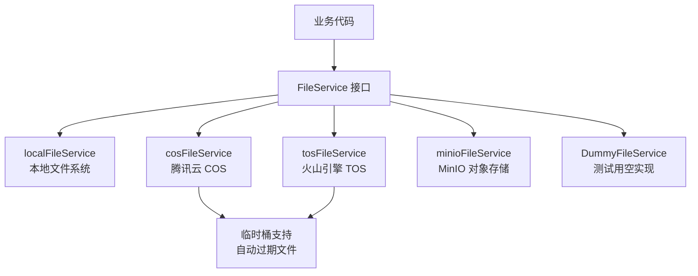

# file_storage_provider_services 模块深度解析

## 模块概述

想象一下，您正在构建一个需要存储用户上传文件的应用系统——从用户文档、知识库附件到临时导出文件。如果直接将文件系统操作硬编码在业务逻辑中，那么当您需要从本地存储迁移到云存储时，代码将会变得一团糟。`file_storage_provider_services` 模块就是为了解决这个问题而设计的：它提供了一个统一的文件存储抽象层，让业务代码可以无缝地在不同的存储后端之间切换，而不需要修改任何业务逻辑。

这个模块的核心价值在于**解耦**：它将"文件需要被存储"这一业务需求与"文件具体存储在哪里"这一技术实现细节完全分离。无论是本地文件系统、腾讯云 COS、火山引擎 TOS 还是 MinIO，业务代码都只需要面对同一个接口。

## 架构设计

### 核心架构图



### 架构解析

这个模块采用了经典的**策略模式**（Strategy Pattern）设计：

1. **统一接口层**：所有存储实现都遵循同一个 `FileService` 接口（定义在 [core_domain_types_and_interfaces](core_domain_types_and_interfaces.md) 模块中），确保业务代码可以无差别地使用任何存储后端。

2. **多实现策略**：
   - `localFileService`：用于开发环境或简单部署场景，直接操作本地文件系统
   - `cosFileService`：腾讯云对象存储，支持主桶和临时桶双桶架构
   - `tosFileService`：火山引擎对象存储，同样支持临时桶
   - `minioFileService`：开源对象存储，适合私有云部署
   - `DummyFileService`：空实现，用于单元测试，不进行实际文件操作

3. **双桶设计**：COS 和 TOS 实现都支持"主桶 + 临时桶"的双桶架构。主桶用于持久化存储，临时桶用于存放导出文件等自动过期的临时数据，这是一个很巧妙的设计——通过存储层面的生命周期管理来自动清理临时文件，避免了应用层的定时清理逻辑。

## 核心设计决策

### 1. 接口优先设计

**决策**：定义 `FileService` 接口，所有实现都依赖这个接口而非具体实现。

**为什么这样设计**：
- 业务代码不需要知道文件实际存储在哪里，只需要知道"我可以保存、读取、删除文件"
- 可以在运行时根据配置切换存储后端，无需重新编译
- 便于测试——使用 `DummyFileService` 可以在不依赖外部存储的情况下测试业务逻辑

**权衡**：
- ✅ 优点：高度解耦，易于测试和扩展
- ⚠️ 缺点：接口设计需要谨慎，一旦确定就难以修改（否则所有实现都要改）

### 2. 路径作为唯一标识符

**决策**：所有方法都使用文件路径/URL 作为文件的唯一标识符，而不是抽象的文件 ID。

**为什么这样设计**：
- 不同存储后端有不同的定位方式：本地文件系统用文件路径，COS 用完整 URL，MinIO 用 `minio://` 协议路径
- 将路径作为返回值，让调用方可以直接存储和使用，无需额外的映射关系
- 保持简单——路径本身就包含了足够的定位信息

**权衡**：
- ✅ 优点：简单直接，调用方可以立即使用返回的路径
- ⚠️ 缺点：如果需要迁移存储后端，旧的路径会失效（这通常通过重定向或迁移工具解决）

### 3. 临时桶设计（仅 COS/TOS）

**决策**：COS 和 TOS 实现支持配置临时桶，用于存放自动过期的临时文件。

**为什么这样设计**：
- 导出文件、预览文件等临时数据不需要永久存储
- 利用云存储的生命周期规则自动清理，避免应用层维护定时任务
- 临时文件和持久化文件分离，降低主桶的存储成本和管理复杂度

**权衡**：
- ✅ 优点：自动清理，降低成本，职责分离
- ⚠️ 缺点：增加了配置复杂度，只有云存储实现支持（本地和 MinIO 不支持）

## 数据流程

### 典型文件上传流程

```
业务代码
    ↓ 调用 SaveFile(file, tenantID, knowledgeID)
FileService 实现
    ↓ 生成唯一文件名（UUID + 原始扩展名）
    ↓ 构建存储路径（按租户和知识库组织）
    ↓ 执行存储操作
    ↓ 返回文件路径/URL
业务代码
    ↓ 存储路径到数据库
```

### 临时文件保存流程（COS/TOS）

```
业务代码
    ↓ 调用 SaveBytes(data, tenantID, fileName, temp=true)
FileService 实现
    ↓ 检查是否配置了临时桶
    ↓ 是：使用临时桶，路径中不包含 pathPrefix
    ↓ 否：使用主桶
    ↓ 生成唯一文件名
    ↓ 执行存储操作
    ↓ 返回文件路径/URL
业务代码
```

## 子模块说明

### cloud_object_storage_provider_services

这个子模块包含了所有云存储提供商的实现：
- [cloud_object_storage_provider_services](application_services_and_orchestration-file_storage_provider_services-cloud_object_storage_provider_services.md)：包含 MinIO、腾讯云 COS 和火山引擎 TOS 实现

### local_filesystem_provider_service

[本地文件系统实现](application_services_and_orchestration-file_storage_provider_services-local_filesystem_provider_service.md)，适合开发环境和简单部署场景。

### dummy_file_provider_service

[测试用空实现](application_services_and_orchestration-file_storage_provider_services-dummy_file_provider_service.md)，用于单元测试，不进行实际文件操作。

## 与其他模块的依赖关系

### 依赖的模块

- **core_domain_types_and_interfaces**：定义了 `FileService` 接口，这是整个模块的契约基础
- **platform_infrastructure_and_runtime**：可能提供配置管理，用于选择和配置存储后端

### 被依赖的模块

- **knowledge_ingestion_extraction_and_graph_services**：知识入库时需要存储文档文件
- **http_handlers_and_routing**：文件上传下载接口需要使用文件存储服务
- **conversation_context_and_memory_services**：可能需要存储对话相关的附件

## 使用指南与注意事项

### 选择合适的存储后端

| 场景 | 推荐实现 | 理由 |
|------|---------|------|
| 本地开发 | `localFileService` | 无需外部依赖，简单直接 |
| 单元测试 | `DummyFileService` | 不进行实际文件操作，测试速度快 |
| 腾讯云部署 | `cosFileService` + 临时桶 | 与腾讯云生态集成好，临时桶自动清理 |
| 火山引擎部署 | `tosFileService` + 临时桶 | 与火山引擎生态集成好，临时桶自动清理 |
| 私有云部署 | `minioFileService` | 开源可控，兼容 S3 协议 |

### 新贡献者注意事项

1. **路径格式不统一**：不同实现返回的路径格式不同，调用方需要注意不要假设路径格式。例如，不要尝试解析路径来提取租户 ID——这应该在调用存储服务之前就保存好。

2. **临时文件支持不一致**：只有 COS 和 TOS 支持临时桶，其他实现会忽略 `temp` 参数。如果业务逻辑依赖临时文件自动清理，需要在应用层额外处理。

3. **错误处理**：所有方法都可能返回错误，不要假设文件操作一定成功。特别是网络存储（COS/TOS/MinIO），网络波动可能导致操作失败。

4. **GetFileURL 的有效期**：云存储实现返回的预签名 URL 只有 24 小时有效期，不要永久存储这个 URL——应该存储原始文件路径，需要时再生成 URL。

5. **文件名唯一性**：所有实现都使用 UUID 确保文件名唯一，不要依赖原始文件名来识别文件。

### 扩展新的存储后端

如果需要添加新的存储后端（例如阿里云 OSS），只需：

1. 创建新的结构体，实现 `FileService` 接口的所有方法
2. 提供构造函数（例如 `NewAliyunOSSService`）
3. 在配置和依赖注入层添加新实现的选择逻辑

无需修改任何业务代码——这就是接口抽象的力量。
