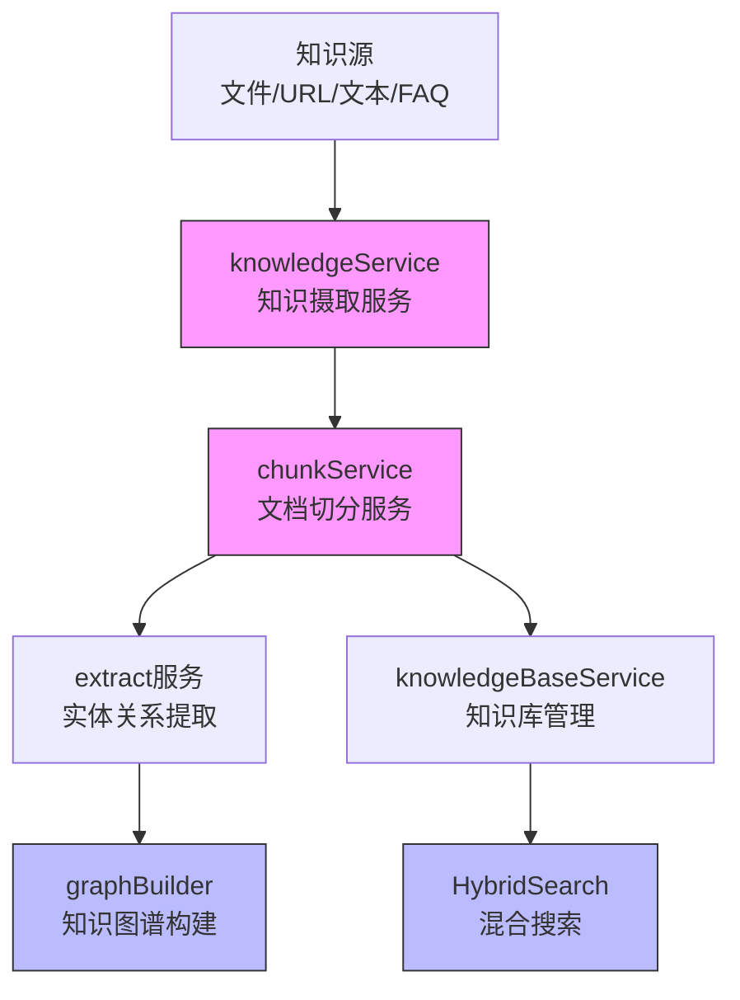
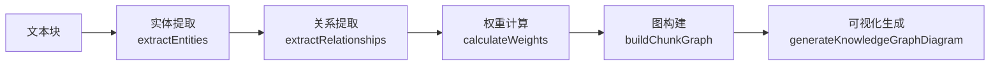
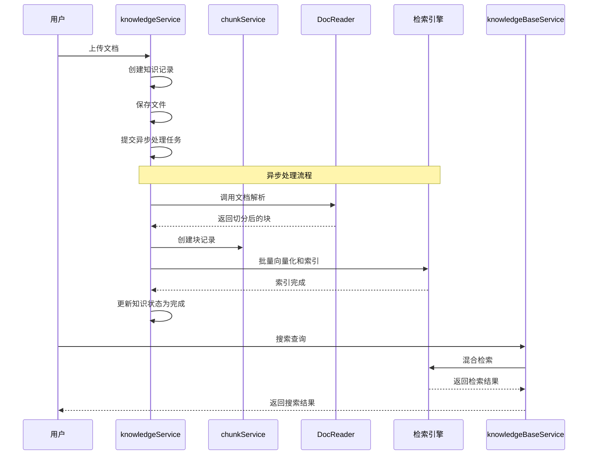
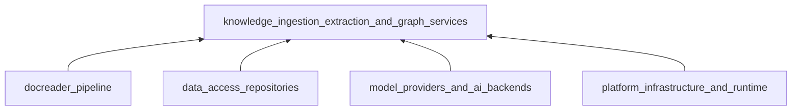

# 知识摄取、提取与图服务模块 (Knowledge Ingestion, Extraction & Graph Services)

## 概述

知识摄取、提取与图服务模块是 WeKnora 系统的核心组件，负责将各种来源的知识（文档、URL、文本段落、FAQ 等）转换为结构化、可检索的形式，并构建知识图谱以支持智能问答和推理。

这个模块就像一座"知识加工厂"——接收原始的信息材料，经过解析、提取、向量化等多道工序，最终生产出高质量的"知识产品"，供系统的其他部分使用。



## 核心设计理念

### 1. 多模态知识处理

该模块设计支持多种知识源类型：
- **文档文件**：PDF、Word、Excel、CSV、Markdown 等
- **网页资源**：通过 URL 直接抓取
- **文本段落**：直接输入的文本内容
- **FAQ 条目**：结构化的问答对
- **手工知识**：用户编辑的 Markdown 内容

### 2. 异步处理架构

考虑到知识处理的计算密集型特性，模块采用了基于任务队列的异步处理架构：
- 使用 Asynq 作为任务调度器
- 支持任务重试和失败处理
- 避免阻塞主请求流程

### 3. 混合检索策略

结合向量检索和关键词检索的优势：
- 向量检索：语义相似度匹配
- 关键词检索：精确匹配
- RRF（Reciprocal Rank Fusion）算法融合结果

## 核心组件详解

### knowledgeService：知识摄取的总指挥

`knowledgeService` 是整个知识摄取流程的总指挥，负责协调整个知识处理生命周期。

#### 主要职责：
- 从各种来源创建知识条目
- 处理文档解析和切分
- 管理知识的生命周期（创建、更新、删除）
- 协调向量化和索引过程

#### 关键设计决策：

**幂等性处理**：
```go
// 检查任务状态 - 幂等性处理
if knowledge.ParseStatus == types.ParseStatusCompleted {
    logger.Infof(ctx, "Document already completed, skipping: %s", payload.KnowledgeID)
    return nil // 幂等：已完成的任务直接返回
}
```

为什么这样设计？因为文档处理可能会因为各种原因重试（网络问题、服务重启等），我们需要确保重复处理不会造成数据重复或不一致。

**删除保护机制**：
```go
// 检查是否正在删除 - 如果是则直接退出，避免与删除操作冲突
if knowledge.ParseStatus == types.ParseStatusDeleting {
    logger.Infof(ctx, "Knowledge is being deleted, aborting processing: %s", payload.KnowledgeID)
    return nil
}
```

这是一个典型的并发控制策略——当知识正在被删除时，任何处理任务都应该立即停止，避免竞态条件。

### chunkService：文档切分专家

`chunkService` 专注于文档切分和块管理，它就像一位专业的"文本分割师"，知道如何将长篇文档切分成合适大小的块。

#### 主要功能：
- 块的创建、查询、更新、删除
- 父子块关系管理
- 生成问题的管理

#### 切分策略：
- 配置化的切分大小和重叠
- 支持多种分隔符
- 保持语义完整性

### graphBuilder：知识图谱建筑师

`graphBuilder` 是构建知识图谱的核心组件，它能从文本中提取实体和关系，构建结构化的知识网络。

#### 工作流程：



#### 关键算法：

**PMI（点互信息）权重计算**：
```go
// PMI calculation: log(P(x,y) / (P(x) * P(y)))
pmi := math.Max(math.Log2(relProbability/(sourceProbability*targetProbability)), 0)
```

**关系强度融合**：
```go
// Combine PMI and Strength using configured weights
combinedWeight := normalizedPMI*PMIWeight + normalizedStrength*StrengthWeight
```

这种设计权衡了共现频率（PMI）和语义强度（Strength），使得关系权重更准确地反映实体间的关联程度。

### knowledgeBaseService：知识库管理者

`knowledgeBaseService` 负责知识库的生命周期管理和混合搜索功能。

#### 混合搜索实现：

模块采用了先进的 RRF（Reciprocal Rank Fusion）算法来融合向量检索和关键词检索的结果：

```go
// RRF score = sum(1 / (k + rank)) for each retriever where the chunk appears
const rrfK = 60

// 计算 RRF 分数
rrfScore := 0.0
if rank, ok := vectorRanks[chunkID]; ok {
    rrfScore += 1.0 / float64(rrfK+rank)
}
if rank, ok := keywordRanks[chunkID]; ok {
    rrfScore += 1.0 / float64(rrfK+rank)
}
```

为什么选择 RRF？因为它不需要参数调优，且在大多数情况下表现良好，能够很好地平衡不同检索方式的结果。

## 数据流程

### 完整的知识摄取流程

让我们追踪一个文档从上传到可检索的完整旅程：



### FAQ 导入流程

FAQ 导入是一个特殊的流程，因为它处理的是结构化的问答对：

1. **验证阶段**：检查重复、格式验证
2. **Dry Run 模式**：只验证不导入，生成报告
3. **增量导入**：基于内容哈希判断是否需要更新
4. **索引策略**：支持仅索引问题或同时索引问题和答案

## 设计权衡与决策

### 1. 同步 vs 异步处理

**决策**：采用异步处理为主，同步处理为辅

**原因**：
- 文档处理可能耗时较长（几秒到几分钟）
- 避免阻塞用户界面
- 更好的容错和重试机制

**权衡**：
- ✅ 更好的用户体验
- ✅ 系统更稳定
- ❌ 需要额外的状态管理
- ❌ 增加了系统复杂度

### 2. 块大小的选择

**决策**：配置化的块大小，默认值适中

**权衡**：
- 大块：保留更多上下文，但检索粒度粗
- 小块：检索精确，但可能丢失上下文
- 重叠：增加召回率，但增加存储和计算成本

### 3. 向量检索 vs 关键词检索

**决策**：同时支持，用 RRF 融合

**原因**：
- 向量检索：擅长语义匹配，对同义词、相关概念敏感
- 关键词检索：精确匹配，对产品名、技术术语等效果好
- 两者结合：取长补短

### 4. 知识图谱的构建策略

**决策**：基于 PMI 和强度的混合权重，批量处理

**设计考虑**：
- 并发控制：使用 errgroup 限制并发数
- 批处理：平衡内存使用和处理效率
- 权重计算：综合考虑统计特性和语义强度

## 使用指南与注意事项

### 错误处理与重试

模块具有完善的错误处理机制：

1. **任务重试**：Asynq 任务会自动重试，有最大重试次数限制
2. **幂等性**：重复处理不会造成问题
3. **清理机制**：失败时会清理部分创建的资源
4. **最后一次重试**：会更新状态为失败

### 并发安全

多个关键区域都有并发控制：

1. **知识删除**：标记为删除中，处理任务检测后会退出
2. **FAQ 导入**：使用 Redis 记录运行中的任务，防止并发导入
3. **图构建**：使用 mutex 保护共享数据结构

### 性能优化建议

1. **块大小配置**：根据文档类型调整
   - 代码文档：较小的块（256-512 字符）
   - 叙事性文档：较大的块（512-1024 字符）

2. **并发控制**：
   - 实体提取并发：`MaxConcurrentEntityExtractions`
   - 关系提取并发：`MaxConcurrentRelationExtractions`

3. **批处理大小**：
   - 默认关系批大小：`DefaultRelationBatchSize`
   - FAQ 导入批大小：`faqImportBatchSize`

## 与其他模块的关系

### 依赖关系



### 主要交互

1. **docreader_pipeline**：提供文档解析和切分功能
2. **data_access_repositories**：提供数据持久化
3. **model_providers_and_ai_backends**：提供嵌入模型和聊天模型
4. **platform_infrastructure_and_runtime**：提供任务队列、Redis 等基础设施

## 子模块

本模块包含以下子模块，各负责特定功能：

- [chunk_lifecycle_management](application_services_and_orchestration-knowledge_ingestion_extraction_and_graph_services-chunk_lifecycle_management.md)：文档块的生命周期管理
- [document_extraction_and_table_summarization](application_services_and_orchestration-knowledge_ingestion_extraction_and_graph_services-document_extraction_and_table_summarization.md)：文档内容提取和表格摘要
- [knowledge_graph_construction](application_services_and_orchestration-knowledge_ingestion_extraction_and_graph_services-knowledge_graph_construction.md)：知识图谱构建
- [knowledge_ingestion_orchestration](application_services_and_orchestration-knowledge_ingestion_extraction_and_graph_services-knowledge_ingestion_orchestration.md)：知识摄取流程编排
- [knowledge_base_lifecycle_management](application_services_and_orchestration-knowledge_ingestion_extraction_and_graph_services-knowledge_base_lifecycle_management.md)：知识库生命周期管理

## 总结

知识摄取、提取与图服务模块是 WeKnora 的核心引擎，它将原始信息转化为可检索、可推理的知识资产。通过精心设计的异步架构、混合检索策略和知识图谱构建，该模块为整个系统提供了强大的知识处理能力。

理解这个模块的关键是理解"知识加工"的思想——从原始材料到最终产品，每个环节都在增加价值，使信息变得更加结构化、可发现和有用。