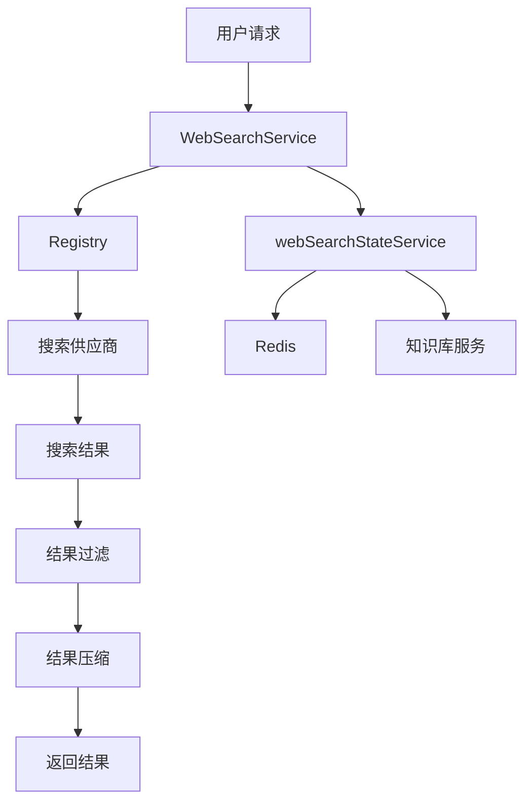

# Web Search Orchestration Registry and State 模块

## 概述

**web_search_orchestration_registry_and_state** 模块是一个负责管理和协调网络搜索功能的核心组件。它解决了在多供应商搜索环境中需要统一接口、状态管理和结果处理的问题。

想象一下，你有一个需要使用多个搜索引擎（如 Bing、Google、DuckDuckGo）的应用程序。如果没有这个模块，你需要为每个搜索引擎编写单独的代码，处理不同的API接口、结果格式和错误处理。这个模块就像一个"搜索引擎调度中心"，它统一了所有搜索提供商的接口，管理搜索状态，并提供结果压缩和过滤功能。

## 核心功能

1. **搜索供应商注册与管理**：通过注册表模式动态管理多个搜索提供商
2. **统一搜索接口**：为不同的搜索提供商提供一致的调用接口
3. **结果压缩与优化**：使用RAG技术对搜索结果进行智能压缩和优化
4. **搜索状态管理**：管理临时知识库和搜索会话状态
5. **结果过滤**：支持黑名单过滤和结果去重

## 架构设计

### 模块组成

本模块由以下三个主要子模块组成：

1. **web_search_orchestration_service**：核心搜索服务，提供统一的搜索接口和结果处理
2. **web_search_provider_registry**：搜索供应商注册表，管理多个搜索提供商的注册和创建
3. **web_search_state_management**：搜索状态管理，处理临时知识库和会话状态

### 架构流程图



## 核心组件详解

### 1. WebSearchService

`WebSearchService` 是整个模块的核心，它提供了统一的搜索接口和结果处理功能。

#### 主要功能：
- **搜索执行**：通过注册表选择并调用相应的搜索提供商
- **结果过滤**：根据黑名单规则过滤搜索结果
- **结果压缩**：使用RAG技术对搜索结果进行智能压缩
- **结果转换**：将搜索结果转换为统一的格式

#### 关键方法：

**Search**：执行搜索操作
```go
func (s *WebSearchService) Search(
    ctx context.Context,
    config *types.WebSearchConfig,
    query string,
) ([]*types.WebSearchResult, error)
```

**CompressWithRAG**：使用RAG技术压缩搜索结果
```go
func (s *WebSearchService) CompressWithRAG(
    ctx context.Context, sessionID string, tempKBID string, questions []string,
    webSearchResults []*types.WebSearchResult, cfg *types.WebSearchConfig,
    kbSvc interfaces.KnowledgeBaseService, knowSvc interfaces.KnowledgeService,
    seenURLs map[string]bool, knowledgeIDs []string,
) (compressed []*types.WebSearchResult, kbID string, newSeen map[string]bool, newIDs []string, err error)
```

### 2. Registry

`Registry` 是搜索供应商的注册表，它管理多个搜索提供商的注册和创建。

#### 主要功能：
- **供应商注册**：允许动态注册新的搜索提供商
- **供应商创建**：根据ID创建搜索提供商实例
- **供应商信息查询**：查询所有已注册的搜索提供商信息

#### 关键方法：

**Register**：注册一个新的搜索提供商
```go
func (r *Registry) Register(info types.WebSearchProviderInfo, factory ProviderFactory)
```

**CreateProvider**：创建一个搜索提供商实例
```go
func (r *Registry) CreateProvider(id string) (interfaces.WebSearchProvider, error)
```

### 3. webSearchStateService

`webSearchStateService` 负责管理搜索状态，特别是临时知识库的状态。

#### 主要功能：
- **状态保存**：保存临时知识库状态到Redis
- **状态获取**：从Redis获取临时知识库状态
- **状态清理**：清理临时知识库和相关资源

#### 关键方法：

**SaveWebSearchTempKBState**：保存临时知识库状态
```go
func (s *webSearchStateService) SaveWebSearchTempKBState(
    ctx context.Context,
    sessionID string,
    tempKBID string,
    seenURLs map[string]bool,
    knowledgeIDs []string,
)
```

**DeleteWebSearchTempKBState**：删除临时知识库状态
```go
func (s *webSearchStateService) DeleteWebSearchTempKBState(ctx context.Context, sessionID string) error
```

## 设计决策与权衡

### 1. 注册表模式 vs 硬编码

**决策**：采用注册表模式管理搜索提供商

**原因**：
- 灵活性：可以在运行时动态添加或删除搜索提供商
- 可扩展性：新的搜索提供商可以轻松集成，无需修改核心代码
- 解耦：搜索服务与具体的搜索提供商实现解耦

**权衡**：
- 增加了一定的复杂性
- 需要额外的注册逻辑

### 2. 临时知识库 vs 内存处理

**决策**：使用临时知识库进行结果压缩

**原因**：
- 可以利用现有的知识库和搜索功能
- 支持更复杂的结果处理和压缩算法
- 可以在多个搜索请求之间共享状态

**权衡**：
- 增加了系统的复杂性
- 需要额外的存储和清理逻辑
- 可能会增加响应时间

### 3. Redis状态存储 vs 内存存储

**决策**：使用Redis存储搜索状态

**原因**：
- 支持分布式环境
- 状态可以在服务重启后恢复
- 可以设置过期时间自动清理

**权衡**：
- 增加了对Redis的依赖
- 网络开销可能会影响性能

## 数据流分析

### 搜索请求流程

1. **请求接收**：`WebSearchService.Search()` 接收搜索请求
2. **供应商选择**：从 `Registry` 中获取指定的搜索提供商
3. **搜索执行**：调用搜索提供商的 `Search()` 方法
4. **结果过滤**：使用 `filterBlacklist()` 过滤结果
5. **结果返回**：返回过滤后的搜索结果

### 结果压缩流程

1. **状态获取**：从 `webSearchStateService` 获取临时知识库状态
2. **知识库创建/复用**：创建或复用临时知识库
3. **结果导入**：将搜索结果导入临时知识库
4. **混合搜索**：在临时知识库中执行混合搜索
5. **结果选择**：使用轮询算法选择相关结果
6. **结果合并**：将选择的结果合并回原始格式
7. **状态保存**：保存临时知识库状态

## 使用指南

### 基本搜索

```go
// 创建搜索服务
registry := web_search.NewRegistry()
// 注册搜索提供商
registry.Register(types.WebSearchProviderInfo{ID: "bing"}, func() (interfaces.WebSearchProvider, error) {
    return bing.NewBingProvider(), nil
})
searchService, _ := NewWebSearchService(cfg, registry)

// 执行搜索
results, err := searchService.Search(ctx, &types.WebSearchConfig{
    Provider: "bing",
    MaxResults: 10,
}, "查询关键词")
```

### 结果压缩

```go
// 压缩搜索结果
compressed, kbID, seenURLs, knowledgeIDs, err := searchService.CompressWithRAG(
    ctx, sessionID, tempKBID, questions, webSearchResults, cfg,
    kbSvc, knowSvc, seenURLs, knowledgeIDs,
)
```

### 状态管理

```go
// 创建状态服务
stateService := NewWebSearchStateService(redisClient, knowledgeService, knowledgeBaseService)

// 保存状态
stateService.SaveWebSearchTempKBState(ctx, sessionID, tempKBID, seenURLs, knowledgeIDs)

// 获取状态
tempKBID, seenURLs, knowledgeIDs := stateService.GetWebSearchTempKBState(ctx, sessionID)

// 清理状态
stateService.DeleteWebSearchTempKBState(ctx, sessionID)
```

## 注意事项与最佳实践

1. **临时知识库清理**：确保在搜索完成后调用 `DeleteWebSearchTempKBState()` 清理临时知识库，避免资源泄漏
2. **搜索超时**：合理设置搜索超时时间，避免长时间等待
3. **黑名单规则**：谨慎使用黑名单规则，避免误过滤有用结果
4. **结果压缩**：结果压缩功能会增加响应时间，只在必要时使用
5. **供应商注册**：确保在使用搜索服务前注册所有需要的搜索提供商

## 与其他模块的关系

- **依赖**：
  - [知识库服务](application_services_and_orchestration-knowledge_ingestion_extraction_and_graph_services.md)：用于创建和管理临时知识库
  - [Redis](platform_infrastructure_and_runtime-stream_state_backends.md)：用于存储搜索状态
  - [搜索提供商实现](application_services_and_orchestration-retrieval_and_web_search_services-web_search_provider_implementations.md)：实际执行搜索的提供商

- **被依赖**：
  - [搜索插件](application_services_and_orchestration-chat_pipeline_plugins_and_flow-query_understanding_and_retrieval_flow-retrieval_execution.md)：使用搜索服务执行搜索
  - [HTTP处理器](http_handlers_and_routing-evaluation_and_web_search_handlers.md)：提供搜索API接口

## 子模块文档

- [Web Search Orchestration Service](application_services_and_orchestration-retrieval_and_web_search_services-web_search_orchestration_registry_and_state-web_search_orchestration_service.md)
- [Web Search Provider Registry](application_services_and_orchestration-retrieval_and_web_search_services-web_search_orchestration_registry_and_state-web_search_provider_registry.md)
- [Web Search State Management](application_services_and_orchestration-retrieval_and_web_search_services-web_search_orchestration_registry_and_state-web_search_state_management.md)
