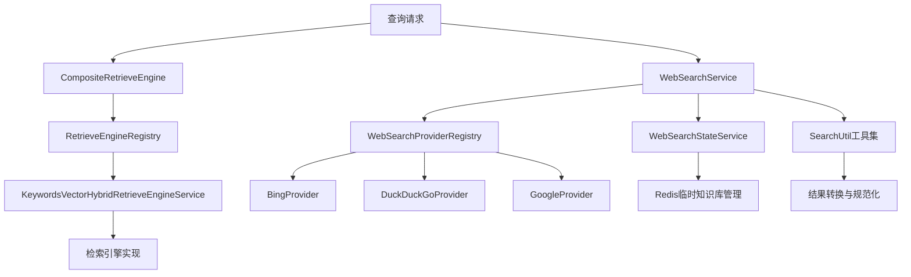

# 检索与网络搜索服务 (retrieval_and_web_search_services)

## 概览

这个模块是整个系统的**信息获取中枢**，它解决了两个核心问题：
1. 如何从内部知识库中高效、灵活地检索相关信息
2. 如何从外部互联网获取实时、多样的搜索结果

想象一下，您正在构建一个智能问答系统，当用户提问时，系统需要同时从内部文档库和互联网中寻找答案。这个模块就像是一个"信息调度中心"，它不仅知道该调用哪个搜索引擎，还能将不同来源的结果智能地融合在一起。

## 架构总览

### 核心组件说明

1. **CompositeRetrieveEngine（组合检索引擎）**：采用组合模式，将多个检索引擎整合在一起，根据不同的检索类型选择合适的引擎执行查询。

2. **RetrieveEngineRegistry（检索引擎注册表）**：管理所有可用的检索引擎，支持动态注册和获取。

3. **KeywordsVectorHybridRetrieveEngineService（关键词向量混合检索引擎）**：同时支持关键词检索和向量检索的混合引擎，能根据需要生成和保存向量嵌入。

4. **WebSearchService（网络搜索服务）**：统一的网络搜索接口，支持多个搜索提供商，包括 Bing、DuckDuckGo 和 Google。

5. **WebSearchProviderRegistry（搜索提供商注册表）**：管理网络搜索提供商的注册和实例化。

6. **WebSearchStateService（网络搜索状态服务）**：管理网络搜索过程中的临时状态，包括临时知识库的创建、使用和清理。

7. **SearchUtil（搜索工具集）**：提供搜索结果转换和关键词分数规范化等实用功能。

## 关键设计决策

### 1. 组合模式与注册表模式的结合

**决策**：使用 `CompositeRetrieveEngine` 结合 `RetrieveEngineRegistry` 来管理多个检索引擎。

**为什么这样设计**：
- 支持多种检索类型（关键词、向量、混合）的灵活组合
- 允许在运行时动态添加新的检索引擎，而不需要修改现有代码
- 通过注册表模式实现了检索引擎的解耦和可扩展性

**替代方案**：
- 直接在代码中硬编码所有检索引擎：不够灵活，难以扩展
- 使用依赖注入容器：可能会增加系统复杂度

### 2. 关键词与向量的混合检索

**决策**：实现 `KeywordsVectorHybridRetrieveEngineService`，在同一个引擎中同时支持关键词和向量检索。

**为什么这样设计**：
- 关键词检索适合精确匹配，向量检索适合语义匹配，两者结合可以提供更全面的检索结果
- 在索引时根据需要生成向量，避免不必要的计算开销
- 支持批量索引和并发处理，提高性能

**性能考量**：
- 使用批量嵌入和并发保存来提高索引效率
- 实现了最大并发数限制，避免对后端系统造成过大压力

### 3. 多搜索引擎提供商支持

**决策**：设计 `WebSearchService` 支持多个搜索引擎提供商（Bing、DuckDuckGo、Google）。

**为什么这样设计**：
- 不同搜索引擎有不同的优势和覆盖范围
- 允许用户根据需求选择合适的搜索引擎
- 通过注册表模式实现提供商的动态注册和管理

**特殊处理**：
- DuckDuckGo 实现了 HTML 抓取和 API 两种方式，并在 HTML 方式失败时自动回退到 API
- 支持黑名单过滤，可以排除特定域名的搜索结果
- 实现了基于 RAG 的结果压缩功能

### 4. 临时知识库管理

**决策**：使用 `WebSearchStateService` 结合 Redis 管理网络搜索过程中的临时知识库。

**为什么这样设计**：
- 网络搜索结果可能很多，通过临时知识库可以进行更精细的筛选和排序
- 使用 Redis 存储状态，支持会话级别的状态保持
- 实现了自动清理机制，避免临时数据堆积

**工作流程**：
1. 创建临时知识库
2. 将网络搜索结果作为知识片段导入
3. 使用混合检索从临时知识库中获取最相关的结果
4. 在会话结束时清理临时知识库

### 5. 搜索结果规范化

**决策**：实现 `NormalizeKeywordScores` 函数，对关键词匹配分数进行规范化处理。

**为什么这样设计**：
- 不同检索引擎返回的分数范围可能不同，需要统一到相同的尺度
- 使用百分位数边界来减少异常值的影响
- 提供回调机制，方便监控和调试

## 子模块概述

### 1. 检索引擎组合与注册表

这个子模块负责检索引擎的管理和组合，包括：
- [组合检索引擎编排](application_services_and_orchestration-retrieval_and_web_search_services-retriever_engine_composition_and_registry-composite_retriever_engine_orchestration.md)
- [关键词向量混合检索引擎服务](application_services_and_orchestration-retrieval_and_web_search_services-retriever_engine_composition_and_registry-keywords_vector_hybrid_retrieve_engine_service.md)
- [检索引擎注册表管理](application_services_and_orchestration-retrieval_and_web_search_services-retriever_engine_composition_and_registry-retrieve_engine_registry_management.md)

### 2. 网络搜索编排、注册表与状态

这个子模块负责网络搜索的整体编排和状态管理，包括：
- [网络搜索编排服务](application_services_and_orchestration-retrieval_and_web_search_services-web_search_orchestration_registry_and_state-web_search_orchestration_service.md)
- [网络搜索提供商注册表](application_services_and_orchestration-retrieval_and_web_search_services-web_search_orchestration_registry_and_state-web_search_provider_registry.md)
- [网络搜索状态管理](application_services_and_orchestration-retrieval_and_web_search_services-web_search_orchestration_registry_and_state-web_search_state_management.md)

### 3. 网络搜索提供商实现

这个子模块包含具体的网络搜索提供商实现，包括：
- [Bing 提供商实现与响应契约](application_services_and_orchestration-retrieval_and_web_search_services-web_search_provider_implementations-bing_provider_implementation_and_response_contract.md)
- [DuckDuckGo 提供商实现](application_services_and_orchestration-retrieval_and_web_search_services-web_search_provider_implementations-duckduckgo_provider_implementation.md)
- [Google 提供商实现](application_services_and_orchestration-retrieval_and_web_search_services-web_search_provider_implementations-google_provider_implementation.md)

### 4. 搜索结果转换与规范化工具

这个子模块提供搜索结果处理的实用工具，包括：
- [网络结果转换选项](application_services_and_orchestration-retrieval_and_web_search_services-search_result_conversion_and_normalization_utilities-web_result_conversion_options.md)
- [关键词分数规范化回调](application_services_and_orchestration-retrieval_and_web_search_services-search_result_conversion_and_normalization_utilities-keyword_score_normalization_callbacks.md)

## 与其他模块的依赖关系

### 依赖的模块

1. **core_domain_types_and_interfaces**：提供了核心的领域类型和接口定义，包括检索引擎接口、网络搜索接口等。

2. **data_access_repositories**：提供了数据访问层的实现，特别是向量检索后端仓库。

3. **model_providers_and_ai_backends**：提供了嵌入模型的实现，用于向量检索。

4. **platform_infrastructure_and_runtime**：提供了运行时配置和基础设施支持。

### 被依赖的模块

1. **application_services_and_orchestration/chat_pipeline_plugins_and_flow**：在聊天流程中使用检索和网络搜索服务。

2. **http_handlers_and_routing**：通过 HTTP 接口暴露检索和网络搜索功能。

## 新贡献者注意事项

### 1. 检索引擎的扩展

如果需要添加新的检索引擎：
1. 实现 `interfaces.RetrieveEngineService` 接口
2. 在 `RetrieveEngineRegistry` 中注册
3. 确保支持所需的 `RetrieverType`

### 2. 网络搜索提供商的扩展

如果需要添加新的网络搜索提供商：
1. 实现 `interfaces.WebSearchProvider` 接口
2. 创建对应的 `ProviderInfo` 函数
3. 在 `Registry` 中注册
4. 考虑添加测试支持

### 3. 并发处理的注意事项

- 模块中大量使用了并发处理，特别是在批量索引和检索时
- 注意使用适当的同步机制（如 `sync.Mutex`、`errgroup`）
- 考虑设置合理的并发限制，避免对后端系统造成压力

### 4. 临时资源的清理

- 网络搜索过程中会创建临时知识库，确保在使用后正确清理
- `WebSearchStateService` 提供了清理功能，但需要在适当的时机调用
- 注意处理清理过程中的错误，避免资源泄漏

### 5. 错误处理和重试

- 一些操作（如批量嵌入）实现了重试机制
- 注意区分可重试错误和不可重试错误
- 提供适当的日志记录，方便调试和监控

## 总结

`retrieval_and_web_search_services` 模块是系统的信息获取核心，它通过组合模式和注册表模式实现了灵活的检索引擎管理，支持关键词和向量的混合检索，并提供了多搜索引擎提供商的支持。同时，它还实现了临时知识库管理和搜索结果规范化等高级功能。

对于新贡献者，建议从理解核心接口和组件开始，逐步深入到具体实现细节。在扩展功能时，注意遵循现有的设计模式和架构风格，确保代码的一致性和可维护性。
