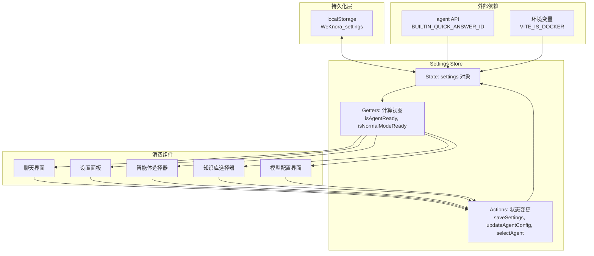

# application_settings_state_contracts 模块深度解析

## 模块概述：前端应用的"控制面板"

想象一下你走进一个复杂的工业控制室 —— 墙上有几十个开关、旋钮和指示灯，每个都控制着系统的某个方面。**`application_settings_state_contracts`** 模块就是这个控制室的操作面板，它统一管理着前端应用的所有运行时配置：从 API 端点、认证密钥，到智能体行为参数、模型选择、知识库绑定，再到各种功能开关（网络搜索、记忆功能等）。

这个模块存在的核心原因是：**一个支持多租户、多模型、多智能体的知识问答系统，需要在客户端维护大量用户可配置的状态，且这些状态需要在页面刷新后持久保留**。如果每个组件各自为政地管理自己的配置，会导致状态不一致、配置丢失、以及难以追踪的 bug。该模块通过 Pinia Store 模式提供了一个**单一事实来源（Single Source of Truth）**，确保整个应用对"当前配置是什么"有一致的理解。

更深层的设计洞察是：**配置不仅是数据，更是用户意图的载体**。用户选择某个智能体、绑定某些知识库、启用某些功能，这些选择构成了他们与系统交互的"上下文"。模块通过 `selectAgent()` 自动重置知识库选择等设计，体现了对"不同智能体需要不同知识上下文"这一业务逻辑的深刻理解。

---

## 架构与数据流



### 架构角色解析

这个模块在整体架构中扮演**状态协调器（State Coordinator）**的角色：

1. **向上游（用户界面）**：提供响应式的状态读取接口（getters）和状态变更接口（actions）。任何组件想要知道"当前是否启用了 Agent 模式"或"用户选择了哪个对话模型"，都通过 getters 获取；任何组件想要修改配置，都通过 actions 提交变更。

2. **向下游（持久化层）**：负责将状态序列化并写入 `localStorage`。这是一个简单但有效的策略 —— 利用浏览器的本地存储能力，在页面刷新后恢复用户配置，无需后端参与。

3. **横向依赖**：依赖 `@/api/agent` 中定义的智能体常量（`BUILTIN_QUICK_ANSWER_ID`, `BUILTIN_SMART_REASONING_ID`），这体现了模块对业务领域概念的耦合。

### 数据流动路径

以**用户切换智能体**为例，数据流如下：

```
用户点击智能体选择器 
  → AgentSelector 组件调用 selectAgent(agentId, sourceTenantId)
  → Action 更新 settings.selectedAgentId 和 settings.selectedAgentSourceTenantId
  → 根据智能体类型自动设置 isAgentEnabled（快速问答=false, 智能推理=true）
  → 重置 selectedKnowledgeBases、selectedFiles、selectedFileKbMap（避免上下文污染）
  → 序列化整个 settings 对象写入 localStorage
  → Pinia 触发响应式更新
  → 所有依赖 getters 的组件（ChatUI、KBSelector 等）重新渲染
```

这个流程的关键设计是**状态变更的原子性**：一次 `selectAgent` 调用会同时更新多个相关字段，确保状态的一致性。如果这些更新分散在多个地方，很容易出现"智能体已切换但知识库未清空"的中间状态。

---

## 核心组件深度解析

### Settings 接口：配置状态的完整 Schema

```typescript
interface Settings {
  endpoint: string;
  apiKey: string;
  knowledgeBaseId: string;
  isAgentEnabled: boolean;
  agentConfig: AgentConfig;
  selectedKnowledgeBases: string[];
  selectedFiles: string[];
  selectedFileKbMap: Record<string, string>;
  modelConfig: ModelConfig;
  ollamaConfig: OllamaConfig;
  webSearchEnabled: boolean;
  enableMemory: boolean;
  conversationModels: ConversationModels;
  selectedAgentId: string;
  selectedAgentSourceTenantId: string | null;
}
```

**设计意图**：这个接口定义了应用配置的"完整状态空间"。每个字段都对应一个用户可感知的配置维度：

| 字段 | 业务含义 | 为什么需要持久化 |
|------|----------|------------------|
| `endpoint` / `apiKey` | 后端服务连接信息 | 用户不必每次刷新都重新输入 |
| `isAgentEnabled` | 是否使用 Agent 推理模式 | 这是用户的工作模式偏好 |
| `agentConfig` | Agent 行为参数（迭代次数、温度等） | 高级用户的调优配置 |
| `selectedKnowledgeBases` | 当前会话绑定的知识库 | 切换会话后应保持选择 |
| `modelConfig` | 所有已配置的模型列表 | 用户添加的模型不应丢失 |
| `conversationModels` | 当前会话使用的模型 ID | 这是会话级上下文 |
| `selectedAgentId` | 当前激活的智能体 | 这是用户当前的工作焦点 |

**关键设计决策**：`selectedFileKbMap: Record<string, string>` 这个字段值得特别注意。它建立了**文件 ID 到知识库 ID 的映射**，用于处理共享知识库场景。当用户从共享知识库选择文件后，前端需要记住这个文件属于哪个知识库，以便后续请求能正确携带 `kb_id` 参数。这是一个典型的**跨实体引用**设计，避免了在多个地方重复存储冗余信息。

### AgentConfig 接口：智能体行为的"调优旋钮"

```typescript
interface AgentConfig {
  maxIterations: number;      // 最大推理迭代次数
  temperature: number;        // LLM 温度参数
  allowedTools: string[];     // 允许使用的工具列表
  system_prompt?: string;     // 统一系统提示词（支持 {{web_search_status}} 占位符）
}
```

**为什么这些参数暴露给用户？** Agent 模式的核心是"让 LLM 自主决定如何解决问题"，但完全开放会导致不可预测的行为。这些参数提供了**可控的灵活性**：

- `maxIterations` 防止无限循环（安全边界）
- `temperature` 平衡创造性与确定性（风格控制）
- `allowedTools` 限制可用工具集（能力边界）
- `system_prompt` 支持高级用户定制行为（深度定制）

**占位符设计**：`system_prompt` 支持 `{{web_search_status}}` 这样的占位符，说明系统会在运行时动态注入上下文信息。这是一种**模板化配置**模式，比硬编码提示词更灵活。

### ModelConfig 与 ModelItem：多模型管理的抽象

```typescript
interface ModelItem {
  id: string;
  name: string;
  source: 'local' | 'remote';
  modelName: string;
  baseUrl?: string;
  apiKey?: string;
  dimension?: number;         // Embedding 专用
  interfaceType?: 'ollama' | 'openai';  // VLLM 专用
  isDefault?: boolean;
}

interface ModelConfig {
  chatModels: ModelItem[];
  embeddingModels: ModelItem[];
  rerankModels: ModelItem[];
  vllmModels: ModelItem[];
}
```

**设计洞察**：这个设计支持**混合模型部署策略**。用户可能同时使用：
- 本地 Ollama 模型（隐私敏感场景）
- 远程 OpenAI 兼容 API（高性能场景）
- 专用 Embedding 服务（向量检索场景）
- VLLM 视觉模型（多模态场景）

`ModelItem` 的统一接口设计使得前端可以用同一套 UI 组件管理所有类型的模型，而 `source` 字段帮助后端路由请求到正确的推理引擎。

**`isDefault` 的互斥逻辑**：在 `addModel`、`updateModel`、`setDefaultModel` 等 action 中，当某个模型被设为默认时，会自动取消同类型其他模型的默认状态。这保证了**每个模型类别有且仅有一个默认值**，避免了"没有默认模型"或"多个默认模型"的歧义状态。

### Getters：从原始状态到业务语义的桥梁

```typescript
getters: {
  isAgentEnabled: (state) => state.settings.isAgentEnabled || false,
  
  isAgentReady: (state) => {
    const config = state.settings.agentConfig || defaultSettings.agentConfig
    const models = state.settings.conversationModels || defaultSettings.conversationModels
    return Boolean(
      config.allowedTools && config.allowedTools.length > 0 &&
      models.summaryModelId && models.summaryModelId.trim() !== '' &&
      models.rerankModelId && models.rerankModelId.trim() !== ''
    )
  },
  
  isNormalModeReady: (state) => {
    const models = state.settings.conversationModels || defaultSettings.conversationModels
    return Boolean(
      models.summaryModelId && models.summaryModelId.trim() !== '' &&
      models.rerankModelId && models.rerankModelId.trim() !== ''
    )
  },
  // ...
}
```

**为什么需要 getters 而不是直接读取 state？**

1. **默认值兜底**：`state.settings.isAgentEnabled || false` 确保即使 state 中该字段为 `undefined`，返回值也是明确的布尔值。这处理了 localStorage 数据损坏或版本升级导致的 schema 不匹配问题。

2. **业务语义封装**：`isAgentReady` 不是一个简单的字段，而是一个**复合条件判断**。它封装了"Agent 模式可运行"的业务规则：需要配置工具列表、摘要模型、重排模型。如果这个逻辑分散在各个组件中，一旦规则变更（比如新增一个依赖项），需要修改多处代码。

3. **计算缓存**：Pinia 会缓存 getters 的返回值，直到依赖的 state 发生变化。这对于频繁读取的计算属性（如 UI 中每秒多次检查 `isAgentReady` 来启用/禁用按钮）有性能优势。

**设计权衡**：`isAgentReady` 和 `isNormalModeReady` 都检查 `summaryModelId` 和 `rerankModelId`，但 Agent 模式额外要求 `allowedTools`。这反映了两种模式的**能力边界差异**：普通模式只需要检索 + 摘要，而 Agent 模式还需要工具调用能力。

### Actions：状态变更的唯一入口

#### `selectAgent()`：智能体切换的编排逻辑

```typescript
selectAgent(agentId: string, sourceTenantId?: string | null) {
  this.settings.selectedAgentId = agentId;
  this.settings.selectedAgentSourceTenantId = (sourceTenantId != null && sourceTenantId !== "") ? sourceTenantId : null;
  
  // 根据智能体类型自动切换 Agent 模式
  if (agentId === BUILTIN_QUICK_ANSWER_ID) {
    this.settings.isAgentEnabled = false;
  } else if (agentId === BUILTIN_SMART_REASONING_ID) {
    this.settings.isAgentEnabled = true;
  }
  
  // 切换智能体时重置知识库和文件选择状态
  this.settings.selectedKnowledgeBases = [];
  this.settings.selectedFiles = [];
  this.settings.selectedFileKbMap = {};
  localStorage.setItem("WeKnora_settings", JSON.stringify(this.settings));
}
```

**这是整个模块最复杂的 action**，它体现了几个关键设计原则：

1. **智能体与模式的绑定**：快速问答（`BUILTIN_QUICK_ANSWER_ID`）对应普通模式，智能推理（`BUILTIN_SMART_REASONING_ID`）对应 Agent 模式。用户切换智能体时，自动切换模式，避免"用快速问答智能体却开启 Agent 推理"的配置冲突。

2. **上下文隔离**：不同智能体可能关联不同的知识库集合。切换智能体时清空 `selectedKnowledgeBases` 和 `selectedFiles`，防止用户意外地用 A 智能体访问 B 智能体的知识库。这是一个**防御性设计**，牺牲了一点便利性（用户需要重新选择知识库）换取了安全性。

3. **空值规范化**：`sourceTenantId` 的处理逻辑 `(sourceTenantId != null && sourceTenantId !== "") ? sourceTenantId : null` 确保存储的值只有两种状态：有效的租户 ID 字符串，或 `null`。这避免了 `""`、`undefined`、`null` 多种"空值"表示带来的判断复杂性。

#### 模型管理 Actions：维护 `isDefault` 的不变量

```typescript
addModel(type: 'chat' | 'embedding' | 'rerank' | 'vllm', model: ModelItem) {
  const key = `${type}Models` as keyof ModelConfig;
  const models = [...this.settings.modelConfig[key]] as ModelItem[];
  
  // 如果设为默认，取消其他模型的默认状态
  if (model.isDefault) {
    models.forEach(m => m.isDefault = false);
  }
  
  // 如果是第一个模型，自动设为默认
  if (models.length === 0) {
    model.isDefault = true;
  }
  
  models.push(model);
  this.settings.modelConfig[key] = models as any;
  localStorage.setItem("WeKnora_settings", JSON.stringify(this.settings));
}
```

**不变量（Invariant）**：每个模型类别（chat/embedding/rerank/vllm）必须有且仅有一个 `isDefault=true` 的模型（当列表非空时）。

这个 action 通过两个机制维护不变量：
1. **显式默认**：如果新模型标记为 `isDefault`，先清除所有现有模型的默认状态
2. **隐式默认**：如果这是第一个模型，自动设为默认

**潜在问题**：`deleteModel` 中，如果删除的是默认模型，会将第一个模型设为默认。但如果列表为空，就没有默认模型了 —— 这是一个**边界情况**，依赖 `getters` 中的默认值兜底逻辑来处理。

---

## 依赖关系分析

### 上游依赖（谁调用这个模块）

| 调用方 | 调用内容 | 期望行为 |
|--------|----------|----------|
| 聊天界面组件 | `isAgentReady`, `isNormalModeReady` | 判断是否允许发送消息 |
| 设置面板组件 | 所有 actions | 修改用户配置 |
| 智能体选择器 | `selectAgent()`, `getSelectedAgentId()` | 切换智能体并获取当前选择 |
| 知识库选择器 | `selectKnowledgeBases()`, `getSelectedKnowledgeBases()` | 管理知识库绑定 |
| 模型配置界面 | `addModel()`, `updateModel()`, `modelConfig` | 管理模型列表 |

### 下游依赖（这个模块调用谁）

| 被调用方 | 调用内容 | 调用原因 |
|----------|----------|----------|
| `localStorage` | `getItem()`, `setItem()` | 持久化配置 |
| `@/api/agent` | `BUILTIN_QUICK_ANSWER_ID`, `BUILTIN_SMART_REASONING_ID` | 内置智能体常量 |
| `import.meta.env` | `VITE_IS_DOCKER` | 环境检测（决定默认 endpoint） |

### 数据契约

**与 localStorage 的契约**：
- Key 固定为 `"WeKnora_settings"`
- Value 为 Settings 接口的 JSON 序列化字符串
- **隐式契约**：schema 变更时需要处理版本迁移（当前代码未实现，是一个技术债）

**与 agent API 的契约**：
- 依赖两个常量 ID 来识别内置智能体
- 如果后端新增内置智能体类型，前端需要同步更新这些常量

---

## 设计决策与权衡

### 1. 为什么用 localStorage 而不是后端存储？

**选择**：配置存储在浏览器 localStorage

**权衡分析**：

| 维度 | localStorage | 后端存储 |
|------|--------------|----------|
| 实现复杂度 | 低（几行代码） | 高（需要 API、数据库、认证） |
| 跨设备同步 | ❌ 不支持 | ✅ 支持 |
| 离线可用 | ✅ 支持 | ❌ 需要缓存策略 |
| 隐私性 | ✅ 数据在本地 | ⚠️ 数据上传到服务器 |
| 容量限制 | ~5-10MB | 取决于后端 |
| 版本迁移 | ⚠️ 需要手动处理 | ✅ 可通过后端逻辑处理 |

**为什么选择 localStorage**：
1. **配置是用户本地的偏好**：不同设备可能有不同配置（家里用 Ollama，公司用远程 API）
2. **减少后端负担**：配置读取频率高，但变更频率低，不适合每次都查数据库
3. **快速迭代**：前端可以独立修改配置 schema，无需后端配合

**技术债**：当前代码没有 schema 版本管理。如果未来 `Settings` 接口变更（比如新增字段、修改类型），旧版本的 localStorage 数据可能导致运行时错误。建议引入版本号字段，在加载时进行迁移。

### 2. 为什么 Settings 是扁平结构而不是嵌套模块？

**选择**：所有配置字段都在同一层级

**权衡分析**：

```typescript
// 当前设计（扁平）
{
  endpoint: string,
  agentConfig: { ... },
  modelConfig: { ... },
  ollamaConfig: { ... }
}

// 替代设计（模块化）
{
  connection: { endpoint, apiKey },
  agent: { enabled, config },
  models: { config, ollama, conversation },
  features: { webSearch, memory }
}
```

**为什么选择扁平**：
1. **简单性优先**：嵌套过深会增加访问路径（`state.settings.models.conversation.selectedChatModelId` vs `state.settings.conversationModels.selectedChatModelId`）
2. **Pinia 的响应式追踪**：扁平结构更容易让 Pinia 追踪哪些组件依赖哪些字段
3. **localStorage 序列化**：扁平对象序列化后更紧凑

**代价**：当配置项超过 20 个时，扁平结构会变得难以浏览。当前设计处于临界点，未来可能需要重构。

### 3. 为什么 `selectAgent()` 要重置知识库选择？

**选择**：切换智能体时清空 `selectedKnowledgeBases` 和 `selectedFiles`

**权衡分析**：

| 方案 | 优点 | 缺点 |
|------|------|------|
| 重置选择 | 避免上下文污染，安全 | 用户需要重新选择，体验稍差 |
| 保留选择 | 用户体验流畅 | 可能用错知识库，导致错误结果 |

**为什么选择重置**：
1. **业务语义**：不同智能体设计用于不同的知识域。快速问答可能面向通用知识，而某个定制智能体可能只面向特定知识库。保留选择会导致语义混淆。
2. **防御性编程**：宁可让用户多操作一次，也不要让用户得到错误的答案。
3. **简化后端逻辑**：后端不需要处理"智能体 A 能否访问智能体 B 的知识库"的权限检查。

**改进空间**：可以提供"智能体 - 知识库"的预设绑定，切换智能体时自动选择推荐的知识库，而不是完全清空。

### 4. 为什么 getters 中大量使用 `|| defaultSettings.xxx` 兜底？

**选择**：每个 getter 都提供默认值

**原因**：
1. **localStorage 数据损坏**：用户可能手动修改 localStorage，导致字段缺失或类型错误
2. **版本升级**：新增字段后，旧用户的 localStorage 中没有该字段
3. **TypeScript 的局限性**：虽然类型定义要求字段存在，但运行时无法保证

**潜在问题**：这种模式会掩盖 schema 不匹配的问题。更好的做法是在应用启动时进行一次性的 schema 验证和迁移，而不是在每个 getter 中兜底。

---

## 使用指南与示例

### 基础使用模式

```typescript
import { useSettingsStore } from '@/stores/settings';

const settingsStore = useSettingsStore();

// 读取配置
const endpoint = settingsStore.getEndpoint();
const isReady = settingsStore.isAgentReady;

// 修改配置
settingsStore.updateAgentConfig({ temperature: 0.8 });
settingsStore.toggleWebSearch(true);

// 批量更新
settingsStore.updateConversationModels({
  summaryModelId: 'model-123',
  rerankModelId: 'rerank-456'
});
```

### 智能体切换的完整流程

```typescript
// 用户选择"智能推理"模式
settingsStore.selectAgent(BUILTIN_SMART_REASONING_ID);

// 此时状态变化：
// - selectedAgentId = BUILTIN_SMART_REASONING_ID
// - isAgentEnabled = true
// - selectedKnowledgeBases = [] (已清空)
// - selectedFiles = [] (已清空)

// 用户需要重新选择知识库
settingsStore.selectKnowledgeBases(['kb-1', 'kb-2']);
```

### 模型配置的典型操作

```typescript
// 添加一个新的聊天模型
settingsStore.addModel('chat', {
  id: 'ollama-llama3',
  name: 'Llama 3 (Local)',
  source: 'local',
  modelName: 'llama3',
  isDefault: true  // 自动取消其他模型的默认状态
});

// 更新模型配置
settingsStore.updateModel('chat', 'ollama-llama3', {
  temperature: 0.7
});

// 设置默认模型
settingsStore.setDefaultModel('chat', 'gpt-4-remote');

// 删除模型（如果删除的是默认模型，第一个模型会自动成为默认）
settingsStore.deleteModel('chat', 'old-model-id');
```

---

## 边界情况与注意事项

### 1. localStorage 容量限制

**问题**：localStorage 通常限制在 5-10MB。如果用户配置了大量模型（每个模型有 baseUrl、apiKey 等），可能接近限制。

**症状**：`setItem()` 抛出 `QuotaExceededError`，配置无法保存。

**缓解措施**：
- 定期清理不用的模型配置
- 考虑将敏感信息（apiKey）移到更安全的地方（如浏览器的密码管理器）

### 2. Schema 版本不兼容

**问题**：假设 v1.0 的 `Settings` 没有 `enableMemory` 字段，v1.1 新增了该字段。v1.0 用户升级到 v1.1 后，`enableMemory` 为 `undefined`。

**当前处理**：getter 中用 `|| false` 兜底。

**更好的方案**：
```typescript
// 在 store 初始化时进行迁移
const stored = localStorage.getItem("WeKnora_settings");
let settings = JSON.parse(stored || JSON.stringify(defaultSettings));

// Schema 迁移
if (!settings.enableMemory) settings.enableMemory = false;
if (!settings.selectedAgentSourceTenantId) settings.selectedAgentSourceTenantId = null;

// 保存迁移后的数据
localStorage.setItem("WeKnora_settings", JSON.stringify(settings));
```

### 3. 并发修改冲突

**问题**：如果多个标签页同时修改配置，后写入的会覆盖先写入的。

**场景**：用户在标签页 A 启用 Agent 模式，在标签页 B 禁用 Agent 模式，最后保存的配置取决于哪个标签页后调用 `setItem()`。

**缓解措施**：
- 使用 `storage` 事件监听其他标签页的变更，同步状态
- 或引入版本号，写入前检查版本号是否匹配

### 4. 敏感信息泄露风险

**问题**：`apiKey` 以明文存储在 localStorage，任何有页面访问权限的 JavaScript 都可以读取。

**风险等级**：中等（XSS 攻击可窃取密钥）

**建议**：
- 如果可能，使用后端代理，不在前端存储密钥
- 或至少对密钥进行加密存储（但密钥本身也需要保护）

### 5. `selectedAgentId` 与 `isAgentEnabled` 的同步

**隐式契约**：`selectedAgentId === BUILTIN_QUICK_ANSWER_ID` 时，`isAgentEnabled` 应为 `false`；`selectedAgentId === BUILTIN_SMART_REASONING_ID` 时，`isAgentEnabled` 应为 `true`。

**风险**：如果直接调用 `toggleAgent()` 而不通过 `selectAgent()`，可能破坏这个契约。

**示例**：
```typescript
// 危险操作：可能导致状态不一致
settingsStore.selectAgent(BUILTIN_QUICK_ANSWER_ID);  // isAgentEnabled = false
settingsStore.toggleAgent(true);  // 现在 isAgentEnabled = true，但智能体是快速问答
```

**建议**：将 `isAgentEnabled` 设为只读 getter，由 `selectedAgentId` 推导得出，而不是独立存储。

---

## 扩展点与修改建议

### 1. 添加配置版本管理

```typescript
interface Settings {
  schemaVersion: number;  // 新增版本号
  // ... 其他字段
}

// 在 store 初始化时迁移
function migrateSettings(settings: any): Settings {
  if (!settings.schemaVersion) settings.schemaVersion = 0;
  
  if (settings.schemaVersion < 1) {
    settings.enableMemory = false;
    settings.schemaVersion = 1;
  }
  
  // ... 更多迁移逻辑
  
  return settings as Settings;
}
```

### 2. 添加配置验证

```typescript
function validateSettings(settings: any): Settings {
  if (typeof settings.endpoint !== 'string') {
    throw new Error('Invalid endpoint');
  }
  if (settings.agentConfig.maxIterations < 1) {
    throw new Error('maxIterations must be >= 1');
  }
  // ... 更多验证
  return settings as Settings;
}
```

### 3. 支持配置导入/导出

```typescript
exportSettings(): string {
  return JSON.stringify(this.settings, null, 2);
}

importSettings(json: string) {
  const settings = JSON.parse(json);
  this.saveSettings(validateSettings(settings));
}
```

---

## 相关模块参考

- [agent_conversation_api](agent_conversation_api.md) - Agent 会话相关的 API 契约
- [knowledge_base_api](knowledge_base_api.md) - 知识库管理 API
- [model_api](model_api.md) - 模型配置 API
- [tenant_and_evaluation_api](tenant_and_evaluation_api.md) - 租户配置（与 `selectedAgentSourceTenantId` 相关）

---

## 总结

`application_settings_state_contracts` 模块是前端应用的配置中枢，它通过 Pinia Store 模式实现了：

1. **状态集中管理**：所有配置在一个地方，避免分散状态导致的不一致
2. **持久化透明**：自动保存到 localStorage，用户无感知
3. **业务语义封装**：通过 getters 将原始数据转换为业务概念（如 `isAgentReady`）
4. **变更编排**：复杂操作（如 `selectAgent`）原子性地更新多个相关字段

核心设计权衡是**简单性优先于灵活性**：用 localStorage 而非后端存储、用扁平结构而非嵌套模块、用运行时兜底而非 schema 迁移。这些选择在项目早期加速了开发，但随着功能增长，可能需要引入更复杂的机制（版本管理、验证、同步）来维护系统的健壮性。

对于新贡献者，最需要理解的是：**这个模块不仅是数据存储，更是用户意图的载体**。每次配置变更都反映了用户想要如何与系统交互，模块的设计应该尊重和保护这些意图，而不是简单地读写字段。
