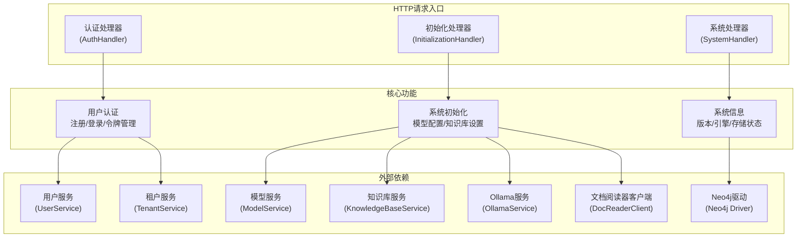

# 认证初始化与系统操作处理器模块

## 模块概述

这个模块是系统的入口门户，就像一个智能建筑的前台接待区和后勤管理中心。它负责处理用户身份验证、系统初始化配置和系统级信息查询等核心功能。想象一下，当你第一次进入一个新的办公楼时，你需要在前台登记身份（认证）、领取门禁卡和设施使用指南（初始化配置），然后才能使用楼内的各项服务。这个模块就扮演了这样的角色。

## 架构概览

这个模块由三个主要处理器组成：

1. **认证处理器 (AuthHandler)**: 负责用户身份验证、注册、登录、登出、令牌刷新等功能。它就像建筑的门禁系统，验证每个人的身份并发放通行证。

2. **初始化处理器 (InitializationHandler)**: 负责系统初始化配置，包括模型设置、知识库配置、Ollama模型管理、多模态功能测试等。它就像建筑的后勤部门，负责设置和维护各种设施。

3. **系统处理器 (SystemHandler)**: 负责提供系统级信息，如版本号、构建信息、引擎配置、MinIO存储桶状态等。它就像建筑的信息中心，提供关于整个建筑的状态信息。

## 设计决策

### 1. 职责分离设计

**决策**：将认证、初始化和系统操作分离到三个独立的处理器中。

**原因**：这种设计遵循单一职责原则，每个处理器只负责一类功能，使得代码更易于理解、测试和维护。

**权衡**：
- ✅ 优点：代码结构清晰，每个处理器职责明确，易于独立测试和修改。
- ⚠️ 缺点：可能会有一些重复代码，比如错误处理和日志记录。

### 2. 环境变量控制功能开关

**决策**：使用环境变量（如 `DISABLE_REGISTRATION`、`NEO4J_ENABLE`）来控制某些功能的启用或禁用。

**原因**：这种设计使得系统可以在不修改代码的情况下，通过配置来改变行为，提高了系统的灵活性和可部署性。

**权衡**：
- ✅ 优点：部署灵活，可以在不同环境中启用不同功能。
- ⚠️ 缺点：可能会导致配置复杂，需要文档清楚说明每个环境变量的作用。

### 3. 异步模型下载

**决策**：使用异步任务来处理Ollama模型的下载，并提供进度查询接口。

**原因**：模型下载可能需要很长时间（几分钟到几小时），使用同步请求会导致HTTP超时，用户体验差。异步处理可以让用户在下载过程中继续使用系统，并随时查询进度。

**权衡**：
- ✅ 优点：用户体验好，不会因为长时间等待而超时。
- ⚠️ 缺点：实现复杂度增加，需要管理异步任务的状态和生命周期。

### 4. 配置验证与安全措施

**决策**：在处理配置请求时进行严格的验证，并对敏感信息进行脱敏处理。

**原因**：配置错误可能导致系统无法正常工作，敏感信息泄露可能造成安全风险。

**权衡**：
- ✅ 优点：提高了系统的稳定性和安全性。
- ⚠️ 缺点：增加了代码复杂度，可能会影响一些开发调试时的便利性。

## 子模块概览

本模块包含以下子模块：

- [认证端点处理器](http_handlers_and_routing-auth_initialization_and_system_operations_handlers-auth_endpoint_handler.md)：负责用户认证相关的HTTP端点处理
- [初始化引导与模型设置](http_handlers_and_routing-auth_initialization_and_system_operations_handlers-initialization_bootstrap_and_model_setup.md)：负责系统初始化和模型配置
- [初始化提取与多模态契约](http_handlers_and_routing-auth_initialization_and_system_operations_handlers-initialization_extraction_and_multimodal_contracts.md)：负责知识提取和多模态功能配置
- [系统信息与存储桶策略操作](http_handlers_and_routing-auth_initialization_and_system_operations_handlers-system_info_and_bucket_policy_operations.md)：负责系统信息查询和存储桶管理

## 跨模块依赖

这个模块与系统的其他部分有重要的依赖关系：

1. **依赖的模块**：
   - [身份租户与组织服务](application_services_and_orchestration-agent_identity_tenant_and_configuration_services.md)：提供用户和租户管理功能
   - [模型目录与配置](core_domain_types_and_interfaces-identity_tenant_organization_and_configuration_contracts.md)：提供模型配置和管理
   - [知识库领域模型](core_domain_types_and_interfaces-knowledge_graph_retrieval_and_content_contracts.md)：提供知识库相关的数据结构
   - [聊天与嵌入模型](model_providers_and_ai_backends.md)：提供AI模型功能

2. **被依赖的模块**：
   - [路由中间件与后台任务](http_handlers_and_routing-routing_middleware_and_background_task_wiring.md)：负责将HTTP请求路由到这些处理器

## 使用指南

### 认证流程

1. **用户注册**：发送POST请求到 `/auth/register`，包含用户名、邮箱和密码。
2. **用户登录**：发送POST请求到 `/auth/login`，包含邮箱和密码，获取访问令牌和刷新令牌。
3. **令牌刷新**：发送POST请求到 `/auth/refresh`，使用刷新令牌获取新的访问令牌。
4. **获取当前用户信息**：发送GET请求到 `/auth/me`，需要在Authorization头中提供访问令牌。
5. **修改密码**：发送POST请求到 `/auth/change-password`，包含旧密码和新密码。
6. **用户登出**：发送POST请求到 `/auth/logout`，撤销当前访问令牌。

### 系统初始化流程

1. **检查Ollama服务状态**：发送GET请求到 `/initialization/ollama/status`。
2. **列出已安装的Ollama模型**：发送GET请求到 `/initialization/ollama/models`。
3. **下载Ollama模型**：发送POST请求到 `/initialization/ollama/models/download`，创建异步下载任务。
4. **查询下载进度**：发送GET请求到 `/initialization/ollama/download/{taskId}`。
5. **初始化知识库配置**：发送POST请求到 `/initialization/kb/{kbId}`，配置知识库的模型和参数。
6. **测试远程模型连接**：发送POST请求到 `/initialization/models/remote/check`。
7. **测试Embedding模型**：发送POST请求到 `/initialization/models/embedding/test`。

### 系统信息查询

1. **获取系统信息**：发送GET请求到 `/system/info`，获取版本号、构建信息、引擎配置等。
2. **列出MinIO存储桶**：发送GET请求到 `/system/minio/buckets`，获取所有存储桶及其访问权限。

## 注意事项与陷阱

1. **环境变量配置**：确保正确配置所有必需的环境变量，特别是与Ollama、MinIO和Neo4j相关的变量。
2. **知识库模型变更限制**：一旦知识库中有文件，就不能更改Embedding模型，因为这会导致已存在的向量无法使用。
3. **异步任务状态管理**：下载任务状态存储在内存中，服务重启后会丢失。
4. **敏感信息保护**：在日志中对敏感信息进行了脱敏处理，但在调试时可能需要查看完整信息。
5. **模型配置验证**：在应用配置前会进行验证，但某些配置错误可能只有在实际使用时才会发现。
6. **多模态功能依赖**：多模态功能依赖于DocReader服务，确保该服务正常运行且配置正确。
