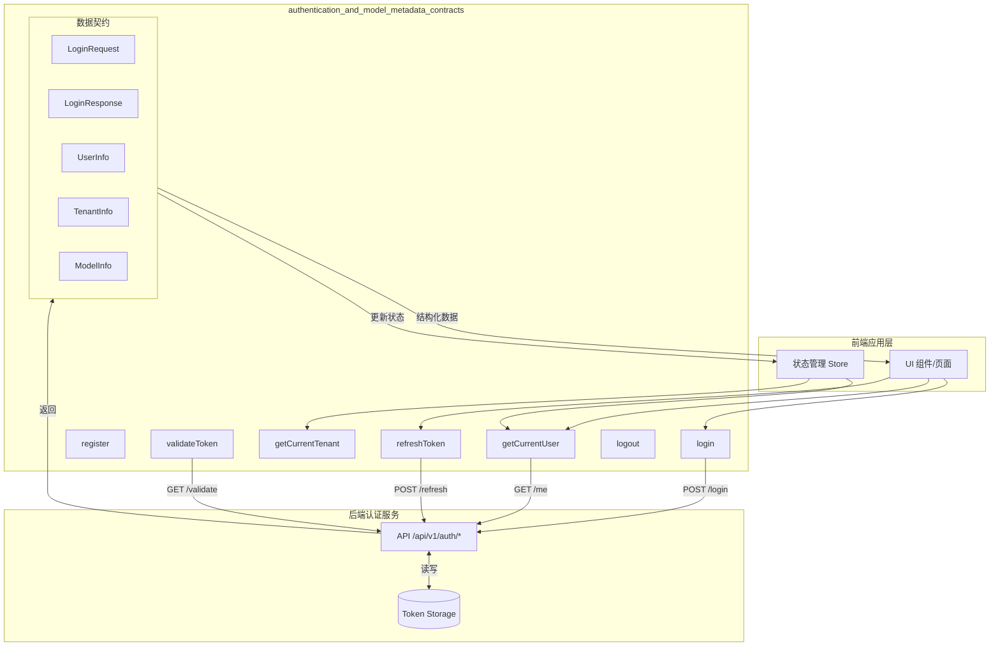

# Authentication and Model Metadata Contracts

## 概述：为什么需要这个模块

想象一下，你正在构建一个多租户的 AI 知识库平台。每个用户登录后需要知道自己的身份、所属租户、可用模型，以及这些资源的访问权限。前端不能直接查询数据库，也不能信任客户端传来的任何身份声明——它需要一个**可信的契约层**来与后端认证系统对话。

`authentication_and_model_metadata_contracts` 模块正是这个契约层。它定义了前端与后端认证系统之间的**数据协议**和**通信接口**，解决的核心问题是：**如何在无状态的 HTTP 协议上，建立并维护一个安全的、多租户的用户会话上下文**。

这个模块的设计洞察在于：认证不是单次事件，而是一个**持续的状态管理过程**。用户登录只是开始，后续每次请求都需要验证 token 有效性、刷新过期凭证、在多个租户间切换上下文。模块通过统一的接口封装，让前端业务代码无需关心这些底层细节，只需调用 `getCurrentUser()` 或 `refreshToken()` 即可获得一致的行为。

## 架构与数据流



### 架构角色解析

这个模块在系统中扮演**网关适配器**的角色：

1. **协议翻译器**：将后端的 REST API 响应转换为前端类型安全的 TypeScript 接口
2. **错误吸收层**：所有 API 调用都被 `try-catch` 包裹，确保网络错误不会直接抛到 UI 层
3. **状态同步点**：前端 Store 通过调用这些接口获取最新的用户和租户状态

### 数据流动路径

以用户登录为例，数据流经以下节点：

```
UI 表单输入 → LoginRequest → POST /api/v1/auth/login 
         → 后端验证 → LoginResponse 
         → 前端解析 → Store 更新 → UI 重渲染
```

关键的是，`LoginResponse` 中携带的 `token` 和 `refresh_token` 会被持久化（通常存储在 localStorage 或 secure cookie），后续所有 API 请求都会附带这个 token。当 token 过期时，`refreshToken()` 函数会被自动或手动调用，用 `refresh_token` 换取新的 `access_token`。

## 核心组件深度解析

### 认证请求/响应契约

#### `LoginRequest` 与 `LoginResponse`

```typescript
export interface LoginRequest {
  email: string
  password: string
}

export interface LoginResponse {
  success: boolean
  message?: string
  user?: { ... }
  tenant?: { ... }
  token?: string
  refresh_token?: string
}
```

**设计意图**：`LoginResponse` 采用**联合响应模式**——无论成功失败都返回相同结构，通过 `success` 字段区分。这种设计的好处是前端无需在 `try-catch` 中处理两种完全不同的数据结构，统一检查 `success` 即可。

**为什么 `user` 和 `tenant` 是可选的**？因为登录失败时这些字段不存在，但 TypeScript 需要知道完整结构。这种设计避免了定义 `LoginSuccessResponse` 和 `LoginFailureResponse` 两个接口带来的类型联合复杂性。

#### `RegisterRequest` 与 `RegisterResponse`

注册接口与登录接口的关键差异在于：注册成功后返回的 `data` 字段包含新创建的 `user` 和 `tenant` 对象。这反映了一个业务事实：**首次注册的用户会自动创建一个默认租户**，无需手动申请。

```typescript
export interface RegisterResponse {
  success: boolean
  message?: string
  data?: {
    user: { id, username, email }
    tenant: { id, name, api_key }
  }
}
```

**注意**：注册响应中的 `tenant` 包含 `api_key`，这是租户调用外部 API 的凭证。登录响应中的 `tenant` 也包含此字段，但注册时返回更完整，因为这是用户首次获取 API 密钥的唯一机会。

### 用户与租户状态契约

#### `UserInfo`

```typescript
export interface UserInfo {
  id: string
  username: string
  email: string
  avatar?: string
  tenant_id: string
  can_access_all_tenants?: boolean
  created_at: string
  updated_at: string
}
```

**关键字段解析**：

- `tenant_id`：用户当前关联的租户 ID。多租户系统中，一个用户可能属于多个租户，但每次会话只激活一个。
- `can_access_all_tenants`：管理员标志。为 `true` 表示该用户可以访问系统中所有租户（通常是平台运营人员）。
- `avatar` 是可选的，因为用户可能从未上传过头像。

#### `TenantInfo`

```typescript
export interface TenantInfo {
  id: string
  name: string
  description?: string
  api_key: string
  status?: string
  business?: string
  owner_id: string
  storage_quota?: number
  storage_used?: number
  created_at: string
  updated_at: string
  knowledge_bases?: KnowledgeBaseInfo[]
}
```

**设计权衡**：`TenantInfo` 包含 `knowledge_bases` 数组，这是一个**预加载优化**。理论上，获取租户信息和获取租户下的知识库应该分开查询，但这里将知识库列表嵌入租户响应，减少了前端首次加载时的请求数量。

**潜在问题**：当租户下有数百个知识库时，这个响应会变得很大。如果未来遇到性能问题，应该将 `knowledge_bases` 拆分为独立接口。

#### `ModelInfo`

```typescript
export interface ModelInfo {
  id: string
  name: string
  type: string
  source: string
  description?: string
  is_default?: boolean
  created_at: string
  updated_at: string
}
```

**模块命名解释**：模块名中的 "Model Metadata" 主要指的就是这个接口。它定义了 LLM 模型的元数据，前端用这些信息渲染模型选择下拉框。

- `type`：模型类型（如 `chat`、`embedding`、`rerank`）
- `source`：模型来源（如 `openai`、`anthropic`、`local`）
- `is_default`：是否为租户的默认模型

**依赖关系**：这个接口与后端的 [`model_api`](model_api.md) 模块中的 `Model` 结构对应，但字段有所精简，只保留前端需要的展示信息。

### API 函数实现分析

#### `login()` 与 `register()`

```typescript
export async function login(data: LoginRequest): Promise<LoginResponse> {
  try {
    const response = await post('/api/v1/auth/login', data)
    return response as unknown as LoginResponse
  } catch (error: any) {
    return {
      success: false,
      message: error.message || '登录失败'
    }
  }
}
```

**错误处理模式**：所有 API 函数都采用相同的错误处理策略——捕获异常后返回一个 `success: false` 的响应对象，而不是抛出异常。这样做的好处是：

1. **调用方无需 try-catch**：UI 组件可以直接 `const result = await login(...)` 然后检查 `result.success`
2. **统一错误消息**：网络错误、超时、服务器错误都被转换为友好的中文提示

**代价**：这种模式隐藏了错误的真实类型。如果调用方需要区分"网络错误"和"认证失败"，需要解析 `message` 字段，这不够类型安全。

#### `refreshToken()`

```typescript
export async function refreshToken(refreshToken: string): Promise<{ 
  success: boolean; 
  data?: { token: string; refreshToken: string }; 
  message?: string 
}> {
  try {
    const response: any = await post('/api/v1/auth/refresh', { refreshToken })
    if (response && response.success) {
      if (response.access_token || response.refresh_token) {
        return {
          success: true,
          data: {
            token: response.access_token,
            refreshToken: response.refresh_token,
          }
        }
      }
    }
    return {
      success: false,
      message: response?.message || '刷新 Token 失败'
    }
  } catch (error: any) {
    return {
      success: false,
      message: error.message || '刷新 Token 失败'
    }
  }
}
```

**设计细节**：

1. **参数命名冲突**：函数名叫 `refreshToken`，参数也叫 `refreshToken`。这在 TypeScript 中是合法的（参数遮蔽函数名），但阅读时容易混淆。更好的命名是 `refreshAccessToken(refreshToken: string)`。

2. **响应字段映射**：后端返回 `access_token` 和 `refresh_token`，但前端统一称为 `token` 和 `refreshToken`。这个映射层让前端代码无需关心后端的命名约定。

3. **双重验证**：先检查 `response.success`，再检查 `access_token || refresh_token`。这是因为某些情况下后端可能返回 `success: true` 但实际没有刷新 token（比如 refresh_token 也过期了）。

#### `getCurrentUser()` 与 `getCurrentTenant()`

```typescript
export async function getCurrentUser(): Promise<{ 
  success: boolean; 
  data?: { user: UserInfo; tenant: TenantInfo }; 
  message?: string 
}> {
  try {
    const response = await get('/api/v1/auth/me')
    return response as unknown as { success: boolean; data?: { user: UserInfo; tenant: TenantInfo }; message?: string }
  } catch (error: any) {
    return {
      success: false,
      message: error.message || '获取用户信息失败'
    }
  }
}
```

**使用场景**：这两个函数通常在应用启动时调用，用于恢复用户会话。典型流程是：

```typescript
// App 初始化时
const userResult = await getCurrentUser()
if (userResult.success) {
  store.setUser(userResult.data.user)
  store.setTenant(userResult.data.tenant)
} else {
  router.push('/login')
}
```

**依赖关系**：这些函数依赖于 `@/utils/request` 模块中的 `get` 函数，该函数会自动在请求头中附加当前存储的 token。如果 token 过期，后端返回 401，`request` 模块可能会自动调用 `refreshToken()`，但这取决于 `request` 模块的具体实现。

#### `validateToken()`

```typescript
export async function validateToken(): Promise<{ 
  success: boolean; 
  valid?: boolean; 
  message?: string 
}> {
  try {
    const response = await get('/api/v1/auth/validate')
    return response as unknown as { success: boolean; valid?: boolean; message?: string }
  } catch (error: any) {
    return {
      success: false,
      valid: false,
      message: error.message || 'Token 验证失败'
    }
  }
}
```

**与 `getCurrentUser()` 的区别**：`validateToken()` 只验证 token 是否有效，不返回用户信息。适用场景是：

- 定时检查 token 是否即将过期
- 在执行敏感操作前快速验证权限
- 调试和诊断

**返回值设计**：注意返回类型中有 `valid?: boolean` 字段，这与 `success` 字段有细微差别：
- `success: false` 表示 API 调用失败（网络错误、服务器错误）
- `valid: false` 表示 API 调用成功但 token 无效

## 依赖关系分析

### 上游依赖（被谁调用）

这个模块主要被以下组件调用：

1. **前端状态管理 Store**：[`frontend_state_store_contracts`](frontend_contracts_and_state.md) 中的状态管理代码会调用 `getCurrentUser()` 和 `getCurrentTenant()` 来初始化应用状态。

2. **登录/注册页面组件**：直接调用 `login()` 和 `register()` 处理用户提交。

3. **API 请求拦截器**：`@/utils/request` 模块在检测到 401 响应时，可能会调用 `refreshToken()` 自动刷新 token。

4. **路由守卫**：在导航到受保护路由前，调用 `validateToken()` 检查用户是否已登录。

### 下游依赖（调用谁）

```typescript
import { post, get, put } from '@/utils/request'
```

模块唯一依赖是 `@/utils/request`，这是一个封装了 fetch/axios 的基础 HTTP 客户端。它负责：

- 添加认证头（Authorization: Bearer <token>）
- 处理通用错误（超时、网络断开）
- 可能的自动 token 刷新

**耦合风险**：如果 `request` 模块改变了行为（比如不再自动附加 token），这个模块的所有函数都会受到影响。但由于所有 API 调用都通过 `request`，这个耦合是必要的。

### 数据契约对应关系

| 前端接口 | 后端对应模块 | 说明 |
|---------|-------------|------|
| `LoginRequest` | [`internal.types.user.LoginRequest`](core_domain_types_and_interfaces.md) | 完全对应 |
| `LoginResponse` | [`internal.types.user.LoginResponse`](core_domain_types_and_interfaces.md) | 前端简化版 |
| `UserInfo` | [`internal.types.user.UserInfo`](core_domain_types_and_interfaces.md) | 字段基本一致 |
| `ModelInfo` | [`client.model.Model`](model_api.md) | 前端展示精简版 |
| `TenantInfo` | [`client.tenant.Tenant`](tenant_and_evaluation_api.md) | 前端扩展了 `knowledge_bases` |

## 设计决策与权衡

### 1. 统一错误处理 vs 精确错误类型

**选择**：所有函数捕获异常后返回 `success: false` 对象，不抛出异常。

**优点**：
- 调用方代码简洁，无需 try-catch
- 错误消息统一处理，易于国际化

**缺点**：
- 丢失错误类型信息（网络错误 vs 业务错误）
- 无法利用 TypeScript 的类型收窄特性

**替代方案**：可以定义 `ApiError` 类，包含 `code`、`message`、`details` 字段，然后抛出这个错误。调用方用 `instanceof` 判断错误类型。但这会增加调用方的代码复杂度。

### 2. 响应中包含完整用户/租户信息 vs 仅返回 token

**选择**：登录成功后直接返回 `user` 和 `tenant` 对象，而不是只返回 token 让前端再调用 `/me` 接口。

**优点**：
- 减少一次 HTTP 请求，加快登录后的页面渲染
- 原子性：登录成功就意味着能获取到用户信息，不会出现登录成功但获取用户信息失败的不一致状态

**缺点**：
- 响应体较大
- 如果用户信息在登录后立即被修改（比如管理员修改了用户权限），前端会有短暂的不一致

### 3. `ModelInfo` 放在认证模块 vs 独立的模型模块

**选择**：`ModelInfo` 接口定义在认证模块中。

**原因**：模型列表通常是用户登录后才能访问的资源（不同租户可见的模型可能不同），所以将模型信息与认证上下文放在一起。从业务角度看，"我能用哪些模型"是"我是谁"的自然延伸。

**代价**：这造成了轻微的概念耦合。如果未来需要未登录时展示可用模型列表（比如注册前让用户选择偏好的模型），这个设计就不太合适了。

### 4. 可选字段 vs 默认值

**选择**：大量使用可选字段（`avatar?: string`、`description?: string`），而不是提供默认值。

**原因**：可选字段明确表达了"这个值可能不存在"的语义，调用方必须处理 undefined 情况。如果用默认值（如空字符串），调用方可能误以为真的有这个值。

**代价**：调用方需要频繁使用可选链（`user?.avatar`）或空值合并（`tenant.description ?? '无描述'`）。

## 使用指南与示例

### 典型登录流程

```typescript
import { login, getCurrentUser, refreshToken } from '@/api/auth'

// 1. 用户提交登录表单
const handleLogin = async (email: string, password: string) => {
  const result = await login({ email, password })
  
  if (!result.success) {
    toast.error(result.message) // 显示错误提示
    return
  }
  
  // 2. 保存 token 到本地存储
  localStorage.setItem('access_token', result.token!)
  localStorage.setItem('refresh_token', result.refresh_token!)
  
  // 3. 更新全局状态
  store.setUser(result.user!)
  store.setTenant(result.tenant!)
  
  // 4. 跳转到首页
  router.push('/dashboard')
}

// 2. 应用启动时恢复会话
const initializeApp = async () => {
  const token = localStorage.getItem('access_token')
  if (!token) {
    router.push('/login')
    return
  }
  
  const result = await getCurrentUser()
  if (result.success) {
    store.setUser(result.data!.user)
    store.setTenant(result.data!.tenant)
  } else {
    // 尝试刷新 token
    const refreshTokenStr = localStorage.getItem('refresh_token')
    if (refreshTokenStr) {
      const refreshResult = await refreshToken(refreshTokenStr)
      if (refreshResult.success) {
        localStorage.setItem('access_token', refreshResult.data!.token)
        localStorage.setItem('refresh_token', refreshResult.data!.refreshToken)
        // 重试获取用户信息
        return initializeApp()
      }
    }
    // 刷新也失败，跳转到登录页
    router.push('/login')
  }
}
```

### 模型选择器实现

```typescript
import { ModelInfo } from '@/api/auth'

interface ModelSelectorProps {
  models: ModelInfo[]
  selectedModelId: string
  onChange: (modelId: string) => void
}

const ModelSelector: React.FC<ModelSelectorProps> = ({ 
  models, 
  selectedModelId, 
  onChange 
}) => {
  return (
    <select value={selectedModelId} onChange={e => onChange(e.target.value)}>
      {models.map(model => (
        <option key={model.id} value={model.id}>
          {model.name} {model.is_default && '(默认)'}
          {' - '}
          <span className="text-gray-500">{model.source}</span>
        </option>
      ))}
    </select>
  )
}
```

### 租户切换逻辑

```typescript
import { getCurrentTenant } from '@/api/auth'

const switchTenant = async (tenantId: string) => {
  // 调用后端切换租户接口（这个接口在 tenant API 中，不在认证模块）
  await tenantService.switchTenant(tenantId)
  
  // 重新获取租户信息
  const result = await getCurrentTenant()
  if (result.success) {
    store.setTenant(result.data!)
    // 刷新页面或重新加载租户相关数据
    reloadTenantData()
  }
}
```

## 边界情况与注意事项

### 1. Token 刷新竞态条件

当多个 API 请求同时检测到 token 过期时，可能会同时调用 `refreshToken()`，导致：
- 多次刷新，浪费资源
- 后一个刷新使前一个刷新的 token 失效

**解决方案**：在 `request` 拦截器中实现刷新锁：

```typescript
let isRefreshing = false
let refreshSubscribers: ((token: string) => void)[] = []

const subscribeTokenRefresh = (cb: (token: string) => void) => {
  refreshSubscribers.push(cb)
}

const onTokenRefreshed = (token: string) => {
  refreshSubscribers.forEach(cb => cb(token))
  refreshSubscribers = []
}

// 在拦截器中
if (isRefreshing) {
  return new Promise(resolve => {
    subscribeTokenRefresh(token => {
      request.headers.Authorization = `Bearer ${token}`
      resolve(request)
    })
  })
}
```

### 2. 多标签页会话同步

当用户在多个标签页中打开应用时，一个标签页登出或 token 刷新不会自动同步到其他标签页。

**解决方案**：使用 `localStorage` 的 `storage` 事件监听：

```typescript
window.addEventListener('storage', (e) => {
  if (e.key === 'access_token' && !e.newValue) {
    // 其他标签页登出了，当前标签页也登出
    logout()
  }
  if (e.key === 'access_token' && e.newValue) {
    // 其他标签页刷新了 token，当前标签页也更新
    localStorage.setItem('access_token', e.newValue)
  }
})
```

### 3. `KnowledgeBaseInfo` 的预加载陷阱

`TenantInfo` 中的 `knowledge_bases` 字段是预加载的，但如果租户下有大量知识库，这个响应会很大。

**建议**：
- 如果知识库数量超过 50 个，考虑分页加载
- 或者将 `knowledge_bases` 改为只包含 `id` 和 `name` 的精简版，详情另外查询

### 4. 时间戳格式一致性

所有 `created_at` 和 `updated_at` 字段都是 ISO 8601 格式的字符串（如 `"2024-01-15T10:30:00Z"`）。前端在展示时需要统一转换：

```typescript
const formatDate = (isoString: string) => {
  return new Date(isoString).toLocaleDateString('zh-CN', {
    year: 'numeric',
    month: 'short',
    day: 'numeric'
  })
}
```

### 5. 安全注意事项

- **不要将 token 存储在 localStorage**：localStorage 易受 XSS 攻击。更好的选择是 httpOnly cookie，但这需要后端配合设置 `Set-Cookie` 头。
- **refresh_token 应该更短命**：理想情况下，access_token 有效期 15 分钟，refresh_token 有效期 7 天。这样即使 access_token 泄露，攻击窗口也有限。
- **登出时清除所有存储**：包括 token、用户信息、租户信息等，防止会话残留。

## 相关模块参考

- **[frontend_state_store_contracts](frontend_contracts_and_state.md)**：前端状态管理的数据结构定义，与认证模块配合使用
- **[model_api](model_api.md)**：后端模型管理 API，`ModelInfo` 的数据来源
- **[tenant_and_evaluation_api](tenant_and_evaluation_api.md)**：租户管理 API，`TenantInfo` 的数据来源
- **[core_domain_types_and_interfaces](core_domain_types_and_interfaces.md)**：后端核心领域类型定义，与前端接口一一对应
