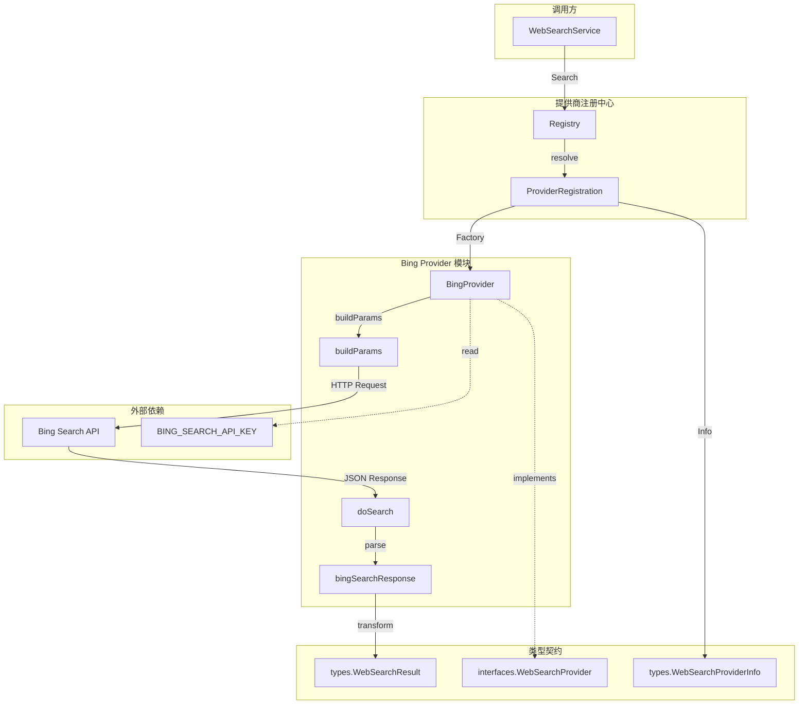

# Bing Provider 实现与响应契约

## 概述

想象一下你的 Agent 需要回答一个关于"2025 年最新 AI 趋势"的问题 —— 它的训练数据只到 2024 年，怎么办？这时候就需要**外部 web 搜索**来补充实时信息。`bing_provider_implementation_and_response_contract` 模块正是系统连接 Bing 搜索 API 的桥梁。

这个模块的核心职责非常聚焦：**将 Bing Search API 的原始响应转换为系统内部统一的 `WebSearchResult` 格式**。它不是简单的 HTTP 客户端封装，而是整个 Web 搜索能力插件化架构中的一个具体实现。系统采用**策略模式**设计，允许在 Bing、Google、DuckDuckGo 等多个搜索提供商之间无缝切换，而调用方无需感知底层差异。

为什么不能直接调用 Bing API？因为系统需要：(1) 统一的接口契约，让上层服务不依赖具体提供商；(2) 统一的响应格式，让下游处理逻辑不需要为每个提供商写适配代码；(3) 可配置的认证和超时策略。这个模块就是这些设计意图的落地。

## 架构定位与数据流



### 架构角色解析

这个模块在整个系统中扮演**适配器 + 策略实现**的双重角色：

1. **适配器（Adapter）**：Bing API 返回的 JSON 结构（`bingSearchResponse`）与系统内部类型（`WebSearchResult`）完全不同。模块负责解析 Bing 的嵌套结构（`webPages.value[]`），提取关键字段（`name`, `url`, `snippet`, `dateLastCrawled`），并映射到统一格式。

2. **策略实现（Strategy）**：系统定义了 `WebSearchProvider` 接口，BingProvider 是其中一个具体实现。同级的还有 [`duckduckgo_provider_implementation`](duckduckgo_provider_implementation.md) 和 [`google_provider_implementation`](google_provider_implementation.md)。这种设计让 [`WebSearchService`](web_search_orchestration_service.md) 可以在运行时根据配置选择提供商。

### 数据流追踪

一次完整的搜索请求经历以下阶段：

```
用户查询 → WebSearchService.Search() 
         → Registry 解析提供商 
         → BingProvider.Search() 
         → buildParams() 构建 HTTP 请求 
         → Bing API 返回 JSON 
         → doSearch() 解析响应 
         → 转换为 []*WebSearchResult 
         → 返回给调用方
```

关键转换点在 `doSearch()` 方法中：Bing 返回的 `dateLastCrawled` 是 `time.Time` 类型，直接赋值给 `PublishedAt *time.Time`；`Name` 字段映射为 `Title`，`URL` 保持不变，`Snippet` 保持不变，`Source` 硬编码为 `"bing"`。

## 核心组件深度解析

### BingProvider 结构体

```go
type BingProvider struct {
    client  *http.Client
    baseURL string
    apiKey  string
}
```

**设计意图**：这是一个**无状态的服务类**（除了配置信息）。所有搜索请求共享同一个 `http.Client` 实例，这是 Go 的最佳实践 —— `http.Client` 内部维护连接池，重复使用可以复用 TCP 连接，显著提升性能。

**字段说明**：
- `client *http.Client`：配置了 10 秒超时的 HTTP 客户端。超时是必要的防御措施，防止 Bing API 响应慢时拖垮整个请求链路。
- `baseURL string`：Bing Search API v7.0 的端点 URL，定义为常量 `defaultBingSearchURL`。
- `apiKey string`：从环境变量 `BING_SEARCH_API_KEY` 读取的认证密钥。**注意**：密钥不在代码中硬编码，而是通过环境变量注入，这是安全实践。

**构造方法 `NewBingProvider()`**：
```go
func NewBingProvider() (interfaces.WebSearchProvider, error)
```

这个方法实现了**工厂模式**。它做三件事：
1. 从环境变量读取 API 密钥，如果为空则返回错误（fail-fast 原则）
2. 创建带超时配置的 `http.Client`
3. 返回实现了 `WebSearchProvider` 接口的实例

返回值是接口类型而非具体类型，这是**依赖倒置**的体现 —— 调用方只依赖抽象接口，不依赖具体实现。

### 搜索方法 `Search()`

```go
func (p *BingProvider) Search(
    ctx context.Context,
    query string,
    maxResults int,
    includeDate bool,
) ([]*types.WebSearchResult, error)
```

**参数设计考量**：
- `ctx context.Context`：支持请求取消和超时传递。如果上层调用方设置了 30 秒超时，这个上下文会确保 Bing 请求不会超过这个时间。
- `query string`：搜索关键词。方法会校验非空，避免无效请求。
- `maxResults int`：期望返回的最大结果数。注意这是"期望值"，Bing API 可能返回更少结果。
- `includeDate bool`：**当前实现未使用**。这是一个设计上的技术债 —— 参数存在但未被 `buildParams()` 使用，可能是为未来功能预留。

**返回值**：
- `[]*types.WebSearchResult`：指针切片，避免大结构体拷贝。
- `error`：网络错误、解析错误、参数错误都会通过此返回。

**内部流程**：
1. 校验 `query` 非空
2. 调用 `buildParams()` 构建 `*http.Request`
3. 调用 `doSearch()` 执行请求并解析响应

这种拆分（构建请求 + 执行请求）是**单一职责原则**的体现，也便于单元测试 —— 可以单独测试参数构建逻辑，而不需要 mock HTTP 响应。

### 请求构建 `buildParams()`

```go
func (p *BingProvider) buildParams(
    ctx context.Context, 
    query string, 
    maxResults int, 
    includeDate bool,
) (*http.Request, error)
```

**关键行为**：
1. 使用 `url.Values` 构建查询参数（`q` 和 `count`）
2. 拼接完整 URL
3. 创建 `http.Request` 并绑定上下文
4. 设置两个关键 Header：
   - `User-Agent`：模拟 Chrome 浏览器，某些 API 会校验此字段
   - `Ocp-Apim-Subscription-Key`：Bing API 的认证头

**设计细节**：
- 使用 `fmt.Sprintf` 拼接 URL 而非 `url.URL` 结构体，因为参数简单，这样更直观。
- `User-Agent` 硬编码为 macOS Chrome 的标识，这是为了兼容性 —— 某些 API 对非浏览器请求有限制。
- `includeDate` 参数未使用，这是一个**未实现的扩展点**。

### 响应解析 `doSearch()`

```go
func (p *BingProvider) doSearch(ctx context.Context, req *http.Request) ([]*types.WebSearchResult, error)
```

**执行流程**：
1. `p.client.Do(req)` 发送 HTTP 请求
2. `defer resp.Body.Close()` 确保响应体关闭（防止连接泄漏）
3. `io.ReadAll()` 读取完整响应
4. `json.Unmarshal()` 解析到 `bingSearchResponse` 结构体
5. 遍历 `respData.WebPages.Value` 转换为 `WebSearchResult`

**错误处理**：
- 网络错误直接返回
- 响应体读取失败返回
- JSON 解析失败会包装错误信息（`failed to unmarshal response`），便于调试

**字段映射表**：

| Bing API 字段 | 内部类型字段 | 说明 |
|--------------|-------------|------|
| `Name` | `Title` | 搜索结果标题 |
| `URL` | `URL` | 原始链接 |
| `Snippet` | `Snippet` | 摘要文本 |
| `DateLastCrawled` | `PublishedAt` | 爬取时间（作为发布时间代理） |
| 硬编码 `"bing"` | `Source` | 标识来源 |

**注意**：`PublishedAt` 使用的是 `DateLastCrawled`（Bing 最后爬取时间），而非网页实际发布时间。这是一个**近似值** —— 对于新闻类查询可能不够准确，但对于一般搜索足够。

### 响应契约 `bingSearchResponse`

```go
type bingSearchResponse struct {
    Type         string `json:"_type"`
    QueryContext struct{ OriginalQuery string } `json:"queryContext"`
    WebPages struct {
        WebSearchURL          string `json:"webSearchUrl"`
        TotalEstimatedMatches int    `json:"totalEstimatedMatches"`
        Value                 []struct {
            ID               string    `json:"id"`
            Name             string    `json:"name"`
            URL              string    `json:"url"`
            IsFamilyFriendly bool      `json:"isFamilyFriendly"`
            DisplayURL       string    `json:"displayUrl"`
            Snippet          string    `json:"snippet"`
            DateLastCrawled  time.Time `json:"dateLastCrawled"`
            SearchTags       []struct{ Name, Content string } `json:"searchTags,omitempty"`
            About            []struct{ Name string } `json:"about,omitempty"`
        } `json:"value"`
    } `json:"webPages"`
    RelatedSearches struct{ ... } `json:"relatedSearches"`
    RankingResponse struct{ ... } `json:"rankingResponse"`
}
```

**设计分析**：
- 这是一个**私有结构体**，仅用于内部解析，不暴露给调用方。
- 包含了 Bing API 返回的完整结构，但实际只使用了 `WebPages.Value` 部分。
- 嵌套结构体直接内联定义（而非单独类型），因为只在此处使用，避免过度抽象。
- 使用 `omitempty` 标签处理可选字段（`SearchTags`, `About`）。

**未使用字段**：
- `RelatedSearches`：相关搜索建议，当前未使用，但保留了解析逻辑。
- `RankingResponse`：Bing 的排序元数据，当前未使用。
- `QueryContext`：原始查询信息，当前未使用。

这些字段保留可能是为了未来扩展（如：支持相关搜索推荐、搜索结果重排序等）。

### 提供商信息 `BingProviderInfo()`

```go
func BingProviderInfo() types.WebSearchProviderInfo
```

**用途**：这是一个**工厂函数**，返回提供商的元数据，用于 [`Registry`](web_search_provider_registry.md) 注册。

**返回内容**：
- `ID: "bing"`：内部标识符
- `Name: "Bing"`：显示名称
- `Free: false`：Bing API 是付费服务
- `RequiresAPIKey: true`：需要 API 密钥
- `Description: "Bing Search API"`：描述

这个函数让系统可以在不实例化提供商的情况下获取其元数据，用于 UI 展示或配置验证。

## 依赖关系分析

### 上游依赖（被谁调用）

| 调用方 | 调用方式 | 期望 |
|--------|---------|------|
| [`WebSearchService`](web_search_orchestration_service.md) | 通过 `Registry` 解析后调用 `Search()` | 返回统一的 `[]*WebSearchResult` |
| [`Registry`](web_search_provider_registry.md) | 调用 `BingProviderInfo()` 获取元数据 | 用于提供商注册和发现 |

### 下游依赖（调用谁）

| 被调用方 | 调用目的 | 耦合度 |
|---------|---------|--------|
| `net/http` | 发送 HTTP 请求 | 低（标准库） |
| `encoding/json` | 解析 JSON 响应 | 低（标准库） |
| [`types.WebSearchResult`](web_search_domain_models.md) | 返回统一格式结果 | 中（依赖内部类型） |
| [`interfaces.WebSearchProvider`](web_search_provider_integration_contracts.md) | 实现接口 | 中（依赖接口定义） |
| 环境变量 `BING_SEARCH_API_KEY` | 读取 API 密钥 | 低（配置注入） |

### 数据契约

**输入契约**（`Search()` 方法参数）：
- `query` 不能为空，否则返回错误
- `maxResults` 传递给 Bing API 的 `count` 参数，Bing 有上限（通常 50）
- `includeDate` 当前被忽略

**输出契约**（`[]*WebSearchResult`）：
- `Title`：来自 Bing 的 `Name` 字段
- `URL`：原始链接，未做校验
- `Snippet`：摘要，可能包含 HTML 标签（Bing API 返回的原始内容）
- `Source`：固定为 `"bing"`
- `PublishedAt`：可能为 nil（如果 Bing 未返回 `DateLastCrawled`）

## 设计决策与权衡

### 1. 策略模式 vs 条件分支

**选择**：使用 `WebSearchProvider` 接口 + 多个实现（Bing、Google、DuckDuckGo）

**替代方案**：在 `WebSearchService` 中用 `switch` 语句根据配置调用不同 API

**权衡**：
- 策略模式的优势：新增提供商无需修改 `WebSearchService`，符合开闭原则；便于单元测试（可以 mock 提供商）
- 代价：需要额外的接口定义和注册机制，代码量略增

**为什么适合这里**：系统明确需要支持多个搜索源，且不同提供商的 API 差异较大（请求参数、响应结构、认证方式），策略模式隔离了这些差异。

### 2. 响应结构体内联定义 vs 独立类型

**选择**：`bingSearchResponse` 及其嵌套结构体全部内联定义在同一个文件中

**替代方案**：为每个嵌套结构体定义独立类型（如 `WebPage`, `SearchTag` 等）

**权衡**：
- 内联定义的优势：代码集中，易于理解整体结构；避免过度抽象
- 代价：如果其他地方需要复用这些类型，会导致重复定义

**为什么适合这里**：这些类型仅用于 Bing API 响应解析，没有复用需求，内联定义更简洁。

### 3. API 密钥通过环境变量注入 vs 配置文件

**选择**：从 `os.Getenv("BING_SEARCH_API_KEY")` 读取

**替代方案**：从配置文件或密钥管理服务读取

**权衡**：
- 环境变量的优势：符合 12-Factor App 原则；部署时灵活配置；避免密钥进入代码仓库
- 代价：多环境管理需要额外工具；无法在运行时动态更新

**为什么适合这里**：API 密钥是敏感信息，环境变量是云原生部署的标准做法。

### 4. 固定超时 vs 可配置超时

**选择**：硬编码 `defaultBingTimeout = 10 * time.Second`

**替代方案**：通过配置传入超时时间

**权衡**：
- 固定超时的优势：简单；10 秒对搜索 API 是合理的（太长影响用户体验，太短可能误判）
- 代价：无法针对不同网络环境调整

**为什么适合这里**：搜索是用户交互操作，10 秒是可接受的上限。如果需要调整，修改常量即可，不需要复杂配置。

### 5. `includeDate` 参数未实现

**现状**：`Search()` 方法有 `includeDate bool` 参数，但 `buildParams()` 未使用

**可能原因**：
- 预留功能：计划支持按日期范围过滤（Bing API 支持 `freshness` 参数）
- 历史遗留：早期设计有此需求，后来被简化

**影响**：调用方传入 `true` 不会有额外效果，但也不会出错。这是一个**隐性契约不匹配**，建议在文档中明确说明或移除该参数。

## 使用指南

### 基本使用

```go
// 1. 创建提供商实例
provider, err := web_search.NewBingProvider()
if err != nil {
    // 处理错误（通常是 API 密钥未设置）
    return err
}

// 2. 执行搜索
ctx := context.Background()
results, err := provider.Search(ctx, "Golang 最佳实践", 10, false)
if err != nil {
    return err
}

// 3. 处理结果
for _, result := range results {
    fmt.Printf("标题：%s\n", result.Title)
    fmt.Printf("链接：%s\n", result.URL)
    fmt.Printf("摘要：%s\n", result.Snippet)
}
```

### 通过 Registry 使用（推荐）

```go
// 1. 注册提供商
registry := web_search.NewRegistry()
registry.Register(web_search.BingProviderInfo(), web_search.NewBingProvider)

// 2. 解析并使用
provider, err := registry.Get("bing")
if err != nil {
    return err
}
results, err := provider.Search(ctx, query, maxResults, includeDate)
```

### 配置要求

**环境变量**：
```bash
export BING_SEARCH_API_KEY="your-bing-api-key"
```

**获取 API 密钥**：
1. 访问 [Azure Portal](https://portal.azure.com/)
2. 创建 "Bing Search v7" 资源
3. 复制密钥到环境变量

**配额限制**：
- 免费层：每月 1000 次调用
- 标准层：按调用次数计费

## 边界情况与注意事项

### 1. 空查询处理

```go
if len(query) == 0 {
    return nil, fmt.Errorf("query is empty")
}
```

**行为**：直接返回错误，不发送 HTTP 请求。

**原因**：Bing API 会拒绝空查询，提前校验可以节省网络开销。

### 2. API 密钥缺失

```go
apiKey := os.Getenv("BING_SEARCH_API_KEY")
if len(apiKey) == 0 {
    return nil, fmt.Errorf("BING_SEARCH_API_KEY is not set")
}
```

**行为**：构造时即失败，而非搜索时失败。

**设计意图**：fail-fast 原则 —— 尽早暴露配置问题，避免运行时错误。

### 3. 响应解析失败

```go
if err := json.Unmarshal(body, &respData); err != nil {
    return nil, fmt.Errorf("failed to unmarshal response: %w", err)
}
```

**可能原因**：
- Bing API 返回非 JSON 响应（如 HTML 错误页面）
- API 密钥无效（Bing 返回 401 错误，响应体不是预期格式）
- 网络中间人攻击（响应被篡改）

**调试建议**：错误信息包含原始解析错误，可以查看具体失败原因。

### 4. 日期字段可能为零值

```go
PublishedAt: &item.DateLastCrawled,
```

**注意**：如果 Bing 未返回 `dateLastCrawled`，该字段会是 `time.Time` 的零值（1970-01-01），而非 `nil`。调用方需要判断：

```go
if result.PublishedAt != nil && !result.PublishedAt.IsZero() {
    // 使用日期
}
```

### 5. 并发安全

**`BingProvider` 是并发安全的**：
- `http.Client` 是并发安全的
- 没有可变状态（`baseURL`, `apiKey` 在构造后不变）

**可以安全地在多个 goroutine 中复用同一个实例**。

### 6. 结果数量不保证

```go
params.Set("count", strconv.Itoa(maxResults))
```

**注意**：`maxResults` 是请求参数，但 Bing 可能返回更少结果（如总共只有 5 条匹配）。调用方不应假设返回数量等于请求数量。

### 7. Snippet 可能包含 HTML

Bing API 返回的 `Snippet` 字段可能包含 HTML 标签（如 `<b>` 高亮关键词）。如果需要在纯文本环境使用，需要额外清理：

```go
// 需要时使用 html2text 库清理
cleanSnippet := html2text.FromString(result.Snippet)
```

## 扩展点

### 添加日期范围过滤

当前 `includeDate` 参数未使用。如果要支持按日期过滤，可以修改 `buildParams()`：

```go
if includeDate {
    params.Set("freshness", string(bingFreshnessMonth)) // 最近一个月
}
```

需要定义 `bingFreshness` 枚举（代码中已有定义但未使用）。

### 支持 SafeSearch

代码中定义了 `bingSafeSearch` 枚举（`Off`, `Moderate`, `Strict`），但未在请求中使用。可以添加配置参数：

```go
func (p *BingProvider) Search(..., safeSearch bingSafeSearch) {
    params.Set("safeSearch", string(safeSearch))
}
```

### 缓存搜索结果

当前实现每次搜索都调用 Bing API。可以添加缓存层（如 Redis）减少 API 调用：

```go
// 伪代码
cacheKey := fmt.Sprintf("bing:%s:%d", query, maxResults)
if cached, ok := cache.Get(cacheKey); ok {
    return cached, nil
}
results, err := p.doSearch(...)
cache.Set(cacheKey, results, 1*time.Hour)
```

## 相关模块

- [`web_search_orchestration_service`](web_search_orchestration_service.md) — 调用本模块的上层服务
- [`web_search_provider_registry`](web_search_provider_registry.md) — 提供商注册中心
- [`duckduckgo_provider_implementation`](duckduckgo_provider_implementation.md) — 另一个搜索提供商实现
- [`google_provider_implementation`](google_provider_implementation.md) — 另一个搜索提供商实现
- [`web_search_domain_models`](web_search_domain_models.md) — 搜索相关类型定义
- [`web_search_provider_integration_contracts`](web_search_provider_integration_contracts.md) — 提供商接口定义
