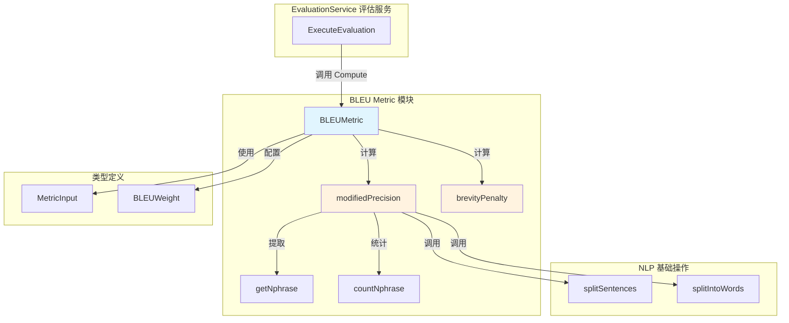

# BLEU Precision-Based Overlap Metric 模块深度解析

## 概述：为什么需要这个模块

想象你正在训练一个智能问答系统，它需要根据知识库生成答案。你怎么知道它生成的答案好不好？人工评估当然最准确，但当系统每天要处理成千上万次问答时，人工评估既不现实也不可持续。

**BLEU 指标模块解决的就是这个核心问题**：如何自动、量化地评估生成文本的质量。

BLEU（Bilingual Evaluation Understudy）最初是为机器翻译设计的，但它的核心思想——**通过计算候选文本与参考文本的 n-gram 重叠度来衡量相似性**——同样适用于问答、摘要等任何文本生成任务。这个模块将经典的 BLEU 算法从 Python NLTK 库移植到 Go，并针对知识库问答场景进行了适配。

**关键设计洞察**：BLEU 不是简单的"词匹配率"。它通过三个机制避免 naive 方案的缺陷：
1. **Modified Precision（修正精度）**：防止候选文本通过重复高频词作弊（比如候选说"好的好的好的"，参考只说"好的"，简单匹配会给出 100% 精度，但修正精度会裁剪计数）
2. **Brevity Penalty（简洁惩罚）**：防止候选文本过短（只说"好的"可能精度很高，但信息量不足）
3. **N-gram 加权**：支持从 1-gram 到 4-gram 的不同粒度评估，捕捉不同层次的语言模式

---

## 架构与数据流



### 数据流追踪

一次典型的 BLEU 评估流程如下：

1. **输入阶段**：`EvaluationService` 构造 `MetricInput`，包含 `GeneratedTexts`（模型生成的答案）和 `GeneratedGT`（标准答案/ground truth）

2. **预处理阶段**：`Compute()` 方法调用 `splitSentences()` 和 `splitIntoWords()` 将文本拆分为 token 序列，并统一转换为小写

3. **精度计算阶段**：对每个 n-gram 级别（1-4），调用 `modifiedPrecision()` 计算修正精度：
   - `getNphrase()` 从候选和参考文本中提取所有 n-gram
   - `countNphrase()` 统计每个 n-gram 的出现次数
   - 对参考文本中的每个 n-gram 计数取最大值（支持多参考）
   - 裁剪候选计数不超过参考计数（防止重复作弊）

4. **长度惩罚阶段**：`brevityPenalty()` 找到与候选长度最接近的参考长度，如果候选过短则施加指数惩罚

5. **聚合阶段**：将各 n-gram 精度的对数按权重加权求和，乘以简洁惩罚因子，得到最终 BLEU 分数

---

## 核心组件深度解析

### BLEUMetric 结构体

```go
type BLEUMetric struct {
    smoothing bool
    weights   BLEUWeight
}
```

**设计意图**：这是一个**策略模式**的实现。`BLEUMetric` 封装了 BLEU 评估的完整逻辑，但通过两个参数允许调用方定制行为：

- **`smoothing`**：布尔标志，控制是否启用平滑。当候选文本包含参考文本中未出现的 n-gram 时，精度可能为 0，导致整体 BLEU 为 0（因为要连乘）。平滑通过分子分母各加 1 避免这个问题。这在短文本评估或冷启动场景特别有用。

- **`weights`**：`BLEUWeight` 类型（`[]float64`），定义 1-4 gram 的权重分配。模块提供了四个预配置：
  - `BLEU1Gram = [1.0, 0.0, 0.0, 0.0]`：只考虑单词匹配，适合评估词汇覆盖
  - `BLEU2Gram = [0.5, 0.5, 0.0, 0.0]`：平衡单词和双词短语
  - `BLEU3Gram = [0.33, 0.33, 0.33, 0.0]`：加入三词模式
  - `BLEU4Gram = [0.25, 0.25, 0.25, 0.25]`：标准 BLEU-4，捕捉更长的语言模式

**为什么是指针接收者**：所有方法都使用 `*BLEUMetric` 接收者，这暗示了设计者预期 `BLEUMetric` 实例会被复用（避免重复分配权重切片），且未来可能扩展状态（如缓存统计信息）。

### Compute 方法

```go
func (b *BLEUMetric) Compute(metricInput *types.MetricInput) float64
```

**职责**：执行完整的 BLEU 评估流程，返回 0-1 之间的分数（1 表示完美匹配）。

**关键实现细节**：

1. **大小写归一化**：在计算前将所有 token 转为小写。这是一个**设计权衡**——它提高了对大小写变化的鲁棒性，但也意味着无法区分专有名词的大小写错误（如"Beijing"vs"beijing"）。在知识库问答场景中，这通常是可接受的，因为语义比格式更重要。

2. **多参考支持**：`references` 被定义为 `[]Sentence`，虽然当前调用只传入一个参考（`GeneratedGT`），但架构上支持多个参考答案。这在 FAQ 场景很有用——同一个问题可能有多种正确表述。

3. **零重叠处理**：如果所有 n-gram 精度都为 0（`overlap == 0`），直接返回 0 而不计算简洁惩罚。这是一个**防御性设计**——避免 `log(0)` 导致 NaN。

4. **对数空间计算**：使用 `math.Log(pn)` 和 `math.Exp(s)` 而不是直接连乘。这是数值稳定性的标准做法——多个小于 1 的数连乘容易下溢到 0。

**返回值语义**：
- `1.0`：候选与参考完全一致
- `0.5-0.8`：高质量匹配，核心信息完整
- `0.2-0.5`：部分匹配，可能遗漏关键信息或包含噪声
- `< 0.2`：低质量，需要人工审查

### modifiedPrecision 方法

```go
func (b *BLEUMetric) modifiedPrecision(candidate Sentence, references []Sentence, n int) float64
```

**这是 BLEU 算法的核心创新点**。传统精度计算是"候选中匹配的词数 / 候选总词数"，但这会被重复词作弊。修正精度的公式是：

$$
\text{Modified Precision} = \frac{\sum_{\text{ngram} \in \text{Candidate}} \min(\text{count}_{\text{cand}}(\text{ngram}), \text{count}_{\text{ref}}(\text{ngram}))}{\sum_{\text{ngram} \in \text{Candidate}} \text{count}_{\text{cand}}(\text{ngram})}
$$

**实现逻辑**：

1. **提取候选 n-gram**：`getNphrase(candidate, n)` 生成所有长度为 n 的连续词序列

2. **统计候选计数**：`countNphrase()` 将 n-gram 序列序列化为 JSON 字符串作为 map 的 key（这是一个**实用但非最优**的选择，见后文"设计权衡"部分）

3. **计算参考最大计数**：遍历所有参考文本，对每个在候选中出现的 n-gram，取它在所有参考中出现次数的最大值。这支持多参考场景下的"宽松匹配"。

4. **裁剪计数**：`clippedCounts[ngram] = min(count, maxCounts[ngram])` —— 这是防止作弊的关键。如果候选说"好的好的好的"（3 次），参考只说"好的"（1 次），则只计 1 次匹配。

5. **平滑处理**：如果启用平滑，分子分母各加 1。这确保即使没有匹配也不会得到 0 精度。

**边界情况处理**：
- 如果候选太短无法提取 n-gram（`len(nphrase) == 0`），返回 0.0
- 如果 counts 为空（理论上不会发生，但防御性检查），返回 0.0

### brevityPenalty 方法

```go
func (b *BLEUMetric) brevityPenalty(candidate Sentence, references []Sentence) float64
```

**设计动机**：防止"短而精"的作弊策略。如果参考答案是 100 词的详细说明，候选只说"好的"（2 词），精度可能很高，但信息量严重不足。

**公式**：
$$
BP = \begin{cases} 
1 & \text{if } c > r \\
e^{1 - r/c} & \text{if } c \leq r
\end{cases}
$$

其中 $c$ 是候选长度，$r$ 是参考长度。

**实现细节**：

1. **多参考长度选择**：当有多个参考时，选择与候选长度**最接近**的参考长度（`minDiff` 逻辑）。这是一个**合理但非标准**的选择——原始 BLEU 论文建议使用最短参考长度，但这里的选择更宽容。

2. **指数惩罚**：当候选过短时，惩罚因子随长度差距指数增长。例如：
   - 候选 50 词，参考 100 词：$BP = e^{1-100/50} = e^{-1} \approx 0.37$
   - 候选 25 词，参考 100 词：$BP = e^{1-100/25} = e^{-3} \approx 0.05$

3. **无惩罚条件**：如果候选长度超过参考，不施加惩罚（返回 1）。这鼓励生成充分详细的答案，但也可能鼓励冗余——需要与 `maxCounts` 裁剪机制配合使用。

---

## 依赖关系分析

### 上游依赖（谁调用它）

| 调用方 | 位置 | 期望 |
|--------|------|------|
| `EvaluationService` | `internal/application/service/evaluation/evaluation.go` | 传入 `MetricInput`，期望返回 0-1 的分数用于聚合统计 |
| `HookMetric` | `internal/application/service/metric_hook/hook.go` | 可能作为可插拔指标之一被注册 |

**数据契约**：`types.MetricInput` 定义了输入格式：
```go
type MetricInput struct {
    GeneratedTexts string  // 模型生成的文本
    GeneratedGT    string  // 标准答案（Ground Truth）
    // 可能还有其他字段如 RetrievalResults 等
}
```

### 下游依赖（它调用谁）

| 被调用方 | 位置 | 用途 |
|----------|------|------|
| `splitSentences` | 同文件未显示，可能在 utils 包 | 将文本按句子边界拆分 |
| `splitIntoWords` | 同文件未显示，可能在 utils 包 | 将句子分词为 token 序列 |
| `strings.ToLower` | Go 标准库 | 大小写归一化 |
| `math.Log/Exp` | Go 标准库 | 对数空间计算 |
| `json.Marshal` | Go 标准库 | n-gram 序列化（作为 map key） |

**关键观察**：分词逻辑（`splitSentences`/`splitIntoWords`）未在提供的代码中显示，这意味着：
1. 它们可能在同一个包的其他文件中定义
2. 或者它们是非常简单的实现（如按空格分割）

**潜在风险**：如果分词逻辑不支持中文（中文没有空格分词），这个模块在处理中文问答时会失效。需要确认分词实现是否集成了中文分词器（如 jieba）。

---

## 设计权衡与决策分析

### 1. n-gram 序列化：JSON vs 自定义哈希

**当前选择**：使用 `json.Marshal(phrase)` 将 n-gram 序列转换为字符串作为 map 的 key。

**优点**：
- 实现简单，无需自定义哈希函数
- 自动处理边界情况（如空词、特殊字符）

**缺点**：
- **性能开销**：每次提取 n-gram 都要分配内存并序列化
- **可读性差**：调试时看到的是 `["好","的"]` 而不是直观的字符串
- **依赖 encoding/json**：增加了不必要的依赖

**替代方案**：使用 `strings.Join(phrase, "|||")` 或自定义结构体哈希。在高频调用场景（如批量评估上千条问答），这可能带来显著性能提升。

### 2. 大小写归一化：统一小写 vs 保留原样

**当前选择**：强制转为小写。

**权衡**：
- **收益**：提高鲁棒性，"Beijing"和"beijing"被视为相同
- **损失**：无法检测专有名词大小写错误，"USA"和"usa"被视为相同

**适用场景**：在知识库问答中，语义正确性比格式正确性更重要，这个选择是合理的。但如果用于评估正式文档生成，可能需要可配置的大小写策略。

### 3. 多参考长度选择：最接近 vs 最短

**当前选择**：选择与候选长度最接近的参考长度。

**与原始 BLEU 的差异**：原始论文建议使用**最短**参考长度，这更严格。

**影响**：
- 当前实现更宽容，适合有多个不同长度参考答案的场景（如 FAQ 有多种表述）
- 但可能低估对长答案的惩罚——如果参考有 50 词和 200 词两个版本，候选 40 词会选择 50 词参考，惩罚较轻

**建议**：如果系统需要更严格的评估，应添加配置项选择策略。

### 4. 平滑策略：加 1 平滑 vs 其他方法

**当前选择**：简单的加 1 平滑（Laplace smoothing）。

**替代方案**：
- **Chen & Cherry 平滑**：更复杂但更准确
- **线性插值**：结合不同阶的 n-gram

**评估**：对于知识库问答场景，加 1 平滑足够简单有效。如果未来需要发表研究级评估结果，可考虑升级。

---

## 使用指南与示例

### 基本用法

```go
import "github.com/Tencent/WeKnora/internal/application/service/metric"

// 创建 BLEU-4 指标实例（标准配置）
bleu := metric.NewBLEUMetric(
    true,  // 启用平滑
    metric.BLEU4Gram,
)

// 构造评估输入
input := &types.MetricInput{
    GeneratedTexts: "人工智能是计算机科学的一个分支",
    GeneratedGT:    "人工智能属于计算机科学的范畴",
}

// 计算分数
score := bleu.Compute(input)
// score ≈ 0.3-0.5（取决于分词和 n-gram 重叠）
```

### 不同场景的配置建议

| 场景 | 推荐配置 | 理由 |
|------|----------|------|
| 短答案评估（<20 词） | `BLEU2Gram + smoothing=true` | 短文本难以提取高阶 n-gram，平滑避免 0 分 |
| 长答案评估（>100 词） | `BLEU4Gram + smoothing=false` | 有足够上下文，不需要平滑 |
| 多参考答案 | `BLEU3Gram + smoothing=true` | 平衡灵活性和严格性 |
| 严格质量门禁 | `BLEU4Gram + smoothing=false` | 不宽容，要求精确匹配 |

### 与 ROUGE 指标的对比

本模块的"兄弟模块"[rouge_recall_oriented_overlap_metric](rouge_recall_oriented_overlap_metric.md) 实现了 ROUGE 指标。关键区别：

| 维度 | BLEU（本模块） | ROUGE |
|------|---------------|-------|
| 核心思想 | 精度导向（候选中有多少在参考中） | 召回导向（参考中有多少在候选中） |
| 适用场景 | 评估生成是否"准确" | 评估生成是否"完整" |
| 长度惩罚 | 有（简洁惩罚） | 通常无 |
| 推荐用法 | 与 ROUGE 结合使用 | 与 BLEU 结合使用 |

**最佳实践**：同时计算 BLEU 和 ROUGE，取调和平均或分别报告。高 BLEU + 低 ROUGE 意味着"准确但不完整"，低 BLEU + 高 ROUGE 意味着"完整但有噪声"。

---

## 边界情况与注意事项

### 1. 空输入处理

**当前行为**：如果 `GeneratedTexts` 或 `GeneratedGT` 为空字符串，分词后得到空序列，`modifiedPrecision` 返回 0，最终 BLEU 为 0。

**潜在问题**：没有显式检查空输入，依赖下游逻辑处理。建议在 `Compute` 入口添加：
```go
if strings.TrimSpace(metricInput.GeneratedTexts) == "" || 
   strings.TrimSpace(metricInput.GeneratedGT) == "" {
    return 0.0
}
```

### 2. 中文分词兼容性

**风险**：如果 `splitIntoWords` 只是按空格分割，中文文本会被视为单个 token，导致 BLEU 计算失效。

**验证方法**：
```go
// 测试中文分词
input := &types.MetricInput{
    GeneratedTexts: "人工智能技术",
    GeneratedGT:    "人工智能的方法",
}
// 期望：分词为 ["人工", "智能", "技术"] 而非 ["人工智能技术"]
```

**解决方案**：确认分词实现集成了中文分词器，或在文档中明确说明仅支持空格分词的语言。

### 3. 数值稳定性

**当前实现**：使用对数空间计算，避免了连乘下溢。

**剩余风险**：当候选非常长（>10000 词）时，`sum(counts)` 可能溢出 int。建议将计数累加器改为 `int64`。

### 4. 并发安全性

**当前状态**：`BLEUMetric` 实例**不是**并发安全的——`Compute` 方法虽然不修改状态，但未来如果添加缓存就可能有问题。

**建议**：
- 如果需要在 goroutine 中复用实例，添加 `sync.RWMutex`
- 或者文档明确说明"每个 goroutine 使用独立实例"

### 5. 性能考虑

**热点路径**：`modifiedPrecision` 被调用 4 次（1-4 gram），每次都要：
1. 提取 n-gram（O(n)）
2. 序列化每个 n-gram（O(k*m)，k 是 n-gram 数，m 是平均长度）
3. 遍历参考文本（O(r*k)）

**优化建议**：
- 缓存 n-gram 提取结果（1-gram 可用于计算 2-gram）
- 使用更高效的序列化（如 `strings.Join`）
- 对于批量评估，预分配 map 容量

---

## 扩展点与二次开发

### 添加新的 n-gram 权重配置

```go
// 在 bleu.go 中添加
var BLEU5Gram BLEUWeight = []float64{0.2, 0.2, 0.2, 0.2, 0.2}

// 需要修改 getNphrase 和 modifiedPrecision 支持 5-gram
```

### 自定义分词策略

当前分词逻辑是硬编码的。可以通过依赖注入支持自定义：

```go
type Tokenizer interface {
    Tokenize(text string) []string
}

type BLEUMetric struct {
    smoothing  bool
    weights    BLEUWeight
    tokenizer  Tokenizer  // 新增
}
```

### 添加置信区间估计

对于研究用途，可以扩展返回类型：

```go
type BLEUResult struct {
    Score      float64
    Confidence float64  // 通过 bootstrap 采样估计
}
```

---

## 相关模块参考

- [rouge_recall_oriented_overlap_metric](rouge_recall_oriented_overlap_metric.md)：ROUGE 指标实现，召回导向的文本重叠评估
- [ngram_overlap_primitives](ngram_overlap_primitives.md)：N-gram 基础操作工具
- [evaluation_orchestration_and_state](evaluation_orchestration_and_state.md)：评估任务编排服务
- [metric_hooking_and_metric_set_contracts](metric_hooking_and_metric_set_contracts.md)：指标钩子和集合接口

---

## 总结

`bleu_precision_based_overlap_metric` 模块是一个**经典算法的工程化实现**。它没有追求学术上的最先进，而是选择了**简单、可理解、可维护**的设计路径。对于知识库问答系统的日常评估需求，这个实现已经足够。

**核心设计哲学**：
1. **精度优先于召回**：BLEU 的修正精度机制确保评估的是"生成内容的准确性"而非"覆盖度"
2. **防御性编程**：处理零重叠、空 n-gram 等边界情况
3. **配置优于硬编码**：通过权重和平滑参数支持不同场景

**适合的使用场景**：
- 知识库问答质量自动评估
- RAG 系统答案生成质量监控
- 模型迭代时的回归测试

**不适合的场景**：
- 需要评估语义相似度（应使用嵌入相似度）
- 需要评估事实准确性（应使用基于知识的验证）
- 多语言混合文本（需要更复杂的分词策略）

理解这个模块的关键是把握它的**定位**：它不是要替代人工评估，而是提供一个**快速、一致、可量化的第一道质量筛选**。高 BLEU 分数不保证答案完美，但低 BLEU 分数几乎总是意味着需要人工审查。
