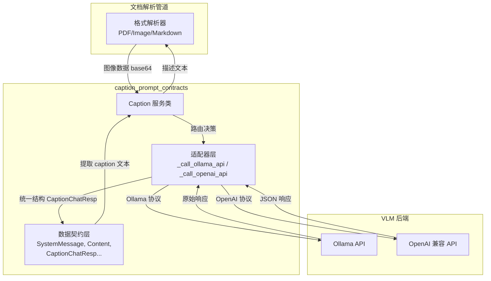

# caption_prompt_contracts 模块深度解析

## 模块概述：为什么需要这个模块？

想象一下，你的文档解析管道正在处理一份包含大量图表、截图和示意图的技术手册。纯文本解析器对这些图像束手无策——它们只是一堆二进制数据，没有任何语义信息。这就是 `caption_prompt_contracts` 模块存在的根本原因：**为文档中的图像生成语义化的文本描述，让下游的检索和理解系统能够"看懂"图片内容**。

这个模块的核心挑战在于：不同的团队可能使用不同的视觉语言模型（VLM）后端——有的用 Ollama 本地部署，有的用 OpenAI 兼容的云服务。如果每个调用点都直接写死 API 调用逻辑，代码会迅速变得难以维护。`caption_prompt_contracts` 通过定义一套统一的**请求/响应契约**和**适配器模式**，将这种异构性封装在模块内部，对外暴露简洁一致的接口。

简而言之，这个模块是文档解析管道与 VLM 服务之间的**翻译层**：它把图像数据翻译成 VLM 能理解的请求格式，再把 VLM 的响应翻译成管道能理解的统一结构。

---

## 架构全景：数据如何流动



**数据流 walkthrough**：

1. **入口**：当解析器（如 `PDFParser` 或 `ImageParser`）遇到图像时，调用 `Caption.get_caption(image_base64)`
2. **路由**：`Caption` 类根据配置的 `interface_type` 决定调用 Ollama 还是 OpenAI 兼容接口
3. **协议转换**：适配器层将统一的图像数据转换成对应 API 要求的请求格式（Ollama 用 `client.generate()`，OpenAI 用 HTTP POST）
4. **响应归一化**：无论后端返回什么格式，都被解析成 `CaptionChatResp` 统一结构
5. **内容提取**：通过 `choice_data()` 方法从响应中提取最终的 caption 文本
6. **返回**：纯文本描述返回给调用方，用于后续的 chunk 生成或检索索引

---

## 核心组件深度解析

### 1. 数据契约层：定义语言的语法

这个模块的大部分代码是 **dataclass 定义**——它们不是简单的数据容器，而是**协议规范的代码化表达**。

#### `SystemMessage` 与 `UserMessage`：VLM 对话的角色契约

```python
@dataclass
class SystemMessage:
    role: Optional[str] = None
    content: Optional[str] = None

@dataclass
class UserMessage:
    role: Optional[str] = None
    content: List[Content] = field(default_factory=list)
```

**设计意图**：这两个类模仿了 Chat Completion API 的消息结构。`SystemMessage` 用于设定模型的行为模式（虽然在这个模块中实际使用的是硬编码在 prompt 中的指令），`UserMessage` 承载实际的请求内容。关键在于 `UserMessage.content` 是一个 `List[Content]`——这支持**多模态内容混合**，即一条消息可以同时包含文本 prompt 和图像 URL。

**为什么用 List[Content] 而不是分开的字段？** 这是为了兼容 OpenAI 的 Vision API 设计，该设计允许在一条消息中交替排列文本和图像，为未来扩展（如多图像输入）留下空间。

#### `Content` 与 `ImageUrl`：多模态内容的载体

```python
@dataclass
class Content:
    type: Optional[str] = None
    text: Optional[str] = None
    image_url: Optional[ImageUrl] = None

@dataclass
class ImageUrl:
    url: Optional[str] = None
    detail: Optional[str] = None
```

**关键细节**：`ImageUrl.url` 字段支持两种格式：
- 远程 URL：`https://example.com/image.png`
- Data URI：`data:image/png;base64,{base64_data}`

在 `_call_openai_api` 中，代码显式构造 Data URI 格式：
```python
image_url=ImageUrl(
    url="data:image/png;base64," + image_base64, 
    detail="auto"
)
```

**`detail` 字段的作用**：这是 OpenAI Vision API 的参数，控制模型处理图像的精细程度（`low`/`high`/`auto`）。这里使用 `auto` 是一种折中——让 API 根据图像分辨率自动决定，平衡成本和效果。

#### `CaptionChatResp`：响应归一化的核心

```python
@dataclass
class CaptionChatResp:
    id: Optional[str] = None
    created: Optional[int] = None
    model: Optional[Model] = None
    object: Optional[str] = None
    choices: List[Choice] = field(default_factory=list)
    usage: Optional[Usage] = None
```

**为什么需要这个类？** Ollama 和 OpenAI 的响应格式不同：
- Ollama 返回简单的 `{response: str, ...}` 结构
- OpenAI 返回标准的 Chat Completion 格式 `{choices: [{message: {content: str}}], ...}`

`CaptionChatResp` 强制将两者统一成 OpenAI 风格的结构。这样做的好处是：**调用方只需要理解一种响应格式**，后续如果要添加第三个 VLM 后端（如 Gemini），只需在适配器层做转换，不影响上游代码。

**`from_json()` 方法的设计考量**：
```python
@staticmethod
def from_json(json_data: dict) -> "CaptionChatResp":
    choices = []
    for choice in json_data.get("choices", []):
        message_data = choice.get("message", {})
        message = Message(
            role=message_data.get("role"),
            content=message_data.get("content"),
            tool_calls=message_data.get("tool_calls"),
        )
        choices.append(Choice(message=message))
    # ...
```

这里使用 `.get()` 而非直接访问字典键，是一种**防御性编程**实践。API 响应可能因为版本升级、网络代理修改等原因缺少某些字段，`.get()` 返回 `None` 而不是抛出 `KeyError`，让系统能够优雅降级而非崩溃。

**`choice_data()` 方法**：这是一个**便利方法**，封装了从嵌套结构中提取实际内容的逻辑：
```python
def choice_data(self) -> str:
    if (
        not self.choices
        or not self.choices[0]
        or not self.choices[0].message
        or not self.choices[0].message.content
    ):
        logger.warning("No choices available in response")
        return ""
    return self.choices[0].message.content
```

注意这里的**链式空值检查**——每一层都可能为 `None`，必须逐层验证。这种写法虽然冗长，但比 `try/except` 更清晰，因为明确表达了数据结构的可能状态。

---

### 2. Caption 服务类：适配器模式的实现

`Caption` 类是这个模块的**唯一对外接口**，它封装了所有与 VLM 交互的复杂性。

#### 配置策略：灵活性与默认值的平衡

```python
def __init__(self, vlm_config: Optional[Dict[str, str]] = None):
    self.prompt = """简单凝炼的描述图片的主要内容"""
    self.timeout = 30
    
    if vlm_config and vlm_config.get("base_url") and vlm_config.get("model_name"):
        self.completion_url = vlm_config.get("base_url", "") + "/chat/completions"
        self.model = vlm_config.get("model_name", "")
        self.api_key = vlm_config.get("api_key", "")
        self.interface_type = vlm_config.get("interface_type", "openai").lower()
    else:
        self.completion_url = CONFIG.vlm_model_base_url + "/chat/completions"
        self.model = CONFIG.vlm_model_name
        self.api_key = CONFIG.vlm_model_api_key
        self.interface_type = CONFIG.vlm_interface_type
```

**设计决策分析**：

1. **两级配置回退**：优先使用传入的 `vlm_config` 参数，否则回退到全局 `CONFIG`。这种设计支持**上下文相关的配置覆盖**——例如，不同的知识库可以使用不同的 VLM 模型，而不需要修改全局配置。

2. **Prompt 硬编码的权衡**：`self.prompt` 是硬编码的中文字符串，而不是从配置文件读取。这是一个**简化设计**的决策：
   - **优点**：减少配置复杂度，确保 prompt 与代码逻辑一致
   - **缺点**：修改 prompt 需要重新部署代码，不支持多语言场景
   
   如果未来需要支持多语言 caption（如英文文档用英文描述），这里需要重构为可配置项。

3. **接口类型验证**：
   ```python
   if self.interface_type not in ["ollama", "openai"]:
       logger.warning(f"Unknown interface type: {self.interface_type}, defaulting to openai")
       self.interface_type = "openai"
   ```
   这是一种**宽容解析**策略——配置错误不会导致服务启动失败，而是降级到默认值并记录警告。在生产环境中，这种设计可以防止配置失误导致整个文档解析管道瘫痪。

#### 适配器层：_call_ollama_api vs _call_openai_api

这两个方法体现了**相同语义，不同协议**的适配逻辑。

**Ollama 适配器**：
```python
def _call_ollama_api(self, image_base64: str) -> Optional[CaptionChatResp]:
    host = self.completion_url.replace("/v1/chat/completions", "").replace("/chat/completions", "")
    client = ollama.Client(host=host, timeout=self.timeout)
    
    response = client.generate(
        model=self.model,
        prompt="简单凝炼的描述图片的主要内容",
        images=[image_base64],
        options={"temperature": 0.1},
        stream=False,
    )
    
    caption_resp = CaptionChatResp(
        id="ollama_response",
        created=int(time.time()),
        model=Model(id=self.model),
        object="chat.completion",
        choices=[Choice(message=Message(role="assistant", content=response.response))],
    )
    return caption_resp
```

**关键观察**：
1. **Host 提取逻辑**：Ollama 客户端需要基础 URL（如 `http://localhost:11434`），但 `self.completion_url` 包含完整路径（如 `http://localhost:11434/chat/completions`）。代码通过字符串替换提取 host——这是一种**脆弱的解析方式**，如果 URL 格式变化（如添加版本号 `/v1/chat/completions`），需要同时更新替换逻辑。

2. **温度参数差异**：Ollama 使用 `temperature=0.1`（极低随机性），而 OpenAI 适配器使用 `temperature=0.3`。这反映了对不同模型特性的经验调优——Ollama 本地模型可能更不稳定，需要更低的温度来保证输出一致性。

3. **响应构造**：Ollama 原生响应被手动包装成 `CaptionChatResp` 格式，确保上层代码无需关心来源。

**OpenAI 适配器**：
```python
def _call_openai_api(self, image_base64: str) -> Optional[CaptionChatResp]:
    user_msg = UserMessage(
        role="user",
        content=[
            Content(type="text", text=self.prompt),
            Content(
                type="image_url",
                image_url=ImageUrl(url="data:image/png;base64," + image_base64, detail="auto"),
            ),
        ],
    )
    
    gpt_req = CompletionRequest(
        model=self.model,
        temperature=0.3,
        top_p=0.8,
        messages=[user_msg],
        user="abc",
    )
    
    headers = {"Content-Type": "application/json", ...}
    if self.api_key:
        headers["Authorization"] = f"Bearer {self.api_key}"
    
    response = requests.post(self.completion_url, data=json.dumps(gpt_req, ...), ...)
    caption_resp = CaptionChatResp.from_json(response.json())
    return caption_resp
```

**设计细节**：
1. **`user="abc"` 硬编码**：这是 OpenAI API 的可选字段，用于终端用户追踪。这里硬编码为 `"abc"` 是一个**占位实现**，应该改为可配置或使用有意义的标识符。

2. **序列化策略**：`json.dumps(gpt_req, default=lambda o: o.__dict__, indent=4)` 使用 lambda 将 dataclass 转换为字典。这种写法简洁，但依赖 dataclass 字段名与 API 期望的 JSON 键名完全一致——如果 API 升级需要不同的键名（如 `topP` 而非 `top_p`），这里需要自定义序列化逻辑。

3. **错误处理分层**：
   ```python
   except requests.exceptions.Timeout:
       logger.error("Timeout while calling OpenAI-compatible API after 30 seconds")
       return None
   except requests.exceptions.RequestException as e:
       logger.error(f"Request error calling OpenAI-compatible API: {e}")
       return None
   except Exception as e:
       logger.error(f"Unexpected error calling OpenAI-compatible API: {e}")
       return None
   ```
   这种分层捕获允许针对不同错误类型采取不同策略（虽然目前都是返回 `None`）。未来可以扩展为：超时重试、认证失败告警、未知错误熔断等。

#### 公共入口：get_caption 方法

```python
def get_caption(self, image_data: str) -> str:
    if not image_data or self.completion_url is None:
        logger.error("Image data is not set")
        return ""
    caption_resp = self._call_caption_api(image_data)
    if caption_resp:
        caption = caption_resp.choice_data()
        return caption
    logger.warning("Failed to get caption from Caption API")
    return ""
```

**失败语义**：无论发生什么错误（网络超时、API 认证失败、模型不可用），这个方法都返回空字符串 `""` 而不是抛出异常。这是一种**静默降级**策略——文档解析管道可以继续处理其他内容，而不是因为一张图片无法描述而中断整个流程。

**权衡**：这种设计提高了系统的鲁棒性，但调用方无法区分"图片确实没有内容"和"API 调用失败"两种情况。如果需要更精细的错误处理，应该引入返回值包装类型（如 `Optional[str]` 或 `Result[str, Error]`）。

---

## 依赖关系分析

### 上游调用者（谁在用这个模块）

根据模块树，`caption_prompt_contracts` 位于 `docreader_pipeline > parser_framework_and_orchestration` 下，与各类解析器并列。典型的调用模式是：

```
docreader.parser.image_parser.ImageParser
    └── 遇到图像时调用 Caption.get_caption()
    
docreader.parser.pdf_parser.PDFParser
    └── 提取嵌入图像后调用 Caption.get_caption()
    
docreader.parser.markdown_parser.MarkdownParser
    └── 处理 markdown 中的图片引用时调用 Caption.get_caption()
```

**调用方的期望**：
1. 输入：base64 编码的图像数据（字符串）
2. 输出：图像描述的纯文本（字符串），空字符串表示失败
3. 延迟：同步阻塞调用，超时时间 30 秒
4. 副作用：无（不修改外部状态）

### 下游依赖（这个模块依赖什么）

| 依赖 | 用途 | 耦合程度 |
|------|------|----------|
| `docreader.config.CONFIG` | 读取 VLM 配置的默认值 | 紧耦合——配置结构变化会影响模块初始化 |
| `ollama` Python 库 | Ollama API 客户端 | 松耦合——只通过 `ollama.Client` 接口交互 |
| `requests` 库 | OpenAI 兼容 API 的 HTTP 调用 | 松耦合——标准 HTTP 客户端 |

**配置耦合的风险**：`CONFIG.vlm_model_base_url`、`CONFIG.vlm_model_name` 等字段如果重命名或移除，会导致模块启动失败。建议通过依赖注入传递配置，而非直接引用全局单例。

---

## 设计决策与权衡

### 1. 同步 vs 异步：为什么不用 async/await？

当前实现是同步阻塞的，每次调用会阻塞 30 秒（超时时间）。在文档解析管道中，这意味着：
- **优点**：代码简单，调试容易，不需要事件循环管理
- **缺点**：处理大量图像时，线程利用率低，吞吐量受限

**权衡背景**：如果文档解析本身是 CPU 密集型（如 PDF 解析、OCR），那么 I/O 等待的阻塞影响相对较小。但如果系统需要高并发处理大量文档，应该考虑异步化或线程池优化。

### 2. 继承 vs 组合：为什么没有抽象基类？

模块中没有定义 `BaseVLMAdapter` 抽象类，而是直接用 `if/else` 路由。这反映了**YAGNI 原则**（You Aren't Gonna Need It）：
- 当前只有两个后端，`if/else` 足够清晰
- 如果未来增加到 5+ 个后端，应该重构为策略模式

**扩展点**：如果要添加新后端（如 Gemini），需要在 `_call_caption_api` 中添加新的分支，并实现对应的适配器方法。

### 3. 数据验证的缺失

dataclass 没有使用 `__post_init__` 或第三方库（如 `pydantic`）进行字段验证。例如：
- `CompletionRequest.temperature` 可以是任意浮点数（包括负数）
- `ImageUrl.url` 可以是任意字符串（不一定是有效 URL）

**原因推测**：这是一个内部模块，假设调用方（其他解析器）会保证输入正确性。但如果作为独立服务暴露，应该增加严格的输入验证。

### 4. 日志级别的选择

模块大量使用 `logger.info` 记录正常流程（如 "Parsing CaptionChatResp from JSON"）。在生产环境中，这可能导致日志膨胀。建议：
- 正常流程使用 `logger.debug`
- 保留 `logger.info` 用于关键里程碑（如 "Successfully generated caption"）
- `logger.warning` 和 `logger.error` 用于异常情况

---

## 使用示例与配置

### 基础用法

```python
from docreader.parser.caption import Caption

# 使用全局配置初始化
caption_service = Caption()
caption = caption_service.get_caption(image_base64_data)
print(f"图像描述：{caption}")
```

### 自定义配置

```python
# 为特定知识库使用不同的 VLM 模型
custom_config = {
    "base_url": "https://custom-vlm.example.com",
    "model_name": "llava-v1.5",
    "api_key": "sk-xxx",
    "interface_type": "openai"  # 或 "ollama"
}
caption_service = Caption(vlm_config=custom_config)
```

### 在解析器中的集成模式

```python
# 伪代码：ImageParser 中的典型用法
class ImageParser(BaseParser):
    def __init__(self):
        self.caption_service = Caption()
    
    def parse(self, file_path: str) -> List[Chunk]:
        image_data = self.extract_image(file_path)
        if image_data:
            caption = self.caption_service.get_caption(image_data)
            # 将 caption 作为图像的文本表示加入 chunk
            chunk = Chunk(content=caption, metadata={"type": "image_caption"})
            return [chunk]
        return []
```

---

## 边界情况与陷阱

### 1. 空图像数据的处理

```python
if not image_data or self.completion_url is None:
    logger.error("Image data is not set")
    return ""
```

**陷阱**：空字符串 `""` 和 `None` 都被视为无效输入，但调用方无法区分这两种情况。如果业务逻辑需要区分，应该修改返回类型为 `Optional[str]`。

### 2. Ollama Host 解析的脆弱性

```python
host = self.completion_url.replace("/v1/chat/completions", "").replace("/chat/completions", "")
```

**风险场景**：
- 如果 `completion_url` 是 `http://localhost:11434/api/v1/chat/completions`，解析结果会是 `http://localhost:11434/api`（错误）
- 如果未来 Ollama 改变 API 路径，这里需要手动更新

**建议修复**：使用 `urllib.parse.urlparse` 进行规范的 URL 解析：
```python
from urllib.parse import urlparse
parsed = urlparse(self.completion_url)
host = f"{parsed.scheme}://{parsed.netloc}"
```

### 3. API Key 缺失的静默处理

```python
if self.api_key:
    headers["Authorization"] = f"Bearer {self.api_key}"
```

如果 `api_key` 为空，请求会不带认证头发送。某些 API 会返回 401，但有些可能返回 403 或 429，导致错误诊断困难。建议在初始化时验证必需的配置项：
```python
if self.interface_type == "openai" and not self.api_key:
    raise ValueError("API key is required for OpenAI-compatible interface")
```

### 4. 超时时间的硬编码

`self.timeout = 30` 是固定的 30 秒。对于大图像或慢速网络，这可能不够；对于批量处理，这可能太长。建议：
- 将超时时间作为配置项
- 或者根据图像大小动态调整超时

### 5. 多语言支持的缺失

Prompt 硬编码为中文：`简单凝炼的描述图片的主要内容`。如果处理英文文档，生成的中文 caption 可能与文档语言不一致，影响检索效果。

**改进方向**：
```python
def __init__(self, ..., language: str = "zh"):
    self.prompts = {
        "zh": "简单凝炼的描述图片的主要内容",
        "en": "Briefly describe the main content of the image",
        # ...
    }
    self.prompt = self.prompts.get(language, self.prompts["zh"])
```

---

## 相关模块参考

- **[parser_framework_and_orchestration](parser_framework_and_orchestration.md)**：父模块，包含解析器管道编排逻辑
- **[format_specific_parsers](format_specific_parsers.md)**：调用本模块的具体解析器实现
- **[document_models_and_chunking_support](document_models_and_chunking_support.md)**：定义 `Chunk` 数据模型，接收 caption 生成的文本

---

## 总结：模块的设计哲学

`caption_prompt_contracts` 体现了一种**务实的工程哲学**：

1. **契约优先**：先定义清晰的数据结构，再实现业务逻辑
2. **适配器模式**：封装异构后端的差异，对外提供统一接口
3. **静默降级**：宁可返回空结果，也不让单个失败阻塞整个流程
4. **配置灵活性**：支持全局默认值和局部覆盖两种配置方式

这些设计选择反映了模块的定位：**文档解析管道中的一个可靠但不关键的增强组件**。图像 caption 能提升检索质量，但即使失败，文档的文本内容仍然可以被正常处理。这种"有则更好，无亦可接受"的定位，决定了它在错误处理、超时策略等方面的宽容设计。
