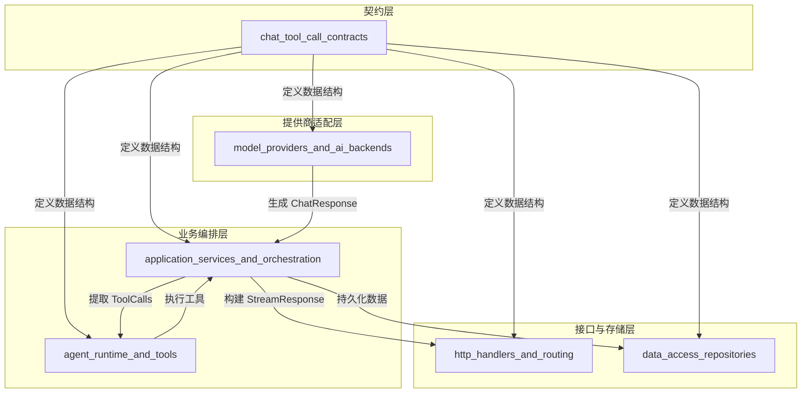

# chat_tool_call_contracts 模块技术深度解析

## 1. 模块概述与问题定位

### 1.1 解决的核心问题

在现代 AI 代理系统中，LLM（大语言模型）与工具（Tool）之间的交互是一个复杂的通信问题。想象一下：LLM 想要调用一个工具，它需要清晰地表达"我要调用哪个工具"、"使用什么参数"，并且这个表达需要能够在整个系统中可靠地传递——从 LLM 响应解析，到中间件处理，再到工具执行，最后记录到数据库中。

如果没有一套统一的契约，不同组件可能会有不同的工具调用表示方式：有些可能把参数作为 JSON 对象，有些可能作为字符串；有些可能有 ID 字段，有些可能没有。这种不一致会导致系统各部分之间的耦合度增加，维护成本上升，而且容易出现边界错误。

### 1.2 解决方案

`chat_tool_call_contracts` 模块正是为了解决这个问题而存在的。它定义了 LLM 工具调用的标准化数据结构，这些结构在整个系统中扮演着"通用语言"的角色：

- **LLMToolCall**：表示一次完整的工具调用请求，包含唯一标识、类型和具体的函数信息
- **FunctionCall**：表示函数的具体细节，包括函数名和参数
- **ChatResponse**：封装 LLM 的完整响应，可能包含多个工具调用
- **StreamResponse**：支持流式输出的响应结构，能够处理部分工具调用的增量传输

这些结构体不仅仅是数据容器，它们还实现了数据库序列化接口（`driver.Valuer` 和 `sql.Scanner`），确保了工具调用信息可以持久化存储和检索。

## 2. 架构与数据流程

### 2.1 系统架构视图



这个架构图展示了 `chat_tool_call_contracts` 模块在整个系统中的核心位置——它是连接各个组件的"粘合剂"，定义了它们之间交换数据的格式。

### 2.2 典型数据流程

让我们追踪一次典型的 LLM 工具调用在系统中的流转：

1. **LLM 响应生成**：在 `model_providers_and_ai_backends` 模块中，LLM 生成响应，不同的提供商适配器将各自的响应格式转换为统一的 `ChatResponse` 结构
2. **响应解析与处理**：`application_services_and_orchestration` 中的聊天管道插件接收 `ChatResponse`，提取 `ToolCalls` 并决定下一步操作
3. **工具执行**：`agent_runtime_and_tools` 模块使用 `LLMToolCall` 中的信息来查找和调用对应的工具
4. **流式传输**：如果是流式场景，`http_handlers_and_routing` 模块会将 `StreamResponse` 通过 SSE（Server-Sent Events）发送给前端
5. **持久化**：`data_access_repositories` 模块使用这些结构体的数据库序列化接口将工具调用信息存储到数据库中

### 2.3 依赖关系分析

这个模块是一个典型的"被依赖"模块，它不依赖于系统中的其他业务模块，只依赖标准库（`encoding/json`、`database/sql/driver`）。这种设计确保了契约的稳定性——核心数据结构不会因为业务逻辑的变化而频繁变动。

依赖这个模块的主要组件包括：
- `model_providers_and_ai_backends`：将 LLM 响应转换为标准格式
- `application_services_and_orchestration`：处理工具调用逻辑
- `agent_runtime_and_tools`：执行实际的工具调用
- `http_handlers_and_routing`：处理 API 响应和流式传输
- `data_access_repositories`：持久化工具调用信息

## 3. 核心组件详解

### 3.1 LLMToolCall 结构体

```go
type LLMToolCall struct {
    ID       string       `json:"id"`
    Type     string       `json:"type"` // "function"
    Function FunctionCall `json:"function"`
}
```

**设计意图**：
- **ID 字段**：为每个工具调用提供唯一标识，这在处理多个并行工具调用时至关重要，可以用来匹配请求和响应
- **Type 字段**：明确指定工具调用的类型，目前固定为 "function"，但为未来扩展其他类型的工具调用（如代码解释器、文件操作等）预留了空间
- **Function 字段**：嵌套的 FunctionCall 结构体，将"调用元数据"和"具体函数信息"分离，提高了结构的清晰度和可维护性

### 3.2 FunctionCall 结构体

```go
type FunctionCall struct {
    Name      string `json:"name"`
    Arguments string `json:"arguments"` // JSON string
}
```

**设计意图**：
- **Name 字段**：工具的标识符，用于在工具注册表中查找对应的实现
- **Arguments 字段**：这里有一个关键的设计决策——将参数存储为 JSON 字符串而非结构化对象。这是一个有意的选择：
  - **灵活性**：不同工具可能有完全不同的参数结构，使用字符串可以避免类型系统的限制
  - **兼容性**：不同的 LLM 提供商可能以不同格式返回参数，统一作为字符串处理可以简化适配器层
  - **延迟解析**：允许在实际需要使用参数时才进行解析，这在某些场景下可以提高性能

### 3.3 ChatResponse 结构体

```go
type ChatResponse struct {
    Content     string       `json:"content"`
    ToolCalls   []LLMToolCall `json:"tool_calls,omitempty"`
    FinishReason string       `json:"finish_reason,omitempty"`
    Usage       struct {
        PromptTokens     int `json:"prompt_tokens"`
        CompletionTokens int `json:"completion_tokens"`
        TotalTokens      int `json:"total_tokens"`
    } `json:"usage"`
}
```

**设计意图**：
- **Content 字段**：LLM 的文本响应，当不需要工具调用时，这是主要的输出
- **ToolCalls 字段**：一个切片，支持 LLM 在单次响应中请求多个工具调用，这是实现并行工具执行的基础
- **FinishReason 字段**：指示 LLM 为什么结束生成，常见值包括 "stop"（正常结束）、"tool_calls"（需要调用工具）、"length"（达到 token 限制）
- **Usage 字段**：token 使用统计，这对于成本计算、限流和性能监控至关重要

### 3.4 StreamResponse 结构体

```go
type StreamResponse struct {
    ID                  string       `json:"id"`
    ResponseType        ResponseType `json:"response_type"`
    Content             string       `json:"content"`
    Done                bool         `json:"done"`
    KnowledgeReferences References   `json:"knowledge_references,omitempty"`
    SessionID           string       `json:"session_id,omitempty"`
    AssistantMessageID  string       `json:"assistant_message_id,omitempty"`
    ToolCalls           []LLMToolCall `json:"tool_calls,omitempty"`
    Data                map[string]interface{} `json:"data,omitempty"`
}
```

**设计意图**：
- **ID 字段**：流式响应的唯一标识，用于客户端关联多个相关的响应片段
- **ResponseType 字段**：明确响应的类型，系统根据这个类型来决定如何处理和展示响应
- **Content 字段**：当前片段的内容，在流式传输中可能是部分文本或部分工具调用
- **Done 字段**：标记流式传输是否完成，客户端可以根据这个字段知道何时停止监听
- **ToolCalls 字段**：支持流式传输工具调用，这对于大型工具调用参数的增量传输很有用
- **Data 字段**：一个通用的 map，用于存储额外的元数据，提供了良好的扩展性

## 4. 设计决策与权衡

### 4.1 参数作为 JSON 字符串存储

**决策**：将 FunctionCall 的 Arguments 字段定义为 string 类型，而不是 map[string]interface{} 或具体的结构体。

**权衡分析**：
- **优点**：
  - 最大的灵活性，可以处理任何复杂的参数结构
  - 简化了不同 LLM 提供商的适配工作，因为它们都可以输出 JSON 字符串
  - 允许延迟解析，只在真正需要参数时才进行 JSON 解析
- **缺点**：
  - 失去了编译时类型检查，参数错误只能在运行时发现
  - 需要额外的 JSON 解析步骤，可能在高频调用场景下影响性能
  - 代码可读性稍差，开发者需要知道 Arguments 字段实际上是 JSON

**为什么这个选择是合理的**：在 AI 代理系统中，工具的多样性和 LLM 响应的不确定性是主要矛盾。类型安全的损失换来了系统的灵活性和可扩展性，这在这种场景下是值得的。

### 4.2 支持多工具调用

**决策**：ChatResponse 和 StreamResponse 都使用切片来存储 ToolCalls，而不是单个工具调用。

**权衡分析**：
- **优点**：
  - 支持并行工具执行，提高系统效率
  - 符合现代 LLM 的能力（如 GPT-4 支持一次调用多个工具）
  - 为复杂的代理工作流提供了基础
- **缺点**：
  - 增加了系统的复杂性，需要处理工具调用的顺序和依赖关系
  - 错误处理变得更复杂，一个工具调用失败不应该影响其他工具调用
  - 客户端需要能够处理多个工具调用的结果

### 4.3 实现数据库序列化接口

**决策**：让 References 类型实现 driver.Valuer 和 sql.Scanner 接口。

**权衡分析**：
- **优点**：
  - 透明的数据库持久化，业务代码不需要关心序列化细节
  - 保持了领域模型的纯净，不引入数据库特定的类型
- **缺点**：
  - 序列化/反序列化有性能开销
  - 数据库中存储的是 JSON 字符串，不便于进行复杂的查询
  - 模型变更时需要考虑数据库迁移

## 5. 使用指南与最佳实践

### 5.1 解析 FunctionCall 参数

```go
// 正确的参数解析方式
func ExecuteTool(call FunctionCall) (interface{}, error) {
    var params map[string]interface{}
    if err := json.Unmarshal([]byte(call.Arguments), &params); err != nil {
        return nil, fmt.Errorf("failed to parse arguments: %w", err)
    }
    
    // 使用参数...
    return toolRegistry.Execute(call.Name, params)
}
```

### 5.2 处理多个工具调用

```go
// 并行执行多个工具调用
func ProcessToolCalls(toolCalls []LLMToolCall) ([]interface{}, error) {
    results := make([]interface{}, len(toolCalls))
    var wg sync.WaitGroup
    var errOnce sync.Once
    var firstErr error
    
    for i, call := range toolCalls {
        wg.Add(1)
        go func(idx int, tc LLMToolCall) {
            defer wg.Done()
            result, err := ExecuteTool(tc.Function)
            if err != nil {
                errOnce.Do(func() {
                    firstErr = err
                })
                return
            }
            results[idx] = result
        }(i, call)
    }
    
    wg.Wait()
    return results, firstErr
}
```

### 5.3 流式响应构建

```go
// 构建流式工具调用响应
func BuildToolCallStreamResponse(call LLMToolCall, done bool) StreamResponse {
    return StreamResponse{
        ID:           generateUniqueID(),
        ResponseType: ResponseTypeToolCall,
        Content:      "", // 工具调用通常没有文本内容
        Done:         done,
        ToolCalls:    []LLMToolCall{call},
    }
}
```

## 6. 注意事项与常见陷阱

### 6.1 参数解析错误处理

Arguments 字段是 JSON 字符串，但 LLM 有时可能生成无效的 JSON。必须妥善处理这种情况：

```go
// 不好的做法
var params map[string]interface{}
json.Unmarshal([]byte(call.Arguments), &params) // 忽略错误
// 使用 params...

// 好的做法
var params map[string]interface{}
if err := json.Unmarshal([]byte(call.Arguments), &params); err != nil {
    // 记录错误，可能尝试修复或请求 LLM 重新生成
    log.Printf("Invalid JSON arguments: %v", err)
    return nil, fmt.Errorf("invalid arguments: %w", err)
}
```

### 6.2 空切片与 nil 的区别

在 Go 中，空切片 `[]LLMToolCall{}` 和 `nil` 是不同的。在 JSON 序列化时，它们的表现也不同：

```go
var toolCalls1 []LLMToolCall = nil
var toolCalls2 []LLMToolCall = []LLMToolCall{}

// toolCalls1 会序列化为 null
// toolCalls2 会序列化为 []
```

为了保持一致性，建议在初始化时使用空切片而不是 nil。

### 6.3 ID 字段的重要性

不要忽视 LLMToolCall 的 ID 字段。在处理多个工具调用时，这个 ID 是匹配请求和响应的关键：

```go
// 存储工具调用请求
pendingCalls := make(map[string]LLMToolCall)
for _, call := range toolCalls {
    pendingCalls[call.ID] = call
}

// 当收到工具响应时，使用 ID 匹配请求
func HandleToolResponse(response ToolResponse) {
    if call, ok := pendingCalls[response.CallID]; ok {
        // 处理响应...
        delete(pendingCalls, response.CallID)
    }
}
```

## 7. 总结

`chat_tool_call_contracts` 模块是一个看似简单但设计精良的核心契约模块。它通过定义标准化的数据结构，解决了 LLM 工具调用在系统各组件之间可靠传递的问题。模块的设计体现了几个重要的原则：

1. **契约优先**：定义清晰的接口和数据结构，作为系统各部分协作的基础
2. **灵活性与类型安全的权衡**：在保证系统灵活性的前提下，尽可能提供类型安全
3. **扩展性**：为未来的功能扩展预留空间（如 Type 字段）
4. **实用性**：实现数据库序列化接口，解决实际的工程问题

对于新加入团队的开发者来说，理解这个模块的设计思想和使用方式是理解整个 AI 代理系统的关键一步。

