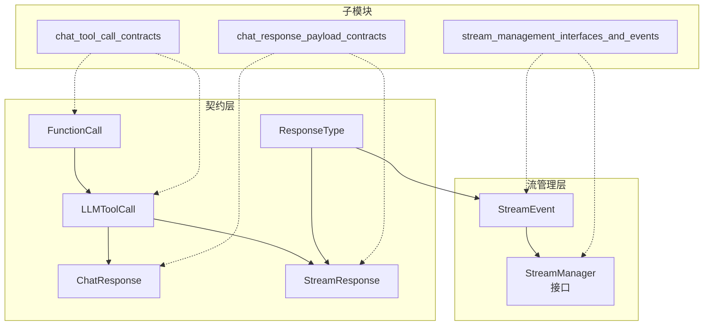

# chat_completion_and_streaming_contracts 模块深度解析

## 问题空间：为什么需要这个模块？

想象一下，你正在构建一个实时聊天应用，需要与多种大语言模型（LLM）交互。每个模型供应商都有自己的 API 格式，有些支持流式输出，有些只支持批量响应；有些模型会调用工具，有些直接返回答案。更复杂的是，你需要在多个层次（HTTP 层、服务层、存储层）之间传递这些数据，同时还要支持前端实时渲染和后端持久化。

在没有统一契约的情况下，你会看到：
- 每个供应商适配器都在定义自己的响应结构
- 流式和非流式输出使用完全不同的数据模型
- 工具调用、思考过程、知识引用等语义信息散落各处
- 每次新增模型或功能都需要修改多个层次的代码

**这个模块的核心使命**：为聊天完成和流式输出定义一套统一的、不可变的数据契约，让整个系统在不同层次、不同组件之间能够"说同一种语言"。

## 架构概览



这个模块的设计可以看作是一个**分层契约栈**：

1. **基础契约层**：`FunctionCall` 和 `LLMToolCall` 定义了工具调用的原子结构
2. **响应契约层**：`ChatResponse`（批量）和 `StreamResponse`（流式）定义了完整的交互单元
3. **流管理层**：`StreamManager` 接口和 `StreamEvent` 定义了如何管理流式状态的抽象

## 核心设计理念

### 1. 事件驱动的流式状态管理

`StreamManager` 接口采用了**追加式事件日志**的设计模式：

```go
type StreamManager interface {
    AppendEvent(ctx context.Context, sessionID, messageID string, event StreamEvent) error
    GetEvents(ctx context.Context, sessionID, messageID string, fromOffset int) ([]StreamEvent, int, error)
}
```

**为什么这样设计？**
- **不可变性**：事件一旦追加就不可修改，天然支持审计和回放
- **增量读取**：前端可以通过 `fromOffset` 实现断点续传，不需要重新拉取整个流
- **性能优化**：使用 Redis 的 RPush 和 LRange 操作，追加和读取都是 O(1) 或 O(k)（k 为读取数量）

这不是一个简单的"消息队列"，而是一个**状态机的事件溯源**实现。整个流式对话的状态完全由事件序列决定。

### 2. 统一的响应类型系统

`ResponseType` 枚举定义了 11 种响应类型，从简单的 "answer" 到复杂的 "thinking"、"tool_call"、"reflection"：

```go
const (
    ResponseTypeAnswer     ResponseType = "answer"
    ResponseTypeThinking   ResponseType = "thinking"
    ResponseTypeToolCall   ResponseType = "tool_call"
    ResponseTypeToolResult ResponseType = "tool_result"
    ResponseTypeComplete   ResponseType = "complete"
    // ... 更多类型
)
```

**关键洞察**：这些类型不仅仅是"数据标签"，它们定义了**前端渲染策略**和**后端处理逻辑**。例如：
- "thinking" 类型会在前端显示思考动画
- "tool_call" 类型会触发后端的工具执行逻辑
- "references" 类型会在侧边栏展示知识引用

### 3. 流式与非流式的统一抽象

注意 `ChatResponse` 和 `StreamResponse` 的关系：

- `ChatResponse` 是**完整的、最终的**响应（适用于非流式 API）
- `StreamResponse` 是**部分的、增量的**响应片段（适用于流式 API）
- 两者都包含 `ToolCalls` 和语义化的内容

这种设计让系统可以**无缝切换**流式和非流式模式：同样的业务逻辑，既可以组装成一个 `ChatResponse` 返回，也可以拆分成多个 `StreamResponse` 事件推送。

## 数据流向解析

让我们追踪一个典型的**流式工具调用对话**的数据流向：

```
1. 用户输入 → HTTP 层
   ↓
2. 服务层创建 StreamManager
   ↓
3. LLM 提供者适配器开始流式输出
   ├─→ AppendEvent(ResponseTypeThinking, "正在分析问题...")
   ├─→ AppendEvent(ResponseTypeAnswer, "我需要")
   ├─→ AppendEvent(ResponseTypeAnswer, "查询知识库")
   ├─→ AppendEvent(ResponseTypeToolCall, {工具调用数据})
   ↓
4. 工具执行子系统
   └─→ AppendEvent(ResponseTypeToolResult, {工具结果})
   ↓
5. LLM 继续生成
   ├─→ AppendEvent(ResponseTypeThinking, "正在整合结果...")
   ├─→ AppendEvent(ResponseTypeAnswer, "根据查询...")
   └─→ AppendEvent(ResponseTypeComplete, Done=true)
   ↓
6. 前端通过 GetEvents 增量读取并渲染
```

**关键契约点**：
- 每个步骤都使用相同的 `StreamEvent` 结构
- `sessionID` 和 `messageID` 作为复合键，确保事件路由正确
- `ResponseType` 作为"类型标签"，驱动各层的差异化处理

## 设计权衡分析

### 1. JSON 字符串 vs 结构化对象

在 `FunctionCall` 中，`Arguments` 字段被定义为 `string` 类型，而不是 `map[string]interface{}`：

```go
type FunctionCall struct {
    Name      string `json:"name"`
    Arguments string `json:"arguments"` // JSON 字符串，而非结构化对象
}
```

**为什么这样设计？**
- **保留原始性**：LLM 返回的参数可能是无效 JSON，保留字符串形式可以在更高层次处理解析错误
- **避免双序列化**：如果定义为结构化对象，在 HTTP 层会被再次序列化为 JSON，增加开销
- **灵活性**：某些场景可能需要原始字符串进行特殊处理

**权衡**：失去了类型安全，调用方必须手动处理 JSON 解析。

### 2. 单一 AppendEvent vs 专用方法

`StreamManager` 接口只有一个 `AppendEvent` 方法，而不是 `AppendThinkingEvent`、`AppendToolCallEvent` 等专用方法。

**选择：最小接口设计**
- ✅ 接口简单，易于实现（Redis、内存、数据库等）
- ✅ 新增事件类型不需要修改接口
- ❌ 失去了类型安全，调用方可能构造无效事件

这是典型的**简单性优先**设计，符合 Go 语言的哲学。

### 3. StreamResponse vs StreamEvent 的重叠

注意 `StreamResponse` 和 `StreamEvent` 有很多相似字段：
- 都有 `ID`、`Content`、`Done`
- 都有类型字段（`ResponseType` vs `Type`）
- 都有 `Data` 扩展字段

**为什么不合并？**
因为它们属于**不同的层次**：
- `StreamResponse`：HTTP 层契约，面向外部 API 消费者
- `StreamEvent`：内部流管理层契约，面向状态存储

这是**防腐层**设计的体现：内部和外部契约解耦，可以独立演进。

## 核心组件详解

### FunctionCall 和 LLMToolCall

这两个结构体定义了LLM工具调用的标准格式。

**设计意图**：
- `FunctionCall`：封装函数的名称和参数（JSON字符串格式）
- `LLMToolCall`：完整的工具调用，包含ID、类型和函数详情

**使用场景**：
- LLM生成工具调用请求
- Agent编排引擎解析和执行工具调用
- 前端展示工具调用信息

**关键细节**：
- `Arguments` 字段使用JSON字符串而非结构化对象，这样可以支持任意函数签名
- `Type` 字段目前固定为 "function"，但为未来扩展预留了空间

### ChatResponse

这是LLM完整响应的标准格式。

**设计意图**：
- 封装文本内容、工具调用、完成原因和使用统计
- 提供与OpenAI API兼容的格式，便于集成多种LLM提供商

**使用场景**：
- 非流式聊天响应
- 批量处理和历史记录存储
- LLM提供商适配器的输出格式

**关键细节**：
- `ToolCalls` 是可选的，只有当LLM请求工具调用时才会包含
- `FinishReason` 可以是 "stop"、"tool_calls"、"length" 等，用于指示响应结束的原因
- `Usage` 字段包含token使用统计，便于计费和监控

### StreamResponse 和 ResponseType

这是流式响应的核心定义。

**设计意图**：
- 支持多种类型的流式输出（文本、思考、工具调用等）
- 提供增量更新机制，前端可以逐步渲染
- 包含元数据（如引用、会话ID等）增强用户体验

**使用场景**：
- 实时聊天交互
- Agent思考过程展示
- 工具调用和结果的流式展示

**关键细节**：
- `ResponseType` 枚举定义了11种不同的响应类型，覆盖了从初始查询到完成的整个生命周期
- `Done` 字段用于标识响应是否完成
- `Data` 字段是一个通用的map，用于传递额外的元数据

**ResponseType 详解**：
- `ResponseTypeAnswer`：AI的文本回答
- `ResponseTypeReferences`：知识引用
- `ResponseTypeThinking`：Agent的思考过程
- `ResponseTypeToolCall`：工具调用请求
- `ResponseTypeToolResult`：工具执行结果
- `ResponseTypeError`：错误信息
- `ResponseTypeReflection`：Agent的反思
- `ResponseTypeSessionTitle`：会话标题
- `ResponseTypeAgentQuery`：查询已接收并开始处理
- `ResponseTypeComplete`：Agent处理完成

### StreamEvent 和 StreamManager

这是流式管理的核心抽象。

**设计意图**：
- `StreamEvent`：将流式响应封装为带时间戳的事件
- `StreamManager`：定义事件存储和检索的最小接口

**使用场景**：
- 实时事件存储和分发
- 历史交互回放
- 多客户端同步（通过共享事件流）

**关键细节**：
- `StreamEvent` 包含时间戳，便于排序和调试
- `StreamManager` 使用Redis作为后端，提供O(1)的追加性能
- `GetEvents` 支持增量读取，通过偏移量实现高效的事件同步

## 子模块概览

本模块包含三个主要子模块，每个子模块负责特定的契约领域：

### chat_tool_call_contracts
专注于工具调用相关的契约定义，扩展了基础的 `FunctionCall` 和 `LLMToolCall`，提供更丰富的工具调用语义。

[→ 查看 chat_tool_call_contracts 文档](chat_completion_and_streaming_contracts-chat_tool_call_contracts.md)

### chat_response_payload_contracts
定义了更复杂的响应载荷结构，支持多轮对话、上下文携带等高级场景。

[→ 查看 chat_response_payload_contracts 文档](chat_completion_and_streaming_contracts-chat_response_payload_contracts.md)

### stream_management_interfaces_and_events
扩展了基础的流管理接口，提供事件过滤、批量操作等高级功能。

[→ 查看 stream_management_interfaces_and_events 文档](chat_completion_and_streaming_contracts-stream_management_interfaces_and_events.md)

## 与其他模块的关系

### 依赖关系

**被以下模块依赖**：
- [model_providers_and_ai_backends-chat_completion_backends_and_streaming](model_providers_and_ai_backends-chat_completion_backends_and_streaming.md)：所有 LLM 提供者适配器都使用这些契约
- [application_services_and_orchestration-chat_pipeline_plugins_and_flow](application_services_and_orchestration-chat_pipeline_plugins_and_flow.md)：聊天流水线使用这些契约传递数据
- [http_handlers_and_routing-session_message_and_streaming_http_handlers](http_handlers_and_routing-session_message_and_streaming_http_handlers.md)：HTTP 层使用这些契约序列化响应

**依赖的模块**：
- 此模块是**基础契约层**，不依赖其他业务模块，仅依赖标准库和一些基础类型

### 关键交互点

1. **与 LLM 提供者的交互**：提供者将模型特定的响应转换为统一的 `ChatResponse` 或 `StreamResponse`
2. **与流状态存储的交互**：通过 `StreamManager` 接口将 `StreamEvent` 持久化
3. **与前端的交互**：HTTP 层将 `StreamResponse` 序列化为 SSE（Server-Sent Events）格式

## 新贡献者注意事项

### 1. 不要修改现有字段

这些契约是**系统的基础设施**，修改现有字段可能会破坏：
- 前端向后兼容性
- 数据库持久化格式
- 日志和监控系统

**原则**：只能新增字段，不能修改或删除现有字段。

### 2. FunctionCall.Arguments 的 JSON 解析

永远不要假设 `Arguments` 是有效的 JSON：

```go
// ❌ 错误做法
var args map[string]interface{}
json.Unmarshal([]byte(functionCall.Arguments), &args) // 可能 panic

// ✅ 正确做法
var args map[string]interface{}
err := json.Unmarshal([]byte(functionCall.Arguments), &args)
if err != nil {
    // 处理无效 JSON 的情况
    log.Error("Invalid tool call arguments", "error", err)
    return err
}
```

### 3. StreamResponse.Done 的语义

`StreamResponse.Done = true` **仅表示该事件类型的结束**，不表示整个流的结束。只有 `ResponseTypeComplete` 类型的事件且 `Done = true` 才表示整个对话结束。

### 4. References 的数据库序列化

`References` 类型实现了 `driver.Valuer` 和 `sql.Scanner` 接口，可以直接存入数据库。但要注意：
- 它使用 JSON 序列化，不支持数据库的查询优化
- 大数据量时可能有性能问题

### 5. ResponseType 的扩展

新增 `ResponseType` 时，需要同步更新：
- 前端的渲染策略
- `StreamManager` 的事件处理逻辑
- 任何根据类型做分支判断的代码

## 总结

`chat_completion_and_streaming_contracts` 模块是整个系统的**通用语言**。它不包含任何业务逻辑，却定义了业务逻辑如何交流。它的设计体现了几个关键原则：

1. **契约优先**：在实现之前先定义数据结构
2. **事件溯源**：用不可变事件序列表示状态
3. **分层解耦**：内部和外部契约分离
4. **简单性**：最小接口，最大灵活性

理解这个模块，就理解了整个系统的"数据语"。
