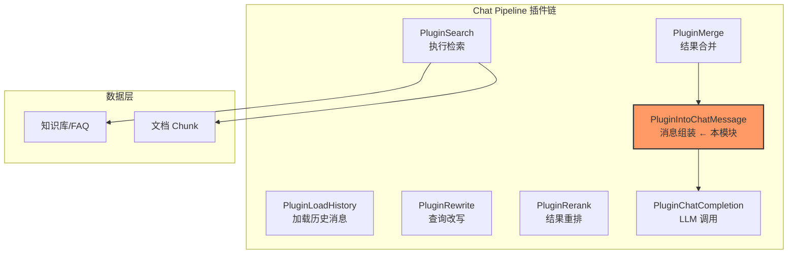

# chat_message_assembly 模块深度解析

## 模块概述：为什么需要这个模块？

想象一下，你正在构建一个智能问答系统。用户问了一个问题，系统从知识库中检索到了十几条相关片段——有些来自标准问答库（FAQ），有些来自文档 chunk，还有些带着图片及其 OCR 文本。现在，你需要把这些原始检索结果"翻译"成大语言模型能理解并用来生成答案的提示词（prompt）。

**这就是 `chat_message_assembly` 模块存在的意义。**

这个模块的核心职责是：**将检索后的混合结果（搜索结果、FAQ、带图片的 chunk）组装成结构化的聊天消息内容**，供下游 LLM 使用。它不是一个简单的字符串拼接器，而是一个带有策略判断的"内容编排器"——它决定哪些信息应该优先呈现、如何标注置信度、如何将图片元数据（描述、OCR 文本）注入到文本流中，以及如何通过模板系统保证输出格式的一致性。

**为什么不能简单地拼接结果？**  naive 的做法会把所有检索结果平铺直叙地丢给 LLM，但这会带来几个问题：
1. **信号噪声比低**：FAQ 的高置信度答案和普通文档 chunk 混在一起，LLM 难以区分优先级
2. **多模态信息丢失**：图片的 OCR 文本和 caption 如果不显式注入，LLM 看不到
3. **格式不可控**：不同场景需要不同的提示词模板（比如是否需要时间戳、是否需要来源标注）

`PluginIntoChatMessage` 通过**FAQ 优先策略**、**图片信息富化**和**模板驱动组装**三个核心机制，解决了这些问题。

---

## 架构定位与数据流

### 模块在系统中的位置



`PluginIntoChatMessage` 位于检索流水线的**末端、LLM 调用之前**。它接收来自 `PluginMerge` 的合并检索结果（`chatManage.MergeResult`），输出格式化后的用户消息内容（`chatManage.UserContent`），供 `PluginChatCompletion` 发送给 LLM。

### 数据流追踪

一次典型的问答请求中，数据如何流经本模块：

```
用户查询 → [PluginLoadHistory] → [PluginRewrite] → [PluginSearch] → [PluginRerank] → [PluginMerge]
                                                                        ↓
                                                            MergeResult: []*SearchResult
                                                                        ↓
                                                            [PluginIntoChatMessage] ← 本模块
                                                                │
                                                                ├─ FAQ 优先策略判断
                                                                ├─ 图片信息富化
                                                                └─ 模板变量替换
                                                                        ↓
                                                            UserContent: string (最终 prompt)
                                                                        ↓
                                                            [PluginChatCompletion] → LLM
```

**关键输入**：
- `chatManage.MergeResult`: 检索结果的合并列表，每条包含 `Content`、`Score`、`ChunkType`、`ImageInfo` 等字段
- `chatManage.FAQPriorityEnabled`: 是否启用 FAQ 优先策略
- `chatManage.FAQDirectAnswerThreshold`: 高置信度 FAQ 的分数阈值
- `chatManage.SummaryConfig.ContextTemplate`: 提示词模板，包含 `{{query}}`、`{{contexts}}`、`{{current_time}}` 等占位符

**关键输出**：
- `chatManage.UserContent`: 组装完成的最终消息内容，直接作为 LLM 的用户消息发送

---

## 核心组件深度解析

### PluginIntoChatMessage 结构体

```go
type PluginIntoChatMessage struct{}
```

这是一个**无状态插件**（stateless plugin），所有运行时数据都通过 `chatManage` 参数传递。这种设计有以下考量：

| 设计选择 | 理由 | 权衡 |
|---------|------|------|
| 无状态结构体 | 插件本身不保存会话级数据，便于并发处理和单元测试 | 每次调用都需要传入完整的 `chatManage` 上下文 |
| 通过 `EventManager` 注册 | 遵循插件系统的统一注册机制，事件驱动触发 | 增加了间接层，调试时需要追踪事件流 |
| 实现 `Plugin` 接口 | 与流水线其他插件保持一致的契约 | 必须遵循接口的固定签名，扩展性受限 |

#### 生命周期与注册

```go
func NewPluginIntoChatMessage(eventManager *EventManager) *PluginIntoChatMessage {
    res := &PluginIntoChatMessage{}
    eventManager.Register(res)  // 注册到事件管理器
    return res
}
```

插件在系统启动时通过 `NewPluginIntoChatMessage` 创建并注册。`EventManager` 维护了一个事件类型到插件的映射表，当 `INTO_CHAT_MESSAGE` 事件触发时，自动调用 `OnEvent` 方法。

#### ActivationEvents：声明式事件订阅

```go
func (p *PluginIntoChatMessage) ActivationEvents() []types.EventType {
    return []types.EventType{types.INTO_CHAT_MESSAGE}
}
```

这种方法声明了插件监听的事件类型。使用**声明式订阅**而非硬编码调用的好处是：
- **解耦**：插件不需要知道谁触发事件，只需要声明自己关心什么
- **可扩展**：未来可以有多个插件监听同一事件，形成事件处理链
- **可测试**：单元测试时可以直接构造事件，不需要启动完整流水线

#### OnEvent：核心处理逻辑

这是模块的**心脏**，执行三个关键任务：

##### 1. FAQ 优先策略与高置信度检测

```go
if chatManage.FAQPriorityEnabled {
    for _, result := range chatManage.MergeResult {
        if result.ChunkType == string(types.ChunkTypeFAQ) {
            faqResults = append(faqResults, result)
            if result.Score >= chatManage.FAQDirectAnswerThreshold && !hasHighConfidenceFAQ {
                hasHighConfidenceFAQ = true
                // 记录日志用于追踪
            }
        } else {
            docResults = append(docResults, result)
        }
    }
}
```

**设计意图**：FAQ 条目通常是人工 curated 的标准答案，置信度高于自动检索的文档 chunk。当 FAQ 分数超过阈值时，系统认为"这个问题有标准答案"，需要在提示词中明确标注优先级。

**为什么只标记第一个高置信度 FAQ？** 这是一种**注意力引导策略**——如果多个 FAQ 都超过阈值，LLM 可能会困惑哪个更相关。标记第一个（通常是分数最高的）作为"精准匹配"，其他的作为补充，帮助 LLM 建立优先级认知。

##### 2. 用户查询安全验证

```go
safeQuery, isValid := utils.ValidateInput(chatManage.Query)
if !isValid {
    return ErrTemplateExecute.WithError(fmt.Errorf("用户查询包含非法内容"))
}
```

在将查询插入模板前进行安全校验，防止**提示词注入攻击**（prompt injection）。这是一个**防御性编程**的典型例子——即使上游已经做过校验，这里仍然进行二次验证，因为本模块是 LLM 调用前的最后一道防线。

##### 3. 模板驱动的内容组装

```go
userContent := chatManage.SummaryConfig.ContextTemplate
userContent = strings.ReplaceAll(userContent, "{{query}}", safeQuery)
userContent = strings.ReplaceAll(userContent, "{{contexts}}", contextsBuilder.String())
userContent = strings.ReplaceAll(userContent, "{{current_time}}", time.Now().Format("2006-01-02 15:04:05"))
userContent = strings.ReplaceAll(userContent, "{{current_week}}", weekdayName[time.Now().Weekday()])
```

使用**占位符替换**而非字符串拼接的好处：
- **可配置性**：运营人员可以通过修改模板调整提示词结构，不需要改代码
- **可读性**：模板文件可以独立审查，便于优化 prompt engineering
- **一致性**：所有会话使用同一套模板，保证行为可预测

**支持的占位符**：
| 占位符 | 替换内容 | 用途 |
|--------|----------|------|
| `{{query}}` | 用户查询（已安全校验） | 让 LLM 知道要回答什么 |
| `{{contexts}}` | 检索结果的结构化文本 | 提供回答依据 |
| `{{current_time}}` | 当前时间戳 | 时间敏感问题的上下文 |
| `{{current_week}}` | 中文星期几 | 工作日/周末相关逻辑 |

---

### getEnrichedPassageForChat：多模态内容富化

```go
func getEnrichedPassageForChat(ctx context.Context, result *types.SearchResult) string {
    if result.Content == "" && result.ImageInfo == "" {
        return ""
    }
    if result.ImageInfo == "" {
        return result.Content
    }
    return enrichContentWithImageInfo(ctx, result.Content, result.ImageInfo)
}
```

这个辅助函数处理**多模态 chunk 的文本化**。当检索结果包含图片时，图片本身无法直接发送给纯文本 LLM，需要将图片的元数据（caption、OCR 文本）提取并注入到文本流中。

**设计决策**：为什么不在检索阶段就完成富化，而是在这里做？

1. **关注点分离**：检索层只负责找到相关 chunk，不负责内容格式化
2. **按需处理**：只有在需要生成聊天消息时才需要富化，避免不必要的计算
3. **上下文感知**：富化策略可能依赖于会话配置（比如是否启用 OCR），在组装阶段更灵活

---

### enrichContentWithImageInfo：图片元数据注入

这是模块中**最复杂**的函数，处理逻辑如下：

```
1. 解析 ImageInfo JSON → 得到图片元数据列表
2. 建立 URL → ImageInfo 的映射表（支持 URL 和 OriginalURL 两种键）
3. 用正则匹配内容中的 Markdown 图片链接 
4. 对每个匹配的图片：
   - 查找对应的 ImageInfo
   - 如果找到，在图片链接后追加"图片描述"和"图片文本"
5. 处理未在内容中出现但存在于 ImageInfo 中的图片
6. 将额外图片信息追加到内容末尾
```

**关键设计点**：

#### 双 URL 映射策略

```go
imageInfoMap[imageInfos[i].URL] = &imageInfos[i]
imageInfoMap[imageInfos[i].OriginalURL] = &imageInfos[i]
```

同时用 `URL` 和 `OriginalURL` 作为键，是因为图片在传输过程中可能被 CDN 改写 URL。这种**冗余索引**策略提高了匹配成功率，代价是少量的内存开销。

#### 已处理 URL 追踪

```go
processedURLs := make(map[string]bool)
```

防止同一张图片被重复处理。考虑这个场景：内容中有 ``，ImageInfo 中也有这张图的信息。如果在步骤 4 处理过了，步骤 5 就不应该再添加一次。

#### 未匹配图片的兜底处理

```go
// 处理未在内容中找到但存在于 ImageInfo 中的图片
for _, imgInfo := range imageInfos {
    if processedURLs[imgInfo.URL] || processedURLs[imgInfo.OriginalURL] {
        continue
    }
    // 添加到"附加图片信息"部分
}
```

这是一个**容错设计**——即使 Markdown 解析失败或图片链接格式不标准，图片信息也不会丢失，而是以"附加图片信息"的形式追加到末尾。这保证了信息完整性，但可能影响阅读体验（属于 tradeoff）。

---

## 依赖关系分析

### 本模块调用的外部组件

| 依赖 | 类型 | 用途 | 耦合度 |
|------|------|------|--------|
| `utils.ValidateInput` | 工具函数 | 用户查询安全校验 | 低（纯函数，无状态） |
| `json.Unmarshal` | 标准库 | 解析 ImageInfo JSON | 低（标准接口） |
| `regexp.Compile` | 标准库 | Markdown 图片链接匹配 | 低（正则表达式稳定） |
| `pipelineInfo/pipelineWarn` | 内部日志 | 流水线可观测性 | 中（依赖日志系统） |
| `ErrTemplateExecute` | 错误定义 | 模板执行错误 | 低（标准错误类型） |

### 调用本模块的组件

| 调用方 | 触发条件 | 期望行为 |
|--------|----------|----------|
| `EventManager` | 收到 `INTO_CHAT_MESSAGE` 事件 | 返回 `*PluginError`，nil 表示成功 |
| `PluginChatCompletion` | 流水线执行到 LLM 调用前 | `chatManage.UserContent` 已填充完成 |

### 数据契约

**输入契约**（`chatManage` 必须包含）：
- `MergeResult`: 非 nil，可以为空数组
- `FAQPriorityEnabled`: bool，默认 false
- `FAQDirectAnswerThreshold`: float64，仅在 FAQPriorityEnabled=true 时使用
- `SummaryConfig.ContextTemplate`: 非空字符串，包含有效占位符
- `Query`: 非空字符串
- `SessionID`: 用于日志追踪

**输出契约**（本模块保证）：
- `UserContent`: 非空字符串（除非所有检索结果为空）
- 所有占位符已被替换
- 图片信息已注入（如果存在）
- 错误时返回 `*PluginError`，`chatManage` 状态不变

---

## 设计决策与权衡

### 1. FAQ 优先策略 vs. 扁平列表

**选择**：当启用 FAQ 优先时，将 FAQ 和文档分开标注，而不是混在一起。

**理由**：
- LLM 对提示词中的**结构信号**敏感，明确的"资料来源 1/2"分层帮助模型理解优先级
- 高置信度 FAQ 加⭐标记，是一种**注意力引导**（attention guidance）技术

**权衡**：
- 增加了提示词长度（额外的标注文本）
- 如果 FAQ 质量不高，可能误导 LLM 过度依赖 FAQ

**替代方案**：
- 按分数排序后统一编号（简单但丢失类型信息）
- 用 JSON 结构化传递（LLM 解析成本高）

### 2. 模板替换 vs. 结构化构建

**选择**：使用 `strings.ReplaceAll` 进行占位符替换，而不是用 `fmt.Sprintf` 或模板引擎。

**理由**：
- **简单即正确**：占位符数量有限（4 个），不需要复杂的模板语法
- **性能**：`ReplaceAll` 是 O(n) 线性扫描，比模板引擎的解析开销小
- **可调试**：模板文件可以直接阅读，不需要理解模板语法

**权衡**：
- 不支持条件逻辑（如"如果有图片则显示某段落"）
- 占位符冲突风险（如果用户查询中包含 `{{query}}`）

**缓解措施**：用户查询在替换前经过 `ValidateInput` 校验，降低了注入风险。

### 3. 图片富化的时机选择

**选择**：在消息组装阶段富化，而不是在检索或存储阶段。

**理由**：
- **按需计算**：不是所有检索结果都会进入最终 prompt（可能被 top-k 过滤）
- **上下文感知**：富化策略可能依赖会话级配置
- **可测试性**：可以独立测试富化逻辑，不需要 mock 存储层

**权衡**：
- 重复计算：如果同一 chunk 在多次请求中被检索，会重复富化
- 延迟增加：富化是同步操作，增加了请求处理时间

**优化空间**：可以引入缓存层，用 chunk ID 作为键缓存富化后的文本。

### 4. 无状态插件设计

**选择**：`PluginIntoChatMessage` 不保存任何状态，所有数据通过参数传递。

**理由**：
- **并发安全**：多个请求可以并行处理，不需要锁
- **可测试性**：单元测试只需构造 `chatManage`，不需要管理插件状态
- **可替换性**：可以轻松替换为不同实现的插件

**权衡**：
- 参数传递开销：每次调用都需要传入完整的上下文
- 无法利用历史信息进行优化（比如缓存上次的模板解析结果）

---

## 使用指南与扩展示例

### 基本使用

插件在系统启动时自动注册，不需要手动调用：

```go
// 在流水线初始化时
eventManager := NewEventManager()
NewPluginIntoChatMessage(eventManager)  // 自动注册

// 当流水线执行到 INTO_CHAT_MESSAGE 事件时
eventManager.Trigger(ctx, types.INTO_CHAT_MESSAGE, chatManage)
```

### 配置 FAQ 优先策略

通过 `chatManage` 的字段控制行为：

```go
chatManage := &types.ChatManage{
    FAQPriorityEnabled: true,              // 启用 FAQ 优先
    FAQDirectAnswerThreshold: 0.85,        // 高置信度阈值
    MergeResult: []*types.SearchResult{...},
    SummaryConfig: &types.SummaryConfig{
        ContextTemplate: `请根据以下资料回答问题：
{{contexts}}

问题：{{query}}
时间：{{current_time}}`,
    },
}
```

### 扩展：添加新的占位符

如果需要支持新的模板变量（比如用户 ID）：

```go
// 在 OnEvent 方法的模板替换部分添加
userContent = strings.ReplaceAll(userContent, "{{user_id}}", chatManage.UserID)
```

**注意**：需要同时更新文档和模板验证逻辑（如果有）。

### 扩展：自定义图片富化策略

如果需要改变图片信息的呈现方式（比如只保留 OCR 文本）：

```go
// 修改 enrichContentWithImageInfo 函数
if found && imgInfo != nil {
    replacement := match[0] + "\n"
    // 只添加 OCR 文本，不添加 caption
    if imgInfo.OCRText != "" {
        replacement += fmt.Sprintf("图片文本：%s\n", imgInfo.OCRText)
    }
    content = strings.Replace(content, match[0], replacement, 1)
}
```

---

## 边界情况与注意事项

### 1. 空检索结果的处理

当 `MergeResult` 为空时，`contextsBuilder` 会是空字符串，模板替换后 `{{contexts}}` 变成空。这可能导致 LLM 收到一个没有上下文的查询。

**建议**：在模板中处理这种情况，或者在上游插件中确保至少有一个检索结果（哪怕是低分的）。

### 2. ImageInfo 解析失败

```go
err := json.Unmarshal([]byte(imageInfoJSON), &imageInfos)
if err != nil {
    pipelineWarn(ctx, "IntoChatMessage", "image_parse_error", ...)
    return content  // 降级：返回原始内容
}
```

解析失败时**不中断流程**，而是返回原始内容。这是**优雅降级**（graceful degradation）的设计——图片信息是增强项，不是必需项。

### 3. 正则匹配的局限性

当前正则 `!\[([^\]]*)\]\(([^)]+)\)` 假设 Markdown 图片链接是单行的。如果图片链接跨行（虽然不常见），会匹配失败。

**影响**：跨行图片链接会被当作普通文本处理，图片信息会进入"附加图片信息"部分。

**修复方案**：使用更复杂的正则或 Markdown 解析库（如 `github.com/yuin/goldmark`）。

### 4. 占位符注入风险

虽然 `ValidateInput` 会校验用户查询，但如果模板本身来自不可信来源，攻击者可以构造包含 `{{query}}` 的模板来绕过替换。

**缓解**：确保 `ContextTemplate` 来自可信配置（如数据库中的系统配置表），而不是用户输入。

### 5. 时区问题

```go
time.Now().Format("2006-01-02 15:04:05")
```

使用服务器本地时区。如果服务部署在不同时区的区域，`{{current_time}}` 会不一致。

**建议**：使用配置中的时区设置，或统一使用 UTC 并在前端转换。

---

## 性能考量

### 时间复杂度分析

| 操作 | 复杂度 | 说明 |
|------|--------|------|
| FAQ/文档分离 | O(n) | n = MergeResult 长度 |
| 模板替换 | O(m) | m = 模板长度 |
| ImageInfo 解析 | O(k) | k = 图片数量 |
| Markdown 正则匹配 | O(c) | c = 内容长度 |
| 图片 URL 映射构建 | O(k) | k = 图片数量 |

**总体复杂度**：O(n + m + c + k)，线性于输入规模。

### 内存分配热点

1. `contextsBuilder`：使用 `strings.Builder` 避免多次字符串拼接的内存复制
2. `imageInfoMap`：每个请求新建映射，可以复用（但需要注意并发安全）
3. `processedURLs`：同上

**优化建议**：如果 profiling 显示这里是瓶颈，可以引入 `sync.Pool` 复用 builder 和 map。

---

## 相关模块参考

- [chat_pipeline_plugins_and_flow](chat_pipeline_plugins_and_flow.md)：插件流水线的整体架构
- [PluginMerge](response_assembly_and_generation.md)：上游插件，负责合并检索结果
- [PluginChatCompletion](response_assembly_and_generation.md)：下游插件，负责调用 LLM
- [context_manager](conversation_context_and_memory_services.md)：上下文管理，影响模板中的历史消息
- [retrieval_engine](retrieval_and_web_search_services.md)：检索引擎，产生原始的 SearchResult

---

## 总结

`chat_message_assembly` 模块是一个**策略驱动的内容编排器**，它在检索和 LLM 调用之间架起了一座桥梁。它的核心价值不在于技术复杂度，而在于**设计意图的清晰性**：

1. **FAQ 优先**：通过结构化标注引导 LLM 关注高置信度答案
2. **多模态富化**：将图片元数据注入文本流，让纯文本 LLM"看见"图片
3. **模板驱动**：通过可配置的模板保证输出一致性，支持 prompt engineering 迭代

理解这个模块的关键是认识到：**它不是在被动的"格式化"，而是在主动的"塑造"LLM 的输入空间**。每一个标注、每一个占位符、每一个图片描述，都是在告诉 LLM"应该如何思考这个问题"。
