# 聊天管道插件与流程 (chat_pipeline_plugins_and_flow)

## 概述

`chat_pipeline_plugins_and_flow` 模块是一个基于事件驱动的插件化管道系统，负责协调用户查询从接收至生成响应的完整生命周期。想象它是一个"生产流水线"——用户的问题就像原材料，依次经过历史加载、查询重写、知识检索、结果重排、内容合并等多个"加工站"，最终输出高质量的回答。每个"加工站"都是一个独立的插件，通过事件系统松散耦合，可以灵活组合、替换或扩展。

这个模块的核心价值在于**将复杂的聊天处理逻辑分解为可组合的独立步骤**，既保证了系统的可维护性，又提供了极强的扩展性。

## 架构概览

```mermaid
graph TB
    subgraph "事件驱动核心"
        EventManager["EventManager<br/>(事件管理器)"]
        Plugin["Plugin 接口<br/>(OnEvent + ActivationEvents)"]
    end

    subgraph "查询理解层"
        LoadHistory["PluginLoadHistory<br/>(加载历史)"]
        Rewrite["PluginRewrite<br/>(查询重写)"]
        ExtractEntity["PluginExtractEntity<br/>(实体抽取)"]
    end

    subgraph "检索执行层"
        Search["PluginSearch<br/>(知识检索)"]
        SearchEntity["PluginSearchEntity<br/>(实体图检索)"]
        SearchParallel["PluginSearchParallel<br/>(并行检索)"]
    end

    subgraph "结果处理层"
        Rerank["PluginRerank<br/>(结果重排)"]
        FilterTopK["PluginFilterTopK<br/>(TopK过滤)"]
        Merge["PluginMerge<br/>(内容合并)"]
        DataAnalysis["PluginDataAnalysis<br/>(数据分析)"]
    end

    subgraph "响应生成层"
        IntoChatMessage["PluginIntoChatMessage<br/>(消息组装)"]
        ChatCompletion["PluginChatCompletion<br/>(对话生成)"]
        ChatCompletionStream["PluginChatCompletionStream<br/>(流式生成)"]
        StreamFilter["PluginStreamFilter<br/>(流过滤)"]
    end

    subgraph "支撑能力"
        Memory["MemoryPlugin<br/>(记忆管理)"]
        Tracing["PluginTracing<br/>(链路追踪)"]
    end

    EventManager --> Plugin
    Plugin --> LoadHistory
    Plugin --> Rewrite
    Plugin --> ExtractEntity
    Plugin --> Search
    Plugin --> SearchEntity
    Plugin --> SearchParallel
    Plugin --> Rerank
    Plugin --> FilterTopK
    Plugin --> Merge
    Plugin --> DataAnalysis
    Plugin --> IntoChatMessage
    Plugin --> ChatCompletion
    Plugin --> ChatCompletionStream
    Plugin --> StreamFilter
    Plugin --> Memory
    Plugin --> Tracing

    ChatManage["ChatManage<br/>(管道状态上下文)"] -.-> EventManager
```



### 架构说明

这个系统采用**责任链模式 + 事件驱动**的混合架构：

1. **EventManager**：作为中央调度器，维护事件类型到插件链的映射，负责构建和触发处理链。
2. **Plugin 接口**：所有处理单元都实现此接口，定义了`OnEvent`（处理逻辑）和`ActivationEvents`（关注的事件）。
3. **ChatManage**：贯穿整个管道的状态上下文，承载用户查询、历史对话、检索结果、模型配置等所有数据。
4. **插件链构建**：插件按注册顺序组成链，每个插件处理完后调用`next()`继续下一个，形成洋葱圈式的处理流程。

## 核心设计决策

### 1. 插件化 vs 单体流程

**决策**：采用插件化架构，而非硬编码的线性流程。

**原因**：
- **灵活性**：不同场景（知识库问答、Web搜索、数据分析）可以组合不同的插件链。
- **可测试性**：每个插件可以独立测试，不依赖完整流程。
- **扩展性**：新增功能只需添加新插件，无需修改现有代码。

**权衡**：
- ✅ 优点：解耦、灵活、易扩展。
- ❌ 缺点：流程不够直观，调试需要追踪多个插件。

### 2. 事件驱动 vs 直接调用

**决策**：通过事件类型触发插件，而非直接函数调用。

**原因**：
- **关注点分离**：插件只声明自己关注的事件，不关心谁会触发它。
- **多播支持**：同一事件可以触发多个插件（例如追踪插件监听所有事件）。
- **动态配置**：可以在运行时通过注册/注销插件改变流程。

**权衡**：
- ✅ 优点：解耦、多播、动态。
- ❌ 缺点：类型安全较弱，需要仔细管理事件类型。

### 3. ChatManage 作为统一上下文 vs 独立参数

**决策**：使用一个大的`ChatManage`结构体承载所有状态，而非传递多个独立参数。

**原因**：
- **简化插件签名**：所有插件都接收相同的参数，接口统一。
- **状态共享方便**：插件间通过`ChatManage`传递数据，无需额外的通信机制。
- **扩展性好**：新增数据只需在`ChatManage`中添加字段，不影响插件签名。

**权衡**：
- ✅ 优点：简单、统一、易扩展。
- ❌ 缺点：`ChatManage`可能变得臃肿，插件间的隐式依赖不够清晰。

## 子模块概览

这个模块可以进一步分为以下几个子模块（点击链接查看详细文档）：

### [管道核心与可观测性](application_services_and_orchestration-chat_pipeline_plugins_and_flow-pipeline_core_and_instrumentation.md)
- **pipeline_contracts_and_event_orchestration**：定义插件接口、事件管理器和错误处理。
- **pipeline_tracing_instrumentation**：提供全链路追踪能力。
- **pipeline_test_doubles_and_validation_helpers**：测试支持组件。

### [查询理解与检索流程](application_services_and_orchestration-chat_pipeline_plugins_and_flow-query_understanding_and_retrieval_flow.md)
- **history_context_loading**：加载对话历史上下文。
- **query_rewriting_and_entity_preparation**：查询重写与实体抽取。
- **retrieval_execution**：知识检索执行（单路/并行）。
- **retrieval_result_refinement_and_merge**：结果重排、过滤与合并。

### [记忆与上下文增强](application_services_and_orchestration-chat_pipeline_plugins_and_flow-memory_and_context_enrichment.md)
- **memory_and_context_enrichment**：管理长期记忆与上下文。

### [结构化抽取与分析插件](application_services_and_orchestration-chat_pipeline_plugins_and_flow-structured_extraction_and_analysis_plugins.md)
- **structured_extraction_and_analysis_plugins**：实体抽取、数据分析等高级功能。

### [响应组装与生成](application_services_and_orchestration-chat_pipeline_plugins_and_flow-response_assembly_and_generation.md)
- **response_assembly_and_generation**：消息组装、LLM调用与流处理。

## 关键数据流

### 典型知识库问答流程

```
用户查询 
  ↓
[事件: LOAD_HISTORY] → PluginLoadHistory 加载历史对话
  ↓
[事件: REWRITE_QUERY] → PluginRewrite 重写查询（结合历史）
                    → PluginExtractEntity 抽取实体（可选）
  ↓
[事件: CHUNK_SEARCH] 或 [CHUNK_SEARCH_PARALLEL]
  ↓
PluginSearch / PluginSearchParallel 检索相关知识
  ↓
[事件: CHUNK_RERANK] → PluginRerank 重排检索结果
  ↓
[事件: FILTER_TOP_K] → PluginFilterTopK 保留TopK结果
  ↓
[事件: CHUNK_MERGE] → PluginMerge 合并相邻分片
  ↓
[事件: INTO_CHAT_MESSAGE] → PluginIntoChatMessage 组装提示词
  ↓
[事件: CHAT_COMPLETION] 或 [CHAT_COMPLETION_STREAM]
  ↓
PluginChatCompletion / PluginChatCompletionStream 生成回答
  ↓
（流式场景下）[事件: STREAM_FILTER] → PluginStreamFilter 过滤输出
```

### 数据流转的关键载体：ChatManage

`ChatManage` 结构体是整个管道的"中央数据库"，主要包含：
- 用户输入：`Query`、`RewriteQuery`、`UserContent`
- 历史信息：`History`
- 检索配置：`KnowledgeBaseIDs`、`SearchTargets`、`EmbeddingTopK`、`RerankTopK`
- 检索结果：`SearchResult`、`RerankResult`、`MergeResult`
- 模型配置：`ChatModelID`、`RerankModelID`
- 生成结果：`ChatResponse`
- 事件总线：`EventBus`（用于流式输出）

## 新开发者注意事项

### 1. 插件开发的正确姿势

开发新插件时，记住：
- ✅ 只关注自己的`ActivationEvents`，不要假设其他插件的存在。
- ✅ 通过`ChatManage`传递数据，但尽量只读写自己需要的字段。
- ✅ 一定要调用`next()`继续流程，除非你有意中断它。
- ✅ 错误处理：返回`PluginError`时，使用预定义的错误类型并通过`WithError`附加原始错误。

### 2. 隐性契约与陷阱

- **事件顺序很重要**：插件的注册顺序决定了执行顺序，注册时要仔细考虑。
- **ChatManage 不是线程安全的**：虽然插件链是串行执行的，但在流式场景或异步处理中要小心并发访问。
- **错误传播**：如果一个插件返回错误，整个链会中断，确保你的插件在非关键路径上可以优雅降级。
- **流式与非流式**：`PluginChatCompletion`和`PluginChatCompletionStream`是互斥的，分别处理不同场景。

### 3. 调试技巧

- 启用`PluginTracing`插件，它会记录每个阶段的详细信息。
- 注意查看日志中的`pipelineInfo`输出，它记录了每个插件的输入输出。
- 在测试中，可以使用`testPlugin`来模拟插件链的行为。

## 与其他模块的关系

- **依赖**：
  - [core_domain_types_and_interfaces](core_domain_types_and_interfaces.md)：提供`ChatManage`、`EventType`等核心类型定义。
  - [model_providers_and_ai_backends](model_providers_and_ai_backends.md)：提供LLM、Embedding、Rerank模型能力。
  - [data_access_repositories](data_access_repositories.md)：提供知识库、文档、Chunk等数据的访问。
  - [application_services_and_orchestration-knowledge_ingestion_extraction_and_graph_services](application_services_and_orchestration-knowledge_ingestion_extraction_and_graph_services.md)：提供知识检索服务。

- **被依赖**：
  - [http_handlers_and_routing](http_handlers_and_routing.md)：通过HTTP接口触发聊天管道。
  - [agent_runtime_and_tools](agent_runtime_and_tools.md)：在Agent场景下可能会复用部分插件。

---

接下来，让我们深入各个子模块，探索它们的具体实现与设计细节。
