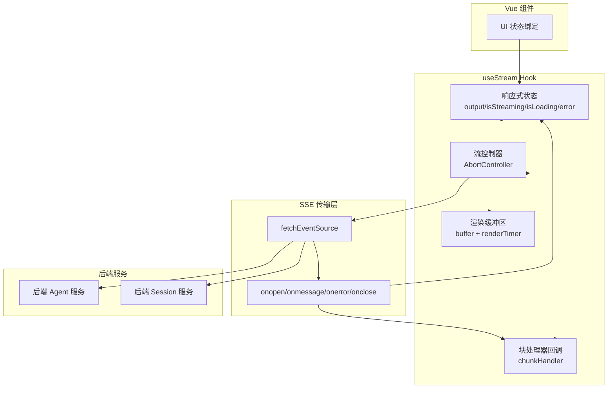

# chat_streaming_option_contracts 模块深度解析

## 概述：为什么需要这个模块

想象一下你在看直播 —— 画面不是一次性加载完成的，而是一帧一帧地推送到你的屏幕上。这个模块做的就是类似的事情，但推送的不是视频帧，而是 **LLM 生成的文本片段**。

`chat_streaming_option_contracts` 模块的核心是一个名为 `useStream` 的 Vue Composition API Hook，它封装了与后端 Agent 服务进行 **Server-Sent Events (SSE)** 流式通信的全部逻辑。这个模块存在的根本原因是：

1. **LLM 响应是渐进式的** —— 大语言模型生成文本需要时间，用户不应该等待完整响应后才看到内容
2. **流式连接有生命周期** —— 需要管理连接建立、数据接收、错误处理、连接关闭、手动停止等状态
3. **前端需要响应式状态** —— Vue 组件需要实时知道流的状态（加载中、传输中、出错、完成）以更新 UI
4. **认证和租户上下文需要自动注入** —— 每次流式请求都需要携带 JWT Token 和租户 ID，这些不应该在每个调用点重复编写

如果没有这个模块，每个需要流式响应的组件都要自己处理 `fetchEventSource`、管理 `AbortController`、解析 SSE 事件、处理认证头 —— 这不仅导致代码重复，还容易出错（比如忘记在组件卸载时关闭连接导致内存泄漏）。

---

## 架构与数据流



### 数据流 walkthrough

当用户在前端发起一个聊天请求时，数据流经以下路径：

1. **组件调用 `startStream()`** —— 传入 `session_id`、`query`、`knowledge_base_ids` 等参数
2. **认证信息注入** —— 从 `localStorage` 读取 JWT Token 和租户 ID，自动添加到请求头
3. **SSE 连接建立** —— `fetchEventSource` 发起请求，触发 `onopen` 回调，`isLoading` 变为 `false`
4. **数据块到达** —— 每个 SSE 事件触发 `onmessage`，数据被推入 `buffer` 数组
5. **自定义处理** —— 如果注册了 `chunkHandler`，数据会立即传递给处理器（用于实时更新 UI 或其他副作用）
6. **连接关闭** —— `onclose` 或 `onerror` 触发 `stopStream()`，所有状态重置
7. **组件卸载** —— `onUnmounted` 钩子自动调用 `stopStream()`，防止内存泄漏

---

## 核心组件深度解析

### StreamOptions 接口

```typescript
interface StreamOptions {
  method?: 'GET' | 'POST'      // 请求方法
  headers?: Record<string, string>  // 自定义请求头
  body?: Record<string, any>   // 请求体（自动 JSON 序列化）
  chunkInterval?: number       // 流式渲染间隔（毫秒）
}
```

**设计意图**：这个接口定义了流式请求的 **配置契约**。它采用可选参数设计，因为大多数场景下默认行为就足够了（POST 方法、标准 JSON 内容类型、无延迟渲染）。`chunkInterval` 的存在是为了在极端高性能场景下可以人为制造渲染延迟，避免 UI 更新过于频繁导致卡顿 —— 这是一种 **性能与流畅度的 tradeoff**。

### useStream Hook

这是模块的核心导出，返回一个包含 7 个属性的对象：

| 属性 | 类型 | 用途 |
|------|------|------|
| `output` | `Ref<string>` | 累积的响应内容（当前实现中未实际使用缓冲区渲染） |
| `isStreaming` | `Ref<boolean>` | 流式传输进行中标志 |
| `isLoading` | `Ref<boolean>` | 初始连接建立中标志 |
| `error` | `Ref<string \| null>` | 错误信息 |
| `onChunk` | `(handler) => void` | 注册数据块处理器 |
| `startStream` | `(params) => Promise<void>` | 启动流式请求 |
| `stopStream` | `() => void` | 手动停止流 |

#### startStream 的内部机制

这个方法做了以下几件关键事情：

**1. 状态重置**
```typescript
output.value = '';
error.value = null;
isStreaming.value = true;
isLoading.value = true;
```
每次新请求开始前清空旧状态，避免上一次请求的残留数据污染当前 UI。

**2. 动态 API 地址解析**
```typescript
const apiUrl = import.meta.env.VITE_IS_DOCKER ? "" : "http://localhost:8080";
```
这是一个 **环境感知** 的设计：Docker 部署时前后端同源，不需要代理；本地开发时需要显式指定后端地址。这种设计避免了在不同环境下修改代码。

**3. 认证与租户上下文注入**
```typescript
const token = localStorage.getItem('weknora_token');
const selectedTenantId = localStorage.getItem('weknora_selected_tenant_id');
```
这里有一个 **隐式契约**：前端必须使用特定的 key 存储认证信息。如果存储 key 变更，这里会静默失败（token 为空时设置错误信息并停止流）。

租户 ID 的处理逻辑更复杂：
```typescript
if (selectedTenantId !== defaultId) {
  tenantIdHeader = selectedTenantId;
}
```
只有当用户选择的租户与默认租户不同时，才添加 `X-Tenant-ID` 头。这是一种 **优化** —— 减少不必要的请求头，同时支持跨租户访问场景。

**4. 请求体构建的条件逻辑**
```typescript
const postBody: any = { 
  query: params.query,
  agent_enabled: params.agent_enabled !== undefined ? params.agent_enabled : true
};
if (params.knowledge_base_ids !== undefined && params.knowledge_base_ids.length > 0) {
  postBody.knowledge_base_ids = params.knowledge_base_ids;
}
```
这里体现了 **后端契约的映射**：`agent-chat` 接口期望特定的字段结构。注意 `knowledge_base_ids` 允许为空数组 —— 注释明确说明后端应该处理这种情况。这是一个 **前后端责任边界** 的设计决策：前端不做强校验，让后端根据业务逻辑决定空数组的含义。

**5. SSE 事件处理**
```typescript
onmessage: (ev) => {
  buffer.push(JSON.parse(ev.data));
  if (chunkHandler) {
    chunkHandler(JSON.parse(ev.data));
  }
}
```
数据被推入缓冲区，然后立即传递给自定义处理器。注意这里 **没有实现真正的缓冲渲染逻辑** —— `buffer` 和 `renderTimer` 定义了但没有被 `output` 使用。这是一个 **未完成的设计** 或 **技术债务**：代码预留了缓冲机制的接口，但实际实现中数据是直接通过 `chunkHandler` 传递给调用方的。

#### stopStream 的清理逻辑

```typescript
const stopStream = () => {
  controller.abort();
  controller = new AbortController();
  isStreaming.value = false;
  isLoading.value = false;
}
```

这里有一个微妙的设计：`controller` 被重置为新的 `AbortController` 实例，而不是简单地设为 `null`。这样做的好处是：如果组件复用这个 Hook 发起下一次请求，`controller.signal` 仍然是有效的对象引用，不需要重新创建。这是一种 **对象池模式** 的简化版。

#### onUnmounted 自动清理

```typescript
onUnmounted(stopStream)
```
这是 Vue Composition API 的生命周期钩子。当组件卸载时，自动停止流式连接。这是一个 **防御性编程** 实践：即使用户导航离开页面时忘记调用 `stopStream()`，也不会导致连接泄漏。

---

## 依赖关系分析

### 这个模块调用什么

| 依赖 | 来源 | 用途 |
|------|------|------|
| `fetchEventSource` | `@microsoft/fetch-event-source` | SSE 客户端库，比原生 `EventSource` 支持更多功能（如自定义 headers、POST 请求） |
| `ref`, `onUnmounted`, `nextTick` | `vue` | Vue 响应式系统和生命周期钩子 |
| `generateRandomString` | `@/utils/index` | 生成 `X-Request-ID` 用于请求追踪 |
| `localStorage` | 浏览器 API | 读取认证 Token 和租户信息 |
| `import.meta.env` | Vite 环境变量 | 判断是否 Docker 部署环境 |

### 什么调用这个模块

根据模块树，这个模块属于 `frontend_contracts_and_state → api_contracts_for_backend_integrations`，被前端聊天相关组件使用。典型的调用模式：

```typescript
// 在 Vue 组件中
const { startStream, stopStream, isStreaming, error, onChunk } = useStream()

// 注册块处理器（用于实时更新消息内容）
onChunk((data) => {
  // 处理 SSE 数据块，如追加到消息列表
})

// 发起请求
await startStream({
  session_id: currentSessionId,
  query: userInput,
  knowledge_base_ids: selectedKBs,
  agent_enabled: true,
  method: 'POST',
  url: '/api/v1/agent-chat'
})
```

### 数据契约

**输入参数** (`startStream` 的 `params`)：
```typescript
{
  session_id: any
  query: any
  knowledge_base_ids?: string[]
  knowledge_ids?: string[]
  agent_enabled?: boolean
  agent_id?: string
  web_search_enabled?: boolean
  enable_memory?: boolean
  summary_model_id?: string
  mcp_service_ids?: string[]
  mentioned_items?: Array<{id: string; name: string; type: string; kb_type?: string}>
  method: string
  url: string
}
```

**输出** (通过 `chunkHandler` 传递)：
```typescript
any  // 实际是 JSON.parse(ev.data)，具体结构由后端 SSE 事件格式决定
```

这里有一个 **隐式契约**：后端 SSE 事件的 `data` 字段必须是有效的 JSON 字符串。如果后端发送纯文本，前端的 `JSON.parse` 会抛出异常。

---

## 设计决策与权衡

### 1. 为什么用 `fetchEventSource` 而不是原生 `EventSource`

原生 `EventSource` 有两个限制：
- 只能发送 GET 请求
- 不能自定义请求头

这个模块需要发送 POST 请求（携带 query 和配置）以及认证头（`Authorization: Bearer <token>`），所以必须使用第三方库。`@microsoft/fetch-event-source` 是一个成熟的选择，它基于 `fetch` API，支持所有 `fetch` 的功能。

**Tradeoff**：增加了一个 npm 依赖，但换来了功能完整性。

### 2. 为什么 `output` 是 `ref<string>` 但实际未使用

代码中定义了 `output` 和 `buffer`，但 `onmessage` 中只把数据推入 `buffer`，没有更新 `output`。这是一个 **设计不一致**：

- **可能性 1**：原本计划实现缓冲渲染（按 `chunkInterval` 定时将 buffer 内容拼接到 output），但后来改为让调用方通过 `chunkHandler` 自己处理
- **可能性 2**：这是一个遗留设计，`output` 应该被移除以避免误导

**建议**：如果确定不再使用内置的缓冲渲染，应该移除 `output`、`buffer`、`renderTimer` 相关代码，简化 API 表面。

### 3. 为什么 `chunkHandler` 是可选的

```typescript
let chunkHandler: ((data: any) => void) | null = null
```

有些场景下，调用方可能只关心流的完成状态，不关心中间数据（比如后台静默处理）。可选的处理器提供了灵活性。

**Tradeoff**：增加了 `null` 检查的复杂度，但支持了更多使用场景。

### 4. 认证信息的隐式依赖

模块直接从 `localStorage` 读取 Token，而不是通过参数传入。这是一个 **耦合** 设计：

- **优点**：调用方不需要每次传递 Token，简化了 API
- **缺点**：难以测试（需要 mock localStorage），且假设了特定的存储 key

**替代方案**：将 Token 作为可选参数传入，默认从 localStorage 读取。这样既保持了便利性，又支持测试注入。

### 5. 错误处理的粒度

```typescript
onerror: (err) => {
  throw new Error(`流式连接失败：${err}`);
}
```

这里将错误重新抛出，让外层的 `catch` 捕获。但 `err` 的类型没有明确定义（可能是 `Event` 对象、字符串或其他）。这是一个 **类型安全漏洞**。

**建议**：明确错误类型，提供更结构化的错误信息（如区分网络错误、认证错误、后端业务错误）。

---

## 使用示例与最佳实践

### 基本用法

```typescript
<script setup lang="ts">
import { useStream } from '@/api/chat/streame'

const { startStream, stopStream, isStreaming, isLoading, error, onChunk } = useStream()

const messages = ref<Message[]>([])

// 注册块处理器
onChunk((data) => {
  // 假设后端发送格式：{ type: 'content', content: '...' }
  if (data.type === 'content') {
    messages.value[messages.value.length - 1].content += data.content
  }
})

const sendMessage = async (query: string) => {
  messages.value.push({ role: 'user', content: query })
  messages.value.push({ role: 'assistant', content: '' })
  
  await startStream({
    session_id: currentSessionId.value,
    query,
    knowledge_base_ids: selectedKBs.value,
    agent_enabled: true,
    method: 'POST',
    url: '/api/v1/agent-chat'
  })
}
</script>
```

### 处理错误

```typescript
watch(error, (err) => {
  if (err) {
    if (err.includes('401')) {
      // 跳转到登录页
      router.push('/login')
    } else if (err.includes('403')) {
      // 提示权限不足
      showToast('无权访问该知识库')
    } else {
      // 通用错误提示
      showToast(err)
    }
  }
})
```

### 手动停止（如用户点击"停止生成"按钮）

```typescript
<template>
  <button @click="stopStream" :disabled="!isStreaming">
    停止生成
  </button>
</template>
```

---

## 边界情况与注意事项

### 1. 组件快速卸载导致的状态竞争

如果 `startStream` 正在执行时组件被卸载，`onUnmounted` 会调用 `stopStream()`，但 `startStream` 的 `try-catch` 可能还在执行。这可能导致：
- `error.value` 被设置为 "AbortError"（预期行为）
- 但调用方可能误以为是业务错误

**缓解**：在 `catch` 中检查 `controller.signal.aborted`，如果是主动中止则不设置错误。

### 2. 多实例并发问题

如果同一个组件创建了多个 `useStream` 实例（比如在 `v-for` 中），每个实例有独立的 `controller` 和状态。这是正确的行为，但要注意：
- 每个实例需要独立的 `session_id`
- 不要共享 `chunkHandler` 除非明确需要

### 3. localStorage 为空的处理

```typescript
if (!token) {
  error.value = "未找到登录令牌，请重新登录";
  stopStream();
  return;
}
```
这里设置了错误信息并停止流，但 **没有自动跳转登录页**。调用方需要监听 `error` 并处理。这是一个 **责任分离** 设计：Hook 只负责报告错误，UI 决定如何响应。

### 4. 租户 ID 解析失败

```typescript
try {
  const defaultTenant = defaultTenantId ? JSON.parse(defaultTenantId) : null;
  // ...
} catch (e) {
  console.error('Failed to parse tenant info', e);
}
```
解析失败时只打印日志，不中断请求。这意味着请求会以默认租户身份发送。这是一个 **优雅降级** 策略，但可能导致权限问题。

### 5. JSON 解析异常

```typescript
buffer.push(JSON.parse(ev.data));
```
如果后端发送的 `ev.data` 不是有效 JSON，这里会抛出未捕获异常。应该用 `try-catch` 包裹：

```typescript
try {
  const data = JSON.parse(ev.data);
  buffer.push(data);
  if (chunkHandler) chunkHandler(data);
} catch (e) {
  error.value = `响应解析失败：${e.message}`;
  stopStream();
}
```

---

## 相关模块参考

- **[agent_conversation_api](agent_conversation_api.md)** —— 后端 Agent 对话接口的请求/响应契约，与 `startStream` 的 `params` 结构对应
- **[session_streaming_and_llm_calls_api](session_streaming_and_llm_calls_api.md)** —— 后端 SSE 流式响应的数据格式定义
- **[frontend_state_store_contracts](frontend_state_store_contracts.md)** —— 前端状态管理相关契约，可与 `useStream` 的状态集成
- **[authentication_and_model_metadata_contracts](authentication_and_model_metadata_contracts.md)** —— 认证 Token 的存储和使用规范

---

## 总结

`chat_streaming_option_contracts` 模块是一个 **流式通信的抽象层**，它将复杂的 SSE 连接管理封装成一个简单的 Vue Hook。核心设计思想是：

1. **状态驱动** —— 用响应式状态管理流的生命周期，让 UI 可以声明式地绑定
2. **自动清理** —— 利用 Vue 生命周期钩子防止资源泄漏
3. **上下文注入** —— 自动处理认证和租户信息，减少调用方负担
4. **灵活扩展** —— 通过 `chunkHandler` 支持自定义数据处理逻辑

主要改进空间：
- 移除未使用的 `output`/`buffer`/`renderTimer` 或实现完整的缓冲渲染
- 增强错误类型区分（网络错误 vs 业务错误 vs 认证错误）
- 支持 Token 注入（便于测试）
- 添加 JSON 解析的异常处理
