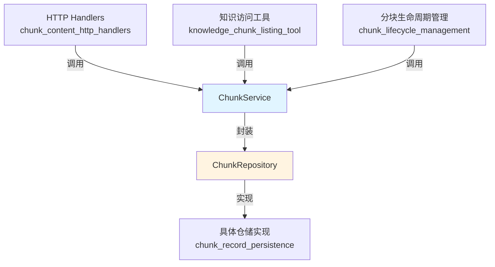

# Chunk 内容服务与仓储接口模块深度剖析

## 1. 为什么需要这个模块？

在知识管理系统中，文档被分块(chunk)处理是提高检索效率和回答质量的核心策略。但是，随着系统的演进，我们面临着几个关键问题：

### 问题空间
- **多租户隔离**：每个租户的数据必须严格隔离，但在共享知识库场景下又需要跨租户访问
- **FAQ与文档的双轨制**：FAQ（常见问题）和普通文档需要完全不同的排序、搜索和展示逻辑
- **权限边界模糊**：普通操作需要租户隔离，但权限解析时又需要绕过这个限制
- **同步一致性挑战**：数据库记录与向量索引需要保持同步，特别是在批量更新和删除操作中

### 设计洞察
这个模块采用了**仓储模式(Repository Pattern)**和**服务层模式(Service Layer Pattern)**的组合，通过清晰的接口契约将数据访问与业务逻辑分离。这样的设计使得：
- 底层存储实现可以灵活替换（从MySQL到PostgreSQL，甚至分布式存储）
- 业务逻辑可以独立演进和测试
- 权限控制和租户隔离可以在接口层面统一规范

## 2. 核心抽象与心智模型

### 关键抽象
- **ChunkRepository**：数据访问契约，定义了与chunk存储交互的所有操作
- **ChunkService**：业务逻辑契约，封装了chunk相关的业务规则和权限控制

### 类比理解
可以把这个模块想象成**图书馆的图书索引系统**：
- `ChunkRepository` 是图书管理员，负责实际的图书存取、查找和整理工作
- `ChunkService` 是借阅台，负责验证读者身份、处理借阅请求、并协调图书管理员的工作
- **租户隔离** 像是不同的图书馆分馆，每个分馆有自己的藏书
- **FAQ vs 文档** 像是图书馆中的不同馆藏类型，它们的分类和检索方式完全不同

## 3. 架构与数据流



### 数据流向分析

1. **创建分块流程**：
   - 上层调用 `ChunkService.CreateChunks()`
   - 服务层验证权限和业务规则
   - 调用 `ChunkRepository.CreateChunks()` 持久化数据
   - 可能触发后续的向量索引更新

2. **查询分块流程**：
   - 调用者通过ID、知识ID或分页参数发起请求
   - `ChunkService` 从上下文中提取租户信息
   - 委托 `ChunkRepository` 执行实际查询
   - 返回过滤和排序后的结果

3. **FAQ差异比较流程**：
   - 调用 `FAQChunkDiff()` 方法
   - 比较源知识库和目标知识库的FAQ分块
   - 基于 `content_hash` 识别需要添加和删除的分块

## 4. 核心组件深度剖析

### ChunkRepository 接口

**设计意图**：定义数据访问层的契约，将业务逻辑与持久化机制解耦。

#### 关键方法解析

1. **带租户隔离 vs 不带租户隔离的方法**
   - `GetChunkByID()`：带租户过滤，适用于常规操作
   - `GetChunkByIDOnly()`：不带租户过滤，专门用于权限解析场景
   
   **设计权衡**：这种设计虽然造成了接口的一定冗余，但明确区分了安全边界。常规操作强制租户隔离，而特殊场景（如共享知识库权限验证）则提供"逃生舱"。

2. **分页查询方法 `ListPagedChunksByKnowledgeID`**
   这个方法是接口中最复杂的方法之一，体现了FAQ和文档双轨制的设计：
   - **knowledgeType** 参数决定排序行为：FAQ按更新时间排序，文档按chunk索引排序
   - **searchField** 参数仅对FAQ有效，支持针对标准问题、相似问题或答案的精确搜索
   
   **设计洞察**：将两种不同类型的查询合并到一个接口中，既保持了API的统一性，又通过参数清晰区分了行为差异。

3. **FAQ专用方法**
   - `ListAllFAQChunksByKnowledgeID()`：仅返回ID和ContentHash，优化性能
   - `ListAllFAQChunksWithMetadataByKnowledgeBaseID()`：用于重复问题检查
   - `ListAllFAQChunksForExport()`：返回完整元数据，用于导出
   
   **设计权衡**：为不同使用场景创建专用方法，虽然增加了接口的复杂度，但显著提升了特定场景的性能。

4. **批量标志更新 `UpdateChunkFlagsBatch`**
   使用位运算进行高效的标志管理：
   - `setFlags`：使用OR操作设置标志
   - `clearFlags`：使用AND NOT操作清除标志
   
   **设计洞察**：这种设计允许在单个SQL语句中批量更新多个chunk的多个标志，大大减少了数据库往返次数。

5. **标签操作方法**
   - `DeleteChunksByTagID()`：删除标签并返回被删除chunk的ID用于索引清理
   - `UpdateChunkFieldsByTagID()`：支持更新is_enabled、flags和tag_id字段
   
   **设计洞察**：这些方法体现了"关注点协同"的设计理念——数据库操作和索引清理虽然是两个不同的关注点，但在接口层面被协同处理，确保数据一致性。

### ChunkService 接口

**设计意图**：封装业务逻辑和权限控制，为上层提供简化的API。

#### 关键方法解析

1. **上下文租户提取**
   与Repository不同，Service的方法（如`GetChunkByID`、`DeleteChunk`）不接受`tenantID`参数，而是从context中提取。
   
   **设计洞察**：这简化了上层调用者的工作，同时确保租户信息不会被错误传递。但这也要求Service的实现者必须正确处理context中的租户信息。

2. **GetRepository() 方法**
   提供对底层Repository的直接访问。
   
   **设计权衡**：这是一个"逃生舱"设计，允许上层在必要时绕过Service层直接访问Repository。虽然这在某些场景下是必要的（如复杂的批量操作），但也增加了耦合，应谨慎使用。

3. **DeleteGeneratedQuestion() 方法**
   一个专门的业务操作，不仅仅更新数据库，还会处理向量索引的同步。
   
   **设计洞察**：这体现了Service层的价值——它可以协调多个关注点（数据库更新和索引清理），确保操作的原子性和一致性。

## 5. 依赖分析

### 此模块依赖的关键组件
- **types.Chunk**：核心数据模型，定义了分块的结构
- **types.Pagination** 和 **types.PageResult**：分页相关的数据契约
- **types.ChunkType** 和 **types.ChunkFlags**：分块类型和标志的枚举定义

### 依赖此模块的组件
- **chunk_content_http_handlers**：HTTP层使用Service接口处理API请求
- **chunk_lifecycle_management**：应用服务层使用Service接口管理分块生命周期
- **knowledge_chunk_listing_tool**：Agent工具使用Service接口访问分块数据
- **chunk_record_persistence**：Repository接口的具体实现

### 数据契约分析
这个模块的一个重要特点是**FAQ和文档的统一处理**。虽然它们在排序和搜索行为上有显著差异，但都被抽象为`Chunk`类型，通过参数（如`knowledgeType`）来区分行为。这种设计使得上层调用者可以用统一的方式处理不同类型的分块。

## 6. 设计决策与权衡

### 1. 双接口设计（Repository vs Service）

**决策**：分离Repository和Service两个接口
- **优点**：清晰的关注点分离，Repository处理数据访问，Service处理业务逻辑和权限
- **缺点**：增加了代码量和理解成本，有些方法可能只是简单的委托

**为什么这样选择**：随着系统的演进，业务逻辑会越来越复杂（如权限控制、索引同步、事件触发等），而数据访问逻辑则相对稳定。分离两者可以让它们独立演进。

### 2. 显式租户ID vs 上下文租户

**决策**：Repository层接受显式的tenantID参数，Service层从context中提取
- **优点**：Repository层更加灵活，可以处理跨租户场景；Service层更加简洁，不易出错
- **缺点**：造成了API的不一致性，需要仔细处理context的传递

**为什么这样选择**：这是一个安全与便利的权衡。Service层面向大多数常规场景，希望减少错误；Repository层面向所有场景，包括特殊的跨租户操作，因此需要更灵活。

### 3. 专用方法 vs 通用方法

**决策**：为特定场景（如FAQ导出、重复检查）创建专用方法
- **优点**：性能优化，语义清晰
- **缺点**：接口膨胀，维护成本增加

**为什么这样选择**：在这个场景下，性能是关键考量。FAQ操作通常涉及大量数据，专用方法可以避免加载不必要的字段，显著提升性能。

### 4. 位运算标志管理

**决策**：使用位运算进行标志的批量设置和清除
- **优点**：高效，单个SQL语句可以处理多个标志的更新
- **缺点**：可读性较差，需要理解位运算

**为什么这样选择**：批量操作是高频场景，性能优化的收益远大于可读性的损失。

## 7. 使用指南与常见模式

### 基本使用模式

```go
// 创建分块
chunks := []*types.Chunk{...}
err := chunkService.CreateChunks(ctx, chunks)

// 分页查询分块
page := &types.Pagination{Page: 1, PageSize: 20}
result, err := chunkService.ListPagedChunksByKnowledgeID(
    ctx, 
    knowledgeID, 
    page,
    []types.ChunkType{types.ChunkTypeText}
)

// 删除分块
err = chunkService.DeleteChunk(ctx, chunkID)
```

### 扩展点

1. **实现自定义Repository**：通过实现`ChunkRepository`接口，可以支持不同的存储后端
2. **实现自定义Service**：通过实现`ChunkService`接口，可以定制业务逻辑和权限控制
3. **使用GetRepository()**：在Service层无法满足需求时，可以直接使用Repository进行复杂操作

### 常见陷阱

1. **忘记租户隔离**：直接使用Repository时，确保正确传递tenantID
2. **混淆FAQ和文档**：在使用`ListPagedChunksByKnowledgeID`时，注意`knowledgeType`参数的正确设置
3. **忽略返回值**：一些方法（如`DeleteChunksByTagID`）返回重要信息（如被删除的chunk ID），这些信息对于索引清理是必要的

## 8. 边缘情况与注意事项

### 数据一致性
- **数据库与索引同步**：所有修改操作（创建、更新、删除）都需要考虑向量索引的同步
- **批量操作的原子性**：批量更新方法（如`UpdateChunkFlagsBatch`）在实现时应考虑事务保护

### 权限边界
- **GetChunkByIDOnly的使用**：这个方法绕过了租户隔离，使用时必须在Service层进行额外的权限验证
- **共享知识库场景**：在处理共享知识库时，需要仔细处理租户ID的传递和验证

### 性能考虑
- **FAQ专用方法的使用**：对于FAQ操作，尽量使用专用方法（如`ListAllFAQChunksByKnowledgeID`）以避免加载不必要的数据
- **分页查询的限制**：大页数的分页查询可能性能较差，应考虑使用游标或其他优化方式

## 9. 相关模块参考

- [知识内容服务与仓储接口](content_service_and_repository_interfaces-knowledge_content_service_and_repository_interfaces.md)：处理知识(Knowledge)实体的相关接口
- [知识库服务与仓储接口](content_service_and_repository_interfaces-knowledgebase_service_and_repository_interfaces.md)：处理知识库(Knowledgebase)实体的相关接口
- [分块记录持久化](data_access_repositories-content_and_knowledge_management_repositories-knowledge_and_corpus_storage_repositories-chunk_record_persistence.md)：ChunkRepository的具体实现
- [分块内容HTTP处理器](http_handlers_and_routing-knowledge_faq_and_tag_content_handlers-chunk_content_http_handlers.md)：ChunkService的上层调用者
