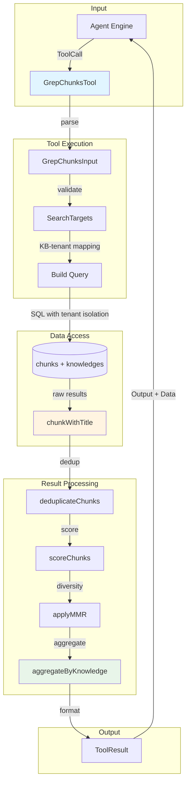

# chunk_grep_and_result_aggregation 模块深度解析

## 模块概述：为什么需要这个模块？

想象一下，你正在一个拥有数百万文档片段（chunk）的企业知识库中查找信息。语义搜索（向量检索）很强大，但有时候你需要的不是"意思相近"的内容，而是**精确的文本匹配**——比如查找特定的错误代码、版本号、API 名称或配置项。这就是 `chunk_grep_and_result_aggregation` 模块存在的意义。

这个模块实现了一个**类 Unix grep 的文本模式匹配工具**，专为知识库场景设计。它的核心洞察是：**在大规模知识库检索中，精确匹配和语义搜索是互补的，而非替代关系**。当用户查询中包含关键实体（如 "Error 503"、"v2.3.1"、"OAuth2.0"）时，语义搜索可能因为向量空间的"平滑"特性而漏掉这些精确匹配，而 grep 工具可以确保这些关键信息不被遗漏。

模块名称揭示了它的两大职责：
1. **Chunk Grep**：在知识库片段中执行字面量文本匹配
2. **Result Aggregation**：将分散的匹配结果按知识文档聚合，提供结构化的检索视图

与 naive 的 `LIKE '%pattern%'` 查询不同，这个模块解决了三个关键问题：
- **多租户数据隔离**：跨租户共享知识库场景下的权限控制
- **结果去重与多样性**：避免返回大量语义重复的片段
- **结果可解释性**：按文档聚合，让用户理解"哪些文档包含了我的关键词"

---

## 架构与数据流



### 数据流详解

1. **输入阶段**：Agent Engine 发起工具调用，传入 `GrepChunksInput`（包含 patterns、knowledge_base_ids、max_results）

2. **权限解析阶段**：工具从预计算的 `SearchTargets` 中获取 KB-Tenant 映射，确保查询不会越权访问其他租户的数据

3. **数据库查询阶段**：构建 tenant-aware 的 SQL 查询，使用 `ILIKE` 进行大小写不敏感的固定字符串匹配，返回 `chunkWithTitle` 结构

4. **结果处理流水线**：
   - **去重**：基于 ID、父 chunk ID、内容签名多维度去重
   - **打分**：根据匹配的模式数量和位置计算相关性分数
   - **多样性优化**：使用 MMR（Maximal Marginal Relevance）算法减少冗余
   - **聚合**：按 knowledge_id 分组，统计每个文档的命中情况

5. **输出阶段**：返回 `ToolResult`，包含人类可读的 Output 和机器可解析的 Data

---

## 核心组件深度解析

### 1. GrepChunksInput：输入契约

```go
type GrepChunksInput struct {
    Pattern          []string `json:"pattern"`
    KnowledgeBaseIDs []string `json:"knowledge_base_ids,omitempty"`
    MaxResults       int      `json:"max_results,omitempty"`
}
```

**设计意图**：这个结构体现了模块的核心使用约束——**patterns 必须是短关键词**。从工具描述中的强调可以看出：

> "Keywords should be 1–3 words maximum. Focus exclusively on core entities, not descriptions."

这不是随意的建议，而是由底层 `ILIKE` 匹配机制决定的。长短语（如 "how to configure the database connection"）在 chunk 中精确出现的概率极低，会导致召回率骤降。正确的用法是提取核心实体：`["database", "connection", "configure"]`。

**参数约束**：
- `pattern`：必填，数组形式支持多关键词 OR 逻辑
- `knowledge_base_ids`：可选，为空时搜索所有授权 KB
- `max_results`：默认 50，上限 200，防止资源耗尽

### 2. GrepChunksTool：执行引擎

这是模块的核心类，继承了 `BaseTool` 基类。它的设计体现了**工具模式的典型架构**：

```go
type GrepChunksTool struct {
    BaseTool
    db            *gorm.DB
    searchTargets types.SearchTargets
}
```

**依赖注入模式**：`db` 和 `searchTargets` 在构造函数中注入，而非在 `Execute` 时创建。这种设计有两个好处：
1. **可测试性**：可以在单元测试中注入 mock 对象
2. **权限预计算**：`searchTargets` 在请求入口点已经根据用户权限预计算好，工具执行时只需读取，无需重复鉴权

#### Execute 方法的处理流水线

`Execute` 方法是理解模块的关键，它实现了一个**多阶段结果优化流水线**：

```
Parse → Validate → Query → Deduplicate → Score → MMR → Aggregate → Format
```

**阶段 1：解析与验证**
```go
var input GrepChunksInput
json.Unmarshal(args, &input)
// 验证 pattern 非空
```

**阶段 2：权限解析**
```go
allowedKBIDs := t.searchTargets.GetAllKnowledgeBaseIDs()
kbTenantMap := t.searchTargets.GetKBTenantMap()
```
这里的关键是 `kbTenantMap`——它建立了 KB ID 到 Tenant ID 的映射，用于后续的 tenant-aware 查询。

**阶段 3：数据库查询**
调用 `searchChunks` 方法，构建 tenant 隔离的 SQL 查询（详见下文）。

**阶段 4：去重**
```go
deduplicatedResults := t.deduplicateChunks(ctx, results)
```
去重策略采用**多维度键**：
- Chunk ID（主键）
- ParentChunkID（处理父子 chunk 关系）
- KnowledgeID + ChunkIndex（同一文档内的位置）
- Content Signature（基于 MD5 的内容指纹，检测近似重复）

**阶段 5：打分**
```go
scoredResults := t.scoreChunks(ctx, deduplicatedResults, patterns)
```
打分公式：
```
score = (matched_patterns / total_patterns) + position_bonus
position_bonus = (1 - earliest_pos / content_length) * 0.1
```
基础分是匹配比例（0-1），位置加分最多 0.1，确保早期匹配的内容略高于晚期匹配。

**阶段 6：MMR 多样性优化**
```go
if len(scoredResults) > 10 {
    mmrResults := t.applyMMR(ctx, scoredResults, patterns, mmrK, 0.7)
}
```
这是模块的**关键设计决策点**。当结果超过 10 条时，启用 MMR 算法。MMR 的核心思想是**在相关性和多样性之间取得平衡**：

```
MMR = λ * relevance - (1-λ) * redundancy
```

其中：
- `relevance`：chunk 的匹配分数
- `redundancy`：与已选结果的最大 Jaccard 相似度
- `λ = 0.7`：偏向相关性，但保留 30% 的多样性权重

**为什么需要 MMR？** 在知识库场景中，同一个文档可能被切分成多个 chunk，这些 chunk 内容高度重叠。如果不做多样性优化，返回的前 N 条结果可能都来自同一个文档，用户无法看到其他相关文档。MMR 通过惩罚与已选结果相似的候选，确保结果覆盖更多样化的内容源。

**阶段 7：按知识文档聚合**
```go
aggregatedResults := t.aggregateByKnowledge(finalResults, patterns)
```
这是模块名称中 "Result Aggregation" 的体现。聚合将分散的 chunk 按 `knowledge_id` 分组，输出结构：

```go
type knowledgeAggregation struct {
    KnowledgeID      string
    KnowledgeTitle   string
    ChunkHitCount    int            // 命中的 chunk 数量
    TotalChunkCount  int            // 文档总 chunk 数
    PatternCounts    map[string]int // 每个 pattern 的命中次数
    TotalPatternHits int
    DistinctPatterns int            // 命中的不同 pattern 数
}
```

**聚合的排序逻辑**：
1. 优先按 `DistinctPatterns` 降序（命中更多不同 pattern 的文档排前面）
2. 其次按 `TotalPatternHits` 降序（总命中次数多的排前面）
3. 再按 `ChunkHitCount` 降序
4. 最后按标题字母序

这种排序策略确保**覆盖用户查询意图更全面**的文档排在前面。

**阶段 8：格式化输出**
生成人类可读的文本输出和机器可解析的 `Data` 字段。

### 3. chunkWithTitle：查询结果载体

```go
type chunkWithTitle struct {
    types.Chunk
    KnowledgeTitle  string
    MatchScore      float64
    MatchedPatterns int
    TotalChunkCount int
}
```

这个结构**嵌入**了 `types.Chunk`，并扩展了查询时计算的字段。使用嵌入而非组合的设计选择，使得可以直接访问 chunk 的所有字段（如 `Content`、`ChunkIndex`），同时添加聚合信息。

**设计权衡**：嵌入使得代码更简洁，但也意味着这个结构 tightly coupled 到 Chunk 的 schema。如果 Chunk 模型变更，这里可能需要同步调整。

### 4. knowledgeAggregation：聚合结果模型

这是模块的**输出抽象**，将底层的 chunk 级结果提升为文档级视图。对于用户（或下游 Agent）来说，"哪个文档包含我的关键词"比"哪些 chunk 包含关键词"更有意义。

---

## 依赖分析

### 上游依赖（谁调用它）

1. **Agent Engine** (`internal.agent.engine.AgentEngine`)
   - 通过工具注册表解析 `ToolGrepChunks` 工具
   - 在 Agent 推理循环中，当 LLM 决定调用 grep 工具时触发

2. **Tool Registry** (`internal.agent.tools.registry.ToolRegistry`)
   - 管理工具的注册和查找
   - 在 Agent 初始化时注册 `GrepChunksTool`

### 下游依赖（它调用谁）

1. **GORM DB** (`gorm.io/gorm`)
   - 执行 SQL 查询
   - 依赖 `chunks` 和 `knowledges` 表的 schema

2. **SearchTargets** (`internal.types.search.SearchTargets`)
   - 提供 KB-Tenant 映射
   - 封装权限检查逻辑

3. **searchutil 包** (`internal.searchutil`)
   - `BuildContentSignature`：内容去重指纹
   - `TokenizeSimple`：MMR 所需的分词
   - `Jaccard`：集合相似度计算

4. **BaseTool** (`internal.agent.tools.tool.BaseTool`)
   - 提供工具元数据（名称、描述、JSON Schema）

### 数据契约

**输入契约**：`GrepChunksInput`
- 必须包含至少一个 pattern
- KB IDs 必须在 SearchTargets 授权范围内

**输出契约**：`types.ToolResult`
```go
type ToolResult struct {
    Success bool
    Output  string  // 人类可读的 grep 风格输出
    Data    map[string]interface{}  // 结构化数据
    Error   string
}
```

**Data 字段结构**：
```go
{
    "patterns":           []string,
    "knowledge_results":  []knowledgeAggregation,
    "result_count":       int,
    "total_matches":      int,
    "knowledge_base_ids": []string,
    "max_results":        int,
    "display_type":       "grep_results"
}
```

---

## 设计决策与权衡

### 1. 固定字符串匹配 vs 正则表达式

**选择**：固定字符串匹配（`ILIKE '%pattern%'`）

**权衡**：
- ✅ 性能更好：数据库可以使用索引优化（虽然 ILIKE 前缀通配符无法用普通 B-Tree 索引，但可以使用 GIN 倒排索引）
- ✅ 语义明确：用户不需要理解正则语法
- ❌ 灵活性较低：不支持复杂模式

**为什么这样选**：模块定位是"关键词提取工具"，而非通用文本搜索。用户应该提取核心实体（如 "OAuth2"），而非编写复杂模式。如果需要正则能力，应该由上层 Agent 逻辑处理。

### 2. 数据库层过滤 vs 应用层过滤

**选择**：在数据库层执行 `ILIKE` 匹配

**权衡**：
- ✅ 减少数据传输：只返回匹配的 chunk
- ✅ 利用数据库优化：数据库可以并行扫描
- ❌ 耦合到 SQL：难以切换到非关系型存储

**为什么这样选**：知识库的 chunk 数量可能达到百万级，全量拉到应用层过滤会导致内存和带宽问题。数据库层过滤是更 scalable 的选择。

### 3. MMR 的 λ 参数选择

**选择**：λ = 0.7

**权衡**：
- 更高的 λ（如 0.9）：更关注相关性，但结果可能更冗余
- 更低的 λ（如 0.5）：更多样化，但可能引入不相关内容

**为什么选 0.7**：这是一个经验值，在相关性和多样性之间取得平衡。对于 grep 场景，用户更关心"找到包含关键词的内容"，所以相关性权重略高。但这个值应该根据实际使用场景调优。

### 4. 聚合层级选择

**选择**：按 knowledge_id 聚合（文档级），而非 knowledge_base_id（知识库级）

**为什么**：用户通常想知道"哪个具体文档包含我的关键词"，而非"哪个知识库包含"。文档级聚合提供了更细粒度的可解释性。

### 5. 去重策略的多维度设计

**选择**：同时使用 ID、ParentChunkID、Content Signature 去重

**为什么**：单一维度的去重不足以处理所有场景：
- ID 去重：处理重复查询
- ParentChunkID 去重：处理父子 chunk 关系（如图片 chunk 和原始文本 chunk）
- Content Signature 去重：处理内容相同但 ID 不同的 chunk（如复制的文档）

---

## 使用指南与示例

### 基本用法

```go
// 初始化工具
tool := NewGrepChunksTool(db, searchTargets)

// 构建输入
input := GrepChunksInput{
    Pattern:    []string{"OAuth2", "authentication"},
    MaxResults: 50,
}

// 执行
inputJSON, _ := json.Marshal(input)
result, err := tool.Execute(ctx, inputJSON)

// 处理结果
if result.Success {
    fmt.Println(result.Output)  // 人类可读输出
    // 访问结构化数据
    knowledgeResults := result.Data["knowledge_results"].([]knowledgeAggregation)
}
```

### Agent 工具调用示例

当 Agent 收到用户查询 "如何配置 OAuth2 认证？" 时，可能生成以下工具调用：

```json
{
  "tool": "grep_chunks",
  "arguments": {
    "pattern": ["OAuth2", "认证"],
    "knowledge_base_ids": ["kb-123"],
    "max_results": 20
  }
}
```

**关键**：pattern 是提取的核心实体，而非完整句子。

### 配置选项

| 参数 | 类型 | 默认值 | 说明 |
|------|------|--------|------|
| pattern | []string | 必填 | 搜索关键词列表 |
| knowledge_base_ids | []string | 空（搜索所有） | 限制搜索范围 |
| max_results | int | 50 | 最大返回结果数（上限 200） |

---

## 边界情况与注意事项

### 1. 空模式处理

```go
if len(patterns) == 0 {
    return &types.ToolResult{
        Success: false,
        Error:   "pattern parameter is required",
    }, fmt.Errorf("missing pattern parameter")
}
```

**注意**：空 pattern 会导致全表扫描，必须拒绝。

### 2. 跨租户查询的权限隔离

```go
// 构建 OR 条件：(kb_id = X AND tenant_id = Y) OR (kb_id = Z AND tenant_id = W)
var conditions []string
for _, kbID := range kbIDs {
    tenantID := kbTenantMap[kbID]
    conditions = append(conditions, "(chunks.knowledge_base_id = ? AND chunks.tenant_id = ?)")
    args = append(args, kbID, tenantID)
}
```

**关键**：必须同时检查 `knowledge_base_id` 和 `tenant_id`，防止通过猜测 KB ID 访问其他租户数据。

### 3. MMR 的性能开销

MMR 需要计算候选结果与已选结果的 Jaccard 相似度，时间复杂度为 O(k * n)，其中 k 是已选结果数，n 是候选数。当结果集很大时（如 >1000），这可能成为瓶颈。

**当前缓解策略**：仅在结果 >10 时启用 MMR，且限制 max_results 为 200。

**潜在优化**：对于超大规模结果集，可以考虑：
- 先按分数排序取 top N，再对 N 应用 MMR
- 使用近似 Jaccard 算法（如 MinHash）

### 4. 内容签名的碰撞风险

`BuildContentSignature` 使用 MD5 哈希，理论上存在碰撞可能。但在去重场景下，碰撞概率极低，且即使碰撞也只是导致本应保留的 chunk 被误删，不影响正确性（不会误保留）。

### 5. ILIKE 的性能陷阱

`ILIKE '%pattern%'` 无法使用普通 B-Tree 索引，因为前缀通配符。对于大规模数据，建议：
- 使用 PostgreSQL 的 GIN 倒排索引（`gin_trgm_ops`）
- 或考虑集成 Elasticsearch 等专用搜索引擎

### 6. 聚合结果的截断

```go
if len(aggregatedResults) > 20 {
    aggregatedResults = aggregatedResults[:20]
}
```

**注意**：聚合后限制为 20 个文档，这是为了控制输出大小。如果用户需要更多结果，应该调整查询策略（如缩小 KB 范围）。

---

## 相关模块参考

- [agent_core_orchestration_and_tooling_foundation](agent_core_orchestration_and_tooling_foundation.md)：工具注册和执行的基础设施
- [knowledge_access_and_corpus_navigation_tools](knowledge_access_and_corpus_navigation_tools.md)：同类知识访问工具的对比
- [semantic_knowledge_search](semantic_knowledge_search.md)：语义搜索工具，与 grep 形成互补
- [data_access_repositories](data_access_repositories.md)：底层 chunk 数据访问层

---

## 总结

`chunk_grep_and_result_aggregation` 模块是一个**精心设计的精确匹配工具**，它在简单的 `LIKE` 查询之上构建了多层结果优化逻辑（去重、打分、多样性、聚合），确保返回的结果既准确又有用。

**核心设计哲学**：
1. **精确匹配与语义搜索互补**：不试图替代向量检索，而是作为补充
2. **结果质量优于原始召回**：通过 MMR 和聚合提升结果的可解释性
3. **权限隔离内建**：tenant-aware 查询确保多租户场景下的数据安全
4. **Agent 友好**：输出同时支持人类阅读和机器解析

对于新贡献者，理解这个模块的关键是把握它的**定位**：它不是通用搜索引擎，而是 Agent 工具箱中的"精确匹配螺丝刀"——在特定场景下（关键词查找、实体验证）发挥不可替代的作用。
