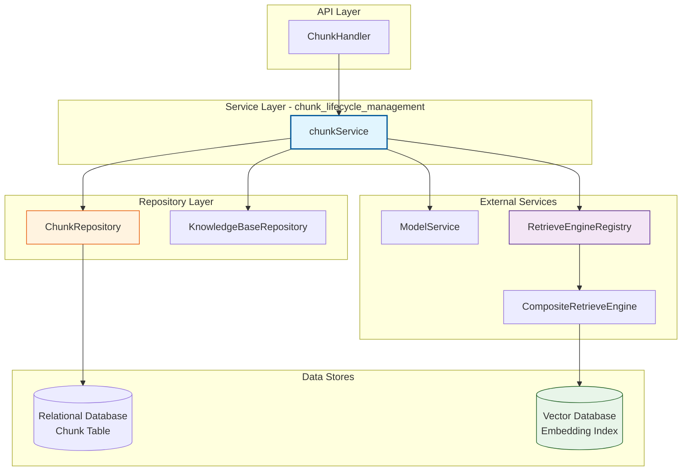

# Chunk Lifecycle Management 模块深度解析

## 模块概述

想象你正在管理一座巨大的图书馆。原始文档就像一本本厚重的书 —— 直接拿去检索效率极低，因为用户的问题往往只涉及书中的某个段落、某张表格，甚至某句话。**Chunk Lifecycle Management** 模块的核心职责，就是把这些"书"拆解成可独立检索、可独立管理的"知识卡片"（Chunk），并在它们的整个生命周期内提供一致的 CRUD 操作、权限控制和向量索引同步能力。

这个模块存在的根本原因是：**文档检索系统不能直接操作原始文档**。当用户上传一个 PDF 或 Word 文档后，系统需要通过 [docreader_pipeline](docreader_pipeline.md) 将其切分成多个 Chunk，每个 Chunk 携带独立的向量嵌入（embedding）、元数据（metadata）和位置信息。Chunk 是检索系统的最小操作单元 —— 无论是语义搜索、FAQ 匹配还是知识图谱构建，最终都是在 Chunk 级别进行的。

但 Chunk 管理远不止简单的数据库 CRUD。它需要处理几个关键挑战：

1. **多租户隔离**：每个 Chunk 必须严格归属于特定租户，查询时自动注入租户过滤条件，防止数据泄露
2. **向量索引同步**：Chunk 的内容变更必须同步到向量数据库（Elasticsearch/Milvus/Qdrant 等），否则检索结果会与实际数据不一致
3. **层级结构维护**：Chunk 之间存在前后继关系（`PreChunkID`/`NextChunkID`）、父子关系（`ParentChunkID`，用于图文关联）、以及知识图谱关系（`RelationChunks`）
4. **FAQ 特殊语义**：FAQ 类型的 Chunk 携带结构化元数据（标准问题、相似问题、答案），支持按问题字段搜索和去重

`chunkService` 作为本模块的核心组件，扮演的是**领域服务层**角色 —— 它协调 `ChunkRepository`（数据持久化）、`KnowledgeBaseRepository`（知识库元数据）、`ModelService`（嵌入模型）和 `RetrieveEngineRegistry`（向量检索引擎），确保业务规则在数据操作中得到正确执行。

---

## 架构与数据流



### 组件角色说明

| 组件 | 职责 | 依赖方向 |
|------|------|----------|
| **chunkService** | 领域服务层，封装 Chunk 的业务逻辑，协调多个 Repository 和 Service | 被 Handler 调用，调用 Repository 和其他 Service |
| **ChunkRepository** | 数据访问层，负责 Chunk 在关系型数据库中的持久化 | 被 chunkService 调用，直接操作数据库 |
| **KnowledgeBaseRepository** | 提供知识库元数据查询（如获取 Embedding 模型 ID） | 被 chunkService 调用 |
| **ModelService** | 提供嵌入模型信息（维度、配置等） | 被 chunkService 调用 |
| **RetrieveEngineRegistry** | 向量检索引擎注册表，根据租户配置返回合适的检索引擎实例 | 被 chunkService 调用 |
| **CompositeRetrieveEngine** | 组合多个检索引擎（如关键词 + 向量混合检索），执行向量索引的增删改查 | 被 chunkService 通过 Registry 间接调用 |

### 典型数据流：删除一个 FAQ 问题

以 `DeleteGeneratedQuestion` 方法为例，展示跨组件协作的完整链路：

```
用户请求 → ChunkHandler → chunkService.DeleteGeneratedQuestion
                              │
                              ├─→ ChunkRepository.GetChunkByID (读取 Chunk)
                              ├─→ KnowledgeBaseRepository.GetKnowledgeBaseByID (获取 KB 配置)
                              ├─→ RetrieveEngineRegistry + CompositeRetrieveEngine
                              │       └─→ VectorDB.DeleteBySourceID (删除向量索引)
                              └─→ ChunkRepository.UpdateChunk (更新元数据)
```

这个流程的关键在于：**删除一个 FAQ 问题需要同时更新关系型数据库和向量数据库**。如果只删除了数据库记录而保留了向量索引，后续检索时会返回无效的 Chunk 引用；反之则会导致索引中存在"幽灵"向量。`chunkService` 在这里承担了**事务协调者**的角色（尽管代码中未使用显式事务，但逻辑上要求两者一致）。

---

## 核心组件深度解析

### chunkService

**设计意图**：作为 Chunk 领域的**业务逻辑编排中心**，`chunkService` 不直接操作数据库或向量引擎，而是通过依赖注入的方式组合多个底层组件。这种设计遵循**依赖倒置原则** —— 服务层依赖抽象接口（`interfaces.ChunkRepository`、`interfaces.RetrieveEngineRegistry`），而非具体实现，使得单元测试可以通过 Mock 轻松隔离依赖。

**核心方法分类**：

#### 1. 基础 CRUD 操作

```go
CreateChunks(ctx, chunks)      // 批量创建
GetChunkByID(ctx, id)          // 按 ID 查询（带租户过滤）
GetChunkByIDOnly(ctx, id)      // 按 ID 查询（无租户过滤，用于权限解析）
UpdateChunk(ctx, chunk)        // 单条更新
UpdateChunks(ctx, chunks)      // 批量更新
DeleteChunk(ctx, id)           // 单条删除
DeleteChunks(ctx, ids)         // 批量删除
```

这些方法看似简单，但每个都隐含了**租户隔离**的设计决策。注意 `GetChunkByID` 和 `GetChunkByIDOnly` 的区别：

- `GetChunkByID`：从 Context 中提取 `tenantID`，传递给 Repository 层进行过滤。这是**默认行为**，确保用户只能访问自己租户的数据。
- `GetChunkByIDOnly`：**跳过租户过滤**，用于权限解析场景。例如，当系统需要判断"用户 A 是否有权访问 Chunk X"时，必须先无条件读取 Chunk，再检查其所属的知识库是否对用户可见。

> ⚠️ **陷阱**：`GetChunkByIDOnly` 是高风险方法，只能在权限校验逻辑中使用。如果在普通业务逻辑中误用，会导致跨租户数据泄露。

#### 2. 按 Knowledge 维度的操作

```go
ListChunksByKnowledgeID(ctx, knowledgeID)           // 列出某文档的所有 Chunk
ListPagedChunksByKnowledgeID(ctx, knowledgeID, page, chunkType)  // 分页列出
DeleteChunksByKnowledgeID(ctx, knowledgeID)         // 删除某文档的所有 Chunk
DeleteByKnowledgeList(ctx, ids)                     // 批量删除多个文档的 Chunk
```

这些方法的设计动机是：**用户操作的最小单元通常是"文档"而非"Chunk"**。当用户上传一个 PDF 后，系统会生成数十个 Chunk，但用户想删除时只会说"删除这个文档"，而不是"删除这 37 个 Chunk"。因此，服务层提供了按 `KnowledgeID` 批量操作的便捷方法。

`ListPagedChunksByKnowledgeID` 特别值得注意 —— 它支持按 `chunkType` 过滤（如 `text`、`image`、`table`），这是因为前端展示时可能需要区分不同类型的 Chunk（例如只展示文本 Chunk，或单独展示表格 Chunk）。

#### 3. 层级关系操作

```go
ListChunkByParentID(ctx, tenantID, parentID)
```

这个方法用于**图文关联**场景。当文档中包含图片时，系统会创建两个 Chunk：一个是图片本身的 Chunk（包含 OCR 结果），另一个是图片周围的文本 Chunk。`ParentChunkID` 字段将两者关联起来，`ListChunkByParentID` 则用于查询某个文本 Chunk 关联的所有图片 Chunk。

#### 4. FAQ 专用操作

```go
DeleteGeneratedQuestion(ctx, chunkID, questionID)
```

这是本模块**最复杂的方法**，体现了 Chunk 管理的核心难点：**多存储引擎一致性**。让我们逐步拆解它的实现逻辑：

```go
// 步骤 1: 读取 Chunk
chunk, err := s.chunkRepository.GetChunkByID(ctx, tenantID, chunkID)

// 步骤 2: 解析元数据，找到要删除的问题
meta, err := chunk.DocumentMetadata()
questionIndex := findQuestionIndex(meta.GeneratedQuestions, questionID)

// 步骤 3: 获取知识库配置（嵌入模型 ID）
kb, err := s.kbRepository.GetKnowledgeBaseByID(ctx, chunk.KnowledgeBaseID)

// 步骤 4: 构造向量索引的 source_id
sourceID := fmt.Sprintf("%s-%s", chunkID, questionID)

// 步骤 5: 删除向量索引
retrieveEngine.DeleteBySourceIDList(ctx, []string{sourceID}, embeddingModel.GetDimensions(), kb.Type)

// 步骤 6: 更新 Chunk 元数据（从 GeneratedQuestions 数组中移除）
meta.GeneratedQuestions = removeQuestion(meta.GeneratedQuestions, questionIndex)
chunk.SetDocumentMetadata(meta)
s.chunkRepository.UpdateChunk(ctx, chunk)
```

**关键设计决策**：

1. **source_id 的构造规则**：`{chunk_id}-{question_id}`。这种设计使得每个 FAQ 问题在向量索引中都有唯一标识，即使它们属于同一个 Chunk。如果直接用 `chunk_id` 作为 source_id，就无法单独删除某个问题。

2. **向量删除失败不中断流程**：注意代码中的注释 `"Continue even if vector deletion fails - the question might not have been indexed"`。这是一个**防御性设计** —— 如果向量索引中本来就没有这个条目（例如之前删除失败但数据库已更新），不应该阻止数据库层面的删除操作。这种设计选择了**最终一致性**而非强一致性，避免了因向量数据库临时不可用而导致整个操作失败。

3. **元数据更新在向量删除之后**：这是为了最小化不一致窗口。如果先更新数据库再删除向量，在两者之间的时间窗口内，检索系统可能返回一个已被删除的问题。反过来，先删向量再更新数据库，即使中间失败，也只是多了一个"孤儿"向量（下次清理时可回收），不会影响检索结果的正确性。

---

## 依赖分析

### 上游调用者（谁调用 chunkService）

| 调用者 | 调用场景 | 期望行为 |
|--------|----------|----------|
| [ChunkHandler](http_handlers_and_routing.md) | HTTP API 请求处理 | 返回标准 HTTP 响应，错误转换为 HTTP 状态码 |
| [knowledgeService](knowledge_ingestion_extraction_and_graph_services.md) | 文档 ingestion 流程 | 批量创建 Chunk，要求高性能和事务一致性 |
| [kbShareService](agent_identity_tenant_and_organization_services.md) | 知识库共享权限检查 | 通过 `GetChunkByIDOnly` 读取 Chunk 后校验权限 |
| [graphBuilder](knowledge_ingestion_extraction_and_graph_services.md) | 知识图谱构建 | 读取 Chunk 内容提取实体关系 |
| [PluginSearch](chat_pipeline_plugins_and_flow.md) | 检索插件执行 | 根据检索结果获取 Chunk 详情 |

### 下游被调用者（chunkService 调用谁）

| 被调用者 | 调用目的 | 数据契约 |
|----------|----------|----------|
| `ChunkRepository` | 持久化 Chunk 数据 | `*types.Chunk` 结构体，包含所有字段 |
| `KnowledgeBaseRepository` | 获取知识库配置（嵌入模型 ID、类型等） | `*types.KnowledgeBase` |
| `ModelService.GetEmbeddingModel` | 获取嵌入模型维度（向量删除时需要） | `EmbeddingModel` 接口，提供 `GetDimensions()` |
| `RetrieveEngineRegistry` | 获取检索引擎实例 | `RetrieveEngine` 接口，提供 `DeleteBySourceIDList()` 等方法 |

### 关键数据契约：types.Chunk

`Chunk` 结构体是模块的**核心数据模型**，理解它的设计对正确使用模块至关重要：

```go
type Chunk struct {
    ID              string      // UUID，主键
    SeqID           int64       // 自增 ID，用于 FAQ 外部 API（用户可见）
    TenantID        uint64      // 租户 ID，所有查询必须过滤
    KnowledgeID     string      // 所属文档 ID
    KnowledgeBaseID string      // 所属知识库 ID
    TagID           string      // 标签 ID（FAQ 分类）
    Content         string      // 文本内容
    ChunkIndex      int         // 在原文档中的位置索引
    IsEnabled       bool        // 是否启用（可临时禁用而不删除）
    Flags           ChunkFlags  // 位标志（推荐状态等）
    Status          int         // 处理状态
    StartAt/EndAt   int         // 在原文档中的字符位置
    PreChunkID      string      // 前一个 Chunk ID（链表结构）
    NextChunkID     string      // 后一个 Chunk ID
    ChunkType       ChunkType   // 类型：text/image/table
    ParentChunkID   string      // 父 Chunk ID（图文关联）
    Metadata        JSON        // 扩展元数据（FAQ 问题、答案等）
    ContentHash     string      // 内容哈希（FAQ 去重）
    // ... 时间戳和软删除字段
}
```

**设计权衡**：

1. **双 ID 系统（ID + SeqID）**：`ID` 是 UUID，适合内部关联；`SeqID` 是自增整数，适合对外暴露（用户友好的 FAQ 编号）。这种设计增加了复杂性，但提升了用户体验。

2. **链表结构（PreChunkID/NextChunkID）**：支持按原文顺序遍历 Chunk，用于重建完整文档。但这种设计在删除中间 Chunk 时需要更新前后继指针，增加了维护成本。

3. **JSON 元数据**：`Metadata` 字段使用 JSON 类型而非结构化字段，提供了灵活性（不同 Chunk 类型可存储不同元数据），但牺牲了类型安全和查询性能。

---

## 设计决策与权衡

### 1. 服务层 vs 仓库层：业务逻辑放哪里？

**选择**：`chunkService` 封装了跨多个 Repository 的业务逻辑（如 `DeleteGeneratedQuestion` 需要同时操作 ChunkRepository、KnowledgeBaseRepository 和 RetrieveEngine），而单一实体的 CRUD 则委托给 `ChunkRepository`。

**权衡**：
- ✅ 优点：服务层可以协调多个数据源，确保业务规则一致执行
- ❌ 缺点：增加了调用层级，简单操作也需要经过服务层

**替代方案**：将逻辑下沉到 Repository 层（Active Record 模式）。但这会导致 Repository 依赖其他 Repository，违反单一职责原则。

### 2. 租户过滤：在服务层还是仓库层？

**选择**：`tenantID` 从 Context 中提取，传递给 Repository 层进行过滤。

**权衡**：
- ✅ 优点：Repository 层统一处理租户隔离，避免遗漏
- ❌ 缺点：Repository 方法签名需要携带 `tenantID` 参数，增加了冗余

**替代方案**：使用数据库行级安全策略（RLS）。但这将业务逻辑耦合到数据库，降低了可移植性。

### 3. 向量索引同步：同步还是异步？

**选择**：`DeleteGeneratedQuestion` 采用**同步删除**向量索引。

**权衡**：
- ✅ 优点：操作简单，立即可见
- ❌ 缺点：增加了请求延迟，向量数据库不可用时会影响主流程

**替代方案**：使用消息队列异步同步。但这增加了系统复杂性，且需要处理失败重试和补偿逻辑。当前代码中的"删除失败不中断"是一种折中方案。

### 4. 批量操作：单条循环还是批量 SQL？

**选择**：提供 `CreateChunks`、`UpdateChunks`、`DeleteChunks` 等批量方法，由 Repository 层决定使用批量 SQL 还是循环单条操作。

**权衡**：
- ✅ 优点：接口简洁，调用者无需关心实现细节
- ❌ 缺点：批量过大时可能超时或占用过多资源

**建议**：调用批量方法时应控制批次大小（建议 ≤ 1000），超大集合应分批次调用。

---

## 使用指南与示例

### 创建 Chunk

```go
chunks := []*types.Chunk{
    {
        ID:              uuid.New().String(),
        TenantID:        tenantID,
        KnowledgeID:     knowledgeID,
        KnowledgeBaseID: kbID,
        Content:         "这是 Chunk 内容",
        ChunkIndex:      0,
        ChunkType:       types.ChunkTypeText,
        Metadata:        types.JSON(`{"standard_question": "问题", "answers": ["答案"]}`),
    },
}
err := chunkService.CreateChunks(ctx, chunks)
```

### 分页查询 FAQ Chunk

```go
page := &types.Pagination{Page: 1, PageSize: 20}
chunkTypes := []types.ChunkType{types.ChunkTypeFAQ}
result, err := chunkService.ListPagedChunksByKnowledgeID(ctx, knowledgeID, page, chunkTypes)
// result.Chunks 包含当前页的 Chunk
// result.Total 包含总数
```

### 删除生成的 FAQ 问题

```go
// 注意：这个方法会同时删除数据库记录和向量索引
err := chunkService.DeleteGeneratedQuestion(ctx, chunkID, questionID)
if err != nil {
    // 处理错误（可能是 Chunk 不存在或问题 ID 无效）
}
```

### 配置依赖注入

```go
// 在应用启动时组装依赖
chunkRepo := repository.NewChunkRepository(db)
kbRepo := repository.NewKnowledgeBaseRepository(db)
modelSvc := service.NewModelService(modelRepo)
retrieveEngine := retriever.NewRetrieveEngineRegistry(esClient, milvusClient, qdrantClient)

chunkSvc := service.NewChunkService(chunkRepo, kbRepo, modelSvc, retrieveEngine)
```

---

## 边界情况与陷阱

### 1. 租户隔离遗漏

**问题**：`GetChunkByIDOnly` 绕过租户过滤，只能在权限校验逻辑中使用。

**症状**：用户 A 可以访问用户 B 的 Chunk。

**防护**：在使用 `GetChunkByIDOnly` 后，必须立即进行权限校验：

```go
chunk, err := s.chunkService.GetChunkByIDOnly(ctx, chunkID)
if err != nil {
    return nil, err
}
// ⚠️ 必须校验权限
if !hasPermission(ctx, chunk.KnowledgeBaseID) {
    return nil, ErrPermissionDenied
}
```

### 2. 向量索引与数据库不一致

**问题**：`DeleteGeneratedQuestion` 中，向量删除失败不会中断流程，可能导致"孤儿"向量。

**症状**：检索结果中包含已删除的问题，点击后报错"Chunk 不存在"。

**防护**：定期运行清理任务，扫描向量索引中的 `source_id`，检查对应的 Chunk 是否存在。

### 3. 元数据解析失败

**问题**：`chunk.DocumentMetadata()` 可能因 JSON 格式错误而失败。

**症状**：更新 FAQ Chunk 时报错 "failed to parse chunk metadata"。

**防护**：在写入 Metadata 前进行 JSON 校验，使用结构化类型而非原始 JSON 字符串。

### 4. 批量操作超时

**问题**：`DeleteByKnowledgeList` 删除大量 Chunk 时可能超时。

**症状**：HTTP 请求 504 Gateway Timeout。

**防护**：对于超大知识库，使用异步任务（如 Asynq）分批处理，或提供进度查询接口。

### 5. 软删除 vs 硬删除

**问题**：`Chunk` 表有 `DeletedAt` 字段（软删除），但 `DeleteChunk` 方法的行为取决于 Repository 实现。

**症状**：删除后 Chunk 仍可查询（如果 Repository 实现为硬删除则不会）。

**防护**：查阅 `ChunkRepository` 的具体实现，确认删除行为。建议在 Repository 层统一使用软删除，定期清理过期数据。

---

## 扩展点

### 添加新的 Chunk 类型

当前支持 `text`、`image`、`table`、`faq` 等类型。如需添加新类型（如 `video`）：

1. 在 `types.ChunkType` 中添加新枚举值
2. 在 `docreader_pipeline` 中添加对应的 Parser
3. 在 `ChunkRepository.ListPagedChunksByKnowledgeID` 中处理新类型的排序和搜索逻辑

### 自定义元数据字段

`Metadata` 字段是 JSON 类型，可以存储任意结构。但建议：

1. 在 `types` 包中定义结构化类型（如 `FAQChunkMetadata`）
2. 提供 `GetDocumentMetadata()` 和 `SetDocumentMetadata()` 辅助方法
3. 在 Repository 层添加针对新字段的索引（如需高效查询）

### 集成新的向量数据库

通过实现 `interfaces.RetrieveEngine` 接口：

```go
type MyVectorEngine struct {
    client *MyVectorClient
}

func (e *MyVectorEngine) DeleteBySourceIDList(ctx, sourceIDs, dimensions, kbType) error {
    // 实现删除逻辑
}

// 注册到 RetrieveEngineRegistry
registry.Register("myvector", NewMyVectorEngine)
```

---

## 相关模块

- [knowledge_ingestion_extraction_and_graph_services](knowledge_ingestion_extraction_and_graph_services.md)：知识入库流程，调用 `chunkService.CreateChunks`
- [data_access_repositories](data_access_repositories.md)：`ChunkRepository` 的具体实现
- [docreader_pipeline](docreader_pipeline.md)：文档解析和 Chunk 切分
- [retrieval_and_web_search_services](retrieval_and_web_search_services.md)：向量检索引擎，同步 Chunk 的向量索引
- [http_handlers_and_routing](http_handlers_and_routing.md)：`ChunkHandler`，HTTP API 入口

---

## 总结

`chunk_lifecycle_management` 模块是知识检索系统的**数据基石**。它的设计体现了几个关键原则：

1. **分层架构**：Service 层编排业务逻辑，Repository 层专注数据持久化
2. **多租户优先**：所有操作默认携带租户过滤，特殊场景才绕过
3. **最终一致性**：向量索引同步失败不中断主流程，通过补偿机制保证最终一致
4. **灵活扩展**：JSON 元数据支持不同类型 Chunk 的差异化需求

理解这个模块的关键是认识到：**Chunk 不是简单的数据库记录，而是连接文档、向量索引和知识图谱的枢纽**。任何对 Chunk 的修改都可能产生连锁反应，因此服务层必须谨慎协调各个组件，确保系统整体的一致性。
