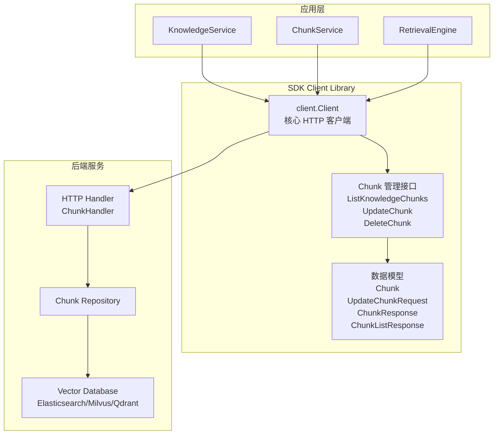
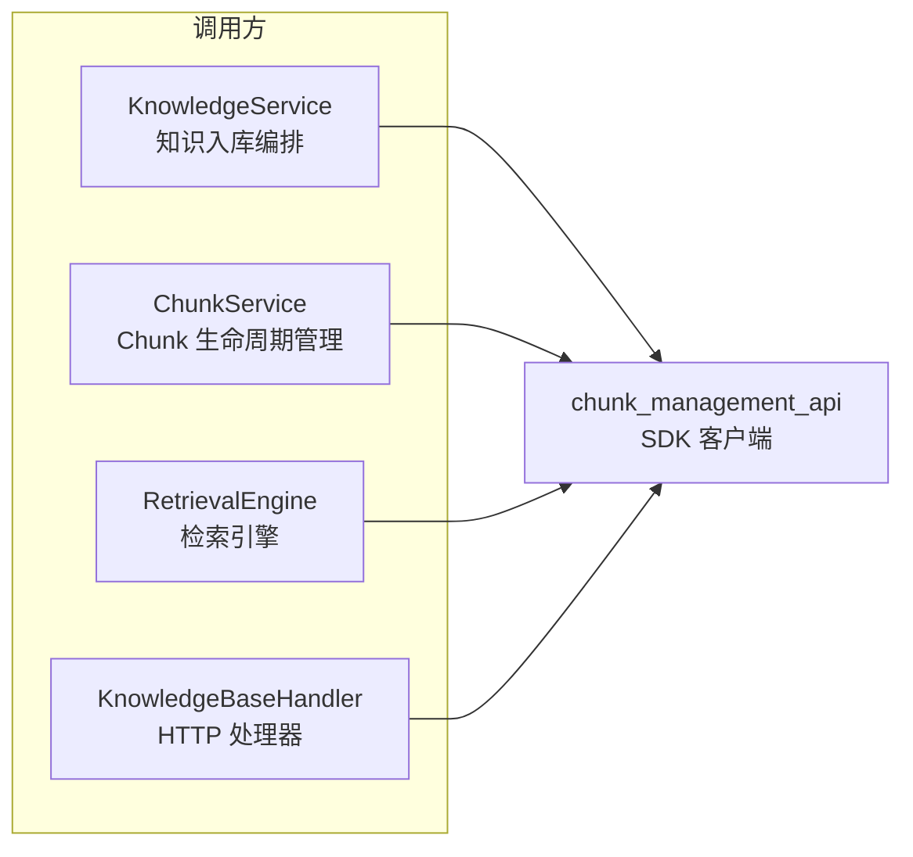
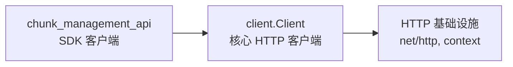

# Chunk Management API 模块深度解析

## 概述：为什么需要这个模块

想象一下你有一个巨大的图书馆，每本书都被切分成若干个章节卡片。`chunk_management_api` 模块就是管理这些卡片的"图书管理员接口"。它存在的核心原因是：**知识库中的文档不能作为一个整体被检索和理解，必须被切分成更小的、语义完整的单元（Chunk）才能被向量数据库索引和检索**。

这个模块解决的问题空间是：当用户上传一个文档到知识库后，系统需要将其切分成多个 chunk，每个 chunk 携带原文位置信息、前后文关系、向量嵌入等元数据。后续的所有检索、问答、知识图谱构建都依赖于对这些 chunk 的精确管理。如果采用 naive 的方案——直接存储原始文档而不维护 chunk 级别的元数据——会导致检索时无法定位到原文的具体位置，也无法追踪 chunk 之间的逻辑关系。

`chunk_management_api` 是 SDK 客户端层对后端 Chunk 管理 HTTP API 的封装，它位于 [`knowledge_and_chunk_api`](../knowledge_and_chunk_api.md) 模块之下，为上层应用提供类型安全的 chunk CRUD 操作接口。

---

## 架构定位与数据流



### 架构角色分析

这个模块在整体架构中扮演**客户端数据访问层**的角色：

1. **向上**：被 [`knowledgeService`](../knowledge_ingestion_extraction_and_graph_services.md)、[`chunkService`](../knowledge_ingestion_extraction_and_graph_services.md) 和 [`RetrievalEngine`](../retrieval_and_web_search_services.md) 等服务层组件调用
2. **向下**：依赖 [`client.Client`](../core_client_runtime.md) 执行实际的 HTTP 请求
3. **横向**：与 [`knowledge_core_model`](../knowledge_core_model.md) 中的 `Knowledge` 模型形成父子关系（一个 Knowledge 包含多个 Chunk）

### 数据流追踪

以"列出某个知识文档的所有 chunk"为例，数据流动路径如下：

```
应用层调用 ListKnowledgeChunks(knowledgeID, page=1, pageSize=20)
    ↓
构造 HTTP GET 请求：/api/v1/chunks/{knowledgeID}?page=1&page_size=20
    ↓
通过 client.Client.doRequest() 发送请求
    ↓
后端 ChunkHandler 处理请求，从 ChunkRepository 查询数据
    ↓
返回 ChunkListResponse JSON 响应
    ↓
SDK 解析响应，反序列化为 []Chunk 和 total count
    ↓
应用层获得类型安全的 chunk 列表
```

---

## 核心组件深度解析

### Chunk 结构体：知识库的原子单元

```go
type Chunk struct {
    ID                     string `json:"id"`
    SeqID                  int64  `json:"seq_id"`
    KnowledgeID            string `json:"knowledge_id"`
    KnowledgeBaseID        string `json:"knowledge_base_id"`
    TenantID               uint64 `json:"tenant_id"`
    TagID                  string `json:"tag_id"`
    Content                string `json:"content"`
    ChunkIndex             int    `json:"chunk_index"`
    IsEnabled              bool   `json:"is_enabled"`
    Status                 int    `json:"status"`
    StartAt                int    `json:"start_at"`
    EndAt                  int    `json:"end_at"`
    PreChunkID             string `json:"pre_chunk_id"`
    NextChunkID            string `json:"next_chunk_id"`
    ChunkType              string `json:"chunk_type"`
    ParentChunkID          string `json:"parent_chunk_id"`
    RelationChunks         any    `json:"relation_chunks"`
    IndirectRelationChunks any    `json:"relation_chunks"`
    Metadata               any    `json:"metadata"`
    ContentHash            string `json:"content_hash"`
    ImageInfo              string `json:"image_info"`
    CreatedAt              string `json:"created_at"`
    UpdatedAt              string `json:"updated_at"`
}
```

**设计意图**：`Chunk` 不仅仅是一段文本，它是携带丰富上下文信息的**可检索单元**。每个字段都有其存在的理由：

| 字段 | 设计目的 | 使用场景 |
|------|----------|----------|
| `ID` / `SeqID` | 双重标识符设计 | `ID` 用于内部关联（UUID 格式），`SeqID` 用于外部 API 展示（更易读的自增整数） |
| `StartAt` / `EndAt` | 原文定位 | 检索命中后，前端可以高亮显示原文中的具体位置 |
| `PreChunkID` / `NextChunkID` | 双向链表结构 | 支持"查看上下文"功能，检索到一个 chunk 后可以快速加载前后文 |
| `ChunkType` | 多模态支持 | 区分 `text`、`image_ocr`、`table` 等类型，不同来源的 chunk 处理方式不同 |
| `ContentHash` | 去重与变更检测 | 快速判断 chunk 内容是否发生变化，避免重复向量化 |
| `RelationChunks` | 知识图谱关联 | 存储通过 NLP 提取的实体关系，支持图检索 |
| `Metadata` | 扩展性设计 | 使用 `any` 类型保持灵活性，可存储解析时的临时信息 |

**关键设计决策**：为什么 `RelationChunks` 和 `Metadata` 使用 `any` 类型而不是具体结构？这是**灵活性 vs 类型安全**的权衡。chunk 的元数据结构可能因文档类型（PDF、Markdown、Excel）而异，使用 `any` 避免了在 SDK 层硬编码所有可能的变体，但代价是调用方需要自行断言类型。

### UpdateChunkRequest：受限的更新能力

```go
type UpdateChunkRequest struct {
    Content    string    `json:"content"`
    Embedding  []float32 `json:"embedding"`
    ChunkIndex int       `json:"chunk_index"`
    IsEnabled  bool      `json:"is_enabled"`
    StartAt    int       `json:"start_at"`
    EndAt      int       `json:"end_at"`
    ImageInfo  string    `json:"image_info"`
}
```

**设计意图**：注意这个结构体**不包含** `ID`、`KnowledgeID`、`CreatedAt` 等字段。这是**命令 - 数据分离**模式的体现：

- **路径参数**携带资源标识（`knowledgeID`、`chunkID` 在 URL 中）
- **请求体**只包含可变的业务数据
- **系统字段**（如 `CreatedAt`、`TenantID`）由服务端维护，不允许客户端修改

这种设计防止了客户端意外覆盖系统管理的字段，是一种**防御性 API 设计**。

**值得注意的字段**：`Embedding` 字段的存在表明这个 API 支持**手动更新向量嵌入**。这在使用场景中对应：当嵌入模型升级后，可以批量重新计算 chunk 的向量并更新，而无需重新解析整个文档。

### 响应结构：统一的 API 契约

```go
type ChunkResponse struct {
    Success bool  `json:"success"`
    Data    Chunk `json:"data"`
}

type ChunkListResponse struct {
    Success  bool    `json:"success"`
    Data     []Chunk `json:"data"`
    Total    int64   `json:"total"`
    Page     int     `json:"page"`
    PageSize int     `json:"page_size"`
}
```

**设计模式**：这是典型的**信封模式（Envelope Pattern）**，所有响应都包裹在 `{success, data}` 结构中。好处是：

1. 统一的错误处理逻辑（检查 `Success` 字段）
2. 便于未来扩展（可以添加 `Message`、`ErrorCode` 等字段而不破坏现有结构）
3. 列表响应内置分页元数据，调用方无需额外请求总记录数

---

## 操作方法详解

### ListKnowledgeChunks：分页遍历 chunk

```go
func (c *Client) ListKnowledgeChunks(ctx context.Context,
    knowledgeID string, page int, pageSize int,
) ([]Chunk, int64, error)
```

**设计考量**：

1. **为什么返回 `([]Chunk, int64, error)` 而不是 `*ChunkListResponse`？**
   
   这是**接口抽象层 vs 传输层**的分离。SDK 选择向调用方暴露业务数据（chunk 列表 + 总数），而不是 HTTP 响应结构。这样做的好处是：
   - 调用方不需要关心 HTTP 细节
   - 未来如果后端响应结构变化，SDK 内部适配即可，不影响调用方
   - 符合 Go 语言习惯（直接返回数据而非响应包装器）

2. **分页参数从 1 开始**：`page` 参数从 1 开始计数（而非 0），这是为了符合非技术用户的直觉，但需要在 SDK 内部转换为后端期望的格式（如果需要的话）。

3. **没有默认 pageSize**：调用方必须显式指定分页大小，这强制调用方考虑性能影响，避免意外拉取大量数据。

**使用示例**：
```go
// 遍历某个知识文档的所有 chunk
var allChunks []Chunk
page := 1
pageSize := 100

for {
    chunks, total, err := client.ListKnowledgeChunks(ctx, knowledgeID, page, pageSize)
    if err != nil {
        return err
    }
    allChunks = append(allChunks, chunks...)
    
    if len(allChunks) >= int(total) {
        break
    }
    page++
}
```

### UpdateChunk：部分更新

```go
func (c *Client) UpdateChunk(ctx context.Context,
    knowledgeID string, chunkID string, request *UpdateChunkRequest,
) (*Chunk, error)
```

**设计决策**：返回更新后的完整 `*Chunk` 而不是简单的成功/失败标志。这遵循**命令查询分离（CQRS）**中的"命令返回最新状态"模式，好处是：

- 调用方可以立即获取更新后的字段（如 `UpdatedAt`）
- 无需额外发起 GET 请求
- 可以检测并发修改（通过比较返回的 `ContentHash`）

### DeleteChunk 与 DeleteChunksByKnowledgeID：两种删除粒度

```go
func (c *Client) DeleteChunk(ctx context.Context, knowledgeID string, chunkID string) error
func (c *Client) DeleteChunksByKnowledgeID(ctx context.Context, knowledgeID string) error
```

**设计对比**：

| 方法 | 使用场景 | 注意事项 |
|------|----------|----------|
| `DeleteChunk` | 删除单个失效 chunk | 需要维护 chunk 链表的完整性（前后 chunk 的 `PreChunkID`/`NextChunkID` 需要更新） |
| `DeleteChunksByKnowledgeID` | 重新解析整个文档前清空旧 chunk | 原子性操作，但需要注意向量数据库中的同步删除 |

**潜在陷阱**：这两个方法只删除**元数据存储**中的 chunk 记录。调用方需要确保同时清理向量数据库中的嵌入向量，否则会导致检索时命中已删除的 chunk。这通常由后端的 [`chunkService`](../knowledge_ingestion_extraction_and_graph_services.md) 协调处理，但 SDK 调用方需要了解这一隐含契约。

---

## 依赖关系分析

### 上游依赖：谁在调用这个模块



1. **[`KnowledgeService`](../knowledge_ingestion_extraction_and_graph_services.md)**：在文档解析完成后，调用 `ListKnowledgeChunks` 验证 chunk 生成结果
2. **[`ChunkService`](../knowledge_ingestion_extraction_and_graph_services.md)**：作为 chunk 生命周期管理的核心服务，频繁使用所有 CRUD 操作
3. **[`RetrievalEngine`](../retrieval_and_web_search_services.md)**：检索后需要获取 chunk 的原文位置信息用于高亮显示
4. **[`KnowledgeBaseHandler`](../knowledge_faq_and_tag_content_handlers.md)**：HTTP 层直接透传 SDK 调用

### 下游依赖：这个模块调用什么



唯一的外部依赖是 [`client.Client`](../core_client_runtime.md)，它负责：
- HTTP 请求构造
- 认证头注入
- 错误处理与重试
- 响应解析

**耦合分析**：这个模块与 `client.Client` 是**紧耦合**的，因为所有方法都直接调用 `c.doRequest()`。这种设计简化了调用链，但意味着如果 `Client` 的请求签名变化，所有 SDK 方法都需要修改。

---

## 设计权衡与决策

### 1. 同步 vs 异步

**选择**：所有方法都是同步阻塞的。

**理由**：Chunk 操作通常是管理型操作（如更新一个 chunk、删除一批 chunk），而非高频检索操作。同步设计简化了调用方的错误处理逻辑。对于批量删除等耗时操作，后端应该通过异步任务处理，SDK 只需等待任务提交确认。

**权衡**：如果未来需要支持大规模 chunk 迁移（如十万级），可能需要引入异步任务接口，返回任务 ID 而非直接等待完成。

### 2. 指针 vs 值返回

**选择**：`UpdateChunk` 返回 `*Chunk`（指针），`ListKnowledgeChunks` 返回 `[]Chunk`（值切片）。

**理由**：
- 单个对象返回指针避免大结构体拷贝
- 切片本身是引用类型，返回 `[]Chunk` 已经足够高效

### 3. 泛型缺失的应对

**观察**：`Metadata`、`RelationChunks` 等字段使用 `any` 类型。

**原因**：Go 在编写此代码时泛型支持有限（或团队选择保守使用）。使用 `any` 保持了向后兼容性，但牺牲了类型安全。

**改进方向**：如果重构，可以考虑：
```go
type Chunk[T any] struct {
    Metadata T `json:"metadata"`
    // ...
}
```

### 4. 错误处理策略

**模式**：所有方法返回 `(T, error)` 或 `(T, int64, error)` 形式。

**设计意图**：遵循 Go 语言的标准错误处理约定，强制调用方显式处理错误。没有使用 panic 或返回值内嵌错误标志。

---

## 使用指南与最佳实践

### 典型使用场景

#### 场景 1：文档重新解析后更新 chunk

```go
// 1. 删除旧 chunk
err := client.DeleteChunksByKnowledgeID(ctx, knowledgeID)
if err != nil {
    return fmt.Errorf("清理旧 chunk 失败：%w", err)
}

// 2. 解析文档生成新 chunk（由后端服务处理）
// 3. 验证新 chunk 已生成
chunks, total, err := client.ListKnowledgeChunks(ctx, knowledgeID, 1, 10)
if err != nil {
    return err
}
if total == 0 {
    return errors.New("文档解析后未生成任何 chunk")
}
```

#### 场景 2：手动修正 chunk 内容

```go
// 用户发现某个 chunk 的 OCR 识别有误，手动修正
updateReq := &client.UpdateChunkRequest{
    Content:   "修正后的文本内容",
    IsEnabled: true,
    // 注意：不需要设置 ID、KnowledgeID 等字段
}

updatedChunk, err := client.UpdateChunk(ctx, knowledgeID, chunkID, updateReq)
if err != nil {
    return err
}

// 可选：验证更新后的 ContentHash 已变化
log.Printf("Chunk 已更新，新 hash: %s", updatedChunk.ContentHash)
```

#### 场景 3：检索后获取原文位置

```go
// 检索引擎返回命中的 chunk ID 列表
for _, chunkID := range hitChunkIDs {
    // 通过 ListKnowledgeChunks 或单独的 GetChunk API 获取详情
    // 使用 StartAt/EndAt 在原文中高亮
}
```

### 配置选项

这个模块本身没有独立的配置项，但行为受以下配置影响：

| 配置项 | 影响 | 来源 |
|--------|------|------|
| HTTP 超时 | `ListKnowledgeChunks` 等方法的等待时间 | [`client.Client`](../core_client_runtime.md) 配置 |
| 分页大小限制 | `pageSize` 的有效范围 | 后端 API 限制 |
| 认证方式 | 请求头的认证信息 | [`client.Client`](../core_client_runtime.md) 配置 |

---

## 边界情况与陷阱

### 1. 分页遍历的竞态条件

**问题**：在使用 `ListKnowledgeChunks` 遍历所有 chunk 时，如果在遍历过程中有新的 chunk 被添加或删除，可能导致遗漏或重复。

**缓解方案**：
- 对于一致性要求高的场景，使用较大的 `pageSize` 减少请求次数
- 或者在业务层加锁，确保遍历期间 chunk 列表不变

### 2. Chunk 链表完整性

**问题**：`Chunk` 结构包含 `PreChunkID` 和 `NextChunkID` 形成双向链表。删除中间 chunk 后，如果后端没有正确更新前后 chunk 的指针，会导致链表断裂。

**检查方法**：
```go
chunks, _, _ := client.ListKnowledgeChunks(ctx, knowledgeID, 1, 100)
for i, chunk := range chunks {
    if i > 0 && chunk.PreChunkID != chunks[i-1].ID {
        log.Printf("链表断裂：chunk %s 的 PreChunkID 不匹配", chunk.ID)
    }
}
```

### 3. 向量数据库同步

**问题**：如前所述，SDK 的删除操作只影响元数据存储。如果向量数据库没有同步清理，会导致"幽灵检索"——检索到已删除的 chunk。

**责任边界**：这是**服务端的责任**，SDK 调用方应确保调用后端的完整删除流程（通常由 [`chunkService`](../knowledge_ingestion_extraction_and_graph_services.md) 协调）。

### 4. 大文档的分页性能

**问题**：对于包含数千个 chunk 的文档，逐页遍历可能很慢。

**优化建议**：
- 如果只需要统计信息，使用 `total` 字段而非遍历所有 chunk
- 如果需要全量数据，考虑后端是否支持导出接口
- 增加 `pageSize` 到合理最大值（如 500）

### 5. 并发更新冲突

**问题**：两个客户端同时更新同一个 chunk，后提交的会覆盖先提交的。

**检测方案**：比较更新前后的 `ContentHash` 或 `UpdatedAt`：
```go
// 1. 获取当前 chunk
chunks, _ := client.ListKnowledgeChunks(ctx, knowledgeID, 1, 1)
originalHash := chunks[0].ContentHash

// 2. 执行更新
updated, _ := client.UpdateChunk(ctx, knowledgeID, chunkID, req)

// 3. 检查是否有并发修改
if updated.ContentHash != originalHash && updated.ContentHash != expectedNewHash {
    // 可能发生了并发修改
}
```

---

## 扩展点与限制

### 可扩展的地方

1. **新增查询条件**：`ListKnowledgeChunks` 目前只支持按 `knowledgeID` 过滤。如果需要按 `ChunkType`、`TagID` 等过滤，可以在方法签名中添加可选参数。

2. **批量更新**：目前只有单 chunk 更新。如果需要批量更新（如批量启用/禁用），可以添加 `UpdateChunks` 方法。

3. **软删除支持**：目前 `DeleteChunk` 是硬删除。如果需要软删除，可以添加 `DisableChunk` 方法，将 `IsEnabled` 设为 `false` 而非真正删除。

### 不可变的设计边界

1. **不支持创建 chunk**：这个模块没有 `CreateChunk` 方法。chunk 的创建是文档解析流程的一部分，由 [`knowledgeService`](../knowledge_ingestion_extraction_and_graph_services.md) 在后端处理，不允许客户端直接创建。这是**领域边界**的体现——chunk 是系统生成的，不是用户直接操作的。

2. **不支持跨 Knowledge 移动**：`KnowledgeID` 在创建后不可变，chunk 不能移动到另一个 Knowledge 下。如需此功能，需要删除后重新创建。

---

## 相关模块参考

- [`knowledge_core_model`](../knowledge_core_model.md)：`Knowledge` 模型定义，Chunk 的父级实体
- [`knowledge_requests_and_responses`](../knowledge_requests_and_responses.md)：Knowledge 级别的请求响应结构
- [`core_client_runtime`](../core_client_runtime.md)：底层 HTTP 客户端实现
- [`chunk_record_persistence`](../chunk_record_persistence.md)：后端 Chunk 数据持久化层
- [`knowledge_ingestion_extraction_and_graph_services`](../knowledge_ingestion_extraction_and_graph_services.md)：Chunk 生命周期管理服务

---

## 总结

`chunk_management_api` 模块是一个**专注且克制**的设计：

- **专注**于 chunk 的查询、更新、删除操作，不越界处理创建逻辑
- **克制**地暴露必要字段，保护系统管理的元数据不被意外修改
- **清晰**地分离传输层（HTTP 响应）和业务层（Chunk 数据）

理解这个模块的关键是认识到：**Chunk 不是独立存在的，它是 Knowledge 的派生物，是检索系统的索引单元，是知识图谱的节点来源**。所有设计决策都围绕这三个角色展开。
