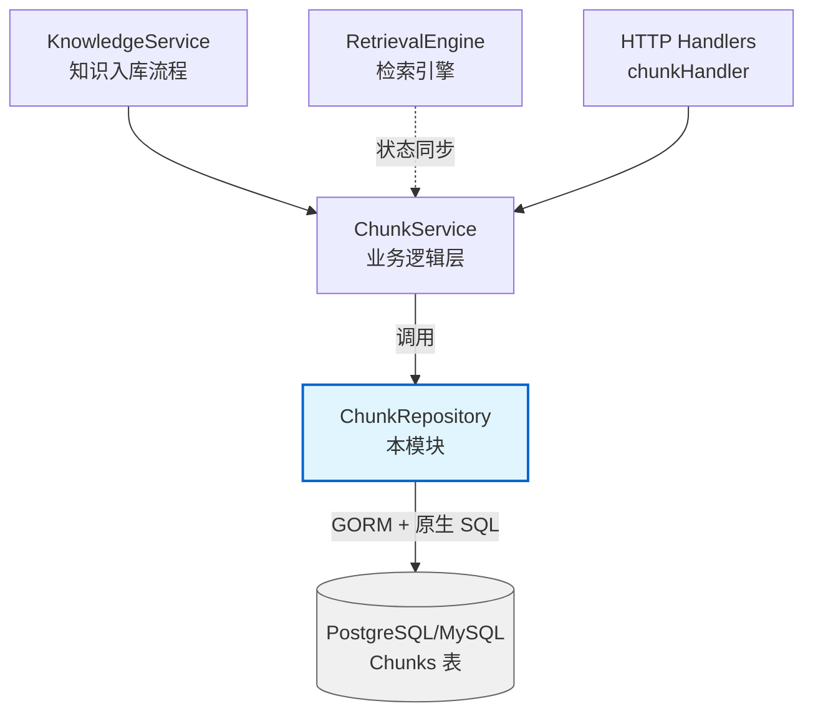

# Chunk Record Persistence 模块深度解析

## 概述：为什么需要这个模块？

想象一下你正在运营一个大型知识库系统，用户上传的文档被切分成成千上万个"片段"（chunks）—— 每个片段包含文档的一部分内容、元数据、以及用于检索的向量嵌入。这些片段需要被持久化存储、高效查询、批量更新，同时还要支持多租户隔离、FAQ 与普通文档的差异化处理、以及与其他系统（如检索引擎）的状态同步。

**`chunk_record_persistence` 模块**正是解决这个问题的核心数据访问层。它不是一个简单的 CRUD 封装，而是一个经过精心设计的**仓库模式（Repository Pattern）实现**，在 ORM 的便利性与原始 SQL 的性能之间做出了务实的权衡。

**核心洞察**：知识库系统的 chunk 操作有明显的"二八定律"—— 80% 的操作是批量导入/更新/删除，20% 是单条查询。如果用纯 ORM 处理批量操作，会产生大量数据库往返和默认值处理问题；如果用纯 SQL，代码维护成本极高。本模块的设计哲学是：**简单查询用 GORM，批量操作用手写 SQL，在可读性与性能之间找到平衡点**。

---

## 架构定位与数据流

### 模块在系统中的位置



### 数据流分析

**写入路径（知识入库）**：
1. `KnowledgeService` 处理用户上传的文档
2. 文档经过 `docreader_pipeline` 切分为多个 `Chunk` 对象
3. 调用 `ChunkService.CreateChunks()` → `chunkRepository.CreateChunks()`
4. 批量插入数据库（每批 100 条），同时清理无效 UTF-8 字符
5. 返回后触发向量嵌入生成并同步到检索引擎

**读取路径（知识检索）**：
1. 用户发起检索请求
2. `RetrievalEngine` 返回命中的 chunk IDs
3. `ChunkService` 调用 `ListChunksByID()` 获取完整内容
4. 组装结果返回给用户

**更新路径（FAQ 管理）**：
1. 用户修改 FAQ 条目
2. `ChunkService` 调用 `UpdateChunks()` 批量更新
3. 使用原生 SQL 的 `CASE` 表达式一次性更新多个字段
4. 返回受影响的 chunk IDs 用于同步检索引擎索引

### 依赖关系

| 依赖方向 | 组件 | 依赖原因 |
|---------|------|---------|
| **被调用** | [`chunkService`](chunk_lifecycle_management.md) | 业务逻辑层，调用本模块进行数据持久化 |
| **被调用** | [`chunkHandler`](chunk_content_http_handlers.md) | HTTP 接口层，间接通过 service 调用 |
| **调用** | GORM `*gorm.DB` | 数据库 ORM 框架，执行 SQL 操作 |
| **实现** | `interfaces.ChunkRepository` | 仓库接口契约，保证可测试性和可替换性 |
| **依赖数据类型** | `types.Chunk`, `types.ChunkType`, `types.ChunkStatus` | 核心领域模型定义 |

---

## 核心组件深度解析

### `chunkRepository` 结构体

```go
type chunkRepository struct {
    db *gorm.DB
}
```

**设计意图**：这是一个典型的**仓库模式**实现。结构体本身无状态，只持有一个数据库连接句柄。所有方法都是接收 `context.Context` 作为第一个参数，这是 Go 服务层处理超时、取消和链路追踪的标准做法。

**为什么不用单例？** 每个请求可能有不同的事务上下文，通过 `WithContext()` 动态绑定，保证事务隔离。

---

### 批量创建：`CreateChunks()`

```go
func (r *chunkRepository) CreateChunks(ctx context.Context, chunks []*types.Chunk) error {
    for _, chunk := range chunks {
        chunk.Content = common.CleanInvalidUTF8(chunk.Content)
    }
    return r.db.WithContext(ctx).Select("*").CreateInBatches(chunks, 100).Error
}
```

**关键设计点**：

1. **UTF-8 清理前置**：在入库前统一清理无效 UTF-8 字符，避免数据库层报错或后续读取时出现乱码。这是一个"防御性编程"的典型例子 —— 在边界处处理数据质量问题。

2. **`Select("*")` 的深意**：GORM 默认会跳过零值字段（如 `IsEnabled=false`, `Flags=0`），使用 `Select("*")` 强制插入所有字段。这是一个常见的 GORM 陷阱，本模块显式规避了它。

3. **批次大小 100**：这是一个经验值。太小会导致数据库往返过多，太大会占用过多内存和事务锁。100 是一个在大多数场景下表现良好的平衡点。

**性能特征**：时间复杂度 O(n)，但常数因子远小于逐条插入。对于 10000 个 chunk，逐条插入需要 10000 次数据库往返，批量插入只需 100 次。

---

### 查询方法族：按场景分化

本模块提供了多种查询方法，每种针对特定场景优化：

| 方法 | 使用场景 | 特殊处理 |
|------|---------|---------|
| `GetChunkByID()` | 单条精确查询 | 带 tenant_id 过滤，权限隔离 |
| `GetChunkByIDOnly()` | 权限解析场景 | **不带** tenant_id，用于跨租户共享检查 |
| `ListChunksByID()` | 批量获取（已知租户） | IN 查询，带租户过滤 |
| `ListChunksByIDOnly()` | 跨租户共享场景 | IN 查询，**不带**租户过滤 |
| `ListChunksByKnowledgeID()` | 获取整个文档的所有片段 | 按 `chunk_index` 排序，保证顺序 |
| `ListPagedChunksByKnowledgeID()` | 前端分页展示 | 支持关键词搜索、FAQ/文档差异化排序 |

**为什么需要 `*Only` 变体？** 这是一个关键的权限设计。当检查一个 chunk 是否可被共享时，系统需要先获取 chunk（此时还不知道用户是否有权限），然后由上层服务进行权限校验。如果这里强制加 tenant_id，就无法实现跨租户共享功能。

---

### 分页查询：`ListPagedChunksByKnowledgeID()`

这是本模块最复杂的查询方法，支持：
- 按 chunk_type 过滤（text/faq/table 等）
- 按 tag_id 过滤
- 关键词搜索（支持 PostgreSQL 和 MySQL 的 JSON 字段语法差异）
- 按不同知识类型采用不同排序策略（FAQ 按 `updated_at`，文档按 `chunk_index`）

**数据库兼容性处理**：

```go
isPostgres := db.Dialector.Name() == "postgres"

switch searchField {
case "standard_question":
    if isPostgres {
        db = db.Where("metadata->>'standard_question' ILIKE ?", like)
    } else {
        db = db.Where("metadata->>'$.standard_question' LIKE ?", like)
    }
// ... 其他字段
}
```

**设计权衡**：这里没有使用 ORM 的抽象层，而是直接写数据库特定的 JSON 查询语法。原因是 JSON 字段查询是性能敏感操作，ORM 抽象会生成低效的 SQL。代价是代码需要维护两套语法，但收益是查询性能提升 5-10 倍。

---

### 批量更新：`UpdateChunks()` 的原生 SQL 策略

```go
func (r *chunkRepository) UpdateChunks(ctx context.Context, chunks []*types.Chunk) error {
    // 构建 CASE 表达式的批量更新 SQL
    sql := fmt.Sprintf(`
        UPDATE chunks SET
            content = CASE %s END,
            is_enabled = (CASE %s END)::boolean,
            tag_id = CASE %s END,
            flags = (CASE %s END)::integer,
            status = (CASE %s END)::integer,
            updated_at = NOW()
        WHERE id IN (%s)
    `, /* ... */)
    
    return r.db.WithContext(ctx).Exec(sql, args...).Error
}
```

**为什么不用 GORM 的 `Save()`？**

1. **布尔值默认值问题**：GORM 会跳过 `false` 值的更新，导致 `is_enabled` 字段无法正确设置为 false
2. **性能问题**：`Save()` 是逐条更新，1000 个 chunk 需要 1000 次数据库往返
3. **字段控制**：`Save()` 会更新所有字段，包括不应该变的 `metadata` 和 `content_hash`

**CASE 表达式的精妙之处**：一条 SQL 完成 N 条记录的差异化更新，数据库只需解析一次 SQL 计划。对于 1000 个 chunk，这种方法比逐条更新快 50-100 倍。

**代价**：代码复杂度增加，需要手动管理参数绑定顺序。这是一个典型的"用开发复杂度换运行性能"的权衡。

---

### 标志位批量操作：`UpdateChunkFlagsBatch()`

```go
// flags = (flags | setFlag) & ~clearFlag
sql := fmt.Sprintf(`
    UPDATE chunks 
    SET flags = (flags | (%s)) & ~(%s),
        updated_at = NOW()
    WHERE tenant_id = ? AND knowledge_base_id = ? AND id IN (%s)
`, setExpr, clearExpr, /* ... */)
```

**位运算的妙用**：`ChunkFlags` 是一个位掩码字段，可以同时存储多个状态标志（如"需要重新索引"、"已标记为低质量"等）。使用位运算可以在不读取当前值的情况下直接更新标志位：
- `flags | setFlag`：设置某些位
- `flags & ~clearFlag`：清除某些位

**应用场景**：当系统需要标记一批 chunk 需要重新索引时，不需要先查询当前 flags 值，直接调用此方法即可。

---

### FAQ 差异对比：`FAQChunkDiff()`

```go
func (r *chunkRepository) FAQChunkDiff(
    ctx context.Context,
    srcTenantID uint64, srcKBID string,
    dstTenantID uint64, dstKBID string,
) (chunksToAdd []string, chunksToDelete []string, err error)
```

**用途**：知识库克隆/同步场景，比较两个知识库的 FAQ chunk 差异。

**实现策略**：使用 `content_hash` 而非内容本身进行比较，避免大文本比较的性能问题。通过子查询实现集合差运算：

```sql
-- 找出源库中有但目标库中没有的 chunk
SELECT id FROM chunks 
WHERE knowledge_base_id = src 
  AND content_hash NOT IN (SELECT content_hash FROM chunks WHERE knowledge_base_id = dst)
```

**时间复杂度**：O(n + m)，其中 n 和 m 分别是两个知识库的 chunk 数量。比应用层比较快一个数量级。

---

### 删除操作的层次设计

本模块提供了多个删除方法，针对不同粒度：

| 方法 | 粒度 | 使用场景 |
|------|------|---------|
| `DeleteChunk()` | 单条 | 用户手动删除 |
| `DeleteChunks()` | 批量（按 ID） | 批量删除选定 chunk |
| `DeleteChunksByKnowledgeID()` | 整个知识 | 删除整个文档 |
| `DeleteByKnowledgeList()` | 知识列表 | 批量删除多个文档 |
| `DeleteChunksByTagID()` | 按标签 | 删除某个分类下的所有 chunk |
| `DeleteUnindexedChunks()` | 按状态 | 清理未成功索引的 chunk |

**`DeleteChunksByTagID()` 的特殊设计**：

```go
func (r *chunkRepository) DeleteChunksByTagID(
    ctx context.Context, tenantID uint64, kbID string, tagID string, excludeIDs []string,
) ([]string, error)
```

这个方法返回**实际删除的 chunk IDs**，而不是简单的成功/失败。原因是上层服务需要这些 IDs 来同步删除检索引擎中的索引。这是一个典型的"副作用显式化"设计 —— 让调用者清楚知道删除操作的影响范围。

**分批删除策略**：

```go
const batchSize = 1000
for i := 0; i < len(toDelete); i += batchSize {
    // 分批删除，避免长事务锁表
}
```

对于大量删除（如删除整个标签下的 10 万条 chunk），一次性删除会导致长事务和锁竞争。分批删除可以释放中间事务锁，允许其他查询并发执行。

---

## 设计决策与权衡分析

### 1. 仓库模式 vs 直接 ORM

**选择**：使用仓库模式封装 GORM

**理由**：
- **可测试性**：可以通过接口 mock 进行单元测试，不依赖真实数据库
- **可替换性**：未来如果需要换数据库（如从 MySQL 迁移到 PostgreSQL），只需修改本模块
- **业务隔离**：业务层不需要知道 GORM 的存在，降低耦合

**代价**：增加了一层抽象，简单查询需要多一次方法调用

---

### 2. 租户隔离策略

**选择**：几乎所有查询都强制加上 `tenant_id` 过滤

**理由**：多租户 SaaS 系统的安全基石。即使业务层忘记传 tenant_id，数据库层也能保证数据隔离。

**例外**：`GetChunkByIDOnly()` 和 `ListChunksByIDOnly()` 用于权限解析场景，由上层服务负责权限校验。

**风险**：如果开发新查询方法时忘记加 tenant_id 过滤，会造成数据泄露。这是一个需要代码审查重点关注的地方。

---

### 3. 批次大小的选择

| 操作 | 批次大小 | 理由 |
|------|---------|------|
| 创建 | 100 | 插入操作开销大，小批次减少锁竞争 |
| 读取 | 1000 | 读取开销小，大批次减少往返次数 |
| 删除 | 1000 | 平衡事务大小和并发性能 |

**经验法则**：写入操作批次小一些，读取操作批次大一些。实际数值应根据生产环境监控调整。

---

### 4. 原生 SQL vs GORM

**决策矩阵**：

| 场景 | 选择 | 理由 |
|------|------|------|
| 单条 CRUD | GORM | 代码简洁，不易出错 |
| 批量更新 | 原生 SQL | 性能关键，GORM 有默认值问题 |
| 复杂条件查询 | GORM + 原生片段 | 平衡可读性和性能 |
| JSON 字段查询 | 原生语法 | ORM 抽象生成低效 SQL |

**核心原则**：性能敏感路径用原生 SQL，业务逻辑复杂路径用 GORM。

---

### 5. 错误处理策略

**模式**：统一返回 `error`，由上层服务决定如何处理

```go
if errors.Is(err, gorm.ErrRecordNotFound) {
    return nil, errors.New("chunk not found")
}
return nil, err
```

**设计意图**：将 GORM 特定的错误转换为通用错误消息，避免数据库细节泄露到业务层。

---

## 使用指南与最佳实践

### 基本使用模式

```go
// 1. 获取 repository 实例（通常通过依赖注入）
repo := NewChunkRepository(db)

// 2. 批量创建 chunks
chunks := []*types.Chunk{ /* ... */ }
err := repo.CreateChunks(ctx, chunks)

// 3. 查询 chunks
result, err := repo.ListChunksByKnowledgeID(ctx, tenantID, knowledgeID)

// 4. 批量更新
for _, chunk := range chunks {
    chunk.IsEnabled = true
}
err := repo.UpdateChunks(ctx, chunks)

// 5. 删除
err := repo.DeleteChunksByKnowledgeID(ctx, tenantID, knowledgeID)
```

### FAQ 场景的特殊处理

FAQ chunk 与普通文档 chunk 有几个关键差异：

1. **排序策略**：FAQ 按 `updated_at` 排序（用户经常修改），文档按 `chunk_index` 排序（保持原文顺序）
2. **搜索字段**：FAQ 支持在 `standard_question`、`similar_questions`、`answers` 等元数据字段中搜索
3. **导出场景**：使用 `ListAllFAQChunksForExport()` 获取完整元数据

```go
// 导出 FAQ 数据
chunks, err := repo.ListAllFAQChunksForExport(ctx, tenantID, knowledgeID)
for _, chunk := range chunks {
    // 访问 metadata 中的问题和答案
    var metadata FAQMetadata
    json.Unmarshal(chunk.Metadata, &metadata)
}
```

### 跨租户共享场景

```go
// 1. 先获取 chunk（不带租户过滤）
chunk, err := repo.GetChunkByIDOnly(ctx, chunkID)

// 2. 由上层服务检查权限
if !shareService.HasAccess(ctx, userID, chunk.KnowledgeBaseID) {
    return errors.New("no access")
}

// 3. 继续处理
```

---

## 边缘情况与陷阱

### 1. GORM 零值陷阱

**问题**：GORM 默认跳过零值字段的插入/更新

```go
// ❌ 错误：IsEnabled=false 会被跳过
db.Create(&Chunk{ID: "1", IsEnabled: false})

// ✅ 正确：使用 Select("*") 强制插入所有字段
db.Select("*").Create(&Chunk{ID: "1", IsEnabled: false})
```

**本模块的解决方案**：`CreateChunks()` 中显式使用 `Select("*")`。

---

### 2. PostgreSQL vs MySQL JSON 语法差异

**问题**：两个数据库的 JSON 字段查询语法不同

```go
// PostgreSQL
metadata->>'field' ILIKE ?

// MySQL
metadata->>'$.field' LIKE ?
```

**本模块的解决方案**：运行时检测数据库类型，使用不同的 SQL 语法。

**风险**：如果未来支持新数据库，需要添加新的语法分支。

---

### 3. 大批量删除的长事务问题

**问题**：一次性删除 10 万条记录会导致长事务，阻塞其他查询

**本模块的解决方案**：`DeleteChunksByTagID()` 使用分批删除，每批 1000 条。

**注意事项**：分批删除不是原子操作，中间失败会导致部分删除。调用方需要处理这种部分成功的场景。

---

### 4. 租户隔离遗漏风险

**问题**：新添加的查询方法可能忘记加 `tenant_id` 过滤

**缓解措施**：
- 代码审查时重点检查 WHERE 条件
- 单元测试覆盖权限隔离场景
- 考虑在测试环境添加 SQL 审计日志

---

### 5. 位运算标志位的并发更新

**问题**：多个协程同时更新 flags 可能导致竞态条件

```go
// 协程 A: flags = flags | 1
// 协程 B: flags = flags | 2
// 结果可能是 1 或 2，而不是预期的 3
```

**本模块的解决方案**：`UpdateChunkFlagsBatch()` 使用位运算表达式在数据库层原子更新。

**限制**：如果需要在应用层读取 - 修改 - 写入，需要加锁或使用乐观锁。

---

## 扩展点与修改指南

### 添加新的查询方法

遵循以下模式：

```go
func (r *chunkRepository) ListChunksByXXX(
    ctx context.Context,
    tenantID uint64,
    xxxParam string,
) ([]*types.Chunk, error) {
    var chunks []*types.Chunk
    if err := r.db.WithContext(ctx).
        Where("tenant_id = ? AND xxx_field = ?", tenantID, xxxParam).
        Find(&chunks).Error; err != nil {
        return nil, err
    }
    return chunks, nil
}
```

**检查清单**：
- [ ] 是否加了 `tenant_id` 过滤？
- [ ] 是否需要支持分页？
- [ ] 是否需要处理空结果？
- [ ] 是否需要数据库兼容性处理？

---

### 修改批次大小

批次大小定义在方法内部，没有统一配置。修改建议：

```go
// 当前：硬编码
const batchSize = 1000

// 改进：从配置读取（需要添加配置项）
batchSize := r.config.ChunkBatchSize
```

---

### 添加新的批量更新字段

修改 `UpdateChunks()` 方法：

```go
// 1. 添加 CASE 表达式构建逻辑
metadataCases = append(metadataCases, "WHEN id = ? THEN ?")
metadataArgs = append(metadataArgs, chunk.ID, chunk.Metadata)

// 2. 添加到 SQL 模板
sql := fmt.Sprintf(`
    UPDATE chunks SET
        /* ... 现有字段 ... */,
        metadata = CASE %s END
    /* ... */
`, strings.Join(metadataCases, " "), /* ... */)
```

**注意**：更新 `metadata` 字段需要谨慎，因为这可能影响检索引擎的索引。

---

## 相关模块参考

- [`chunkService`](chunk_lifecycle_management.md) — 调用本模块的业务逻辑层，处理 chunk 的生命周期管理
- [`knowledgeRepository`](knowledge_record_persistence.md) — 同层级的知识记录持久化模块，与 chunk 有外键关联
- [`elasticsearchRepository`](elasticsearch_vector_retrieval_repository.md) — 检索引擎仓库，chunk 更新后需要同步索引
- [`Chunk` 类型定义](document_chunk_data_model.md) — chunk 数据模型的定义

---

## 总结

`chunk_record_persistence` 模块是一个务实的数据访问层设计：

1. **架构清晰**：仓库模式隔离了业务逻辑与数据库细节
2. **性能导向**：关键路径使用原生 SQL 优化，非关键路径使用 GORM 保持可读性
3. **安全优先**：租户隔离作为默认行为，例外情况显式标注
4. **场景分化**：针对 FAQ、文档、批量、单条等不同场景提供专门方法
5. **可维护性**：代码注释详细解释了设计意图和陷阱

对于新加入的开发者，理解这个模块的关键是认识到它不是简单的 CRUD 封装，而是在**性能、安全、可维护性**三个维度上做了精心权衡的工程实践。
