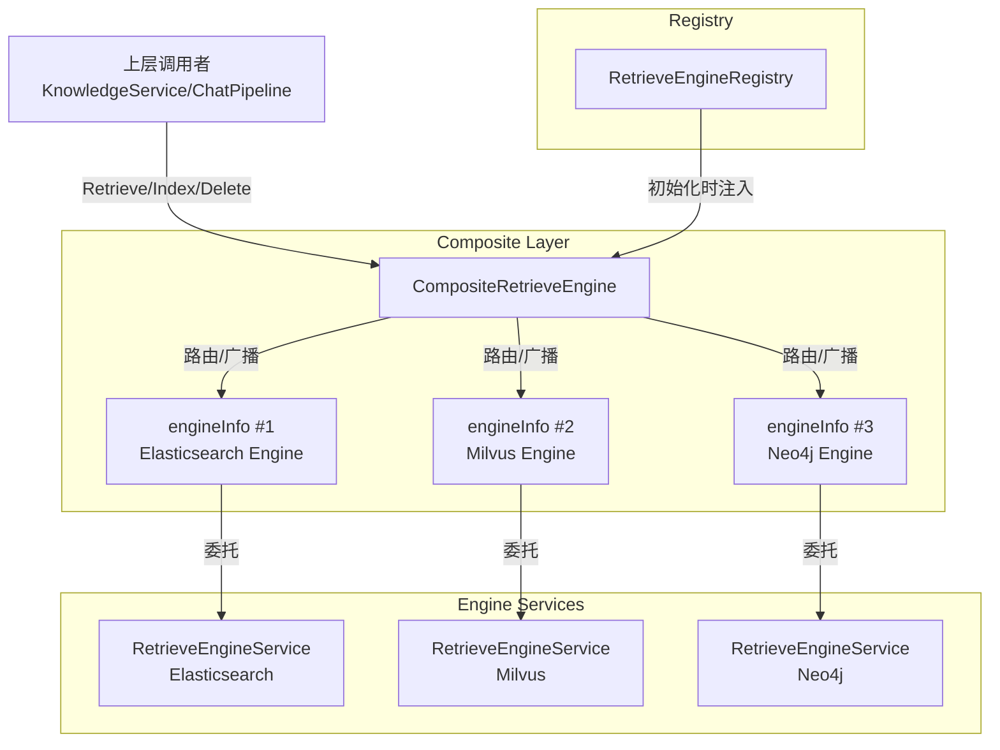

# Composite Retriever Engine Orchestration

## 概述：为什么需要这个模块

想象你正在经营一家大型图书馆，但这座图书馆有一个特殊的设计：它同时使用**多套不同的图书检索系统**——一套基于关键词匹配（如 Elasticsearch），一套基于向量相似度（如 Milvus），还有一套基于图关系查询（如 Neo4j）。当读者来查询资料时，你不能简单地只查其中一套系统，因为：

1. **不同的检索策略适用于不同的场景**：关键词检索适合精确匹配，向量检索适合语义相似，图检索适合关系探索
2. **数据需要保持一致性**：当一本书入库或下架时，所有检索系统都需要同步更新
3. **上层调用者不应该关心底层细节**：业务代码只需要说"我要查这个"，而不需要知道具体查了哪几个数据库

这就是 `CompositeRetrieveEngine` 存在的根本原因。它是一个**检索引擎的编排器**，在多个底层检索引擎之上提供统一的抽象层，让上层业务代码可以透明地使用多种检索策略，同时保证数据在所有引擎中的一致性。

### 核心设计洞察

这个模块的关键洞察在于：**读操作和写操作需要不同的分发策略**。

- **读操作（Retrieve）**：根据请求中指定的 `RetrieverType` **路由到特定的引擎**。比如用户明确要用向量检索，就只调用向量引擎，避免不必要的开销。
- **写操作（Index/Delete/Update）**：**广播到所有注册的引擎**。因为数据必须在所有检索系统中保持同步，否则会导致检索结果不一致。

这种"读时路由、写时广播"的设计，是理解整个模块行为的关键。

---

## 架构与数据流



### 组件角色说明

| 组件 | 职责 | 类比 |
|------|------|------|
| `CompositeRetrieveEngine` | 核心编排器，决定请求分发给哪些引擎 | 机场的航班调度中心 |
| `engineInfo` | 引擎的元数据包装器，记录引擎支持的检索类型 | 航班信息牌（显示目的地和登机口） |
| `RetrieveEngineRegistry` | 引擎服务的注册中心，按引擎类型索引 | 航空公司的航班目录 |
| `RetrieveEngineService` | 具体检索引擎的实现接口 | 具体的航空公司（国航、南航等） |

### 数据流：读操作（Retrieve）

```
用户查询请求
    ↓
RetrieveParams { Query, RetrieverType: "vector", TopK: 10 }
    ↓
CompositeRetrieveEngine.Retrieve()
    ↓
遍历 engineInfos，查找支持 "vector" 类型的引擎
    ↓
找到 Milvus 引擎 → 调用 Milvus.Retrieve()
    ↓
返回 RetrieveResult 集合
```

**关键点**：读操作是**选择性路由**。如果请求指定了 `RetrieverType = "vector"`，只有支持向量检索的引擎会被调用。如果没有任何引擎支持该类型，返回错误。

### 数据流：写操作（Index/Delete）

```
新文档入库请求
    ↓
IndexInfo { Content, SourceID, KnowledgeBaseID, ... }
    ↓
CompositeRetrieveEngine.Index()
    ↓
并发遍历所有 engineInfos
    ↓
├─→ Elasticsearch.Index()
├─→ Milvus.Index()
└─→ Neo4j.Index()
    ↓
所有引擎都成功 → 返回 nil
任一引擎失败 → 返回错误（但其他引擎已写入）
```

**关键点**：写操作是**全量广播**。所有注册的引擎都会收到写入请求，确保数据一致性。但注意：**这不是原子事务**，如果某个引擎失败，已成功的引擎不会回滚（这是设计权衡，后文详述）。

---

## 核心组件深度解析

### 1. `CompositeRetrieveEngine` —— 编排器的核心

这是模块的主结构体，实现了 `RetrieveEngineService` 接口的所有方法。

```go
type CompositeRetrieveEngine struct {
    engineInfos []*engineInfo
}
```

#### 设计意图

`CompositeRetrieveEngine` 本身**不执行任何实际的检索或存储操作**。它的职责纯粹是**编排和分发**：

1. **读请求的智能路由**：根据 `RetrieveParams.RetrieverType` 找到能处理该类型的引擎
2. **写请求的全量同步**：确保所有引擎都收到变更通知
3. **并发执行与错误聚合**：使用 goroutine 并行处理多个引擎，收集并返回错误

#### 关键方法行为

##### `Retrieve(ctx, retrieveParams)` —— 读操作的路由逻辑

```go
func (c *CompositeRetrieveEngine) Retrieve(ctx context.Context,
    retrieveParams []types.RetrieveParams,
) ([]*types.RetrieveResult, error)
```

**内部机制**：
1. 对每个 `RetrieveParams` 启动一个 goroutine（通过 `concurrentRetrieve` 辅助函数）
2. 在 goroutine 中遍历 `engineInfos`，用 `slices.Contains` 检查哪个引擎支持该 `RetrieverType`
3. 找到匹配的引擎后调用其 `Retrieve` 方法，用互斥锁保护结果追加
4. 如果遍历完都没找到支持的引擎，返回 `"retriever type %s not found"` 错误

**为什么用并发**：虽然单个检索请求只路由到一个引擎，但 `retrieveParams` 是一个**切片**，可能包含多个独立的查询请求。并发处理可以加速批量查询场景。

**返回值**：所有查询结果的扁平化切片。注意：如果传入 3 个查询参数，可能返回 3 个 `RetrieveResult`（每个包含多个命中结果）。

##### `Index(ctx, embedder, indexInfo)` / `BatchIndex(...)` —— 写操作的广播逻辑

```go
func (c *CompositeRetrieveEngine) Index(ctx context.Context,
    embedder embedding.Embedder, indexInfo *types.IndexInfo,
) error
```

**内部机制**：
1. 调用 `concurrentExecWithError` 对每个 `engineInfo` 启动 goroutine
2. 每个 goroutine 调用对应引擎的 `Index` 方法
3. 通过 `errCh` 收集错误，返回**第一个遇到的错误**

**重要细节**：
- `BatchIndex` 会先对 `indexInfoList` 按 `SourceID` **去重**（使用 `common.Deduplicate`），避免重复索引
- 带有 OpenTelemetry tracing span，记录 `embedder` 模型名和 `source_id` 等属性
- 如果某个引擎失败，**其他引擎的写入不会回滚**（见后文"设计权衡"）

##### `Delete*` 系列方法 —— 删除操作的广播

包括 `DeleteByChunkIDList`、`DeleteBySourceIDList`、`DeleteByKnowledgeIDList`，都遵循相同的广播模式：

```go
func (c *CompositeRetrieveEngine) DeleteByChunkIDList(ctx context.Context,
    chunkIDList []string, dimension int, knowledgeType string,
) error
```

**为什么需要多个删除方法**：不同的业务场景需要不同的删除粒度：
- `ChunkID`：精确删除某个分块（用户手动删除单个 chunk）
- `SourceID`：删除整个文档的所有分块（文档更新时先删后增）
- `KnowledgeID`：删除整个知识条目（知识库管理操作）

##### `SupportRetriever(r RetrieverType)` —— 能力检查

```go
func (c *CompositeRetrieveEngine) SupportRetriever(r types.RetrieverType) bool
```

**用途**：在初始化或配置校验阶段，检查复合引擎是否支持某种检索类型。例如，如果用户配置了向量检索但底层没有向量引擎，可以提前报错。

---

### 2. `engineInfo` —— 引擎的元数据包装器

```go
type engineInfo struct {
    retrieveEngine interfaces.RetrieveEngineService
    retrieverType  []types.RetrieverType
}
```

#### 设计意图

这个结构体看似简单，但解决了一个关键问题：**如何快速判断某个引擎是否支持特定的检索类型**。

如果没有 `engineInfo`，每次路由时都需要调用 `engine.Support()` 来获取支持的类型列表，然后做匹配。通过预先将 `Support()` 的结果缓存在 `retrieverType` 字段中，路由时的匹配变成了简单的切片查找（`slices.Contains`）。

#### 为什么不用 map

你可能会问：为什么 `retrieverType` 是 `[]RetrieverType` 而不是 `map[RetrieverType]bool`？

**答案**：因为支持的检索类型数量通常很少（2-5 种），切片的线性查找开销可以忽略不计，而且切片更节省内存、遍历时更友好（可以直接用于日志输出、错误信息等）。

---

### 3. `NewCompositeRetrieveEngine` —— 工厂函数

```go
func NewCompositeRetrieveEngine(
    registry interfaces.RetrieveEngineRegistry,
    engineParams []types.RetrieverEngineParams,
) (*CompositeRetrieveEngine, error)
```

#### 初始化流程

1. 创建一个临时 `map[RetrieverEngineType]*engineInfo` 用于去重
2. 遍历 `engineParams`，对每个参数：
   - 从 `registry` 获取对应的 `RetrieveEngineService`
   - **校验**：检查该引擎是否支持参数中指定的 `RetrieverType`（调用 `Support()`）
   - 如果该引擎类型已存在，将新的 `RetrieverType` 追加到 `retrieverType` 列表
   - 如果不存在，创建新的 `engineInfo`
3. 用 `maps.Values` + `slices.Collect` 将 map 转为切片，返回 `CompositeRetrieveEngine`

#### 关键校验逻辑

```go
if !slices.Contains(repo.Support(), engineParam.RetrieverType) {
    return nil, fmt.Errorf("retrieval engine %s does not support retriever type: %s",
        repo.EngineType(), engineParam.RetrieverType)
}
```

**为什么需要这个校验**：防止配置错误。比如用户配置了 `RetrieverEngineType: "elasticsearch"` + `RetrieverType: "vector"`，但 Elasticsearch 引擎实际上只支持关键词检索，不支持向量检索。这个校验在启动时就暴露配置问题，而不是等到运行时才报错。

#### 支持同一引擎的多种检索类型

```go
if _, exists := engineInfos[repo.EngineType()]; exists {
    engineInfos[repo.EngineType()].retrieverType = append(
        engineInfos[repo.EngineType()].retrieverType,
        engineParam.RetrieverType)
    continue
}
```

**场景**：假设有一个"混合引擎"同时支持关键词和向量检索。配置可能是：

```yaml
engineParams:
  - retriever_engine_type: "hybrid"
    retriever_type: "keyword"
  - retriever_engine_type: "hybrid"
    retriever_type: "vector"
```

这段代码确保两个配置项合并到同一个 `engineInfo` 中，而不是创建两个实例。

---

### 4. 并发辅助函数

#### `concurrentRetrieve` —— 读操作的并发框架

```go
func concurrentRetrieve(
    ctx context.Context,
    retrieveParams []types.RetrieveParams,
    fn func(ctx context.Context, param types.RetrieveParams, results *[]*types.RetrieveResult, mu *sync.Mutex) error,
) ([]*types.RetrieveResult, error)
```

**设计模式**：这是典型的 **Worker Pool + Error Channel** 模式。

**关键实现细节**：
1. `errCh` 的容量等于 `len(retrieveParams)`，确保所有 goroutine 发送错误时不会阻塞
2. 每个 goroutine 捕获自己的 `param` 副本（`p := param`），避免闭包引用循环变量
3. 用 `sync.Mutex` 保护 `results` 切片的追加操作
4. 等待所有 goroutine 完成后，遍历 `errCh` 返回第一个错误

**为什么返回第一个错误**：因为任何一个查询失败都意味着整个批量操作不完整。调用者需要知道有错误发生，但没必要收集所有错误（会增加复杂度）。

#### `concurrentExecWithError` —— 写操作的并发框架

```go
func (c *CompositeRetrieveEngine) concurrentExecWithError(
    ctx context.Context,
    fn func(ctx context.Context, engineInfo *engineInfo) error,
) error
```

与 `concurrentRetrieve` 类似，但更简单：
- 不需要收集结果（写操作只关心成功/失败）
- 对每个 `engineInfo` 启动一个 goroutine
- 返回第一个遇到的错误

---

## 依赖关系分析

### 上游调用者（谁在用这个模块）

| 调用者 | 使用场景 | 期望行为 |
|--------|----------|----------|
| [`KnowledgeService`](knowledge_ingestion_orchestration.md) | 文档入库、更新、删除 | 写操作广播到所有引擎，确保一致性 |
| [`ChatPipeline`](chat_pipeline_plugins_and_flow.md) | 用户查询时的知识检索 | 读操作按指定类型路由，返回相关结果 |
| [`EvaluationService`](evaluation_orchestration_and_state.md) | 评估检索质量 | 可能需要多种检索类型对比效果 |

### 下游依赖（这个模块调用了什么）

| 依赖 | 用途 | 耦合程度 |
|------|------|----------|
| `RetrieveEngineRegistry` | 初始化时获取引擎实例 | **紧耦合**：必须通过注册表获取引擎，不能直接实例化 |
| `RetrieveEngineService` | 委托实际的检索/索引操作 | **紧耦合**：依赖接口定义的所有方法 |
| `Embedder` | 计算文本嵌入向量（Index 操作时） | **松耦合**：只作为参数传递，不直接调用 |
| `tracing` / `logger` | 可观测性 | **松耦合**：可选的横切关注点 |

### 数据契约

#### 输入契约

- `RetrieveParams`：必须包含有效的 `RetrieverType`，否则路由失败
- `IndexInfo`：`SourceID` 用于去重，`KnowledgeBaseID` 用于隔离
- `RetrieverEngineParams`：`RetrieverEngineType` 必须在注册表中存在

#### 输出契约

- `RetrieveResult`：`Error` 字段非 nil 表示该次检索失败
- 错误返回值：任何引擎失败都会导致整体操作失败（写操作）

---

## 设计权衡与决策

### 1. 写操作的非原子性

**问题**：`Index()` 方法并发调用所有引擎，如果 Elasticsearch 成功但 Milvus 失败，会发生什么？

**现状**：Elasticsearch 中的数据**不会回滚**，方法返回 Milvus 的错误。

**为什么这样设计**：
1. **跨引擎事务成本过高**：实现分布式事务需要两阶段提交（2PC），会显著降低写入性能
2. **最终一致性可接受**：检索系统通常允许短暂的不一致（秒级），可以通过重试机制修复
3. **失败场景罕见**：引擎失败通常是配置错误或网络问题，需要人工介入而非自动回滚

**应对策略**：
- 调用者应该在收到错误后记录日志，并触发告警
- 可以设计补偿机制（如定时任务检查数据一致性）

**如果你需要强一致性**：这个模块不适合，需要考虑其他架构（如事件溯源 + 单一事实源）。

### 2. 读操作的路由 vs 广播

**决策**：读操作只路由到匹配的引擎，而不是广播到所有引擎后合并结果。

**为什么**：
1. **性能**：避免不必要的引擎调用（比如用户明确要关键词检索，没必要调用向量引擎）
2. **语义清晰**：调用者明确指定了检索类型，应该尊重这个选择
3. **结果可控**：广播后合并结果需要复杂的去重和排序逻辑

**如果你想要多引擎融合检索**：需要在调用层发起多个不同 `RetrieverType` 的查询，然后自行合并结果。

### 3. 并发模型的选择

**决策**：使用 goroutine + channel + mutex，而不是 worker pool 或 semaphore。

**为什么**：
1. **简单直接**：对于引擎数量较少（通常 2-5 个）的场景，直接为每个引擎启动 goroutine 足够高效
2. **错误处理清晰**：通过 `errCh` 收集错误，逻辑直观
3. **无需限流**：引擎数量是固定的，不会像 HTTP 请求那样有突发流量

**潜在问题**：如果未来引擎数量增加到几十个，可能需要引入信号量限制并发度。

### 4. 引擎去重策略

**决策**：在 `NewCompositeRetrieveEngine` 中按 `RetrieverEngineType` 去重，合并支持的 `RetrieverType`。

**为什么**：允许配置文件中为同一引擎指定多种检索类型，提高配置灵活性。

**风险**：如果配置错误地为同一引擎类型创建了两个不同的实例（比如不同的连接配置），只有最后一个会被保留。

---

## 使用指南与示例

### 初始化复合引擎

```go
// 1. 获取注册表（通常从依赖注入容器）
registry := GetRetrieveEngineRegistry()

// 2. 配置引擎参数
engineParams := []types.RetrieverEngineParams{
    {
        RetrieverEngineType: "elasticsearch",
        RetrieverType:       "keyword",
    },
    {
        RetrieverEngineType: "milvus",
        RetrieverType:       "vector",
    },
    {
        RetrieverEngineType: "neo4j",
        RetrieverType:       "graph",
    },
}

// 3. 创建复合引擎
compositeEngine, err := retriever.NewCompositeRetrieveEngine(registry, engineParams)
if err != nil {
    // 处理配置错误（如引擎不存在、不支持的检索类型等）
    log.Fatalf("Failed to create composite engine: %v", err)
}
```

### 执行检索操作

```go
// 向量检索
retrieveParams := []types.RetrieveParams{
    {
        Query:          "如何使用 API 认证",
        Embedding:      queryEmbedding, // []float32
        KnowledgeBaseIDs: []string{"kb-123"},
        RetrieverType:  "vector",
        TopK:           10,
        Threshold:      0.75,
    },
}

results, err := compositeEngine.Retrieve(ctx, retrieveParams)
if err != nil {
    // 处理错误（如没有引擎支持 vector 类型）
    return err
}

// results 是 []*RetrieveResult，每个包含 Results []*IndexWithScore
for _, result := range results {
    if result.Error != nil {
        log.Printf("Retrieval error: %v", result.Error)
        continue
    }
    for _, hit := range result.Results {
        log.Printf("Hit: %s (score: %f)", hit.IndexInfo.ID, hit.Score)
    }
}
```

### 执行索引操作

```go
embedder := GetEmbedder() // 获取嵌入模型

indexInfo := &types.IndexInfo{
    ID:              "chunk-001",
    Content:         "API 认证使用 OAuth2.0 协议...",
    SourceID:        "doc-123",
    ChunkID:         "chunk-001",
    KnowledgeID:     "know-456",
    KnowledgeBaseID: "kb-789",
    KnowledgeType:   "manual",
    IsEnabled:       true,
}

// Index 会广播到所有注册的引擎
err := compositeEngine.Index(ctx, embedder, indexInfo)
if err != nil {
    // 任一引擎失败都会返回错误
    // 但成功的引擎不会回滚
    log.Errorf("Index failed: %v", err)
    // 建议：记录告警，稍后重试或人工检查
}
```

### 批量索引（带自动去重）

```go
indexInfos := []*types.IndexInfo{
    {SourceID: "doc-1", /* ... */},
    {SourceID: "doc-2", /* ... */},
    {SourceID: "doc-1", /* ... */}, // 重复的 SourceID
}

// BatchIndex 会自动按 SourceID 去重，实际只索引 doc-1 和 doc-2
err := compositeEngine.BatchIndex(ctx, embedder, indexInfos)
```

### 删除操作

```go
// 按 ChunkID 删除（精确删除）
err := compositeEngine.DeleteByChunkIDList(ctx, []string{"chunk-001", "chunk-002"}, 768, "manual")

// 按 SourceID 删除（删除整个文档）
err := compositeEngine.DeleteBySourceIDList(ctx, []string{"doc-123"}, 768, "manual")

// 按 KnowledgeID 删除（删除整个知识条目）
err := compositeEngine.DeleteByKnowledgeIDList(ctx, []string{"know-456"}, 768, "manual")
```

### 检查支持的检索类型

```go
if !compositeEngine.SupportRetriever("vector") {
    // 提前报错，避免运行时失败
    return errors.New("vector retrieval is not configured")
}
```

---

## 边界情况与陷阱

### 1. 配置错误：引擎类型不存在

**现象**：`NewCompositeRetrieveEngine` 返回 `"retrieval engine xxx not found"` 错误。

**原因**：`RetrieverEngineParams` 中指定的 `RetrieverEngineType` 没有在 `RetrieveEngineRegistry` 中注册。

**解决**：检查配置文件和注册表初始化代码，确保所有引擎类型都已正确注册。

### 2. 配置错误：引擎不支持指定的检索类型

**现象**：`NewCompositeRetrieveEngine` 返回 `"retrieval engine elasticsearch does not support retriever type: vector"` 错误。

**原因**：Elasticsearch 引擎只支持关键词检索，但配置中指定了 `RetrieverType: "vector"`。

**解决**：修正配置，或更换支持向量检索的引擎（如 Milvus）。

### 3. 运行时错误：检索类型未找到

**现象**：`Retrieve()` 返回 `"retriever type xxx not found"` 错误。

**原因**：请求中的 `RetrieverType` 没有被任何注册的引擎支持。

**调试方法**：
```go
if !compositeEngine.SupportRetriever(params.RetrieverType) {
    log.Errorf("Retriever type %s is not supported", params.RetrieverType)
}
```

### 4. 部分写入成功（写操作失败）

**现象**：`Index()` 返回错误，但部分引擎中已有数据。

**原因**：并发写入时某个引擎失败，其他引擎的写入不会回滚。

**应对策略**：
1. 记录详细日志（哪个引擎失败、为什么失败）
2. 触发告警，通知运维人员
3. 设计补偿任务（如定时扫描不一致的数据）

**不推荐的做法**：在应用层实现回滚逻辑（复杂且容易出错）。

### 5. 并发竞争条件

**现象**：罕见情况下 `Retrieve()` 返回的结果数量不稳定。

**原因**：虽然代码中用 `sync.Mutex` 保护了 `results` 切片的追加，但如果 `RetrieveParams` 中有重复的查询，结果顺序可能不一致。

**解决**：确保 `RetrieveParams` 中的查询是独立的，或在调用层对结果进行排序。

### 6. 内存泄漏风险

**现象**：长时间运行后内存占用持续增长。

**原因**：`errCh` 的容量等于 `len(retrieveParams)` 或 `len(engineInfos)`，如果这些切片非常大，channel 会占用较多内存。

**缓解**：对于超大批量操作，考虑分批处理（如每次最多 100 个查询）。

---

## 扩展点

### 添加新的检索引擎

1. 实现 `RetrieveEngineService` 接口
2. 在 `RetrieveEngineRegistry` 中注册新引擎
3. 在配置中添加新的 `RetrieverEngineParams`

**无需修改** `CompositeRetrieveEngine` 的代码（开闭原则）。

### 自定义路由策略

当前路由策略是"精确匹配 `RetrieverType`"。如果需要更复杂的路由（如 fallback 机制、多引擎融合），可以：

1. 扩展 `engineInfo` 添加路由优先级字段
2. 修改 `Retrieve()` 中的路由逻辑

**注意**：这会改变模块的核心行为，需要谨慎评估。

### 添加写入事务支持

如果需要跨引擎的原子写入，可以：

1. 在 `concurrentExecWithError` 中实现两阶段提交
2. 或引入事件溯源模式，将写入操作异步化

**代价**：显著增加复杂度和延迟。

---

## 相关模块

- [Retrieve Engine Registry](retrieve_engine_registry_management.md) —— 引擎注册表的实现
- [Knowledge Ingestion Orchestration](knowledge_ingestion_orchestration.md) —— 调用本模块进行文档入库
- [Chat Pipeline Plugins](chat_pipeline_plugins_and_flow.md) —— 调用本模块进行检索查询
- [Elasticsearch Vector Retrieval Repository](elasticsearch_vector_retrieval_repository.md) —— 具体的引擎实现示例
- [Milvus Vector Retrieval Repository](milvus_vector_retrieval_repository.md) —— 具体的引擎实现示例

---

## 总结

`CompositeRetrieveEngine` 是一个典型的**组合模式 + 策略模式**的实现，它通过"读时路由、写时广播"的设计，在多个检索引擎之上提供了统一的抽象层。

**核心价值**：
- 对上层业务隐藏多引擎的复杂性
- 保证数据在所有引擎中的一致性（最终一致性）
- 支持灵活的引擎配置和扩展

**使用时的关键认知**：
1. 写操作不是原子的，失败时部分引擎可能已写入
2. 读操作只路由到匹配的引擎，不会自动融合多引擎结果
3. 引擎数量较少时并发模型高效，但引擎数量增加后可能需要限流

理解这些设计权衡，能帮助你在使用和扩展这个模块时做出更明智的决策。
