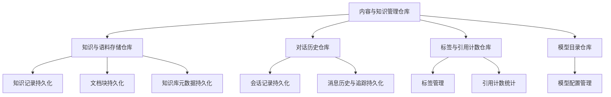

# 内容与知识管理仓库模块

## 概述

这个模块是整个知识管理系统的**数据访问层核心**，负责所有核心业务实体的持久化和检索。想象它是一个"图书馆管理员"，专门管理知识文档、对话记录、标签和模型配置的存取，确保数据一致性、租户隔离和高效查询。

**为什么需要这个模块？**
- 在一个多租户的知识管理系统中，需要统一管理知识库、文档块、会话、消息等核心数据
- 不同业务场景对数据访问有不同需求：批量写入、复杂查询、分页、统计等
- 需要确保租户数据隔离，防止数据越权访问
- 需要处理数据库差异（如 PostgreSQL 和 MySQL 的 JSON 查询语法不同）

## 架构概览



### 核心组件说明

1. **knowledgeBaseRepository**：知识库元数据管理，负责知识库的创建、查询、更新和删除
2. **knowledgeRepository**：知识记录管理，处理文档、URL、FAQ 等知识项的持久化
3. **chunkRepository**：文档块管理，是最复杂的仓库之一，处理知识切分后的小块数据
4. **sessionRepository**：会话管理，负责用户对话会话的持久化
5. **messageRepository**：消息管理，处理会话中的消息历史
6. **knowledgeTagRepository**：标签管理，负责知识和文档块的标签组织
7. **modelRepository**：模型管理，处理 LLM 和嵌入模型的配置

## 数据流程

### 知识导入流程
1. 首先通过 `knowledgeBaseRepository` 获取或创建知识库
2. 使用 `knowledgeRepository` 创建知识记录（包含文件元数据）
3. 文档解析后，通过 `chunkRepository` 批量创建文档块
4. 可选地通过 `knowledgeTagRepository` 为知识和文档块添加标签

### 对话流程
1. 通过 `sessionRepository` 创建或获取会话
2. 用户发送消息后，通过 `messageRepository` 保存用户消息
3. 系统生成回复后，通过 `messageRepository` 保存助手消息
4. 会话结束时，通过 `sessionRepository` 更新会话元数据

## 关键设计决策

### 1. 租户隔离策略
**选择**：几乎所有查询都包含 `tenant_id` 条件
**原因**：
- 确保多租户环境下的数据安全
- 防止跨租户数据访问
- 简化权限检查逻辑

### 2. 批量操作优化
**选择**：使用 `CreateInBatches`、批量 SQL 等方式处理大量数据
**例子**：
- `chunkRepository.CreateChunks` 使用 100 条一批的批量插入
- `chunkRepository.UpdateChunks` 使用 CASE 表达式实现批量更新
**原因**：
- 减少数据库 round-trips
- 提高大规模知识导入的性能
- 降低数据库负载

### 3. 数据库兼容性处理
**选择**：在代码中检测数据库类型并使用不同的 SQL 语法
**例子**：`chunkRepository.ListPagedChunksByKnowledgeID` 中对 PostgreSQL 和 MySQL 的 JSON 查询处理
**原因**：
- 支持多种数据库部署环境
- 利用不同数据库的特性优化查询
- 避免 ORM 抽象带来的性能损失

### 4. 选择性字段更新
**选择**：区分全量更新和部分字段更新
**例子**：
- `chunkRepository.UpdateChunk` 使用 `Save` 更新所有字段
- `chunkRepository.UpdateChunks` 只更新特定字段（content, is_enabled, tag_id, flags, status, updated_at）
**原因**：
- 防止意外覆盖重要字段（如 metadata, content_hash）
- 提高批量更新的性能
- 明确表达业务意图

### 5. 软删除 vs 硬删除
**选择**：部分表使用软删除（如 knowledges），部分使用硬删除
**原因**：
- 知识记录可能需要恢复，使用软删除
- 会话和消息等实时数据不需要恢复，使用硬删除提高性能
- 根据业务需求灵活选择

## 子模块

### 知识与语料存储仓库
负责知识库、知识记录和文档块的持久化，是模块的核心。

[查看详情](data_access_repositories-content_and_knowledge_management_repositories-knowledge_and_corpus_storage_repositories.md)

### 对话历史仓库
管理会话和消息的持久化，支持对话历史的检索和回放。

[查看详情](data_access_repositories-content_and_knowledge_management_repositories-conversation_history_repositories.md)

### 标签与引用计数仓库
处理知识和文档块的标签组织，以及标签引用统计。

[查看详情](data_access_repositories-content_and_knowledge_management_repositories-tagging_and_reference_count_repositories.md)

### 模型目录仓库
管理 LLM 和嵌入模型的配置，支持内置模型和租户自定义模型。

[查看详情](data_access_repositories-content_and_knowledge_management_repositories-model_catalog_repository.md)

## 跨模块依赖

这个模块是整个系统的**基础设施层**，被多个上层模块依赖：

- **应用服务层**：[知识摄入服务](application_services_and_orchestration-knowledge_ingestion_extraction_and_graph_services.md)、[对话上下文服务](application_services_and_orchestration-conversation_context_and_memory_services.md) 等
- **HTTP 处理器层**：[知识管理处理器](http_handlers_and_routing-knowledge_faq_and_tag_content_handlers.md)、[会话消息处理器](http_handlers_and_routing-session_message_and_streaming_http_handlers.md) 等

它依赖的核心模块：
- **核心领域类型**：定义了所有数据模型和接口契约
- **平台基础设施**：提供数据库连接和事务管理

## 使用指南

### 基本使用模式

所有仓库都通过构造函数创建，接受 `*gorm.DB` 作为参数：

```go
// 创建知识库仓库
kbRepo := NewKnowledgeBaseRepository(db)

// 创建知识仓库
knowledgeRepo := NewKnowledgeRepository(db)

// 创建文档块仓库
chunkRepo := NewChunkRepository(db)
```

### 租户隔离

所有查询都应该包含 `tenant_id` 条件，除非有特殊需求（如权限检查）：

```go
// ✅ 正确：包含租户 ID
knowledge, err := knowledgeRepo.GetKnowledgeByID(ctx, tenantID, knowledgeID)

// ⚠️ 谨慎：不包含租户 ID（仅用于权限解析等特殊场景）
knowledge, err := knowledgeRepo.GetKnowledgeByIDOnly(ctx, knowledgeID)
```

### 批量操作

对于大量数据，优先使用批量操作：

```go
// 批量创建文档块
chunks := []*types.Chunk{...}
err := chunkRepo.CreateChunks(ctx, chunks)

// 批量更新文档块
err := chunkRepo.UpdateChunks(ctx, chunks)
```

## 注意事项

### 1. GORM 的零值处理
GORM 默认会忽略零值字段的更新，需要特别注意：
- 使用 `Select("*")` 来强制更新所有字段
- 或者使用原生 SQL 来避免这个问题

### 2. 数据库类型差异
代码中已经处理了 PostgreSQL 和 MySQL 的差异，但在添加新功能时需要注意：
- JSON 查询语法不同
- 布尔类型处理不同
- 字符串大小写敏感性不同

### 3. 事务处理
仓库层不处理事务，事务应该在服务层管理：
```go
// 在服务层开始事务
tx := db.Begin()
defer func() {
    if r := recover(); r != nil {
        tx.Rollback()
    }
}()

// 使用事务创建仓库实例
knowledgeRepo := NewKnowledgeRepository(tx)
chunkRepo := NewChunkRepository(tx)

// 执行操作
err := knowledgeRepo.CreateKnowledge(ctx, knowledge)
err = chunkRepo.CreateChunks(ctx, chunks)

// 提交事务
tx.Commit()
```

### 4. 性能考虑
- 对于大量数据，使用批量操作
- 对于复杂查询，考虑添加索引
- 对于统计查询，使用批量计数而不是逐个计数

### 5. 数据一致性
- 更新知识时，注意同步更新相关的文档块
- 删除知识库时，注意级联删除相关的知识和文档块
- 更新标签时，注意同步更新引用该标签的知识和文档块
