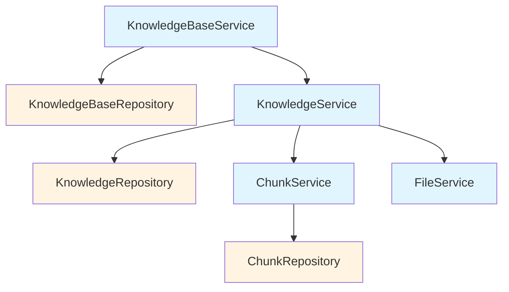

# content_service_and_repository_interfaces 模块

## 概述

`content_service_and_repository_interfaces` 模块是整个知识管理系统的核心契约层。它定义了知识库、知识文档、文本块和文件存储等核心概念的抽象接口，将业务逻辑与具体的实现细节（如数据库访问、文件存储后端）解耦。

想象一下这个模块就像是一份"建筑蓝图"——它不关心你是用混凝土还是木材来建造，只规定了每个房间必须有门、窗和特定的尺寸。通过这些接口定义，系统的不同部分可以独立演进：服务层可以专注于业务逻辑，而数据访问层可以专注于存储效率。

## 架构概览

这个模块采用了经典的**分层架构**和**仓储模式（Repository Pattern）**：

1. **Service 层**（浅蓝色）：提供面向业务的高级操作接口
   - `KnowledgeBaseService`：管理知识库的生命周期和搜索
   - `KnowledgeService`：处理知识文档的导入、解析和管理
   - `ChunkService`：负责文本块的增删改查
   - `FileService`：处理文件的存储和检索

2. **Repository 层**（浅黄色）：提供数据持久化的抽象接口
   - `KnowledgeBaseRepository`：知识库数据访问
   - `KnowledgeRepository`：知识文档数据访问
   - `ChunkRepository`：文本块数据访问

这种分离的核心价值在于：**服务层可以自由组合多个仓储来实现复杂业务，而不需要知道数据是如何存储的；仓储层可以独立优化存储策略，而不会影响业务逻辑**。

## 核心设计决策

### 1. 接口与实现分离

**选择**：将所有核心操作定义为 Go 接口，而非具体实现

**原因**：
- 便于单元测试：可以轻松 mock 这些接口来测试业务逻辑
- 支持多实现：例如 FileService 可以有本地文件系统、云存储等多种实现
- 依赖倒置：高层模块（业务逻辑）依赖抽象，而非具体实现

**权衡**：
- 增加了一定的代码复杂度
- 但换来的是系统的可测试性和可扩展性

### 2. 租户隔离设计

**选择**：几乎所有仓储方法都显式接收 `tenantID` 参数

**原因**：
- 这是一个多租户系统，数据隔离是核心安全要求
- 显式传递 `tenantID` 可以在编译期就发现潜在的安全漏洞
- 避免了依赖隐式上下文可能导致的权限越界问题

**特殊设计**：
- 提供了 `*Only` 方法（如 `GetChunkByIDOnly`）用于权限检查场景，此时需要先获取对象再验证权限

### 3. 同步与异步操作并存

**选择**：在 KnowledgeService 中同时提供同步和异步方法

**例子**：
- `CreateKnowledgeFromPassage`：异步创建，适合大文件处理
- `CreateKnowledgeFromPassageSync`：同步创建，适合小文本段落

**原因**：
- 文档解析和向量化是耗时操作，异步可以提高系统响应性
- 但有些场景需要等待结果（如测试、小批量导入），所以提供同步版本

### 4. FAQ 与文档统一建模

**选择**：将 FAQ 条目也建模为 Chunk 的一种类型

**原因**：
- 减少概念复杂度：FAQ 和文档片段本质上都是"可检索的内容块"
- 复用搜索基础设施：FAQ 和文档可以使用相同的检索引擎
- 统一的标签和权限系统：FAQ 可以像文档一样被分类和授权

## 子模块说明

本模块包含四个子模块，每个子模块负责特定领域的接口定义：

### [chunk_content_service_and_repository_interfaces](content_service_and_repository_interfaces-chunk_content_service_and_repository_interfaces.md)

定义了文本块（Chunk）的服务和仓储接口。文本块是知识库中最细粒度的检索单元，负责存储文档的具体内容片段。

### [knowledge_content_service_and_repository_interfaces](content_service_and_repository_interfaces-knowledge_content_service_and_repository_interfaces.md)

定义了知识文档（Knowledge）的服务和仓储接口。知识文档是用户导入的原始文件（如 PDF、Word）或手动编写的内容，是文本块的上层容器。

### [knowledgebase_service_and_repository_interfaces](content_service_and_repository_interfaces-knowledgebase_service_and_repository_interfaces.md)

定义了知识库（KnowledgeBase）的服务和仓储接口。知识库是知识管理的顶层组织单元，包含多个知识文档，并配置有特定的检索策略。

### [file_storage_service_interface](content_service_and_repository_interfaces-file_storage_service_interface.md)

定义了文件存储的服务接口。负责处理原始文件的保存、检索和删除，支持多种存储后端。

## 跨模块依赖关系

这个模块是整个系统的核心契约层，它被以下模块依赖：

- **application_services_and_orchestration**：实现这些接口来提供具体的业务逻辑
- **data_access_repositories**：实现仓储接口来访问数据库
- **http_handlers_and_routing**：通过服务接口来处理 HTTP 请求

同时，这个模块依赖于：
- **core_domain_types_and_interfaces**：使用其中定义的领域模型（如 `types.Knowledge`、`types.Chunk`）

## 新贡献者指南

### 注意事项

1. **租户隔离是强制性的**：在实现任何仓储方法时，始终确保正确使用 `tenantID` 过滤数据，避免数据泄露。

2. **`*Only` 方法的使用场景**：这些方法跳过了租户过滤，仅用于权限检查流程中——先获取对象，再验证当前用户是否有权访问。

3. **FAQ 的特殊性**：虽然 FAQ 被建模为 Chunk，但它有特殊的排序和搜索逻辑（参见 `ListPagedChunksByKnowledgeID` 的文档）。

4. **异步任务处理**：KnowledgeService 中的 `Process*` 方法是为异步任务队列（Asynq）设计的，不要在普通请求处理中直接调用。

5. **分页参数的处理**：所有分页方法都返回总记录数，前端需要根据这个数字来计算总页数。

### 扩展点

- 需要支持新的文件存储后端？实现 `FileService` 接口。
- 需要切换数据库？实现各个 Repository 接口。
- 需要添加新的知识导入方式？在 `KnowledgeService` 中添加新方法。

这个模块是系统的"稳定基石"——修改接口时要格外谨慎，因为这会影响到所有依赖它的模块。
