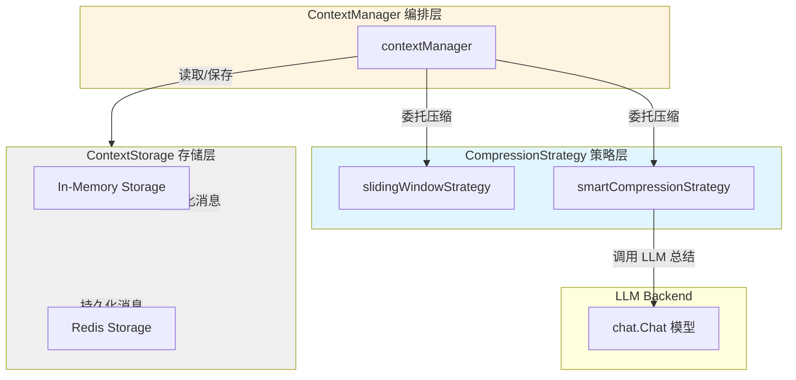

# Context Compression Strategies 模块深度解析

## 模块概述：为什么需要上下文压缩？

想象你正在和一个记忆力有限的人对话 —— 他只能记住最近说过的 20 句话。当对话进行到第 21 句时，他必须决定：是忘记最早的那句，还是把前面的内容压缩成一段摘要？这就是 `context_compression_strategies` 模块要解决的核心问题。

LLM（大语言模型）的上下文窗口（context window）是有上限的。无论是 8K、32K 还是 128K tokens，任何模型都无法无限期地记住整个对话历史。当用户与 Agent 进行多轮对话时，消息会不断累积，最终超出模型能处理的范围。如果简单截断，会丢失关键信息；如果全部保留，会触发 token 限制错误。

本模块提供了两种**上下文压缩策略**，在 `ContextManager` 检测到上下文超出限制时自动触发：

1. **滑动窗口策略（Sliding Window）**：简单粗暴但高效 —— 只保留最近的 N 条消息，其余全部丢弃
2. **智能压缩策略（Smart Compression）**：用 LLM 自己总结历史对话，用一段摘要替换旧消息，保留语义上下文

这两种策略实现了 `CompressionStrategy` 接口，采用**策略模式**设计，允许系统根据场景动态切换。选择哪种策略本质上是在**成本/延迟**与**上下文完整性**之间做权衡。

---

## 架构与数据流



### 组件角色说明

| 组件 | 职责 | 设计意图 |
|------|------|----------|
| `CompressionStrategy` (接口) | 定义压缩行为契约 | 解耦策略实现与使用方，支持运行时切换 |
| `slidingWindowStrategy` | 保留最近 N 条消息 | 零成本、低延迟，适合短对话或对上下文不敏感的场景 |
| `smartCompressionStrategy` | 用 LLM 总结旧消息 | 保留语义上下文，适合长对话、复杂任务场景 |
| `contextManager` | 上下文编排器 | 决定何时触发压缩，调用哪个策略，管理存储后端 |
| `ContextStorage` | 消息持久化接口 | 抽象存储细节，支持内存/Redis 等多种后端 |

### 数据流：一次典型的上下文获取

当 Agent 准备调用 LLM 时，会调用 `ContextManager.GetContext(sessionID)`，流程如下：

```
1. contextManager 从 ContextStorage.Load() 读取该 session 的所有历史消息
2. 调用 EstimateTokens() 估算当前 token 数
3. 如果 token 数 > maxTokens 阈值：
   a. 调用 compressionStrategy.Compress() 压缩消息
   b. 滑动窗口策略：直接丢弃旧消息
   c. 智能策略：调用 LLM 总结旧消息，生成摘要插入
4. 返回压缩后的消息列表给调用方
5. 调用方将消息发送给 LLM 进行推理
```

这个设计的关键洞察是：**压缩决策与存储解耦**。`ContextManager` 不关心消息存在内存还是 Redis，只关心压缩策略的行为。这使得系统可以独立演进存储层和压缩算法。

---

## 核心组件深度解析

### CompressionStrategy 接口

```go
type CompressionStrategy interface {
    Compress(ctx context.Context, messages []chat.Message, maxTokens int) ([]chat.Message, error)
    EstimateTokens(messages []chat.Message) int
}
```

这是整个模块的**抽象边界**。它定义了压缩策略必须实现的两个行为：

- `Compress`：执行压缩，返回适配 token 限制的消息列表
- `EstimateTokens`：快速估算 token 数（用于判断是否需要压缩）

接口设计的精妙之处在于它**不规定压缩算法**，只规定输入输出。这使得系统可以无缝引入新策略（如基于重要性的选择性保留、基于时间衰减的权重压缩等），而无需修改 `ContextManager`。

### slidingWindowStrategy：简单但有效的基线策略

```go
type slidingWindowStrategy struct {
    recentMessageCount int  // 保留的最近消息数
}
```

#### 设计思路

滑动窗口策略的核心思想是：**最近的对话最相关**。它假设用户当前的问题与最近几轮对话关系最密切，而早期对话可以安全丢弃。

#### 内部机制

`Compress` 方法的执行逻辑：

1. **分离系统消息**：遍历所有消息，将 `role=system` 的消息单独提取。系统消息包含 Agent 的人设、工具定义等关键信息，必须始终保留。
2. **截取最近 N 条**：对非系统消息，只保留最后 `recentMessageCount` 条。使用切片操作 `regularMessages[len(regularMessages)-s.recentMessageCount:]` 实现。
3. **重组消息列表**：系统消息在前，最近消息在后，保持 LLM 对话的正确顺序。

#### 关键设计决策

**为什么系统消息要单独处理？**

系统消息（system message）是 LLM 对话的"元指令"，定义了 Agent 的行为规范、可用工具、输出格式等。如果系统消息被丢弃，LLM 会失去行为约束，可能导致工具调用失败或输出格式错误。因此，滑动窗口策略**永远保留所有系统消息**，只对用户/助手消息应用窗口截断。

#### Token 估算方法

```go
func (s *slidingWindowStrategy) EstimateTokens(messages []chat.Message) int {
    totalChars := 0
    for _, msg := range messages {
        totalChars += len(msg.Role) + len(msg.Content)
        // 处理工具调用
        if len(msg.ToolCalls) > 0 {
            for _, tc := range msg.ToolCalls {
                totalChars += len(tc.Function.Name) + len(tc.Function.Arguments)
            }
        }
    }
    return totalChars / 4  // 经验法则：4 字符 ≈ 1 token
}
```

这里使用了一个**经验近似**：英文文本中平均 4 个字符约等于 1 个 token。这个估算不精确（实际 tokenization 依赖具体模型的词表），但足够快速判断是否需要压缩。精确计数需要调用模型的 tokenizer，成本过高。

#### 适用场景与局限

| 优点 | 缺点 |
|------|------|
| 零额外 API 调用，无延迟 | 丢失历史上下文，可能导致对话不连贯 |
| 实现简单，易于调试 | 对长周期任务（如多步骤数据分析）不友好 |
| 成本为零 | 无法区分重要/不重要消息，可能丢弃关键信息 |

**典型使用场景**：短对话 QA、对上下文依赖弱的任务、成本敏感型部署。

### smartCompressionStrategy：用 LLM 总结历史

```go
type smartCompressionStrategy struct {
    recentMessageCount int      // 保留的最近消息数（不压缩）
    chatModel          chat.Chat  // 用于总结的 LLM 模型
    summarizeThreshold int      // 触发总结的最小消息数
}
```

#### 设计思路

智能压缩策略的核心洞察是：**历史对话可以压缩成摘要，而不是直接丢弃**。它利用 LLM 自身的理解能力，将旧消息提炼成一段简洁的总结，既节省 token 又保留关键信息。

这类似于人类对话中的"让我回顾一下我们刚才讨论的内容..."—— 用几句话概括之前的长篇讨论。

#### 内部机制

`Compress` 方法的执行流程：

```
1. 分离消息：系统消息 / 旧消息 / 最近消息
   - 系统消息：全部保留
   - 最近 N 条：原样保留（保持对话新鲜度）
   - 旧消息：待总结

2. 判断是否需要总结
   - 如果旧消息数 < summarizeThreshold：直接返回所有消息（避免过度总结）

3. 调用 LLM 总结旧消息
   - 构建总结 prompt：系统指令 + 旧对话内容
   - 调用 chatModel.Chat() 生成摘要
   - 温度设为 0.3（低温度保证总结稳定性）
   - MaxTokens 设为 500（限制摘要长度）

4. 构造最终消息列表
   - 系统消息 + 总结消息（作为新的 system 消息）+ 最近消息
```

#### 关键设计决策

**为什么总结消息用 `role=system`？**

总结内容被包装成一条新的 system 消息：
```go
chat.Message{
    Role:    "system",
    Content: fmt.Sprintf("Previous conversation summary:\n%s", summary),
}
```

这样做的原因是：
1. **语义清晰**：LLM 知道这是背景信息，不是当前对话的一部分
2. **优先级高**：system 消息在大多数模型中具有较高的注意力权重
3. **避免混淆**：如果用 `user` 或 `assistant` 角色，LLM 可能误以为这是真实对话历史

**为什么设置 `summarizeThreshold`？**

如果旧消息只有 2-3 条，总结的收益很小，反而增加了一次 LLM 调用的成本和延迟。`summarizeThreshold` 是一个**经济性阈值**，通常设为 5-10，确保总结操作"值得做"。

**总结失败时的降级策略**

```go
if err != nil {
    logger.Warnf(ctx, "[SmartCompression] Failed to summarize messages: %v, falling back to old messages", err)
    // 返回所有消息，不压缩
}
```

如果 LLM 调用失败（网络错误、模型超时等），策略会**降级为不压缩**，返回原始消息。这是一个保守但安全的选择 —— 宁可触发 token 超限错误，也不丢失对话内容。调用方（`ContextManager`）可以捕获错误并切换到滑动窗口策略作为后备。

#### Token 估算

与滑动窗口策略相同，使用 4 字符≈1 token 的近似法。注意：总结后的消息 token 数会显著减少，但估算方法不变，因为 `EstimateTokens` 只用于判断是否需要压缩，不用于精确计算。

#### 适用场景与局限

| 优点 | 缺点 |
|------|------|
| 保留语义上下文，对话连贯性好 | 每次总结需要额外 LLM 调用，增加成本 |
| 适合长周期、多步骤任务 | 总结延迟（通常 1-3 秒）影响用户体验 |
| 可配置总结质量（通过 prompt 和参数） | 总结可能丢失细节，依赖 LLM 理解能力 |

**典型使用场景**：复杂数据分析、多轮调试、需要长期记忆的对话、高价值用户场景。

---

## 依赖关系分析

### 本模块调用的组件

| 依赖 | 调用原因 | 耦合程度 |
|------|----------|----------|
| `chat.Chat` 接口 | 智能策略需要调用 LLM 生成总结 | 中等：依赖接口，不依赖具体实现 |
| `chat.Message` 结构 | 消息数据模型 | 低：纯数据结构，稳定 |
| `logger` | 记录压缩操作日志 | 低：可替换 |
| `context.Context` | 传递超时和取消信号 | 低：标准库 |

**关键耦合点**：`smartCompressionStrategy` 直接依赖 `chat.Chat` 接口。这意味着：
- 如果 `Chat` 接口签名变化（如增加参数），本模块需要修改
- 但具体使用哪个模型（GPT-4、Claude、本地模型）由注入的实例决定，本模块不关心

### 调用本模块的组件

| 调用方 | 调用方式 | 期望行为 |
|--------|----------|----------|
| `contextManager` | 持有 `CompressionStrategy` 接口引用，在 `GetContext()` 中调用 | 返回 token 数在限制内的消息列表，不修改存储 |
| （潜在的）其他编排器 | 可直接实例化策略独立使用 | 无副作用，纯函数式行为 |

**数据契约**：
- 输入：`[]chat.Message`（原始消息）、`maxTokens`（token 上限）
- 输出：`[]chat.Message`（压缩后消息）、`error`（压缩失败时的错误）
- 不变性：不修改输入消息切片，返回新切片

---

## 设计权衡与决策分析

### 策略模式 vs 单一算法

**选择**：使用接口定义 `CompressionStrategy`，支持多种实现。

**权衡**：
- **收益**：可插拔、可测试、可演进。可以轻松添加新策略（如基于重要性的压缩），无需修改 `ContextManager`。
- **成本**：增加了一层抽象，代码量略增。

**为什么这样设计**：上下文压缩是一个**高度场景依赖**的问题。客服对话可能适合滑动窗口，而代码调试会话需要智能总结。策略模式允许系统根据用户类型、对话阶段、成本预算动态选择策略。

### 近似 Token 估算 vs 精确计数

**选择**：使用 `总字符数 / 4` 的近似法，而非调用模型 tokenizer。

**权衡**：
- **收益**：极快（微秒级），无外部依赖，无成本。
- **成本**：估算误差约±20%，可能导致边界情况下压缩不足或过度压缩。

**为什么这样设计**：`EstimateTokens` 只用于判断"是否需要压缩"，是一个**二元决策**（是/否），而非精确计算。近似法的误差在可接受范围内，且性能优势显著。如果需要精确控制，可以在 `Compress` 方法内部使用 tokenizer 二次校验。

### 总结失败时降级为不压缩

**选择**：LLM 总结失败时返回原始消息，而非切换到滑动窗口。

**权衡**：
- **收益**：不丢失信息，调用方可以决定如何处理。
- **成本**：可能导致 token 超限错误传递给上层。

**为什么这样设计**：这是一个**责任分离**的设计。压缩策略只负责尝试压缩，失败时不应擅自做决定（如丢弃消息）。`ContextManager` 作为编排器，可以根据错误类型决定重试、切换策略或返回错误给用户。

### 系统消息永远保留

**选择**：两种策略都单独处理 system 消息，永不丢弃。

**权衡**：
- **收益**：保证 LLM 始终知道工具定义、行为规范等元信息。
- **成本**：如果系统 prompt 很长（如包含大量工具定义），可能占用较多 token。

**为什么这样设计**：系统消息是对话的"操作系统"，丢弃它会导致 LLM 行为异常。如果系统 prompt 过长，应该在注入 `ContextManager` 之前优化，而不是在压缩时处理。

---

## 使用指南与配置示例

### 创建滑动窗口策略

```go
// 保留最近 10 条消息
strategy := llmcontext.NewSlidingWindowStrategy(10)

// 与 ContextManager 配合使用
manager := llmcontext.NewContextManager(
    storage,      // ContextStorage 实现
    strategy,     // 压缩策略
    8000,         // maxTokens: 假设模型上下文为 8K
)
```

### 创建智能压缩策略

```go
// 保留最近 5 条消息，旧消息超过 8 条时触发总结
strategy := llmcontext.NewSmartCompressionStrategy(
    5,            // recentMessageCount
    chatModel,    // chat.Chat 实现，用于总结
    8,            // summarizeThreshold
)

manager := llmcontext.NewContextManager(storage, strategy, 8000)
```

### 动态策略选择

根据对话阶段切换策略：

```go
// 对话初期使用滑动窗口（成本低）
if messageCount < 20 {
    strategy = llmcontext.NewSlidingWindowStrategy(15)
} else {
    // 对话后期切换到智能压缩（保留上下文）
    strategy = llmcontext.NewSmartCompressionStrategy(5, chatModel, 10)
}
```

### 配置建议

| 场景 | 推荐策略 | 参数建议 |
|------|----------|----------|
| 短对话 QA | 滑动窗口 | `recentMessageCount=10` |
| 复杂任务（多步骤） | 智能压缩 | `recentMessageCount=5, summarizeThreshold=8` |
| 成本敏感型 | 滑动窗口 | `recentMessageCount=5` |
| 高价值用户 | 智能压缩 | `recentMessageCount=10, summarizeThreshold=5` |

---

## 边界情况与注意事项

### 1. 工具调用消息的处理

`chat.Message` 可能包含 `ToolCalls` 字段（助手调用工具的记录）和 `ToolCallID`（工具返回结果）。压缩时需要注意：

- **工具调用链必须完整**：如果保留了 `assistant` 的工具调用消息，必须同时保留对应的 `tool` 角色消息，否则 LLM 会收到不完整的工具执行结果。
- **当前实现未显式处理**：代码中滑动窗口和智能压缩都按消息顺序处理，未检查工具调用配对。如果窗口截断发生在工具调用中间，可能导致上下文不一致。

**建议**：在 `Compress` 方法中增加工具调用配对检查，确保成对保留。

### 2. 多语言 Token 估算误差

`总字符数 / 4` 的近似法对英文较准确，但对中文、日文等语言误差较大：
- 中文：1 个汉字通常 = 1-2 个 token，4 字符≈1 token 会**低估** token 数
- 代码/技术文本：特殊符号和标识符可能增加 token 数

**影响**：可能导致压缩触发过晚，实际 token 数超出模型限制。

**缓解方案**：对于多语言场景，可以在 `EstimateTokens` 中增加语言检测，使用不同的除数（如中文用 2，英文用 4）。

### 3. 智能压缩的延迟感知

`smartCompressionStrategy` 的 `Compress` 方法会同步调用 LLM，耗时通常 1-3 秒。如果 `ContextManager.GetContext()` 在用户请求的同步路径上调用，用户会感知到延迟。

**优化建议**：
- 异步预总结：在对话进行中后台异步总结旧消息，而非等到需要时才总结
- 缓存总结结果：对同一 session 的总结结果缓存，避免重复总结

### 4. 总结质量依赖 Prompt

智能压缩的总结质量高度依赖 `summarizeMessages` 中的 prompt：

```go
summaryPrompt := []chat.Message{
    {
        Role: "system",
        Content: "You are a helpful assistant that summarizes conversations. " +
            "Provide a concise summary that captures the key points, decisions, and context. " +
            "Keep the summary brief but informative.",
    },
    // ...
}
```

如果总结 prompt 不够清晰，可能导致：
- 总结过于简略，丢失关键信息
- 总结过于冗长，节省 token 效果有限
- 总结格式不一致，影响 LLM 理解

**建议**：将总结 prompt 配置化，允许根据场景调整（如技术对话强调参数和错误信息，客服对话强调用户问题和解决方案）。

### 5. 并发安全

`slidingWindowStrategy` 和 `smartCompressionStrategy` 本身是无状态的（除了配置参数），可以安全并发调用。但需要注意：
- `chatModel.Chat()` 的并发限制：如果多个 session 同时触发总结，可能超过 LLM API 的速率限制
- `ContextStorage` 的并发安全：由具体实现（如 `redisStorage`）保证

---

## 扩展点

### 实现新的压缩策略

实现 `CompressionStrategy` 接口即可：

```go
type importanceBasedStrategy struct {
    // 自定义字段
}

func (s *importanceBasedStrategy) Compress(ctx context.Context, messages []chat.Message, maxTokens int) ([]chat.Message, error) {
    // 基于消息重要性评分，保留高分消息
}

func (s *importanceBasedStrategy) EstimateTokens(messages []chat.Message) int {
    // 估算逻辑
}
```

### 混合策略

可以组合两种策略：

```go
type hybridStrategy struct {
    sliding  *slidingWindowStrategy
    smart    *smartCompressionStrategy
    useSmart func(sessionID string) bool  // 决策函数
}

func (h *hybridStrategy) Compress(ctx context.Context, messages []chat.Message, maxTokens int) ([]chat.Message, error) {
    if h.useSmart(sessionID) {
        return h.smart.Compress(ctx, messages, maxTokens)
    }
    return h.sliding.Compress(ctx, messages, maxTokens)
}
```

---

## 相关模块参考

- [Context Manager](context_manager.md)：使用本模块的编排器，决定何时触发压缩
- [Context Storage](context_storage.md)：消息持久化层，与压缩策略解耦
- [Chat Models](model_providers_and_ai_backends.md)：智能压缩策略依赖的 LLM 后端接口
