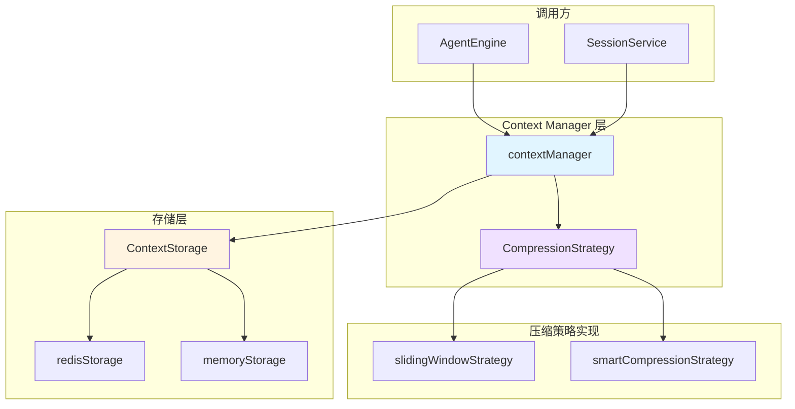

# Context Manager Orchestration

## 概述：为什么需要这个模块

想象你正在和一个 LLM 进行长对话。LLM 的上下文窗口（context window）是有容量限制的——就像一个只能装固定数量文件的公文包。当对话越来越长，新消息不断涌入时，你面临一个核心问题：**如何在有限的 token 预算内，保留最重要的上下文信息？**

一个天真的解决方案是简单地丢弃最早的消息（FIFO）。但这会带来问题：
- 系统提示（system prompt）可能被意外丢弃，导致 LLM 忘记自己的角色
- 关键的用户指令或中间结论可能丢失
- 无法根据实际 token 数做精细控制，因为不同消息的 token 消耗差异很大

`context_manager_orchestration` 模块正是为了解决这个问题而存在。它充当**对话上下文的智能管家**，负责：
1. **持久化存储**：将消息保存到 Redis 或内存中，支持跨请求的上下文延续
2. **Token 预算管理**：实时估算当前上下文的 token 消耗
3. **智能压缩**：当上下文超出限制时，应用压缩策略（如滑动窗口或摘要生成）
4. **系统提示保护**：确保 system message 始终位于上下文开头

这个模块的设计核心是**职责分离**：它处理业务逻辑（压缩、token 管理），而将存储细节委托给 `ContextStorage` 接口。这种设计使得存储后端可以独立演进（例如从内存切换到 Redis），而不影响上层的上下文管理逻辑。

---

## 架构与数据流



### 架构角色解析

上图展示了三个核心抽象层：

| 层级 | 组件 | 职责 | 类比 |
|------|------|------|------|
| **编排层** | `contextManager` | 协调存储、压缩、token 估算的业务逻辑 | 像餐厅的领班，决定何时清理桌子、如何安排座位 |
| **策略层** | `CompressionStrategy` | 定义如何估算 token、如何压缩消息 | 像压缩算法，决定保留哪些信息、丢弃哪些 |
| **存储层** | `ContextStorage` | 持久化消息数据 | 像仓库，只负责存取，不关心内容含义 |

### 关键数据流：添加一条消息

当 `AgentEngine` 调用 `AddMessage()` 时，数据经历以下流程：

```
1. 加载现有上下文
   sessionID → storage.Load() → []Message

2. 追加新消息
   []Message + new Message → extended []Message

3. 估算 Token
   extended []Message → compressionStrategy.EstimateTokens() → int

4. 判断是否需要压缩
   if tokenCount > maxTokens:
       extended []Message → compressionStrategy.Compress() → compressed []Message

5. 持久化
   compressed []Message → storage.Save() → error/nil
```

这个流程的关键在于**压缩是惰性的**——只有在 token 超出限制时才触发，避免了不必要的计算开销。

---

## 核心组件深度解析

### 1. `contextManager`：上下文编排器

**文件位置**: `internal/application/service/llmcontext/context_manager.go`

**设计意图**: 这是模块的核心协调者，实现了 `ContextManager` 接口。它的职责不是直接存储或压缩，而是**编排**这些操作的执行顺序和条件。

#### 内部状态

```go
type contextManager struct {
    storage             ContextStorage                 // 存储后端（Redis、内存等）
    compressionStrategy interfaces.CompressionStrategy // 压缩策略
    maxTokens           int                            // 上下文 token 上限
}
```

这三个字段体现了模块的三个核心关注点：
- `storage`：**在哪里存** —— 通过接口抽象，支持多种后端
- `compressionStrategy`：**如何压缩** —— 通过策略模式，支持多种算法
- `maxTokens`：**存多少** —— 配置化的 token 预算

#### 核心方法：`AddMessage()`

这是模块最复杂的方法，承载了完整的上下文管理逻辑：

```go
func (cm *contextManager) AddMessage(ctx context.Context, sessionID string, message chat.Message) error
```

**执行流程**:

1. **日志记录**：记录消息的 role 和 content 长度（超过 200 字符会截断预览），便于调试和监控
2. **加载现有上下文**：从存储中读取该 session 的历史消息
3. **追加新消息**：将新消息添加到消息列表末尾
4. **Token 估算**：调用 `compressionStrategy.EstimateTokens()` 计算当前 token 数
5. **条件压缩**：如果 token 数超过 `maxTokens`，调用 `compressionStrategy.Compress()` 进行压缩
6. **持久化**：将最终的消息列表保存回存储

**设计细节**:

- **错误包装**：所有存储和压缩错误都被包装成带有上下文的错误信息（如 `"failed to load context: %w"`），便于上层定位问题
- **日志分级**：关键操作（添加、压缩、清除）用 `Info` 级别，详细数据（消息分布、内容预览）用 `Debug` 级别
- **压缩透明性**：调用方不需要知道压缩是否发生，只需要知道消息已成功添加

#### 系统提示的特殊处理：`SetSystemPrompt()`

System message 在 LLM 对话中有特殊地位——它定义 AI 的行为准则，必须始终位于上下文开头。这个方法的处理逻辑是：

```go
if len(messages) > 0 && messages[0].Role == "system" {
    messages[0] = systemMessage  // 替换现有 system message
} else {
    messages = append([]chat.Message{systemMessage}, messages...)  // 插入到开头
}
```

**为什么这样设计？**

- 如果第一个消息已经是 system role，直接替换（保持位置不变）
- 否则，在开头插入新的 system message（可能是首次设置，或之前的 system message 被压缩掉了）

这种设计确保了 system prompt 的**位置稳定性**，避免因为压缩策略导致 system message 被移到中间或末尾。

#### 其他方法

| 方法 | 职责 | 返回值 |
|------|------|--------|
| `GetContext()` | 获取当前会话的完整上下文 | `[]chat.Message, error` |
| `ClearContext()` | 清除会话的所有历史消息 | `error` |
| `GetContextStats()` | 获取上下文的统计信息（消息数、token 数） | `*ContextStats, error` |

---

### 2. `ContextStorage`：存储抽象层

**接口定义**:

```go
type ContextStorage interface {
    Save(ctx context.Context, sessionID string, messages []chat.Message) error
    Load(ctx context.Context, sessionID string) ([]chat.Message, error)
    Delete(ctx context.Context, sessionID string) error
}
```

**设计意图**: 这个接口将**存储细节**与**业务逻辑**解耦。`contextManager` 只关心"保存消息"和"加载消息"，不关心消息是存在 Redis、内存还是数据库中。

#### 实现对比

| 实现 | 组件 | 特点 | 适用场景 |
|------|------|------|----------|
| `memoryStorage` | `internal.application.service.llmcontext.memory_storage.memoryStorage` | 使用 `map[string][]chat.Message` + `sync.RWMutex`，进程内存储 | 测试、单机部署、临时会话 |
| `redisStorage` | `internal.application.service.llmcontext.redis_storage.redisStorage` | 使用 Redis client，支持 TTL 过期，带 key 前缀 | 生产环境、分布式部署、需要持久化 |

**`redisStorage` 的关键配置**:

```go
type redisStorage struct {
    client *redis.Client
    ttl    time.Duration  // 会话过期时间
    prefix string         // Redis key 前缀，避免冲突
}
```

这种设计允许不同租户或环境使用不同的 key 空间，同时自动清理过期会话以节省内存。

---

### 3. `CompressionStrategy`：压缩策略接口

**接口定义**:

```go
type CompressionStrategy interface {
    Compress(ctx context.Context, messages []chat.Message, maxTokens int) ([]chat.Message, error)
    EstimateTokens(messages []chat.Message) int
}
```

**设计意图**: 将"如何压缩上下文"这个决策点抽象成接口，允许根据业务需求切换不同的压缩算法。

#### 策略实现对比

##### `slidingWindowStrategy`：滑动窗口策略

**核心逻辑**: 保留最近的 N 条消息，丢弃早期的消息。

```go
type slidingWindowStrategy struct {
    recentMessageCount int  // 保留的最近消息数量
}
```

**优点**:
- 实现简单，性能高
- 可预测的行为（总是保留最近的消息）

**缺点**:
- 可能丢失重要的早期信息（如用户的关键指令）
- 不考虑消息的 token 长度差异

**适用场景**: 短对话、对历史依赖较少的场景

##### `smartCompressionStrategy`：智能压缩策略

**核心逻辑**: 结合滑动窗口和摘要生成，当消息数超过阈值时，对早期消息进行摘要。

```go
type smartCompressionStrategy struct {
    recentMessageCount int
    chatModel          chat.Chat      // 用于生成摘要的 LLM
    summarizeThreshold int            // 触发摘要的最小消息数
}
```

**优点**:
- 保留早期信息的语义内容（通过摘要）
- 更智能的 token 分配

**缺点**:
- 需要调用 LLM 生成摘要，增加延迟和成本
- 实现复杂度高

**适用场景**: 长对话、需要保留历史语义的场景

---

### 4. `ContextStats`：上下文统计信息

**结构定义**:

```go
type ContextStats struct {
    MessageCount         int  // 当前消息数
    TokenCount           int  // 估算的 token 数
    IsCompressed         bool // 是否经过压缩
    OriginalMessageCount int  // 压缩前的消息数
}
```

**用途**: 这个结构主要用于**监控和调试**。调用方可以通过它了解：
- 当前上下文是否接近 token 限制
- 压缩是否已触发，压缩率如何
- 历史消息的保留情况

**注意**: 代码中 `IsCompressed` 字段目前硬编码为 `false`，注释说明需要显式跟踪压缩状态才能准确报告。这是一个已知的改进点。

---

## 依赖关系分析

### 调用方（谁在用这个模块）

根据模块树，`context_manager_orchestration` 位于 `conversation_context_and_memory_services` 子模块下，主要被以下组件调用：

1. **`AgentEngine`** (`internal.agent.engine.AgentEngine`)
   - 在 Agent 执行循环中，每次与 LLM 交互前需要获取当前上下文
   - 每次收到用户消息后，需要将其添加到上下文中

2. **`SessionService`** (`internal.application.service.session.sessionService`)
   - 管理会话生命周期，可能需要在创建会话时设置 system prompt
   - 提供 API 给前端查询会话的上下文统计信息

### 被调用方（这个模块依赖什么）

| 依赖 | 类型 | 用途 |
|------|------|------|
| `ContextStorage` | 接口 | 持久化消息数据 |
| `CompressionStrategy` | 接口 | Token 估算和压缩 |
| `chat.Message` | 数据结构 | 消息模型 |
| `logger` | 工具 | 日志记录 |

### 数据契约

**输入契约**:
- `sessionID`: 字符串，唯一标识一个会话
- `message`: `chat.Message` 结构，包含 `Role` 和 `Content` 字段
- `maxTokens`: 整数，token 预算上限

**输出契约**:
- 成功：返回 `nil` 错误（对于 `AddMessage`、`ClearContext`、`SetSystemPrompt`）
- 成功：返回 `[]chat.Message` 或 `*ContextStats`（对于 `GetContext`、`GetContextStats`）
- 失败：返回包装后的错误，包含操作类型和底层错误原因

---

## 设计决策与权衡

### 1. 存储抽象 vs 直接依赖 Redis

**选择**: 使用 `ContextStorage` 接口抽象，而非直接依赖 Redis

**权衡**:
- ✅ **优点**: 支持多种存储后端（内存、Redis、未来可能的数据库），便于测试和部署灵活性
- ❌ **缺点**: 增加了一层间接性，需要维护接口和多个实现

**为什么这样选**: 这个模块处于核心对话流程中，存储需求可能随部署环境变化（开发环境用内存，生产用 Redis）。接口抽象使得切换存储后端不需要修改业务逻辑。

### 2. 同步压缩 vs 异步压缩

**选择**: 在 `AddMessage()` 中同步执行压缩

**权衡**:
- ✅ **优点**: 调用方可以立即知道压缩后的状态，逻辑简单
- ❌ **缺点**: 如果压缩涉及 LLM 调用（如 `smartCompressionStrategy`），会增加请求延迟

**为什么这样选**: 上下文管理是对话流程的关键路径，需要保证压缩完成后再继续后续操作。异步压缩会引入状态不一致的风险（例如在压缩完成前就发送了下一条消息）。

### 3. 惰性压缩 vs 主动压缩

**选择**: 只在 token 超出限制时才压缩

**权衡**:
- ✅ **优点**: 避免不必要的计算开销，短对话不会触发压缩
- ❌ **缺点**: 压缩操作可能集中在某些请求上，导致延迟波动

**为什么这样选**: 大多数对话可能不会达到 token 限制，惰性压缩可以节省大量计算资源。对于延迟敏感的场景，可以选择 `slidingWindowStrategy` 这种轻量级策略。

### 4. Token 估算的准确性 vs 性能

**选择**: 使用 `CompressionStrategy.EstimateTokens()` 进行估算，而非精确计算

**权衡**:
- ✅ **优点**: 快速，不依赖外部服务
- ❌ **缺点**: 估算可能与 LLM 实际的 token 计数有偏差

**为什么这样选**: 精确的 token 计数需要调用 LLM 的 tokenizer，这会增加延迟。估算方法（如按字符数或词数近似）虽然不精确，但足够用于判断是否需要压缩。

### 5. System Prompt 的位置保证

**选择**: 始终将 system message 放在消息列表的开头

**权衡**:
- ✅ **优点**: 符合 LLM 的最佳实践，确保 system prompt 优先被注意
- ❌ **缺点**: 如果压缩策略不感知 system message 的特殊性，可能会在压缩时将其丢弃

**为什么这样选**: LLM 通常对上下文开头的信息更敏感，system prompt 作为行为准则应该优先。`SetSystemPrompt()` 方法显式处理了这个边界情况。

---

## 使用指南与示例

### 基本使用模式

```go
// 1. 创建存储后端
storage := llmcontext.NewRedisStorage(redisClient, 24*time.Hour, "session:")

// 2. 选择压缩策略
compressionStrategy := llmcontext.NewSlidingWindowStrategy(20)  // 保留最近 20 条

// 3. 创建 ContextManager
cm := llmcontext.NewContextManager(storage, compressionStrategy, 4096)

// 4. 设置系统提示
err := cm.SetSystemPrompt(ctx, "session-123", "你是一个有帮助的助手。")

// 5. 添加用户消息
err = cm.AddMessage(ctx, "session-123", chat.Message{
    Role:    "user",
    Content: "你好，请帮我分析一下这份数据。",
})

// 6. 获取上下文（用于发送给 LLM）
messages, err := cm.GetContext(ctx, "session-123")

// 7. 查看统计信息
stats, err := cm.GetContextStats(ctx, "session-123")
fmt.Printf("Messages: %d, Tokens: %d\n", stats.MessageCount, stats.TokenCount)
```

### 配置建议

| 场景 | `maxTokens` | 压缩策略 | 说明 |
|------|-------------|----------|------|
| 短对话（客服） | 2048 | `slidingWindowStrategy` (10-15 条) | 快速响应，不需要长历史 |
| 长对话（研究助手） | 8192 | `smartCompressionStrategy` | 保留语义历史，支持复杂任务 |
| 开发/测试 | 4096 | `slidingWindowStrategy` (20 条) | 平衡成本和效果 |
| 内存存储（临时） | 4096 | `slidingWindowStrategy` | 进程重启后数据丢失，仅用于测试 |

### 扩展点

如果你想添加自定义的压缩策略，只需实现 `CompressionStrategy` 接口：

```go
type MyCustomStrategy struct {
    // 自定义字段
}

func (s *MyCustomStrategy) Compress(ctx context.Context, messages []chat.Message, maxTokens int) ([]chat.Message, error) {
    // 自定义压缩逻辑
    return compressedMessages, nil
}

func (s *MyCustomStrategy) EstimateTokens(messages []chat.Message) int {
    // 自定义 token 估算逻辑
    return tokenCount
}
```

---

## 边界情况与注意事项

### 1. 并发安全性

`contextManager` 本身**不是线程安全的**——它依赖底层 `ContextStorage` 实现来保证并发安全。

- `memoryStorage` 使用 `sync.RWMutex` 保护内部 map
- `redisStorage` 依赖 Redis 客户端的并发安全性

**注意**: 如果同一个 `sessionID` 在多个 goroutine 中同时调用 `AddMessage()`，可能会出现消息顺序问题。调用方需要确保同一会话的消息按顺序添加。

### 2. Token 估算偏差

`EstimateTokens()` 是估算方法，可能与 LLM 实际的 token 计数有 10-20% 的偏差。这意味着：
- 设置 `maxTokens` 时应留有余量（例如设置为 LLM 限制的 80%）
- 不要依赖 `ContextStats.TokenCount` 做精确的计费或配额管理

### 3. 压缩状态跟踪不完整

如代码注释所述，`ContextStats.IsCompressed` 字段目前硬编码为 `false`。如果需要准确的压缩状态报告，需要：
- 在 `contextManager` 中添加一个字段来跟踪是否发生过压缩
- 或者在消息元数据中添加压缩标记

### 4. System Prompt 被压缩的风险

虽然 `SetSystemPrompt()` 确保 system message 在开头，但压缩策略（特别是 `slidingWindowStrategy`）可能不知道要保护 system message。如果压缩后只保留最近 N 条消息，system message 可能被丢弃。

**建议**: 压缩策略实现应该显式检查并保护第一条 system message。

### 5. 存储后端的 TTL 设置

`redisStorage` 支持 TTL，但 `memoryStorage` 不支持。这意味着：
- 使用 `memoryStorage` 时，需要外部机制清理过期会话（如定期重启服务）
- 使用 `redisStorage` 时，TTL 设置应与会话预期生命周期匹配

### 6. 错误处理模式

所有方法都返回包装后的错误，调用方应该：
- 检查错误是否为 `nil`
- 使用 `errors.Is()` 或 `errors.As()` 判断错误类型（如果需要区分存储错误和压缩错误）
- 记录错误日志时包含 `sessionID` 以便追踪

---

## 相关模块参考

- [Context Storage Contracts and Implementations](context_storage_contracts_and_implementations.md) — `ContextStorage` 接口及其 Redis/内存实现
- [Context Compression Strategies](context_compression_strategies.md) — `slidingWindowStrategy` 和 `smartCompressionStrategy` 的详细实现
- [Agent Engine Orchestration](agent_engine_orchestration.md) — `AgentEngine` 如何调用 ContextManager
- [Session Conversation Lifecycle Service](session_conversation_lifecycle_service.md) — 会话管理服务与 ContextManager 的集成

---

## 总结

`context_manager_orchestration` 模块是 LLM 对话系统的**上下文基础设施**。它通过清晰的职责分离（存储、压缩、编排）和灵活的接口设计，解决了长对话中的 token 预算管理问题。

**核心设计原则**:
1. **关注点分离**: 业务逻辑（压缩、token 管理）与存储细节解耦
2. **策略模式**: 压缩算法可插拔，适应不同场景需求
3. **惰性执行**: 只在必要时压缩，避免过度计算
4. **可观测性**: 详细的日志和统计信息，便于调试和监控

对于新加入的开发者，理解这个模块的关键是把握它的**编排者角色**——它不直接存储或压缩，而是协调这些操作在正确的时机以正确的顺序执行。
